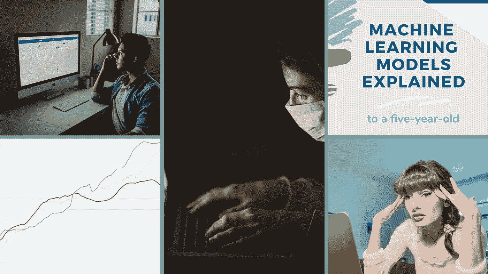

# 本周(4 月 18 日)我看到的有趣的 AI/ML 相关文章

> 原文：<https://towardsdatascience.com/interesting-ai-ml-related-articles-i-came-across-this-week-a5e8ce2c171c?source=collection_archive---------45----------------------->

## 由于我们大多数人都有更多的空闲时间，高亮显示的文章对那些想学习新东西或只想寻找分散注意力的内容的人来说是有用的

包括文章的封面图片

媒体上的内容数量有了明显的增长，这应该是由于作家们现在有了更多的空闲时间。

我读过大量围绕机器学习或数据科学相关主题的精彩内容。我选择了五篇文章，我认为它们在许多方面对不同水平的机器学习读者都有好处。我建议你在下面找到一两篇适合你的文章，并探究它们的内容。

所选文章写得很好，包含不同类型的机器学习爱好者感兴趣的内容。

享受吧。

## 教程和在线课程的陷阱

[Sukanta Roy 的](https://medium.com/u/85f201105103?source=post_page-----a5e8ce2c171c--------------------------------)文章触及了一个很多机器学习从业者都会涉及的话题，教程陷阱。

教程陷阱本质上是一个人承担一系列关于特定主题的教程，而忽略了对实际实践知识的需求的过程。

他不仅解释了什么是“教程陷阱”和它所创造的“能力幻觉”;他还为我们提供了四个指路明灯，我们可以坚持下去，以防止我们作为学习者反复陷入教程陷阱。

提到的一个指导信标是学习任何与机器学习相关的东西的圣杯，那就是**完成一个个人项目**。

**Sukanta 的文章是任何通过在线课程开始获取机器学习知识之旅的人的必读之作。**

 [## 教程和在线课程的陷阱

### 教程和在线课程如何制造一种能力的假象，以及如何不落入这个陷阱

towardsdatascience.com](/the-trap-of-tutorials-and-online-courses-2b0c22e0388) 

## 一个决策科学家给新冠肺炎的 10 条禁忌

在网上不可能避免任何关于新冠肺炎的文章。但是 Cassie Kozyrkov 的文章为目前正在进行的新冠肺炎对话添加了一个完全不同的视角。

她提出了个人在网上消费新冠肺炎相关信息时需要考虑的 20 条准则。

是的，目前的疫情上有很多信息超载，我认为这是非常需要的。但是，对于一个人来说，能够从有用的信息中分离出噪音也是至关重要的，而凯西的指导方针恰恰做到了这一点。

提出的指导方针分为两组，做和不做，每个指导方针都补充了一篇文章的链接，进一步扩展了这个主题。

我对作者之前所写的大量信息印象深刻。有些文章的日期是几个月或几年前，但它们在几年后证明是相关的。

 [## 一位决策科学家给新冠肺炎的十大禁忌

### 在疫情期间，照顾好你的大脑，聪明对待数据，做出更明智的决定

towardsdatascience.com](/a-decision-scientists-10-dos-don-ts-for-covid-19-805577bccd67) 

## 梅根·迪布尔向一个五岁的孩子解释机器学习模型

我喜欢解释文章，更喜欢简单的解释文章。[梅根·迪布尔](https://medium.com/u/271578f29747?source=post_page-----a5e8ce2c171c--------------------------------)写了一篇有趣的文章，用最简单的方式解释了机器学习中的一些关键话题和概念。

虽然这篇文章是针对初学者的，但我确实相信，在机器学习中，不同水平的每个人都可以找到一些价值。

对于那些有点害怕机器学习中的数学的人，Megan 避免了包含方程或数学，而是用一些简单明了的图表来补充每个解释。

她提出了标准的监督和非监督机器学习模型，如 k-means，支持向量机和线性回归。

我仍然怀疑一个五岁的孩子会理解这篇文章的内容，也许是一个天才。

然而，尽管如此，这篇文章是对你必然会不断遇到的标准机器学习术语的简单介绍。

 [## 向一个五岁的孩子解释机器学习模型

### 尽可能简单地解释 ML 模型是如何工作的

towardsdatascience.com](/machine-learning-models-explained-to-a-five-year-old-f2f540d9dcea) 

## [Edouard Harris](https://medium.com/u/11d8ab71ef4b?source=post_page-----a5e8ce2c171c--------------------------------) 数据科学就业市场在过去的一个月里发生了什么

四月已经过了一半，世界仍然被当前的疫情所控制。

我们都知道全球医疗体系面临的压力，以及疫情对全球经济的影响。

Edouard Harris 的文章写道，当前的经济和就业市场状况如何影响工作中的数据科学家或求职者。

Edouard 的文章非常有见地，内容丰富，他提供了受裁员或撤回安置影响的数据科学家数量的统计数据。

虽然这篇文章可能看起来有点黯淡，但爱德华对本月(4 月)和 3 月的比较几乎描绘了一幅充满希望的画面。

这篇文章以轻松的语气结束，强调了公司工作方式即将发生的巨大变化。

 [## 过去一个月数据科学就业市场发生了什么

### 我在一家免费指导数据科学家的公司工作，直到他们被聘用。因为只有当我们的数据…

towardsdatascience.com](/whats-happened-to-the-data-science-job-market-in-the-past-month-88c748a4cd25) 

## 凯尔·加拉丁努力寻找我作为数据科学家的第一份工作

失败的文章是非常谦虚和有趣的，因为从其他人的经验中可以发现丰富的知识。

Kyle 关于他在获得第一份工作之前所面临的困难的文章包含了传统数据科学工作角色所需的面试流程的详细信息。

这篇文章提供了凯尔的缺点和失败的信息，我们都可以从中学习。

在分享他在面试过程中的经历以及他如何最终获得一个角色的同时，他也为读者提供了一些如何接近和准备面试的技巧。

我不会破坏主要的提示是什么，但它们涉及如何处理焦虑，缺乏准备和更多的提示。

这篇文章适合求职者，但如果你只是想打发时间，从编码中休息一下，也是一篇有趣的读物。

 [## 寻找我作为数据科学家的第一份工作的努力

### 在我选择撰写的这个古怪的个人专栏的最新部分，我分享了我兴趣的起源…

towardsdatascience.com](/the-struggle-to-find-my-first-job-as-a-data-scientist-64594c88b67e)