# 中级 Python: NumPy

> 原文：<https://towardsdatascience.com/intermediate-python-numpy-cec1c192b8e6?source=collection_archive---------19----------------------->

## 通过探索数字 Python 库 NumPy，让您的 Python 技能更上一层楼。

如果您最近完成了一门关于 Python 基础的课程或一本书，现在想知道下一步去哪里，探索不同的 Python 包将是一个自然的下一步。NumPy 包(*数字 Python* 的缩写)非常简单，但也非常有用，尤其是对于科学计算、数据科学和机器学习应用程序。

许多数据分析和机器学习 Python 库都是建立在 NumPy 之上的，因此掌握这些基础知识对于成功利用这些库至关重要。本文并不打算作为 NumPy 的全面或深入的资源。更确切地说，这更多的是对这个包的介绍，对于那些可能想探索科学或数据科学应用程序的 Python 新手来说，这是一种正确方向的推动。

# 先决条件

要理解本文中的代码片段，显然需要在机器上安装 Python 和 NumPy 包。命令`pip install numpy`应该可以解决问题，但是如果你有任何问题， [NumPy 站点](https://www.numpy.org)可以在入门部分帮助你设置。

此外，我建议使用 Jupyter 笔记本或 Spyder 中的 IPython 控制台来跟进，但 IDLE 也可以。Jupyter 和 Spyder 附带了 [Anaconda，你可以在这里](https://www.anaconda.com/distribution/)下载，这个包应该已经安装了 NumPy。

# 为什么是 NumPy？

使用 NumPy 包的最大优点之一是 ndarray (n 维数组)数据结构。NumPy `ndarray` 比 python `list`强大得多，并且提供了比 python `array`更多种类的操作和功能。为了理解这些优势，我们首先需要深入了解 Python 的基本数据类型。

Python 是一种动态类型的语言，这是它易于使用的特性之一。Python 允许我们给一个变量赋一个整数值，然后将同一个变量重新赋给不同的类型(比如字符串):

然而，在像 C++这样的静态类型语言中，要给一个变量赋值，我们首先必须给这个变量分配一个类型。在变量被声明后，我们不能将它的值重新赋值给不同类型的值:

这种动态类型功能非常方便，但也有代价。Python 是用 C 实现的，Python 中的基本数据类型实际上不是原始数据类型，而是指向包含许多不同值的 C 结构的指针。存储在像`integer`这样的 Python 数据类型中的额外信息是允许动态类型化的，但是会带来很大的开销，当处理非常大量的数据时，性能成本会变得很明显。

高灵活性和高性能成本同样适用于 Python `lists`。因为`lists`可以是异构的(在同一个列表中包含不同的数据类型)，所以`list`中的每个元素都包含自己的类型和引用信息，就像 Python 对象一样。异构列表将从这种结构中受益，但是当列表中的所有元素都是相同的基本类型时，存储的类型信息变成了多余的，浪费了宝贵的内存。

Python `arrays`在存储统一数据类型方面比`lists`高效得多，但是 NumPy `ndarray`提供了`arrays`没有的功能(例如矩阵和向量运算)。

# 数组创建

首先，检查您是否安装了 NumPy 导入并检查您的版本至少是 1.8。

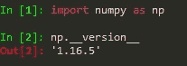

> **注意**:你可以直接`*import numpy*`而不是导入为`*np*`，但是对于教程的其余部分，无论你在哪里看到`*np*`，都用`*numpy*`代替就可以了(例如`*np.array()*` → `*numpy.array()*`)。此外，当使用术语“数组”或“ndarray”时，我可能会有点不一致，所以请记住这些术语指的是同一个东西。

现在让我们看看如何用 NumPy 创建多维数组(ndarrays)。既然我们将 ndarrays 与 Python 列表进行了比较，那么首先让我们看看 NumPy 如何让我们从列表中创建一个数组:

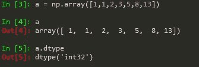

从 Python 列表创建数组

将 Python 列表`[1,1,2,3,5,8,13]`传递给`np.array()`会创建一个 32 位整数值的 ndarray。ndarrays 中保存的值将始终属于同一类型。对于所有 ndar array，`.dtype`属性将返回数组保存的值的数据类型。** [关于数据类型的 Numpy 文档](https://numpy.org/devdocs/user/basics.types.html)

如果我们将包含不同类型值的`list`传递给`np.array()`，NumPy 将向上转换这些值，这样它们就可以是相同的类型:

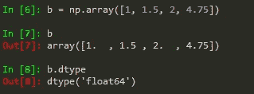

传递给 array()方法的列表包含整数和浮点数。从此列表创建的数组将整数转换为浮点数，以便所有值都是同一类型。

* *注意:请确保当您调用`array()`时，您提供了一个数字列表作为单个参数:`np.array( [1,2,3] )`，而不仅仅是数字作为多个参数:`np.array( 1,2,3 )`；这是一个非常常见的错误。

NumPy 还允许您在使用`dtype`参数创建数组时显式指定数组的数据类型:

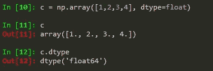

数组中的值最初是作为整数输入的，但是通过将数据类型指定为 float ( **dtype = float** )，Numpy 将所有值都转换为 float(例如 1 → 1.0).

创建时知道数组的大小，但不知道数组的内容是很常见的。在这种情况下，NumPy 允许创建具有占位符值的指定大小的数组:

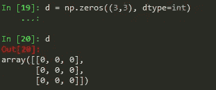

用 **np.zeros( )** 将所有值初始化为 0 的 3x3 数组。

`np.ones()`和`np.empty()`也可以分别用于返回全 1 或不初始化条目的数组。如果您想指定一个值作为占位符，请使用`np.full(size, **placeholder**)`:

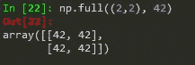

数组也可以用*随机*值初始化。使用`np.random.random(s)`你可以创建一个大小为`s`的数组，用 0 到 1 之间的随机值填充。传递一个整数值将产生一个该长度的一维数组:

长度为 5 的一维数组。

您可以传递更高维数组的维度:

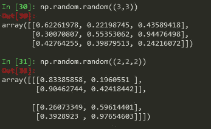

传递(3，3)会产生一个二维的 3x3 数组，而传递(2，2，2)会产生一个三维的 2x2x2 数组。

如果你想要一个随机整数值的数组，使用`np.random.randint(min, max, size)`。指定`min`的最小值、`max`的最大值，当然还有`size`的数组大小，就像我们对`np.random.random()`所做的那样。

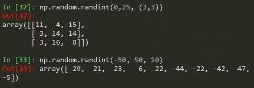

**In[32]** :二维 3x3 数组的取值范围在 0 到 25 之间。 **In[33]** :一维 10x1 数组的范围在-50 到 50 之间。

还有许多其他非常有用的创建 ndarrays 的方法，包括:

*   在给定范围内用**等间距**值填充
*   在一个正态分布**上用随机数填充一个数组**
*   创建一个**身份矩阵**

如果您感兴趣，请查看[数组创建文档](https://docs.scipy.org/doc/numpy-1.15.1/reference/routines.array-creation.html),探索这些数组创建例程以及许多其他例程。

# 数组操作

创建数组很好，但是 NumPy 真正出色的地方是使用数组进行操作和计算的方法。这些方法不仅简单易用，而且当涉及到基于元素的操作(尤其是在大型数组上)时，这些方法具有非常出色的性能——比遍历每个元素的性能好得多，就像通常不使用 NumPy 时所做的那样。

`ndarray`对象允许我们对两个相同大小的数组执行算术运算*和*:

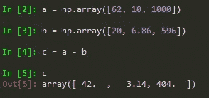

从 **a** 中对应的元素中减去 **b** 中的每个元素。同样，请注意，结果数组中的所有值都是浮点型的，因为正如我们在数组创建示例中看到的那样，整数被转换为浮点型。

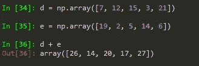

在两个 ndarrays 上使用 **+** 运算符产生元素相加。

请记住，在两个`lists`之间使用`+`操作符不会将它们按元素相加。这实际上导致了两个`lists`的串联。此外，如果我们试图在两个`lists`之间使用`-`操作符，Python 将返回一个错误，因为`lists`在没有使用 for 循环显式声明的情况下，自然不允许元素操作。

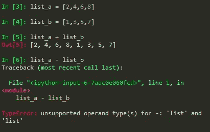

语句 **list_a + list_b** 连接两个列表，而 **list_a -list_b** 返回一个错误。

## 元素方式与矩阵乘法

如果你以前用过 MATLAB，你就会知道使用 n 维数组和矩阵是多么容易。NumPy 在提供一些方便的功能方面做得很好，并且对于 MATLAB 用户来说，可能比使用基本的 Python 更加熟悉。

MATLAB 中的矩阵乘法就像在两个矩阵上使用`*`运算符一样简单(例如`a * b`)。使用 NumPy，`*`操作符将实际返回元素级乘法。

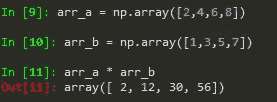

对于矩阵乘法，`@`运算符用于`arrays`:

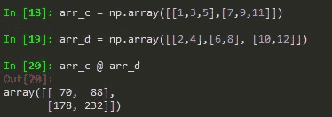

> 而在矩阵乘法这个话题上，NumPy 也有一个`*matrix*`类，实际上是`*array*`的子类。`*array*`类用于一般用途，而`*matrix*`类用于线性代数计算。文档建议在大多数情况下，您应该使用`*array*`类，除非您专门从事线性代数计算。如果您想要处理更高维的数组(例如 3-D)，那么`*array*`类支持这一点，而`*matrix*`类总是处理 2 维数组。

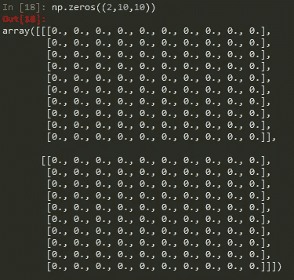

使用 ndarray 类表示的三维数组。

> 此外，`*matrix*`类不像`*array*`那样使用相同的操作。因此对于本文，我们将重点关注`*array*`类。

就像两个数组相乘一样，我们可以将一个数组的所有元素都乘以一个数字。NumPy 还使得获取数组的属性变得非常方便，比如数组(`ndim`)的 **sum** 、 **min** / **max** 、 **dimensions** 、以及`array`的 **size** (总元素数)。

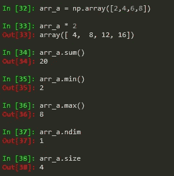

您还可以访问阵列的基本统计值:

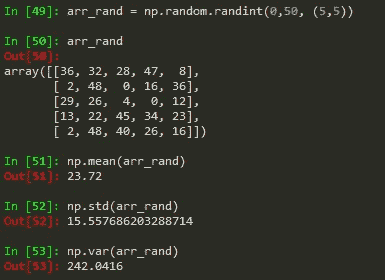

该数组的均值、标准差和方差很容易计算。

## 根据条件获取元素

一个非常酷的`numpy`类方法是`numpy.where()`。这允许您从数组中返回满足指定条件的元素。例如，如果您有一个从 0 到 50 的 5x5 整数数组，并且您想知道大于 25 的值在哪里，您可以执行以下操作:

**np.where( )** 对于保存大于 25 的值的索引返回 1，对于小于等于 25 的值返回 0。这里的 **r** 是原数组

如果你想找到低值(例如< 15) and replace them with a -1:

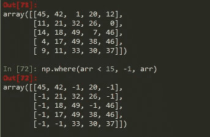

All values less than 15 have been replace with -1\. Here **arr** 是原始数组 in Out[71]

你可以用这个方法做很多事情，特别是用一点创造性的思维，但是只要记住它是如何工作的:`np.where(cond[, x, y])`——如果`cond`条件满足，返回`x`，否则返回`y`。

## 索引、切片和整形

步进的工作原理与`lists`相同:

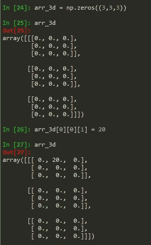

这里我们创建一个填充了 0 的三维数组，然后将索引 **arr_3d[0][0][1]** 的值重新赋值为 20。

要检查数组中是否有值，可以像使用`lists`一样使用`in`关键字:

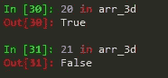

切片与`arrays`一起工作，就像它与`lists`一样，并且`arrays`可以在多个维度上切片:

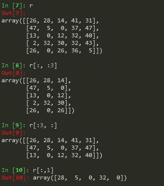

**In[8]** :每行前 3 列。**【9】:**每列前 3 行。 **In[10]** :第 2 列所有项目。

在转换方面，NumPy 有很多功能。例如，如果您有一个 3x5 的数组，并且想要**将**调整为 5x3:

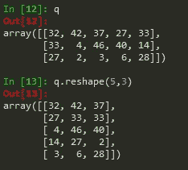

若要调整数组的形状，请将所需的维度传递给 shape()方法。

您也可以使用`array.T`将**转置** `arrays`:

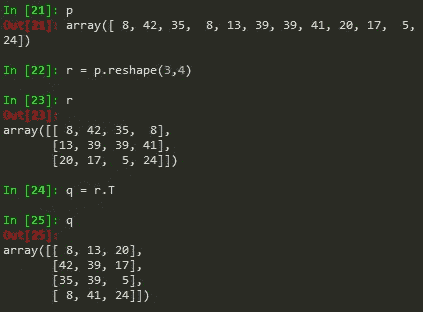

数组 **r** 是 12x1 数组 **p** 的整形，为 3x4 数组。数组 **q** 是 r 的**转置**，通过使用`**r.T**`

`Arrays`也可以使用`np.transpose(a)`进行转置，其中`a`是您想要转置的数组。

我们只是触及了 NumPy 库的皮毛，如果你想知道你还能做什么，[官方文档](https://docs.scipy.org/doc/numpy/index.html)有一个很棒的入门指南，当然，你可以在那里探索库的其余部分。如果您想使用 Python 进行科学计算、机器学习或数据科学，NumPy 是您应该真正熟悉的库之一。

下面是我推荐的其他几个相关的 Python 库，它们被认为是这个领域的核心:

*   [SciPy](https://scipy.org/scipylib/index.html)
*   熊猫
*   [Matplotlib](https://matplotlib.org/)
*   [Scikit-Learn](https://scikit-learn.org/stable/)

最后，我将为您提供一些资源，让您继续掌握用于数据科学和科学应用的 Python。

Jake VanderPlas 著[**《Python 数据科学手册》**](https://jakevdp.github.io/PythonDataScienceHandbook/) —这是一本真正优秀的数据科学入门入门读物。他还从一开始就介绍了 NumPy，但比本文详细得多。

[**用 Scikit-Learn、Keras&tensor flow by**](https://www.amazon.com/Hands-Machine-Learning-Scikit-Learn-TensorFlow/dp/1492032646/ref=pd_sbs_14_img_2/137-9753835-6236819?_encoding=UTF8&pd_rd_i=1492032646&pd_rd_r=64a4562d-7e7a-43c1-a234-1022743cb01c&pd_rd_w=uasXi&pd_rd_wg=FL8ji&pf_rd_p=5cfcfe89-300f-47d2-b1ad-a4e27203a02a&pf_rd_r=P3HGR2WXDBN7ZGB4Q91Z&psc=1&refRID=P3HGR2WXDBN7ZGB4Q91Z)[**aurélien géRon**](https://www.amazon.com/Aur%C3%A9lien-G%C3%A9ron/e/B004MOO740/ref=dp_byline_cont_book_1)——如果你真的对机器学习和深度学习感兴趣，这本书可能是入门最常推荐的书。

[**走向数据科学**](https://towardsdatascience.com/) —数据科学、机器学习、AI、通用编程。这是关于媒体的最好的出版物之一，并且是关于数据科学的大量主题的极好资源。

[**斯坦福大学与吴恩达**](https://www.coursera.org/learn/machine-learning?ranMID=40328&ranEAID=fDhiRyMTeO8&ranSiteID=fDhiRyMTeO8-lab85VbDUwyusQOytt8f1Q&siteID=fDhiRyMTeO8-lab85VbDUwyusQOytt8f1Q&utm_content=10&utm_medium=partners&utm_source=linkshare&utm_campaign=fDhiRyMTeO8#syllabus) 联合开设的机器学习课程——不完全是专门针对 Python 的，但如果你想真正进入机器学习，并在动手实践的同时钻研一些理论，如果你有时间致力于这门课程，这是一个绝佳的起点。吴恩达很聪明。

感谢阅读！