# 具有深度更新过程的间歇需求预测

> 原文：<https://towardsdatascience.com/intermittent-demand-forecasting-with-deep-renewal-processes-f152d3f59f35?source=collection_archive---------51----------------------->

让我们面对现实吧。任何在零售、物流、电子商务等领域从事时间序列预测工作的人。肯定会诅咒那条从不表现的长尾巴。可怕的间歇时间序列使预测者的工作变得困难。这种麻烦使大多数标准预测技术变得不切实际，提出了关于度量标准、模型选择、模型集成等等的问题。更糟糕的是，可能会有这样的情况(比如在备件行业，出现间歇性模式的是流动缓慢但非常关键或高价值的项目。

# 注释

Y - *i* 时间序列的第元素

n -时间序列的索引

i -非零需求指数

Qi -需求间隔，即两个非零需求之间的差距。

Mi-非零需求点的需求规模。

# 传统方法

传统上，有一类算法采用稍微不同的路径来预测间歇时间序列。这组算法将间歇性需求分为两部分——需求规模和需求间隔——并分别建模。

# 克罗斯顿

克罗斯顿提议对 *M* 和 *Q* 分别应用单一指数平滑，如下所示:

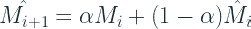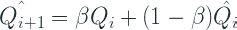

得到这些估计后，最终预测，

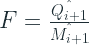

这是一个单步提前预测，如果我们必须扩展到多个时间步，我们将得到一个具有相同值的平面预测。

# 克罗斯顿

Syntetos 和 Boylan，2005 年指出，Croston 预测对间歇性需求有偏见，并提出用需求区间估计的β进行修正。

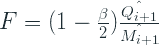

# 克罗斯顿(SBJ)

Shale、Boylan 和 Johnston (2006)得出了到达遵循泊松过程时的预期偏差。

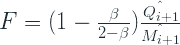

# 作为更新流程的克罗斯顿预测

更新过程是一个到达过程，其中到达间隔是正的、独立的和同分布的(IID)随机变量。这个公式概括了任意长时间的中毒过程。通常，在泊松过程中，需求区间是指数分布的。但是更新过程的内部需求时间是有限的。

Turkmen 等人 2019 年将 Croston 及其变体铸造到更新过程模具中。定义在正整数上的随机变量 *M* 和 *Q* 完全定义了 Yn

# 深度更新过程

一旦克罗斯顿预测被视为一个更新过程，土库曼等人提出，估计他们使用一个单独的 RNN 为每个“需求规模”和“需求间隔”。

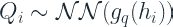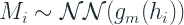

在哪里

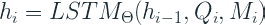

这意味着我们有一个单一的 RNN，它接受输入的是 M*和 Q*并把这些信息编码到一个编码器中( *h* )。然后，我们在这个隐藏层的顶部放置两个独立的 NN 层，以估计 *M* 和 *Q* 的概率分布。对于 *M* 和 *Q* 而言，负二项分布是本文建议的选择。**

# 负二项分布

负二项分布是一种离散的概率分布，通常用于对计数数据进行建模。例如，售出的 SKU 数量、访问网站的人数或呼叫中心接到的服务电话数量。

该分布源自一系列的[伯努利试验](https://en.wikipedia.org/wiki/Bernoulli_trial)，即每个试验只有两种结果。一个经典的例子是掷硬币，可以是正面也可以是反面。所以成功的概率是 *p* 失败的概率是 *1-p* (在公平的抛硬币中，这是各 0.5)。所以现在如果我们继续进行这个实验，直到我们看到 *r* 成功，我们看到的失败次数将会是负二项分布。

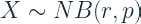

当我们应用这一点时，成功和失败的语义不一定成立，但重要的是只有两种结果。

# 网络体系结构

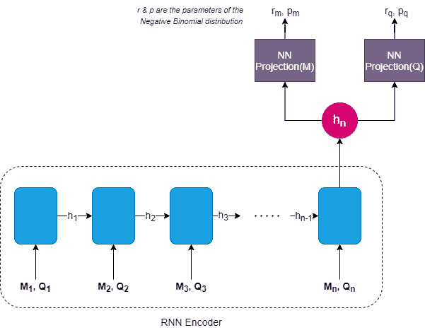

作者图片

# 我们的贡献

本文只讨论了提前一步的预测，这也是你会在很多间歇性需求预测文献中发现的。但在现实世界中，我们需要比这更长的时间来进行适当的规划。无论是 Croston 还是深度更新流程，我们生成 n 步提前预测的方式都是一样的，即需求规模(M)/需求间隔时间(Q)的平面预测。

除了现有的 Flat 方法之外，我们还引入了两种新的输出解码方法——精确解码和混合解码。假设我们用预测长度 5 来训练模型。

该模式的原始输出将是:

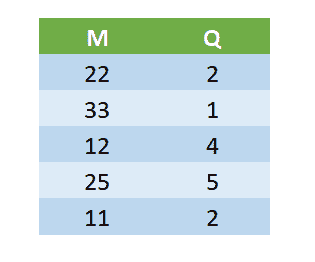

**平**

在平面解码下，我们将只选取第一组输出(M=22 和 Q=2 ),并生成一个单步超前预测，并对所有 5 个时间步长扩展相同的预测。

**确切的说**

精确解码是一种更有把握的解码方式。在这里，我们预测需求规模为 M 的需求，每个内部需求时间为 Q，并使预测的其余部分为零。

**杂交**

在混合解码中，我们将这两者结合起来生成预测，该预测还考虑了模型预期的长期变化。我们使用 M/Q 值进行预测，但我们会根据后续步骤更新 M/Q 值。例如，在我们的例子中，我们将预测前两个时间步的 11(22/3 ),然后预测下一个时间步的 33(33/1 ),依此类推。

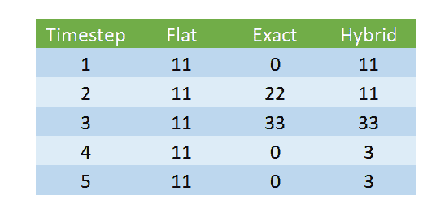

# 履行

我已经使用 GluonTS 实现了该算法，Glu onts 是一个基于 MXNet 的神经时间序列预测框架。AWS 实验室是开源项目的幕后支持者，亚马逊内部使用 DeepAR 等一些算法来进行预测。

# 实施的模型

本文讨论了该模型的两个变体——离散时间 DRP(深度更新过程)和连续时间 DRP。在这个库中，我们只实现了离散时间 DRP，因为它是更流行的用例。

# 如何安装？

该软件包上传到 pypi 上，可以通过以下方式安装:

```
pip install deeprenewal
```

**推荐 Python 版本:3.6**

【https://github.com/manujosephv/deeprenewalprocess】源代码:

如果你运行的是 Windows，需要使用你的 GPU(我推荐)，你需要先安装支持 GPU 的 MXNet==1.6.0 版本 [MXNet 官方安装页面](https://mxnet.apache.org/versions/1.6.0/get_started?platform=windows&language=python&processor=gpu&environ=pip&)

如果你在安装 GPU 版本时遇到困难，你可以试试(取决于你的 CUDA 版本)

```
pip install mxnet-cu101==1.6.0 -f [https://dist.mxnet.io/python/all](https://dist.mxnet.io/python/all)
```

相关 [Github 问题](https://github.com/apache/incubator-mxnet/issues/17719)

# 使用

examples 文件夹中还有一个笔记本，展示了如何使用该模型。相关摘录如下:

# 论文的实验和结果

本文在两个数据集——零件数据集和 UCI 零售数据集上对模型进行了评估。对于概率预测的评估，他们使用分位数损失。

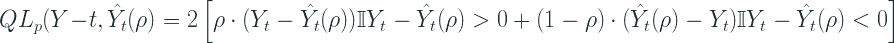

作者使用具有 10 个隐藏单元的单个隐藏层，并使用 softplus 激活将 LSTM 嵌入映射到分布参数。他们使用了全局 RNN，即所有时间序列共享 LSTM 参数。他们评估了提前一步的预测。

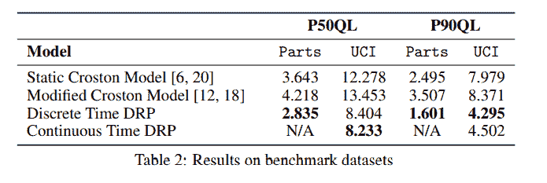

# 我们的实验和贡献

# 实验设置

我们没有重建实验，而是扩大了范围。我们选择的数据集是 UCI 零售数据集，而不是提前一步预测，而是提前 39 天预测。这更符合现实世界的应用，在现实世界中，您需要不止一步的提前预测来进行计划。除了与 Croston 及其变体进行比较，我们还与 ARIMA、ETS、NPTS 和 Deep AR 进行了比较(这是本文中提到的后续步骤)。

# 资料组

[UCI 零售数据集](https://archive.ics.uci.edu/ml/datasets/online+retail)是一个交易数据集，包含一家总部位于英国的注册无店铺在线零售商在 2010 年 1 月 12 日至 2011 年 9 月 12 日之间发生的所有交易。该公司主要销售独特的适合各种场合的礼品。这家公司的许多客户都是批发商。

**栏目:**

*   *发票号*:发票号。名义上，分配给每笔交易的 6 位整数。如果此代码以字母“c”开头，则表示取消。
*   *库存代码*:产品(物品)代码。名义上，一个 5 位数的整数，唯一分配给每个不同的产品。
*   *描述*:产品(物品)名称。名义上。
*   *数量*:每笔交易每种产品(物品)的数量。数字。
*   *发票日期*:发票日期和时间。数字，每笔交易生成的日期和时间。
*   *单价*:单价。数字，单位为英镑的产品价格。
*   *CustomerID* :客户编号。名义上，一个唯一分配给每个客户的 5 位整数。
*   *国家*:国家名称。名义上，每个客户居住的国家的名称。

**预处理:**

*   分组依据为*库存代码*、*国家*、*发票日期* - >数量之和*单价*的平均值
*   用零填充以使时间序列连续
*   将数量的下限值裁剪为 0(去除负值)
*   仅采用长度超过 52 天的时间序列。
*   列车测试拆分日期:*2011–11–01*

**统计:**

*   时间序列数:3828。过滤后:3671
*   数量:平均值= 3.76，最大值= 12540，最小值= 0，中值= 0

**时间序列分割**

使用我们之前讨论过的相同的分割——间歇的、不规则的、平滑的和不稳定的——我将数据集分成四份。

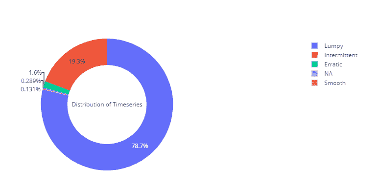

作者图片

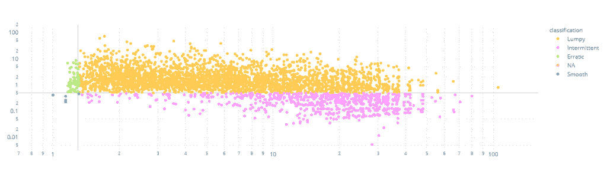

作者图片

我们可以看到，数据集中几乎 98%的时间序列是间歇的或不规则的，这对于我们的用例来说是完美的。

# 结果

## 基线比较

我们选择的基线是克罗斯顿预测。我们还对克罗斯顿做了轻微的修改，即 SBA 和 SBJ。因此，让我们首先针对这些基线进行比较，包括一步预测和 n 步预测。我们也将评估点预测(使用 MSE、MAPE 和 MAAPE)和概率预测(使用分位数损失)

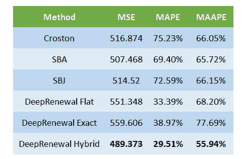

1 步超前点估计值(中值)

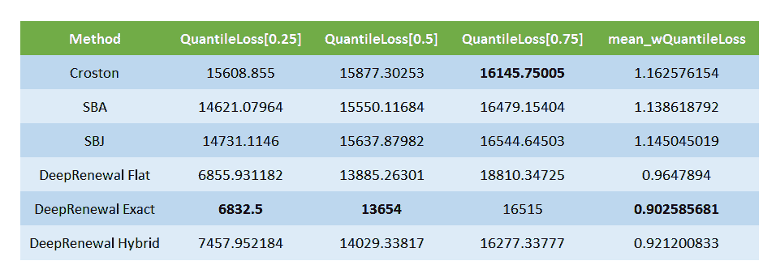

领先一步概率预测

我们可以看到，DRP 模型在点预测和概率预测方面都大大优于基线方法。

现在让我们来看一下 n 步提前预测。

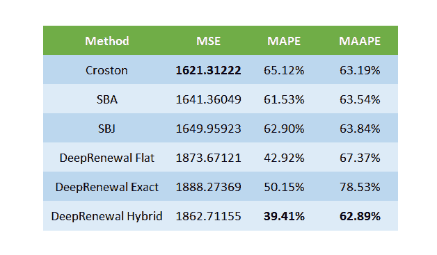

n 步超前点估计值(中值)

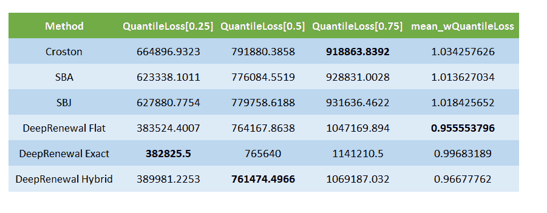

超前 n 步概率预测

在这里，我们看到了一个不同的画面。在预测点上，克罗斯顿在 MSE 上做得更好。DRP 在 MAPE 做得很好，但是我们知道 MAPE 倾向于预测不足，并且当我们观察间歇性需求模式时，它不太可靠。因此，从预测的角度来看，我不会说 DRPs 的长期预测优于 Croston。我们注意到的是，在 DRPs 中，混合解码在 MAPE 和 MSE 方面都比平面解码好得多。

## 扩展比较

为了进一步比较这些结果，让我们也包括来自其他流行预测技术的结果。我们在点估计稳定中加入了 ETS 和 ARIMA，在概率预测稳定中加入了 DeepAR 和 NPTS。

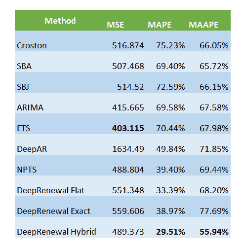

1 步超前点估计值(中值)

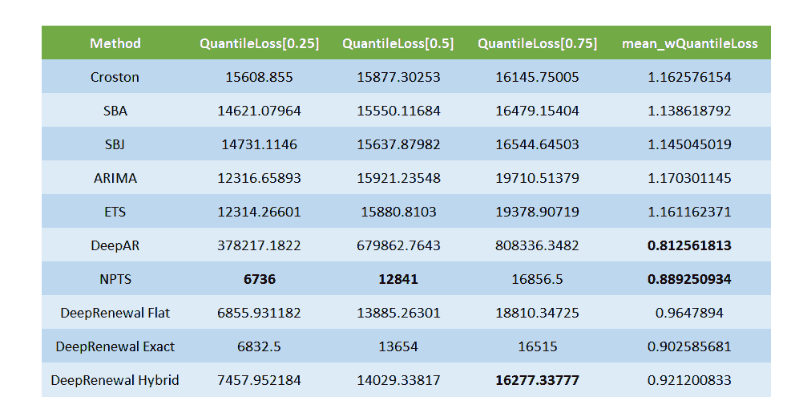

领先一步概率预测

在 MSE 上，ETS 占据了头把交椅，尽管在 MAPE 和 MAAPE 上，DRP 保住了他们的位置。在概率预测方面，DeepAR 有非常高的分位数损失，但当我们看加权分位数损失(按量加权)时，我们看到它出现在顶部位置。这可能是因为 DeepAR 在大部分时间预测为零(或接近零)，并且只预测大批量 SKU 中的良好数字。在所有三个分位数的损失中，NPTS 似乎以微弱优势胜过 DRPs。

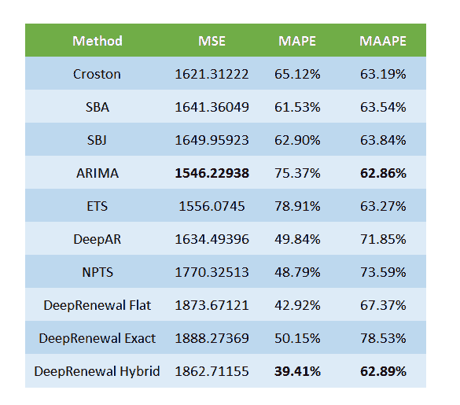

n 步超前点估计值(中值)

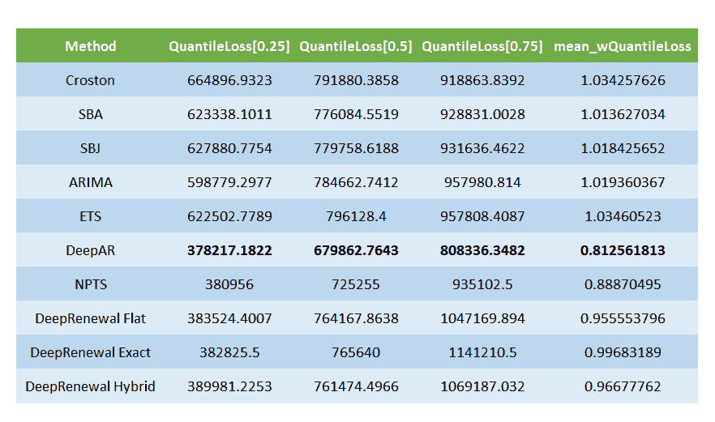

超前 n 步概率预测

当我们看长期预测时，我们看到 ARIMA 和 ETS 在点估计(MSE)方面做得相当好。在概率方面，Deep AR 扭转了这一局面，并成功成为最佳概率模型。

## 几个预测的例子

**间歇**

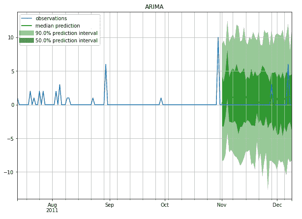

作者图片

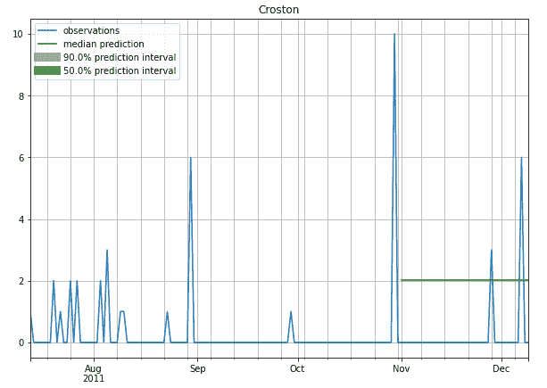

作者图片

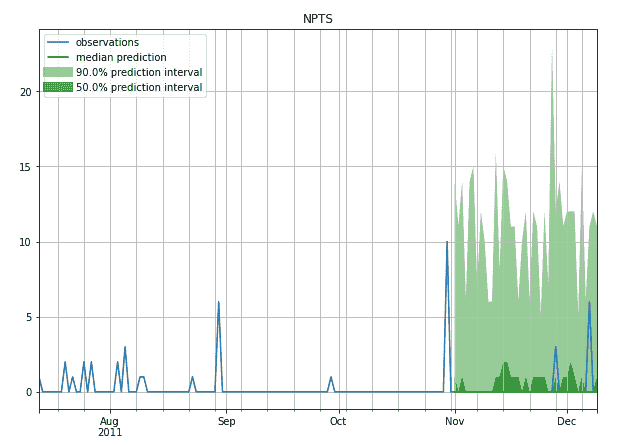

作者图片

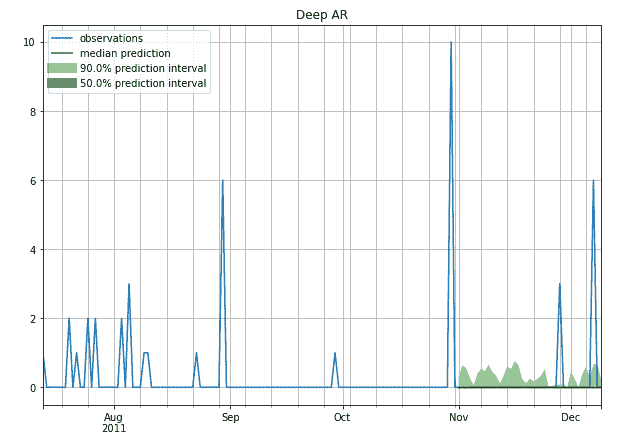

作者图片

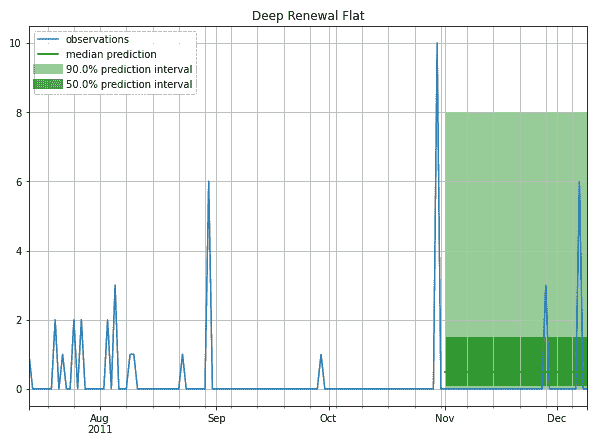

作者图片

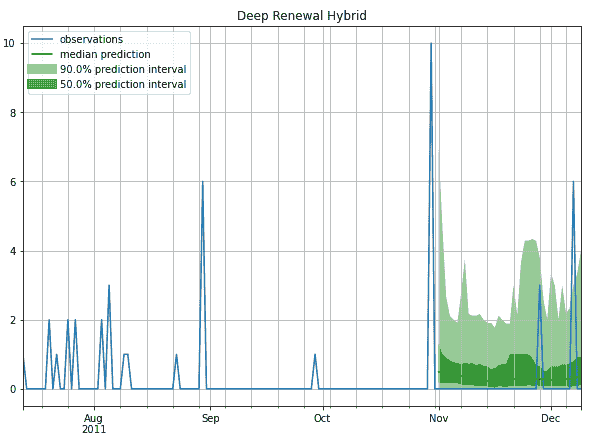

作者图片

**稳定(较少间歇)**

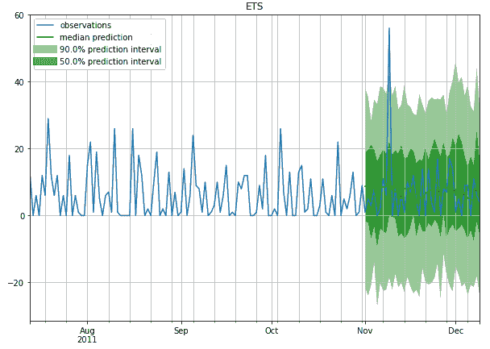

作者图片

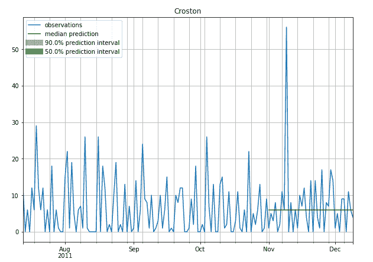

作者图片

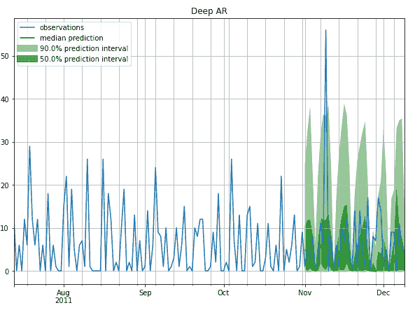

作者图片

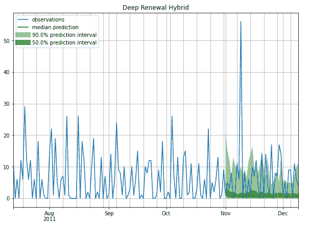

作者图片

# 参考

1.  阿里·卡内尔·土库曼，王渔洋，蒂姆·贾努斯考斯基。[“具有深度更新过程的间歇性需求预测”](https://arxiv.org/pdf/1911.10416.pdf)。arXiv:1911.10416 [cs。LG] (2019)
2.  [**斯蒂芬妮格伦**](https://www.statisticshowto.com/contact/) 。《负二项实验/分布:定义，例子》摘自[**StatisticsHowTo.com**](https://www.statisticshowto.com/):对我们其他人来说的基本统计！[https://www . statistics show to . com/negative-binomial-experiment/](https://www.statisticshowto.com/negative-binomial-experiment/)

*原载于 2020 年 10 月 13 日*[*【http://deep-and-shallow.com】*](https://deep-and-shallow.com/2020/10/13/intermittent-demand-forecasting-with-deep-renewal-processes/)*。*