# 尼日利亚西北部和中北部的境内流离失所者

> 原文：<https://towardsdatascience.com/internal-displacement-in-north-west-north-central-nigeria-b313c939b3b5?source=collection_archive---------33----------------------->

## 我们能从数字中学到什么？

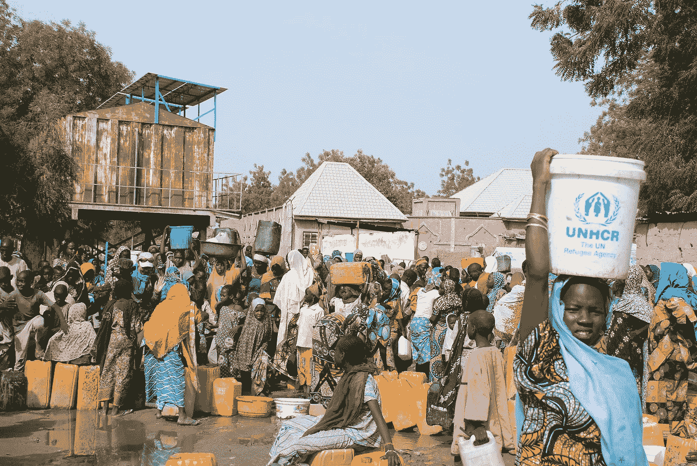

图片来自难民署 KORA

近年来，尼日利亚境内流离失所者人数激增，特别是在该国北部。虽然受影响的人口有一个共同点——在国内流离失所和易受伤害，但他们在人口和地理分布以及安置原因方面可能有不同的特点。我认为，对所有参与向国内流离失所者提供人道主义服务的利益攸关方，最重要的是，对国家各级政府，更好地理解这些是必要的。

设定了这个论述的大背景，具体的背景是尼日尼亚**的**西北**和**中北部**区。**我的目标是通过询问一些具体问题，并使用下述数据集寻求答案，收集关于这两个地区的境内流离失所者的一些信息:

**数据集:**

*尼日利亚位移数据—中北部&西北区—位置评估。* ***发布者*** *:国际移民组织*

*数据集涵盖 2019 年 9 月 4 日至 10 月 16 日期间，包括受流离失所影响最严重的州，包括:* ***贝努埃、纳萨拉瓦和中北部高原；西北部的卡杜纳、卡诺、卡齐纳、索科托和赞法拉*** *如下图:*

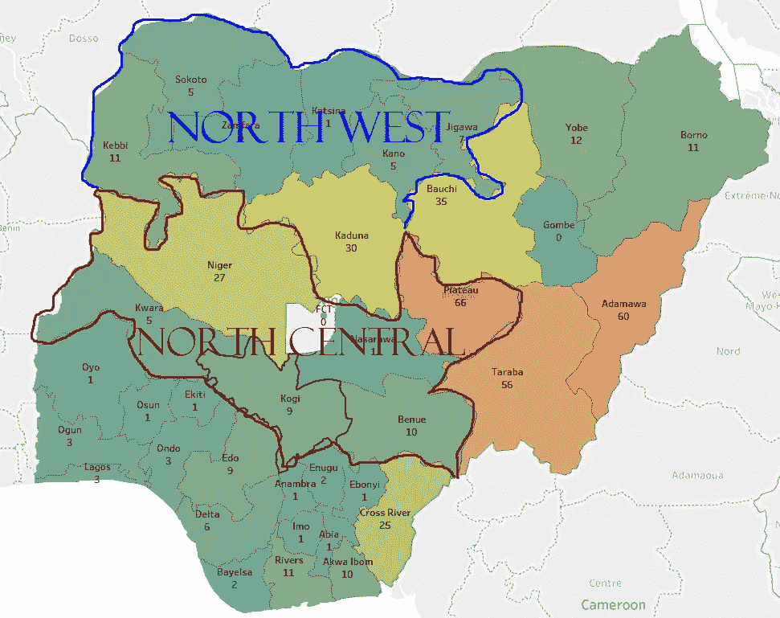

尼日利亚地图。每个州的数字代表该州使用的当地语言的数量。FCT 和贡贝州的语言计数不可用。

## 问题 1:

a .报告的国内流离失所者有多少人口？

***b .各区之间的人口规模有显著差异吗？***

据报告，这两个地区共有 445，901 名境内流离失所者。这个数字相当于瓦里和阿萨巴(两个城市都在尼日利亚南部)人口的总和，从国际角度来看，甚至超过了德国苏黎世的人口。

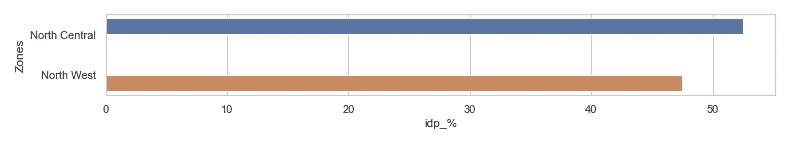

图 A:国内流离失所者的区域分布。

大约 53%的国内流离失所者在中北部地区，47%在西北部地区。这两个地区的国内流离失所者人数只有 6%的差异。一般来说，这对于行政和服务交付来说可以认为是无关紧要的。

虽然这两个地区的国内流离失所者人数没有很大差别，但如果从州一级往下看，情况就不一样了。

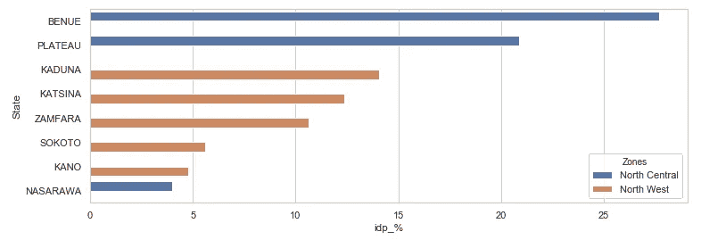

图 B:国内流离失所者在各州的分布情况。

我们可以看到，国内流离失所者人数最多的两个州(贝努埃和高原)属于中北部。贝努埃和普拉托加起来约占整个中北部和西北地区境内流离失所者总数的 47%。同样位于中北部的纳萨拉瓦州的国内流离失所者人数最少，在这两个地区的国内流离失所者总人数中几乎微不足道。我们可以得出结论，中北部地区报告的各州显示了国内流离失所者人口的最高范围。

国内流离失所者是社会中的弱势群体，他们需要政府的干预以及人道主义组织和社会普通成员的援助才能生存。当国内流离失所者聚集在一起时，集中提供社会服务的办法可能效果最好。然而，当他们在地理上分散时，那么应用分布式解决方案交付可能比传统的集中式方法更好。为了获得这方面的一些见解，我问道:

## 问题 2:

***国内流离失所者地点在各州各地方政府辖区的分布情况如何？***

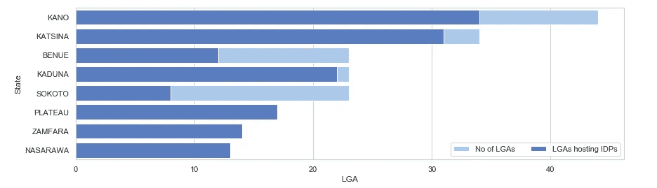

图 C:收容国内流离失所者的地方政府机构占每个州地方政府机构总数的比例。

以下是观察到的情况:

1.  数据显示，境内流离失所者站点遍布东道州的大部分地方政府。
2.  更准确地说，每个州 60%以上的地方政府所在地都有境内流离失所者。
3.  值得注意的是，在高原州、赞法拉州和纳萨拉瓦州，所有地方政府辖区都有境内流离失所者。
4.  卡诺州和卡齐纳州是仅有的拥有 30 多个地方政府所在地的州。此外，这两个州的 30 多个地方政府所在地有境内流离失所者。

## 问题 3:

***各州境内流离失所者的性别分布情况如何？***

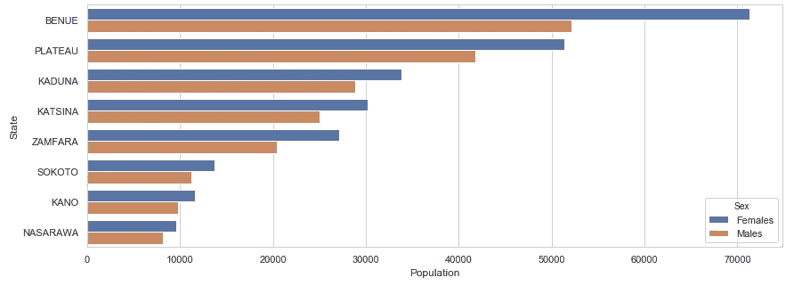

图 D:各州女性与男性国内流离失所者比例图表。

数据显示，在这两个地区的所有州中，女性境内流离失所者人数更多。这种差距在贝努埃州最为突出。

如下图所示，进一步观察发现，在这两个地区的所有州，女性境内流离失所者平均多 9%(性传播疾病多 2.6%)。

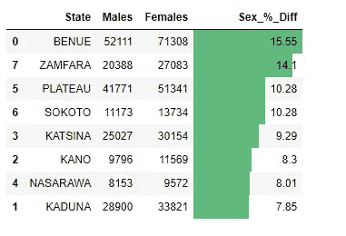

图 E:各州女性与男性境内流离失所者的比例。

一个后续问题是:这一趋势(更多女性境内流离失所者)在地方政府一级是否保持？

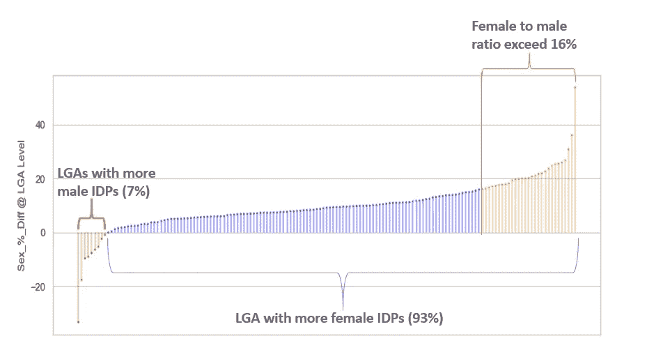

图 f。

上文图 F 显示，这一趋势确实存在，因为 93%的地方政府中女性境内流离失所者多于男性。在这 93%中，约 21%的女性对男性的比例超过 16%，超过了州一级的最大百分比差异。

## 问题 4:

**各州可以关注什么来阻止或减少人们流离失所的机会？**

为了解决这个问题，首先，我们需要知道为什么大多数国内流离失所者流离失所。数据集中提供的一个数据点是大多数人流离失所的**原因。**这样，我们可以从解决上述问题 4 的角度收集一些见解。

在数据集中，部族冲突、叛乱、绑架、武装抢劫和自然灾害被列为大多数境内流离失所者流离失所的原因。每种原因下的人口比例如下:

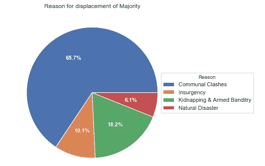

在这两个地区(中北部和西北部)，约 66%的境内流离失所者因社区冲突而流离失所。

这表明，解决现有的社区冲突和预防未来的事件将在所有国家减少 66%的国内流离失所者。

我们将进一步观察这些原因是否以及如何在各州报告中有所不同。

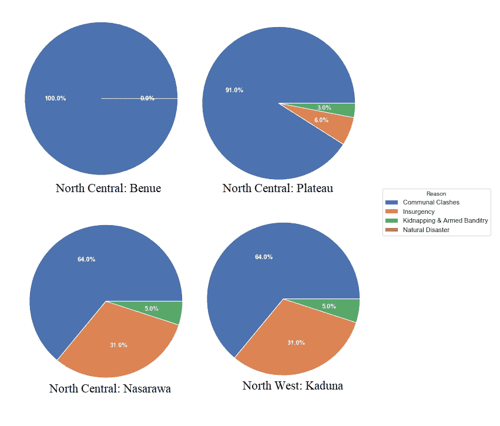

图 G:

在贝努埃、普拉托、纳萨拉瓦和卡杜纳等州，**部族冲突**仍然是境内流离失所的主要原因。非常值得注意的是，贝努埃省 100%的境内流离失所者和高原省 91%的境内流离失所者将部族冲突作为他们流离失所的主要原因。

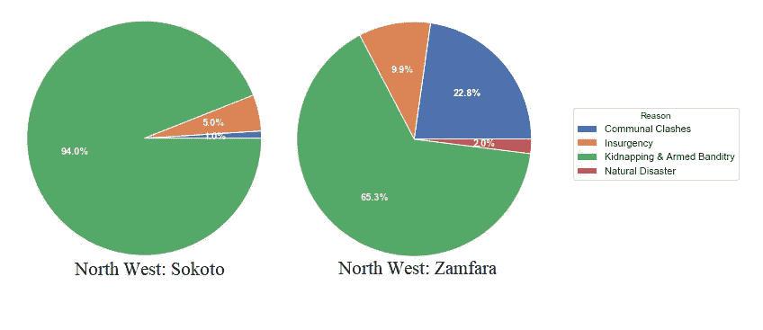

图 H

索科托和赞法拉讲述了一个不同的故事。在这里，大多数国内流离失所者——索科托的 94%和赞法拉的大约 65%——称武装抢劫是他们流离失所的主要原因。

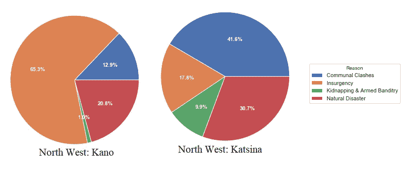

从所提供的数据来看，卡诺仍然是叛乱成为境内流离失所主要原因的唯一一个州。在卡齐纳州，社区冲突和自然灾害是流离失所的主要原因。事实上，卡诺和卡齐纳是仅有的两个报告自然灾害对国内流离失所有重大影响的州。

**推论和建议:**

1.  一个国家的境内流离失所者往往分散在地方政府所在地，因此政府和非政府组织需要采取分布式服务提供方法，以更好地帮助境内流离失所者。
2.  妇女往往占国内流离失所者人口的大多数。因此，在规划时，政府和非政府组织需要多分配一点资源来满足妇女的具体需求和/或服务。
3.  虽然社区冲突是这两个地区和一些州流离失所的主要原因，但州行政人员需要分配更多资源，解决各自州流离失所的主要原因。

总之，必须指出，所提供的数据并没有告诉我们一个国家内的国内流离失所者是否来自同一个国家。由于出于这样或那样的原因在一个国家流离失所的人可以在该国境内或境外寻求庇护，这意味着流离失所的重要原因不一定发生在庇护国。因此，可以得出这样的结论:流离失所的**原因**很少归因于国家。

> 感谢阅读，请注意，此练习的源代码可在 Github 上的 [***此处***](https://github.com/leewaygroups/NGN_IDPs_Analysis) 获得。