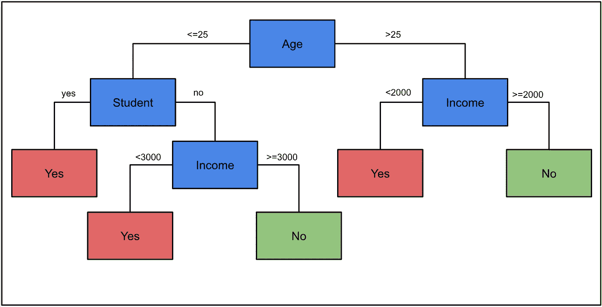
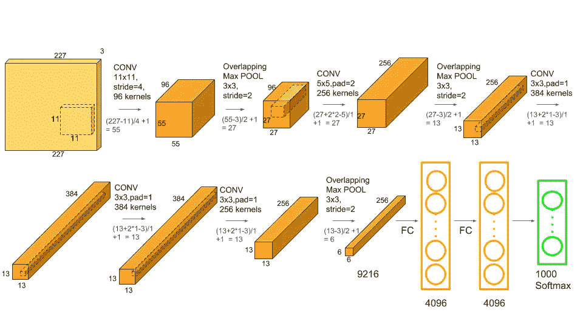

# 可解释与可解释的机器学习

> 原文：<https://towardsdatascience.com/interperable-vs-explainable-machine-learning-1fa525e12f48?source=collection_archive---------6----------------------->

## 可解释的模型和可解释的模型之间的区别以及它为什么重要

从医疗诊断到信贷承保，机器学习模型正被用于做出越来越重要的决策。为了信任由这些模型驱动的系统，我们需要知道它们是如何做出预测的。这就是为什么可解释的模型和可解释的模型之间的区别如此重要。我们理解模型的方式以及我们能够真正理解的程度取决于它们是可解释的还是可解释的。

简而言之，一个可解释的模型可以被人类理解，而无需任何其他的帮助/技术。我们只看模型概要/参数就能理解这些模型是如何做出预测的。我们也可以说一个可解释的模型提供了它自己的解释。相比之下，一个可解释的模型不会提供自己的解释。就其本身而言，这些模型过于复杂，人类无法理解，它们需要额外的技术来理解它们如何做出预测。

在本文的其余部分，我们将:

*   使用示例，深入探究我们如何将模型分类为可解释的或可解释的
*   触及我们可以用来理解一个可解释的模型如何工作的技术
*   讨论可解释性的概念以及它与可解释和可解释模型的关系

# 可解释的机器学习

我们说，如果一件事能够被理解，它就是可解释的。考虑到这一点，我们说如果一个模型能够被人类自己理解，那么它就是可解释的。我们可以查看模型参数或模型摘要，并准确理解它为什么做出某个预测/决策。我们下面讨论的可解释模型的例子包括决策树和线性回归。

在图 1 中，我们有一个决策树，它被训练来预测某人是否会拖欠汽车贷款。假设一个月收入 3000 美元的 29 岁的人提出申请。然后，基于这种模式，一个自动承保系统给了她一笔贷款。我们可以很容易地遍历树的节点，看看为什么做出这个决定。这个人超过 25 岁，所以我们在第一个节点向右走。那么她有一个大于 2000 的收入，所以我们又回到了无叶节点。换句话说，模型预测学生不会拖欠贷款。

图 1:默认预测的决策树(来源:作者)

从这个例子继续，假设我们想要一个模型，使用一个人的年龄和收入来预测给予一个人(Y)的最大贷款规模。我们使用线性回归，得出以下等式:

Y = 100 *年龄+10 *收入+ 200

我们看到，一个人每衰老一年，他们预测的最大贷款额就会增加 100 美元。同样，贷款规模随着收入的增加而增加。对于这个人(26 岁，收入 3000 美元)，最大贷款额预计为 32800 美元。

所以就像决策树一样，我们可以查看这个模型的参数，并准确理解为什么它会做出这样的预测。这是因为这些模型相当简单。决策树只有几个节点，线性回归模型只有 3 个参数。随着模型变得越来越复杂，我们不能再以这种方式理解它们。

# 可解释的机器学习

你可以把 ML 模型想象成一个函数。模型特征是输入，预测是输出。一个可解释的模型是一个复杂到人类无法理解的函数。另一个名称是黑盒模型。我们需要一种额外的方法/技术来窥视黑盒并理解模型是如何工作的。

这种模型的一个例子是随机森林。简而言之，随机森林由许多决策树组成，在进行最终预测时，所有单个树的预测都会被考虑在内。为了理解一个随机的森林是如何工作的，我们必须同时理解所有的树木是如何工作的。即使有少量的树，这也是不可能的。

AlexNet 的架构(来源:[Satya Mallick&Sunita Nayak](https://www.learnopencv.com/number-of-parameters-and-tensor-sizes-in-convolutional-neural-network/)

当我们开始考虑像神经网络这样的算法时，事情变得更加复杂。为了便于理解， [AlexNet](https://en.wikipedia.org/wiki/AlexNet) ，一个用于图像识别的卷积神经网络，有 62，378，344 个参数。相比之下，我们上面的简单回归模型只有 3 个参数。对于人类来说，仅仅通过查看参数权重来理解像 AlexNet 这样的模型是如何工作的是不可能的。

## 用于理解可解释模型的技术

我们需要一些额外的技术来理解像上面讨论的算法是如何进行预测的。这些可能包括像[特征重要性](https://machinelearningmastery.com/calculate-feature-importance-with-python/#:~:text=Feature%20importance%20refers%20to%20techniques,at%20predicting%20a%20target%20variable.)评分这样的技术。这些技术试图确定每个单独的特征能够多好地预测目标变量。分数越高，特征对模型越重要，换句话说，特征对模型预测的影响越大。

来源: [flaticon](https://www.flaticon.com/free-icon/interpretation_1935181)

还有一大堆试图分解单个预测的技术。因此，与着眼于整体预测的特征重要性不同，这些技术将解释每个特征如何对一个特定的预测做出贡献。这包括模型不可知的方法，如[石灰](https://github.com/marcotcr/lime)和 [SHAP](https://github.com/slundberg/shap) 。这意味着它们可以用来解释任何 ML 模型的预测。它们还包括为特定模型创建的方法，例如用于解释神经网络预测的 [DeepLIFT](https://github.com/kundajelab/deeplift) 。

当使用这些技术做出任何结论时，都应该小心谨慎。这是因为这些技术只能提供模型实际预测的近似值。为了验证任何结论，可以结合使用多种技术，或者使用数据可视化来验证这些技术。领域知识也是一个重要的工具。任何与以前的经验/知识相反的结果都应进行更详细的分析。

# 可解释性

到目前为止，我们已经讨论了可解释或可解释的模型，但是应用这种二元标志可能没有意义。这是因为一个模型的可解释性是在一个范围内的，在这个范围内，一些模型比另一些模型更具可解释性。换句话说，可解释性是一个模型能够被人类理解的程度。如果一个模型比另一个模型更容易让人理解它是如何做出预测的，那么这个模型就比另一个模型更容易解释。

在图 2 中，我们可以看到可解释性谱的含义。卷积神经网络比随机森林更难解释，而随机森林比决策树更难解释。大多数模型通常可以分为可解释的或可解释的，其中可解释的模型在光谱的右边，可解释的模型在光谱的左边。然而，有一个灰色地带，在那里你会发现人们对分类有不同意见。

图 2:可解释性谱

例如，像上面讨论的线性回归模型，可以容易地被人理解，并被归类为可解释的模型。在这种情况下，我们只有两个特征(年龄和收入)，但如果我们添加更多的特征，模型将变得更加复杂，更难解释。然而，还不清楚回归模型在什么时候变得可以解释。

## 可解释性-准确性权衡

从上面我们可以看到，一般来说，越不复杂的模型越容易解释。因此，为了更高的可解释性，可能会有较低准确性的折衷。这是因为，在某些情况下，简单的模型可以做出不太准确的预测，但这实际上取决于你试图解决的问题。例如，使用可解释的模型(如逻辑回归)来进行图像识别，结果会很差。即便如此，对于许多问题，一个可解释的模型和一个可解释的模型表现一样好。

在下面的文章中，我们比较了一个可解释的模型，逻辑回归，和一个可解释的模型，神经网络。我们表明，通过对我们的问题进行一些思考，并从我们的数据集创建新的特征，我们可以通过一个可解释的模型实现类似的准确性。它很好地实践了我们在本文中讨论的一些概念。

 [## 特征工程的力量

### 为什么您可能只应该使用逻辑回归来建模非线性决策边界(使用 Python 代码)

towardsdatascience.com](/the-power-of-feature-engineering-b6f3bb7de39c) 

## 成为推荐会员

如果你觉得这篇文章很有帮助并且想看更多，你可以成为我的 [**推荐会员**](https://conorosullyds.medium.com/membership) 来支持我

## 图像来源

图片为本人或从 www.flaticon.com 的[获得。在后者的情况下，我拥有他们的](http://www.flaticon.com/)[高级计划](https://support.flaticon.com/hc/en-us/articles/202798201-What-are-Flaticon-Premium-licenses-)中定义的“完全许可”。

## 参考

[1] C. Rudin，停止解释高风险决策的黑盒机器学习模型，转而使用可解释的模型(2019)，[https://www.nature.com/articles/s42256-019-0048-x](https://www.nature.com/articles/s42256-019-0048-x)

[2] R. Gall，机器学习可解释性 vs .可解释性:两个可以帮助恢复对 AI 信任的概念(2018)，[https://www . kdnugges . com/2018/12/Machine-Learning-explability-interprebility-AI . html](https://www.kdnuggets.com/2018/12/machine-learning-explainability-interpretability-ai.html)

[3] S. Mallick & S. Nayak，卷积神经网络中的参数数量和张量大小(CNN) (2018 年)，[https://www . learnopencv . com/Number-of-Parameters-and-Tensor-Sizes-in-convolutionary-Neural-Network/](https://www.learnopencv.com/number-of-parameters-and-tensor-sizes-in-convolutional-neural-network/)