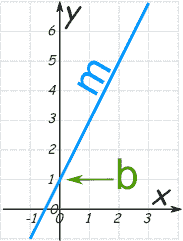

# 在 10 分钟内解释线性回归(非技术性)

> 原文：<https://towardsdatascience.com/interpret-linear-regression-in-10-mins-non-technical-3f78f1f1dbd1?source=collection_archive---------19----------------------->


简·kopřiva 在 [Unsplash](https://unsplash.com?utm_source=medium&utm_medium=referral) 上的照片

当有那么多伟大的文章和对最常见算法的解释时，为什么还要花力气写这个呢？一个高管或非技术人员如何解读线性回归？所有的文章都很注重技术细节。

> 我喜欢理解事物减去*额外努力*后的样子。

线性回归是最基本的算法。尽管浏览线性回归教程可以让一个高中生在大约五分钟内理解并*实现*一个 Python 模型，但在生产环境中应用机器学习算法时还有更多细微差别。

这个博客和即将到来的系列文章的目的是用通俗的语言来捕捉和解释线性回归的微妙之处。你可以关注我[这里](https://medium.com/@anishmahapatra)了解更多。

## 线性回归模型是什么意思？

你记得我们在学校学过的直线方程吗？数学上，直线的表示表示为
y = MX + b。



直线方程([来源](https://www.mathsisfun.com/equation_of_line.html))

```
**y = mx + b**Where, if you were to imagine a straight line (as shown above),**m**: The slope of the line (The angle at which the line is turned)**b**: The intercept (On the Y-Axis, how much higher or lower is the line)**y**: The dependent/ target variable (The value we want to predict)**x**: The independent/ predictor variable (The variable that we use to make the prediction)
```


由[萨曼莎·加德斯](https://unsplash.com/@srosinger3997?utm_source=medium&utm_medium=referral)在 [Unsplash](https://unsplash.com?utm_source=medium&utm_medium=referral) 上拍摄的照片

## 线性模型的真实解释:

让我们从一个管理者的角度来看模型，而不是一个精通技术的人。

> 机器学习模型只是一种能够表示或猜测接下来会发生什么的方法，某些东西属于哪里，或者什么样的特征组合将最适合知道接下来会发生什么。

> 一个机器学习模型是**不是魔法**。它只是数据的数学最佳表示。

*直线模型*中的*直线*代表直线。数据必须是这样的，即数据中有一个**线性趋势**，以便能够使用*线性回归*。让我们来看一个线性模型的经典例子——牛顿第一运动定律。

```
Force = Mass x Acceleration ( F = m x a )
```

现在让我们来解释一下。如果物体的质量不变，那么，当我们增加物体的加速度时，所施加的力也会增加。

为了与前面的公式进行比较，

```
y = mx + bFor this case, 
y = mxand, there is no intercept: '**b'** here. This means that the graph will pass through the origin. (when x = 0, y = 0)
```

现在让我们看看什么是*线性回归*中的*回归*。在机器学习中，

*   因变量表示为“y”
*   将要使用的独立变量表示为“X”

回归只是在自变量和因变量之间建立一种关系。*线性回归*是在特征和因变量之间建立一种关系，这种关系最好用直线**来表示**。

线性回归有两种类型:简单线性回归和多元线性回归。
- *简单线性回归*:用一个自变量预测一个因变量
- *多元线性回归*:用多个自变量预测一个因变量

所以，如果你有一个数据科学家说:

> 我将对独立特征和预测值运行多元线性回归模型，理解他将尝试通过数据制作一条直线，该直线尽可能接近输入数据点。

可以用各种方法在数据中画一条线。

问:您认为**最佳拟合**线意味着什么？
答:在这里，你会听到数据科学家说，他们正试图最小化**成本函数**。

问:成本函数/误差函数是什么意思？
A .汇总误差的函数。作为一个用户，你会想要一个*最优*成本函数，因为这将意味着你有最少的可能误差。

**最佳拟合**线将具有倾斜和截距，以使其通过或尽可能接近数据点。


[萨法尔·萨法罗夫](https://unsplash.com/@codestorm?utm_source=medium&utm_medium=referral)在 [Unsplash](https://unsplash.com?utm_source=medium&utm_medium=referral) 上拍摄的照片

## 代码？

为了能够解释模型的简单性和执行，您必须深入理解实现。在我的 [Github](https://github.com/anishmahapatra01/MasterDataScience/tree/master/Course02-machineLearning-I/01LinearRegression) 上，你可以随意使用同样的工具。如果您在机器学习笔记本的流程中遇到任何问题，请在那里提出问题或在下面发表评论。我强烈建议你在 [Medium](https://medium.com/@anishmahapatra) 或 [LinkedIn](https://www.linkedin.com/in/anishmahapatra/) 上关注我，以便最大限度地接触科技前沿。

如果你想在旧的硬件上运行最新的模型，你可以参考这里的链接在云上免费运行它。

[https://towards data science . com/running-jupyter-notebook-on-the-cloud-in-15-mins-azure-79b 7797 e4ef 6](/running-jupyter-notebook-on-the-cloud-in-15-mins-azure-79b7797e4ef6)

## 评估:

作为一个被动的观察者，看着数据科学家向你展示的各种模型，你必须能够判断一个模型是否*适合*你的需求。请注意，我非常小心地避免在这里使用“好的 T4”或“坏的 T6”这个词。这是一个有意识的决定，因为它因情况而异。

然而，关于这一点，我已经听了太多遍了，我决心为您提供用例和直觉，以便您可以评估该模型是否适合您。在这里，我将强调指出，主管级别的人员可以查看数据科学 Jupyter 笔记本(代码)或提出问题，如下所述。

> 我将解释问题，但不解释答案，因为这是数据科学家的职责。

**如果**数据科学家无法回答，数据科学家需要进一步的培训，然后你才能决定相信结果。


卡洛斯·穆扎在 [Unsplash](https://unsplash.com?utm_source=medium&utm_medium=referral) 上的照片

*   你**清理数据**了吗？你采取了什么步骤，为什么？受影响的列有哪些？
*   按行和列，丢失值 /损坏数据的**百分比是多少？你如何处理丢失的数据？**
*   您是否对数据执行了**异常值分析**？你能给我看一下**箱线图**并向我解释它们以及你为什么决定保留异常值(或移除它们)的理由吗？
*   给我看一下**单变量图**并详细解释给我听。请确保明确记录并提及有趣的趋势。
*   给我看一下**二元图**并解释因变量的有趣趋势。确保你谈论的是与商业背景相关的最重要的变量。(索要**热图**)


凯文·Ku 在 [Unsplash](https://unsplash.com?utm_source=medium&utm_medium=referral) 上的照片

*   对数据进行了**特征工程**吗？有哪些衍生/新功能？
*   什么是**测试列车**拆分？为什么？火车测试数据中有溢出吗？
*   你**是如何处理****分类变量**并生成粘性变量的？有没有考虑过 [*哑变量陷阱*](https://www.algosome.com/articles/dummy-variable-trap-regression.html) ？
*   在绘制模型时，**变量应逐个删除，**变量应在每个变量删除后进行统计和 VIF 分数分析。有人跟踪了吗？
*   是否考虑过统计模型的 **F 统计量**或 **p 值**(一般小于 0.05)？

*   有没有考虑过**多重共线性**的可能性？你能给我看看 VIF T21(可变通货膨胀系数)吗？(VIF > 10 可能表示多重共线性)
*   你对测试数据的结果进行验证了吗？R 平方值是多少？(越接近 1 越好)
*   什么是**调整后的 R 平方**值？这可用于比较具有不同数量特征的模型(越接近 1 越好)

如果你已经到了这种地步，那是令人钦佩的。这意味着你有真正的兴趣，你应该理解建模的细微差别。假设我们处理的是基本干净的数据，问上述问题将有助于我们解释线性回归模型。要进一步了解如何[评估一个线性回归模型](https://medium.com/acing-ai/how-to-evaluate-regression-models-d183b4f5853d)，你可以参考这里的链接。

# 结论:

虽然上述问题可能有助于您理解数据科学家所做的工作，但诠释数据科学的最佳方式就是**亲自动手**！无论是代码还是对代码的解释，获得理解的最佳方式是亲自动手，在 [Kaggle](https://www.kaggle.com/thedudeanish) 和 [ProjectPro](https://www.dezyre.com/projects/data-science-projects/data-science-projects-in-python) 上查看一些行业标准实现。

[](https://www.linkedin.com/in/anishmahapatra/) [## Anish Mahapatra -数据科学家-穆适马公司| LinkedIn

### 我正在努力理解数学、商业和技术如何帮助我们在未来做出更好的决策…

www.linkedin.com](https://www.linkedin.com/in/anishmahapatra/) 

我花了很多时间研究，并且非常喜欢写这篇文章。如果这对你有帮助，给我点爱！😄我也写关于千禧一代的[生活方式](https://medium.com/@anishmahapatra/the-millennial-burn-out-is-real-a0acebff25ae)、[咨询](https://medium.com/@anishmahapatra/my-top-5-learnings-as-a-consultant-accc5989ec34)、[聊天机器人](https://chatbotslife.com/how-you-can-build-your-first-chatbot-using-rasa-in-under-15-minutes-ce557ea52f2f)和[金融](https://medium.com/@anishmahapatra/the-investment-guide-for-smart-noobs-9d0e2ca09457)！如果您对此有任何问题或建议，请随时通过 LinkedIn[联系我](https://www.linkedin.com/in/anishmahapatra/)或关注我[这里](https://medium.com/@anishmahapatra)，我很想听听您的想法！