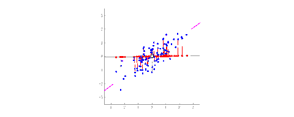
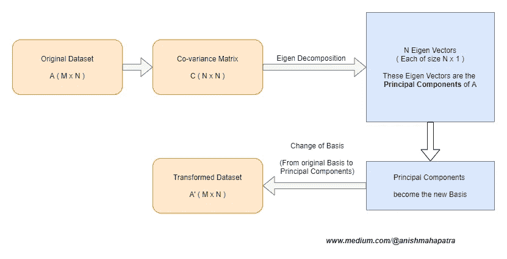

# 解释主成分分析(PCA)

> 原文：<https://towardsdatascience.com/interpret-principal-component-analysis-pca-b8b4a4f22ece?source=collection_archive---------10----------------------->

故事。若昂·布兰科在 [Unsplash](https://unsplash.com?utm_source=medium&utm_medium=referral) 上的照片

数据可以告诉我们故事。反正我是这么听说的。作为一名为财富 300 强客户工作的数据科学家，我每天都要处理大量的数据，我可以告诉你，数据 ***可以*** 告诉我们故事。您可以对数据应用回归、分类或聚类算法，但特征选择和工程可能是一项艰巨的任务。很多时候，我看到数据科学家采用自动方法进行特征选择，如递归特征消除(RFE)或使用随机森林或 XGBoost 利用特征重要性算法。所有这些都是很好的方法，但可能不是获取所有数据“精华”的最佳方法。

# 理解 PCA 的细微差别

## 主成分分析的直觉

如果我们有两列代表 X 和 Y 列，你可以用 2D 轴来表示。假设我们添加了另一个维度，即 Z 轴，现在我们有了一个称为超平面的东西来表示这个 3D 空间中的空间。
现在，包含 n 维的数据集也无法可视化。

重新对齐轴以捕捉数据中的最大差异

PCA 的思想是在 n 维空间中重新排列轴，这样我们可以捕获数据中的大部分差异。在行业中，没有太大差异的特征被丢弃，因为它们对任何机器学习模型没有太大贡献。这些代表数据中大部分方差的新轴被称为主成分。

层次。Alexander Schimmeck 在 [Unsplash](https://unsplash.com?utm_source=medium&utm_medium=referral) 上拍摄的照片

使用主成分的原因是为了处理相关的预测值(多重共线性)以及在二维空间中可视化数据。

PCA 是一种统计过程，用于将可能相关的特征的观察结果转换成主成分，使得:

*   它们彼此不相关
*   它们是原始变量的线性组合
*   它们有助于获取数据集中的最大信息

PCA 是数据中基础的[变化。](https://eli.thegreenplace.net/2015/change-of-basis-in-linear-algebra/)

## 主成分分析的方差

如果一个列的方差越小，它包含的信息就越少。PCA 以这样的方式改变基，使得新的基向量捕获最大方差或信息。这些新的基向量被称为主分量。

乔恩·泰森在 [Unsplash](https://unsplash.com?utm_source=medium&utm_medium=referral) 上的照片

## 主成分分析作为一种降维技术

想象一下很多数据科学家面临的情况。您已经收到数据，执行了数据清理、缺失值分析和数据插补。现在，您继续进一步分析数据，注意分类列，并通过创建虚拟变量对数据执行一次性编码。现在，我们进行特征工程，制造更多的特征。我有过这样的经历，这导致了超过 500 个，有时是 1000 个特性。

 [## 在 15 分钟内在云上运行 Jupyter 笔记本电脑#Azure

### 文章做到了标题所说的。在 Azure 笔记本电脑(免费或付费)上运行 Jupyter Notebook，其成本仅为……

towardsdatascience.com](/running-jupyter-notebook-on-the-cloud-in-15-mins-azure-79b7797e4ef6) 

我应该如何将如此多的特征输入到一个模型中，或者我应该如何知道重要的特征？如果我们继续使用递归特征消除或特征重要性，我将能够选择对预期输出贡献最大的列。然而，如果我们错过了一个对模型有更大贡献的特性呢？模型迭代的过程容易出错且繁琐。PCA 是我们可以利用的一种替代方法。

主成分分析是一种经典的降维技术，用于捕捉数据的本质。它可以用来捕捉超过 90%的数据方差。

*注*:方差不表示列间关系或变量间的相关性。我们对协方差矩阵进行对角化，以获得如下基向量:

*   无关联的
*   线性相关
*   解释最大方差的方向

PCA 的算法寻求找到对角化协方差矩阵的新的基向量。这是使用特征分解完成的。

照片由[路易斯·费利佩](https://unsplash.com/@luiztrix?utm_source=medium&utm_medium=referral)在 [Unsplash](https://unsplash.com?utm_source=medium&utm_medium=referral) 上拍摄

## 主成分分析算法

1.  将数据集中的所有信息表示为协方差矩阵。
2.  对协方差矩阵执行特征分解。
3.  新的基础是在步骤 I 中获得的协方差矩阵的特征向量
4.  在新的基础上表示数据。新的基也被称为主成分。

我在 draw.io 中制作的 PCA 流

## 密码

现在，我在这里写的文章如果没有实际的编码经验是写不出来的。我相信你的代码应该在它该在的地方，不是在[介质](https://medium.com/@anishmahapatra)上，而是在 GitHub 上。

 [## anishmahapatra 01/masters-机器学习-1

### 此时您不能执行该操作。您已使用另一个标签页或窗口登录。您已在另一个选项卡中注销，或者…

github.com](https://github.com/anishmahapatra01/masters-machine-learning-1/tree/master/04DimensionalityReduction-pca/pca-help-assignment/Anish-PCA-and-Clustering-Assignment) 

我已经列出了注释代码和一个使用 PCA 的样本聚类问题，以及帮助您入门的必要步骤。

逻辑步骤详述如下:

*   缺失值和异常值分析完成后，标准化/规范化数据以帮助模型更好地收敛
*   我们使用 sklearn 的 PCA 包对数字和虚拟特征进行 PCA
*   使用 pca.components_ 查看生成的 pca 成分
*   使用 PCA.explained_variance_ratio_ 了解数据解释的差异百分比
*   Scree 图用于了解需要使用多少个主成分来获取数据中的期望方差
*   运行机器学习模型以获得期望的结果

[乔丹·怀特菲尔德](https://unsplash.com/@whitfieldjordan?utm_source=medium&utm_medium=referral)在 [Unsplash](https://unsplash.com?utm_source=medium&utm_medium=referral) 上的照片

 [## 在 10 分钟内解释线性回归(非技术性)

### 当有那么多伟大的文章和对最常见算法的解释时，为什么还要花力气…

towardsdatascience.com](/interpret-linear-regression-in-10-mins-non-technical-3f78f1f1dbd1) 

# 结论:

恭喜你！如果你已经设法达到文章的这个阶段，你是令人敬畏的。起初，主成分分析似乎令人望而生畏，但是，随着你学会将它应用于更多的模型，你将能够更好地理解它。

所以，关于我的一点点。我是一家顶级数据科学公司的数据科学家，目前正在攻读数据科学硕士学位。我花了很多时间研究，并且非常喜欢写这篇文章。如果这对你有帮助，给我点爱！😄我也写关于[千禧一代的生活方式](https://medium.com/@anishmahapatra/the-millennial-burn-out-is-real-a0acebff25ae)、[咨询](https://medium.com/@anishmahapatra/my-top-5-learnings-as-a-consultant-accc5989ec34)、[聊天机器人](https://chatbotslife.com/how-you-can-build-your-first-chatbot-using-rasa-in-under-15-minutes-ce557ea52f2f)和[财经](https://medium.com/@anishmahapatra/the-investment-guide-for-smart-noobs-9d0e2ca09457)！如果您对此有任何问题或建议，请随时在 [LinkedIn](https://www.linkedin.com/in/anishmahapatra/) 上联系我或关注我[这里](https://medium.com/@anishmahapatra)，我很想听听您的想法！

 [## Anish Mahapatra -数据科学家-穆适马公司| LinkedIn

### 我正在努力理解数学、商业和技术如何帮助我们在未来做出更好的决策…

www.linkedin.com](https://www.linkedin.com/in/anishmahapatra/)