# 解释你的回归

> 原文：<https://towardsdatascience.com/interpret-your-regression-d5f93908327b?source=collection_archive---------50----------------------->

## 逐步实现逻辑回归

如果你手头有一个分类任务，你的 go-to 算法是什么？如果不是逻辑回归或者即使是，你有没有发现线性回归和逻辑回归之间的相似之处？如果是，那是因为逻辑回归本身就是一个线性模型。但是不要担心，在这篇文章中，你将通过解释一个逻辑回归和它的参数，你将得到为什么这个算法被认为是线性的答案。

使用的数据集是 UCI 机器学习库中可用的**宫颈癌(风险因素)数据集**。你可以在这里从[那里得到干净的版本。](https://github.com/Anpr1211/Interpretable-ML/blob/master/Cervical%20Cancer%20Dataset/Cervical_Cancer_Dataset_Cleaned.csv)

**目标变量为‘活检’**，存储布尔值 0，代表癌症阴性病例，1，代表癌症阳性病例。

预测器或特征是-

*   荷尔蒙避孕药——(对/错)
*   **抽烟**——(对/错)
*   **怀孕数量**
*   **性病:诊断数量**
*   **宫内节育器**——(对/错)

数据集的清理和预处理、分类变量的虚拟编码和分割以通常的方式完成。接下来的步骤可以参考[这里的](https://github.com/Anpr1211/Interpretable-ML/blob/master/Cervical%20Cancer%20Dataset/Cervical%20Cancer%20Dataset%20-%20Cleaning.ipynb)。

微软研究院的 [InterpretML python 包](https://github.com/interpretml/interpret)已经用于该数据集的探索。

这篇文章遵循类似于[解释你的回归——线性回归](/interpret-your-regressions-1-cae5c2f4c0f9)的结构，并处理逻辑回归的可解释性。

从目标变量的可视化开始探索性数据分析，观察到 2 个类别非常不平衡，因此，这是**不平衡分类**的情况。所有的分类变量本身也是不平衡的。

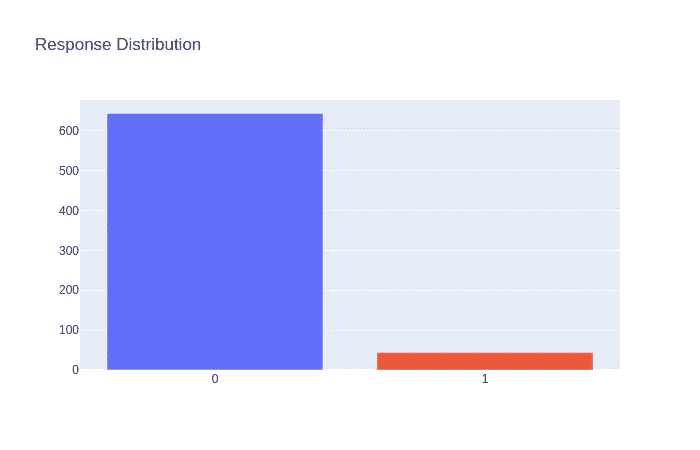

连续特征“怀孕次数”是高度正偏的，即右尾巴比左尾巴更长。这种分布预计会减少怀孕次数，如 1 次、2 次等。更加普遍。

逻辑回归方法用于分类任务，假设**二项式分布产生了目标变量**，我们需要为一组给定预测值的成功概率建模“p”。这里的‘p’是女性患宫颈癌的概率。

由于逻辑回归被认为是线性模型，为了简单起见，首先考虑一个简单的线性方程

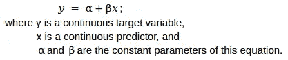

记住标准 8 课，函数是在数学中首次引入的，考虑这样一个函数，**logit 函数**，给出如下

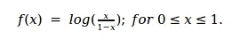

*logit 函数的值域为[0，1],值域范围为∞到∞。*

现在，考虑这个函数的逆函数，

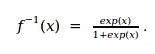

*这是* ***逻辑函数*** *，其范围在∞~之间，域在 0 ~ 1 之间。*

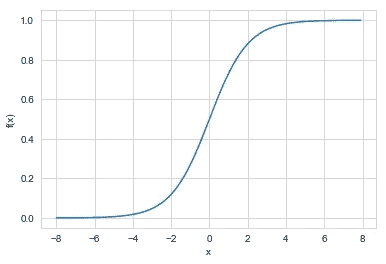

逻辑曲线

现在让我们来看最有趣的部分。考虑一个介于 0 和 1 之间的值“p”。所以， *f(p) = log { p/(1-p) }* 。如果假设“p”是女性患宫颈癌的概率，那么 *p/(1-p)* 是女性可能患宫颈癌的“几率”，其中“几率”只是定义事件概率的另一种方式。因此， *f(p)* 可以被认为是女性可能患有癌症的对数几率。

现在，f(p)的范围位于∞和∞之间，可以有把握地假设:

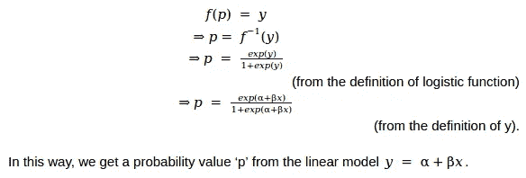

另一种写法是

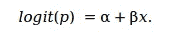

这个公式用于解释模型，因为 logit 可以解释为**成功几率的对数**。

*对于将线性模型与结果参数联系起来的任意函数 g(p) = y，该模型被称为* ***广义线性模型*** *。所以，当你在线性回归模型上使用逻辑斯蒂函数时，你会得到逻辑斯蒂回归的算法。*

现在剩下的唯一工作是将概率值分类，这是使用一个简单的条件完成的。如果' p' > 0.5，则类为 1，否则为 0。

在宫颈癌数据集上训练逻辑回归给出了**93%的准确度，这看起来相当高**，但是由于这是一个不平衡的分类，因此需要进一步分析。

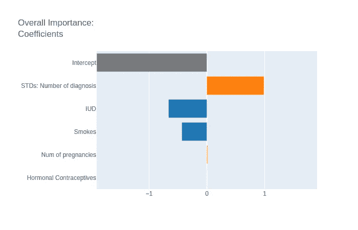

逻辑回归的权重被解释为特征 x 的一个单位的变化改变了𝛽单位的成功几率的对数，就像简单线性回归的情况一样。但是为了简单起见，解释是根据比值比进行的，比值比只不过是对数比值的指数。

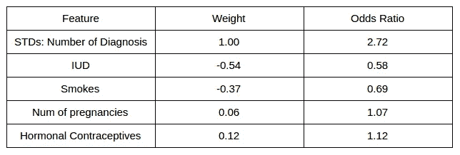

*在所有其他特征保持不变的情况下，怀孕数量的增加改变或增加了癌症与非癌症的几率 1.07 倍。*

*对于使用宫内节育器(IUD)的女性，在所有其他特征保持不变的情况下，与未使用 IUD 的女性相比，患癌与未患癌的几率低 0.58 倍。*

**这些解释总是附带一个注释，即“所有其他特征保持不变”，以避免变量之间的相互作用。**

为了进一步分析分类模型的准确性，绘制了精度-召回曲线，因为这是不平衡分类的情况。

> “然而，如果类分布中有很大的偏差，ROC 曲线可能会对算法的性能表现出过于乐观的看法。[……]在信息检索中经常使用的精确回忆(PR)曲线，已经被引用作为 ROC 曲线的替代，用于类别分布中具有大偏斜的任务。”
> 
> ——杰西·戴维斯和马克·戈德里奇，
> (引自戴维斯，j .和戈德里奇，M. 2006，
> 
> [精确回忆和 ROC 曲线的关系，](https://dl.acm.org/doi/10.1145/1143844.1143874)ICML 06:第 23 届机器学习国际会议论文集)

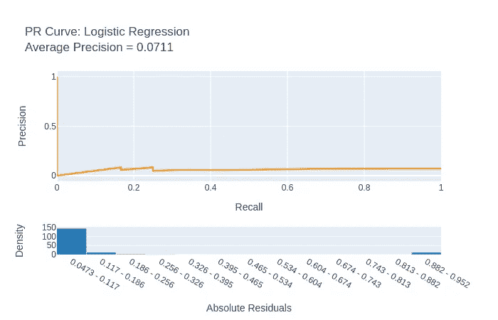

精确回忆曲线提醒人们注意这一点:对于大多数阈值来说，模型只是稍微高于无技能线。无技能线是一条平行于 x 轴的线，其值为数据集中阳性病例的比率，在本例中为 0.06。但这与 93%的高准确率相矛盾。

对混乱矩阵的研究将澄清这种情况。

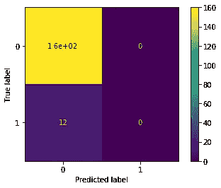

观察到**该分类器已经不能正确地分类任何阳性类别(类别 1)**。大多数情况属于 0 类，并且所有预测都属于 0 类，这一事实导致分类器的高准确度。因此，这种类的不平衡需要通过对数据集中的类 1 进行过采样或对类 0 进行欠采样来补偿，目前这已经超出了本文的范围。

这就是逻辑回归如何发挥作用的，人们希望这种算法被认为是线性的背后的逻辑，以及对权重的解释现在已经很清楚了。逻辑回归仍然是机器学习世界中最强大的算法之一，由于其简单性，在不久的将来不会对其地位和重要性构成威胁。

本文基于 Christoph Molnar 的《可解释的机器学习》一书的探索，[第 4.2 节](https://christophm.github.io/interpretable-ml-book/logistic.html)你可以在这里找到 Github repo [。](https://github.com/Anpr1211/Interpretable-ML)