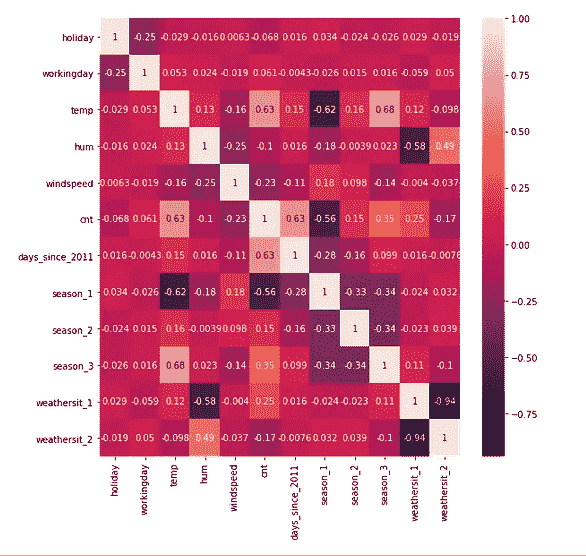
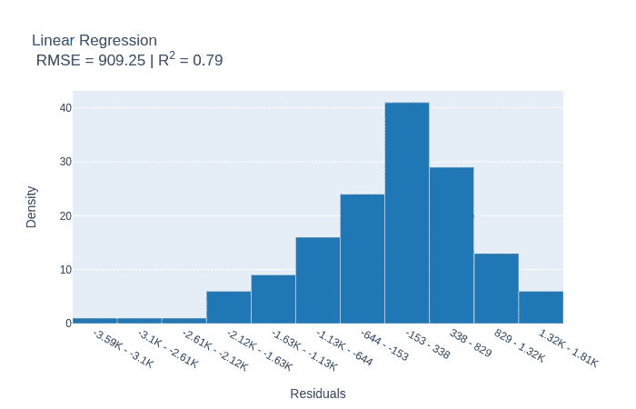

# 解释你的回归

> 原文：<https://towardsdatascience.com/interpret-your-regressions-1-cae5c2f4c0f9?source=collection_archive---------37----------------------->

## 线性回归演练

*“如果你把数据折磨够了，自然总会招供的。”
——罗纳德·科斯
(引自科斯，R. H. 1982。经济学家应该如何选择？
美国企业研究所，华盛顿特区)*

你有多少次冒险越过。fit()和。你做的无数机器学习模型的 predict()方法？想知道术语“权重”实际上代表什么，以及它在不同算法中的不同解释吗？在梯度推进中，预测是由先前的树模型做出的预测的加权和，因此，权重指的是模型中每个变量的相对重要性。另一方面，在广义线性模型中，权重意味着目标变量随着相应特征的单位变化而变化。

在本文中，您将了解机器学习世界中最广泛使用的算法之一——线性回归，并且在文章结束时，您将揭示这个看似简单的算法所包含的许多秘密。

这里使用的数据集是 UCI 机器学习库中可用的**自行车共享数据集**。你可以从[这里](https://github.com/Anpr1211/Interpretable-ML/blob/master/Bike%20Sharing%20Counts/Bike_Sharing_Dataset_Cleaned.csv)得到清理后的版本。

**目标变量，也称为回归变量，是某一天借出的自行车总数。**

使用的预测器或回归器是-

*   **季节**:季节(1:冬季，2:春季，3:夏季，4:秋季)
*   **节假日**:当天是否为节假日
*   **工作日**:如果该日既不是周末也不是节假日，则为 1，否则为 0。
*   **天气状况**:

*- 1:晴，少云，部分多云，部分多云*

*- 2:薄雾+多云，薄雾+碎云，薄雾+少云，薄雾*

*- 3:小雪、小雨+雷雨+散云、小雨+散云*

*- 4:暴雨+冰托盘+雷雨+雾、雪+雾*

*   **temp** :归一化温度，单位为摄氏度。
*   **嗡嗡声**:归一化湿度。
*   **风速**:归一化风速。
*   **自 2011 年起天数**:自 2011 年 1 月 1 日起的天数。

数据集的初始预处理、虚拟编码和分割是以通常的方式完成的。接下来的步骤可以参考[这里的](https://github.com/Anpr1211/Interpretable-ML/blob/master/Bike%20Sharing%20Counts/Bike%20Sharing%20Counts%20-%20Collection%2C%20Cleaning%20and%20EDA.ipynb)。

[**InterpretML python 包**](https://github.com/interpretml/interpret) 已用于该数据集的探索。InterpretML 是一个开源的 python 包，用于训练可解释的机器学习模型和解释黑盒系统。

从目标变量**的可视化开始探索性数据分析，可以假设它遵循正态分布**，因为它似乎是近似对称的。

接下来，我们观察到，所有类别的分布都呈现出明显的不平衡，回归方程与“temp”和“days_since_2011”的正相关值分别为 0.63。这两个特征预计将在模型中占有很高的权重。

相关矩阵

另一个要观察的点是‘天气坐 _ 1’和‘天气坐 _ 2’之间的相关值为-0.94。这让我们想到了线性回归的假设之一，**不存在多重共线性**。多重共线性意味着回归模型中的部分或全部解释变量之间存在某种关系。比如，在家庭用电量对其收入和房屋面积的回归中，有一个约束条件，即收入较高的家庭通常拥有较大的房屋。因此，不可能分别测量两个预测因素对目标的影响。在给定的数据集中,“weathersit_1”和“weathersit_2”都是指晴空和有雾(不清晰)的天空，它们是互补事件，因此，它们之间存在高度负相关。这两个变量都保存在数据集中，不会被删除，但是它们对自行车数量的影响无法以通常的方式确定。

训练一个简单的线性回归模型，假设目标变量与特征共享一个线性关系，给我们一个 79%的相关值。因此，可以说**该模型能够解释目标变量中存在的全部变化的 79%。**

查看残差的直方图显示，分布是负偏斜的，即左尾部比右尾部相对更长。这就违背了**homoscedastacy**的假设，即误差分布的方差应该是常数，或者在一个模型中，

从图中可以清楚地看出，残差不遵循这样的分布，因此可以说是异方差的。因此，在这种情况下，不能使用普通的最小二乘法(这是执行线性回归最常用的方法)，而需要使用加权最小二乘法。

然而，既然模型已经建立和拟合，让我们继续解释模型的权重。

x 轴代表分配给相应预测变量的权重的数值。

在连续特征中，“温度”的权重最高。这与我们的观察结果一致，即“温度”与自行车数量之间存在有效的相关性。在所有其他特征保持不变的情况下，气温每升高 1 摄氏度，自行车的预期数量就会增加 5282 辆。

“weathersit_1”表示晴朗的天气条件，并在分类特征中获得最大权重。在这样的日子里，预计会有更多的人去骑自行车，这是正常的*如果所有其他特征保持不变，与其他天气条件相比，自行车的数量估计会多 1730 辆。*

*这些解释总是带有“假设所有其他特征保持不变”的条款，因为即使一个特征值发生变化，也会在模型中产生交互作用，从而影响目标变量。*

需要注意的一点是,“days_since_2011”在模型中似乎没有任何重要性，尽管它与目标变量存在相关性。为了进一步研究这个问题，我们来看一下个体预测是如何进行的。

x 轴代表各自权重和特征值的乘积。

与整个数据集相比，某些要素对预测自行车数量的贡献非常小或非常大。与平均值和特征“days_since_2011”相比，温度(0.48 度)对预测值的贡献非常小，因为此实例来自 2012 年末(703 天)。

数据集中引入了“days_since_2011”特征，以说明自行车租赁服务随着时间的推移变得越来越受欢迎的趋势。这导致将**自相关**引入到模型中。比如说，在消费支出对收入的时间序列回归中，往往会发现，当期的消费支出，除了当期的收入之外，还取决于上一期的消费支出。如果你的收入是卢比。每月 10000，在三月，你花了卢比。9000，你在 4 月这个月花的少是很自然的。像这样的回归被称为**自回归**，因为其中一个解释变量是因变量的滞后值。在该数据集中，可能是第 7 天下了大雨，因此，接下来的几天自行车数量比平时有所减少。因此，这种自回归需要通过变量的变换来调整。

既然你已经读完了这篇文章，我们假设你已经了解了“简单”线性回归的广阔世界。希望这篇文章能帮助你更好地理解算法，建立更有效的模型。

本文基于克里斯托夫·莫尔纳尔的《可解释的机器学习》一书的探索，[第 4.1 节](https://christophm.github.io/interpretable-ml-book/limo.html#interpretation)你可以在这里找到 Github repo [。](https://github.com/Anpr1211/Interpretable-ML/blob/master/Linear%20Model.ipynb)