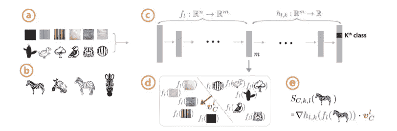
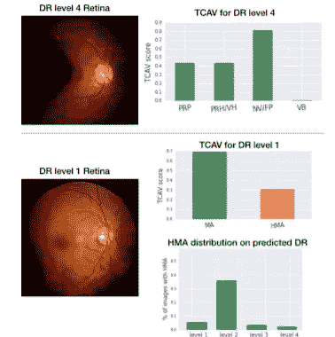

# 可解释性和 TCAV

> 原文：<https://towardsdatascience.com/interpretability-and-tcav-1a08e0a6cf63?source=collection_archive---------37----------------------->

## 确保专家知识反映在你的深度学习模型中

当我在写硕士论文并试图获得研究成果时，我暂停了一分钟，想真正欣赏机器学习领域的突破性发现。这些想法只是基于一些常识和简单的数学。

我目前正在研究一个模型预测的可解释性。我想分享我对什么是可解释性的理解，并进一步解释概念激活向量及其重要性。一如既往，我会尽可能用简单的语言来解释。这里有几个概念可以帮助你。

照片由[像素](https://www.pexels.com/photo/animal-pet-cute-kitten-45201/)上的 [Pixabay](https://pixabay.com/) 拍摄

**可解释性/解释:**假设，有一个模型被训练来将一组图像分类为猫或者不是猫。可解释性是解释为什么一个特定的图片被归类为猫。这对于确认领域专业知识是否已经反映在 NN 模型中是很重要的。此外，它有助于用户建立信任，这是使用模型所必需的。

**局部解释:**如果我们考虑一个单一的数据点/一只猫的单一图像，并解释为什么它被这样分类，那么它将是一个局部解释。假设，它可能是那只猫的脸和身体的像素。

图片:Hjvannes/ [维基共享资源](http://commons.wikimedia.org/wiki/File:Whiskers.jpg)

**全局解释:**将解释在这种情况下，在**模型**中产生分类的特定特征或概念。在将图像分类为猫或不是猫的例子中，全局解释可能是猫的胡须或耳朵。你可以看到我强调了模型这个词，因为这些特性有助于理解模型的整体行为，而不仅仅是一个单独的图像。

好了，我想你现在已经掌握了基本知识。

现在让我们讨论一种局部解释方法，即 s **aliency maps** 。对于那些不太了解显著图的人来说，它指定了每个输入特征对于预测的重要性。也就是说，类别概率对每个像素的导数，即像素的微小变化会改变特定类别的概率吗？如果是，那么增加多少？

显著图的问题是**确认偏差**，我们只看到我们认为真实的东西。因此，现在代替人类的主观判断，如果我们有一个定量的判断来理解哪个概念更重要，这将是一个更好的质量测量。此外，由于人类不考虑像素，我们应该考虑人类可以理解的高级概念。此外，理解一个模型为什么起作用是相当重要的，而不是局部的解释。所以我们想集中在一个全球性的解释上。这些欲望导致了和的关系，激发了的创造力。

TCAV 提供了一个定量的解释，说明我们在为预测进行训练后得出的概念有多重要。但是，你如何表达一个概念呢？我们用一个向量来做，即**C**oncept**A**activation**V**ector(CAV)。

(a)概念和随机对象的图像(b)类别图像(c)从图像的模型中收集激活(d)线性分类器和与决策边界正交的 CAV)使用概念中 w.r.t .变化的导数的 TCAV 分数。来源: [TCAV 论文](https://arxiv.org/pdf/1711.11279.pdf) [1]

对于 CAV，我们拍摄概念的图像和一些其他随机图像，然后我们拍摄我们正在研究的网络的激活。现在，因为我们有激活和概念，我们训练一个线性分类器来从随机图像中分离概念。与决策边界正交的向量给出了 CAV，它是一个向概念图像移动并远离随机图像的向量。

现在对于 TCAV 分数，我们做一些类似于我们在显著图中做的事情。TCAV 分数告诉我们每个概念对预测有多重要。这意味着类别概率对每个概念的导数，即概念的微小变化会改变特定类别的概率。

在[论文](https://arxiv.org/pdf/1711.11279.pdf)中，TCAV 被应用于预测糖尿病视网膜病变(DR)这一影响眼睛的糖尿病并发症的现实世界问题。该模型被训练为使用基于复杂标准的 5 分分级来预测 DR 水平，其中 0 级对应于没有 DR，4 级对应于增生性 DR。医生根据诊断概念诊断 DR，例如微动脉瘤(MA)或泛视网膜激光疤痕(PRP)，不同的概念在不同的 DR 水平上更突出。 [1](https://arxiv.org/pdf/1711.11279.pdf)

4 级和 1 级 DR 的 TCAV 结果。相关的概念用绿色表示，不相关的用红色表示。来源: [TCAV 论文](https://arxiv.org/pdf/1711.11279.pdf)

使用 TCAV 测试了这些概念对模型的重要性分数。对于某些 DR 级别，TCAV 认为正确的诊断概念非常重要。然而，该模型经常将 1 级(轻度)过度预测为 2 级(中度)。考虑到这一点，医生说她想告诉模型不要强调 HMA 对于 1 级的重要性。因此，当专家不同意模型预测时，TCAV 可能有助于帮助他们解释和修复模型错误。因此，确保领域专业知识在模型中得到反映。[ [1](https://arxiv.org/pdf/1711.11279.pdf)

这很棒，但是这个工具需要人类收集相关的概念。有进一步的研究讨论了如何在没有人类监督的情况下做到这一点。

**参考文献**

[1]https://arxiv.org/pdf/1711.11279.pdf 论文:[TCAV](https://arxiv.org/pdf/1711.11279.pdf)