# W & B——CAM 和 GradCAM 深度学习的可解释性

> 原文：<https://towardsdatascience.com/interpretability-in-deep-learning-with-w-b-cam-and-gradcam-45ba5296a58a?source=collection_archive---------26----------------------->

## [生产中的机器学习](https://towardsdatascience.com/tagged/production-ml)

## 这份报告将回顾 Grad-CAM 如何反驳神经网络不可解释的常见批评。

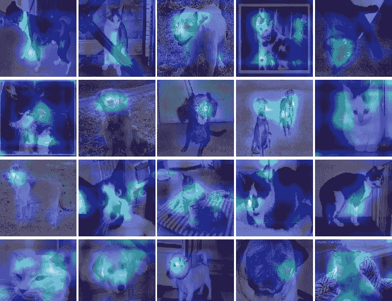

## 点击查看互动报道[。所有的代码都可以在](https://app.wandb.ai/ayush-thakur/interpretability/reports/Interpretability-in-Deep-Learning-with-W%26B-CAM-and-GradCAM--Vmlldzo5MTIyNw)[这里](https://github.com/ayulockin/interpretabilitycnn/)找到。

训练一个分类模型很有趣，但是你有没有想过你的模型是如何进行预测的？你的模型是不是真的看了图像中的狗，才以 98%的准确率将其归类为狗？很有趣，不是吗。在今天的报告中，我们将探讨为什么深度学习模型需要可解释，以及一些有趣的方法来窥视深度学习模型的内幕。深度学习的可解释性是一个非常令人兴奋的研究领域，在这个方向上已经取得了很多进展。

那么，为什么要关心可解释性呢？毕竟，企业或项目的成功主要是由模型的准确性来判断的。但是为了在现实世界中部署我们的模型，我们还需要考虑其他因素。例如，有种族偏见？或者，如果它对人类的分类准确率为 97%,但对男性的分类准确率为 99%,而对女性的分类准确率仅为 95%,那该怎么办？

了解模型如何做出预测也可以帮助我们调试您的网络。[查看这篇关于使用 PyTorch 和 W & B 使用渐变和可视化调试神经网络的博文，了解其他一些有帮助的技术]。

在这一点上，我们都熟悉这样一个概念，即深度学习模型根据用其他更简单的表示形式表达的学习表示进行预测。也就是说，深度学习允许我们从更简单的概念中构建复杂的概念。这里有一篇惊人的[distilt Pub](https://distill.pub/2018/building-blocks/)帖子，可以帮助你更好地理解这个概念。我们还知道，在一些监督学习任务(如图像分类)的情况下，这些表示是在我们用输入数据和标签训练模型时学习的。对这种方法的批评之一是神经网络中学习到的特征是不可解释的。

今天，我们将着眼于解决这一批评的两种技术，并揭示神经网络学习的“黑盒”性质。

*   类别激活图(CAM)
*   梯度凸轮

# 类别激活映射

已经观察到，卷积神经网络的各层的卷积单元充当对象检测器，即使在为分类任务训练网络时没有提供关于对象位置的这种先验。尽管卷积具有这种显著的性质，但是当我们使用完全连接的层来执行分类任务时，它就失去了作用。为了避免使用完全连接的网络，一些架构，如网络中的网络(T2)和谷歌网络(T4)都是完全卷积的神经网络。

全局平均池(GAP)是这种架构中非常常用的层。它主要用作调整剂，以防止训练时过度拟合。[学习区分性定位的深度特征](https://arxiv.org/pdf/1512.04150.pdf)的作者发现，通过调整这样的架构，他们可以扩展 GAP 的优势，并可以保留其定位能力，直到最后一层。让我们试着快速理解使用 GAP 生成 CAM 的过程。

**类别激活图简单地指示图像中的区别区域，CNN 使用该区域将该图像分类到特定类别中。**对于这种技术，网络由 ConvNet 和 Softmax 层(用于多类分类)组成，在卷积特征图上执行全局平均池。该图层的输出用作全连接图层的要素，该图层可生成所需的分类输出。**给定这个简单的连通性结构，我们可以通过将输出层的权重投射回卷积特征图上来识别图像区域的重要性。**

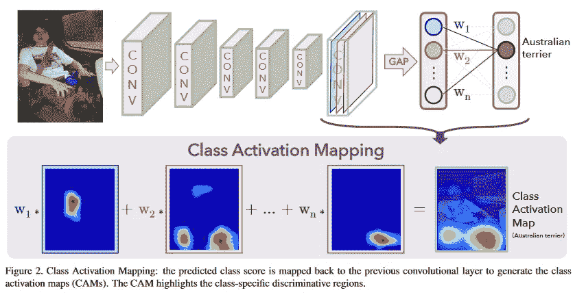

*图 CAM 的理想网络架构(* [*来源*](https://arxiv.org/pdf/1512.04150.pdf) *)*

让我们尝试实现这一点。😄

## 步骤 1:修改你的模型

假设您已经用 Conv 块和几个完全连接的层构建了深度分类器。我们将不得不修改这个架构，这样就没有任何完全连接的层。我们将在输出层(softmax/sigmoid)和最后一个卷积块之间使用`GlobalAveragePooling2D`层。

`CAMmodel`对我们的猫狗分类器进行了必要的修改。**这里我用预先训练好的** `**VGG16**` **模型来模拟我已经训练好的猫狗分类器。**

```
def CAMmodel():
     ## Simulating my pretrained dog and cat classifier. 
     vgg = VGG16(include_top=False, weights='imagenet')
     vgg.trainable = False
     ## Flatten the layer so that it's not nested in the sequential model.
     vgg_flat = flatten_model(vgg)
     ## Insert GAP
     vgg_flat.append(keras.layers.GlobalAveragePooling2D())
     vgg_flat.append(keras.layers.Dense(1, activation='sigmoid'))

     model = keras.models.Sequential(vgg_flat)
     return model
```

一个简单的实用程序`flatten_model`返回我的预训练模型中的图层列表。这样做是为了在使用`Sequential`模型修改时各层不会嵌套，并且可以访问最后一个卷积层并将其用作输出。我在从`flatten_model`返回的数组中追加了`GlobalAveragePooling2D`和`Dense`。最后，返回顺序模型。

```
def flatten_model(model_nested):
    '''
    Utility to flatten pretrained model
    '''
    layers_flat = []
    for layer in model_nested.layers:
       try:
          layers_flat.extend(layer.layers)
       except AttributeError:
          layers_flat.append(layer)

    return layers_flat
```

接下来，我们用适当的模型输入形状调用`model.build()`。

```
keras.backend.clear_session()
model = CAMmodel()
model.build((None, None, None, 3)) # Note
model.summary()
```

## 第二步:用`CAMLogger`回调重新训练你的模型

由于引入了新的层，我们必须重新训练模型。但是我们不需要重新训练整个模型。我们可以通过使用`vgg.trainable=False`来冻结卷积块。

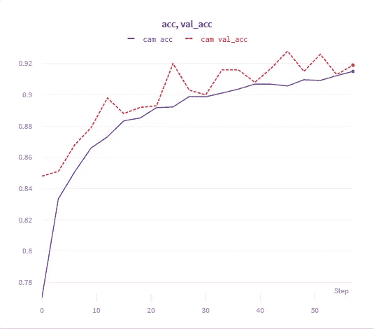

图 2:再训练模型后的度量图。

**观察:**

*   就训练和验证准确性而言，模型性能有所下降。我达到的最佳训练和验证精度分别是`99.01%`和`95.67%`。
*   **因此，为了实施 CAM，我们必须修改我们的架构，从而降低模型性能。**

## 步骤 3:使用`CAMLogger`查看类激活图

在`CAM`类的`__init__`中，我们初始化`cammodel`。注意这个`cammodel`有两个输出:

*   最后一个卷积层的输出(此处为`block5_conv3`
*   模型预测(softmax/sigmoid)。

```
class CAM:
  def __init__(self, model, layerName):
    self.model = model
    self.layerName = layerName
    ## Prepare cammodel
    last_conv_layer = self.model.get_layer(self.layerName).output
    self.cammodel = keras.models.Model(inputs=self.model.input,
                                       outputs=[last_conv_layer, self.model.output])

  def compute_heatmap(self, image, classIdx):
    ## Get the output of last conv layer and model prediction
    [conv_outputs, predictions] = self.cammodel.predict(image)
    conv_outputs = conv_outputs[0, :, :, :]
    conv_outputs = np.rollaxis(conv_outputs, 2)
    ## Get class weights between 
    class_weights = self.model.layers[-1].get_weights()[0]
    ## Create the class activation map.
    caml = np.zeros(shape = conv_outputs.shape[1:3], dtype=np.float32)
    for i, w in enumerate(class_weights[:]):
      caml += w * conv_outputs[i, :, :] caml /= np.max(caml)
    caml = cv2.resize(caml, (image.shape[1], image.shape[2]))
    ## Prepare heat map
    heatmap = cv2.applyColorMap(np.uint8(255*caml), cv2.COLORMAP_JET)
    heatmap[np.where(caml < 0.2)] = 0 return heatmap
  def overlay_heatmap(self, heatmap, image):
    img = heatmap*0.5 + image
    img = img*255
    img = img.astype('uint8')
    return (heatmap, img)
```

`compute_heatmap`方法负责生成热图，这是 CNN 用来识别类别(图像类别)的区分区域。

*   输入图像上的`cammodel.predict()`将给出形状`(1,7,7,512)`的最后一个卷积层的特征图。
*   我们还提取形状`(512,1)`的输出层的权重。
*   最后，计算从最终层提取的权重和特征图的点积，以产生类别激活图。

现在我们把所有东西都包装在回调中。`CamLogger`回调集成了`wandb.log()`方法，将生成的激活图记录到 W & B 运行页面上。通过调用`overlay_heatmap()`方法，从 CAM 返回的热图最终叠加在原始图像上。

## 步骤 4:从 CAM 中得出结论

从下图中我们可以得出很多结论。👇注意`examples`图表包含验证图像及其预测分数。如果预测得分大于 0.5，则网络将图像分类为狗，否则分类为猫。而`CAM`图表有其对应的类激活图。让我们回顾一些观察结果:

*   该模型通过查看图像中的面部区域将图像分类为狗。对于一些图像，它能够看到整个身体，除了爪子。
*   该模型通过观察耳朵、爪子和胡须将这些图像归类为猫。

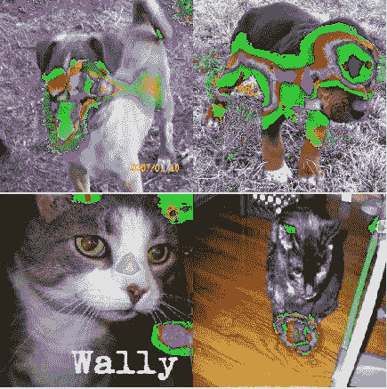

图 3:看着狗的脸和猫的胡须，爪子和耳朵。

*   对于错误分类的图像，模型没有看到它应该看到的地方。因此，通过使用 CAM，我们能够解释这种错误分类背后的原因，这真的很酷。


图 4: CNN 在看别的东西。

这是为什么呢？即使耳朵、爪子和胡须出现在图像中，为什么它会看着别的东西呢？我能想到的一个原因是，由于我们没有在我们的猫狗数据集上微调我们的预训练`VGG16`，作为特征提取器的 CNN 并不完全熟悉我们数据集中出现的模式(分布)。

*   当同一类的多个实例出现在图像中时，模型只查看其中的一个。但这没关系，因为我们不关心物体检测。请注意，由于这个原因，可信度很低。


图 5:只查看一个事件。

**其他用例:**

CAM 可用于弱监督的目标定位任务。链接论文的作者在 ILSVRC 2014 基准数据集上测试了 CAM 执行本地化任务的能力。该技术能够在该数据集上实现 37.1%的目标定位前 5 名误差，这接近于由完全监督的 CNN 方法实现的 34.2%的前 5 名误差。

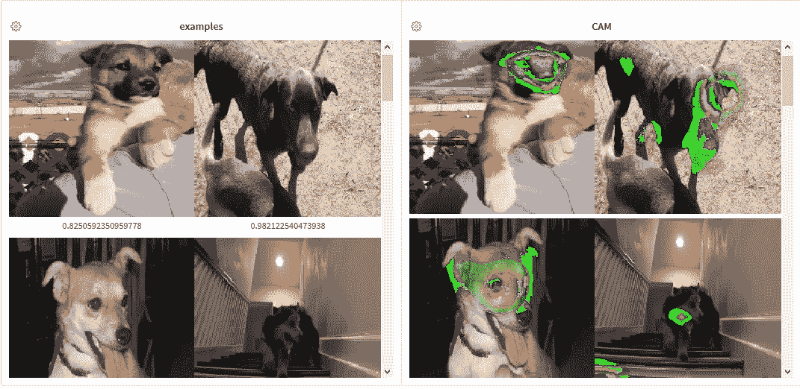

图 6:更多的例子。点击[此处](https://app.wandb.ai/ayush-thakur/interpretability/reports/Interpretability-in-Deep-Learning-with-W%26B-CAM-and-GradCAM--Vmlldzo5MTIyNw)查看更多此类示例。

# 梯度加权类激活图

**尽管 CAM 很棒，但它也有一些局限性:**

*   为了使用 CAM，需要修改模型。
*   修改后的模型需要重新训练，这在计算上是昂贵的。
*   因为完全连接的致密层被移除。模型性能肯定会受到影响。这意味着预测分数没有给出模型能力的实际情况。
*   用例受到架构约束的限制，即在输出层之前执行卷积映射间隙的架构。

**什么是好的视觉解释？:**

*   当然，该技术应该将图像中的类本地化。我们在 CAM 中看到了这一点，而且效果非常好。
*   应该捕获更精细的细节，即激活图应该是高分辨率的。

因此 [Grad-CAM:通过基于梯度的定位](https://arxiv.org/pdf/1610.02391.pdf)从深度网络进行视觉解释，这是一篇非常惊人的论文，作者提出了对 CAM 和以前方法的修改。他们的方法使用流入最终卷积层的任何目标预测的梯度来产生粗略的定位图，该定位图突出显示图像中的重要区域，用于预测图像的类别。

因此 Grad-CAM 是 CAM 的严格推广。除了克服 CAM 的局限性，它还适用于涉及 CNN 的不同深度学习任务。它适用于:

*   具有全连接层(例如 VGG)的 CNN，无需对网络进行任何修改。
*   CNN 用于结构化输出，如图像字幕。
*   CNN 用于具有多模态输入的任务，如视觉问答或强化学习，无需架构改变或重新训练。

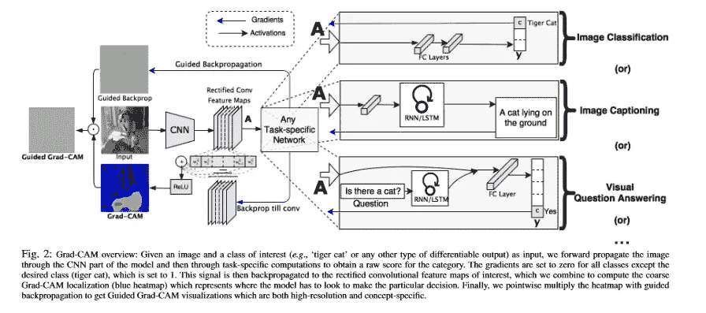

*图 7: Grad-CAM 概述(* [*来源*](https://arxiv.org/pdf/1610.02391.pdf) *)*

让我们实现它😄

## 第一步:你的深度学习任务

我们将关注图像分类任务。与 CAM 不同，我们不必为此任务修改模型并重新训练它。

我使用了一个在`ImageNet`上预先训练的`VGG16`模型作为我的基础模型，我用它来模拟迁移学习。

通过使用`vgg.trainable = False`，基线模型的层变成不可训练的。请注意我是如何在模型中使用完全连接的层的。

```
def catdogmodel():
  inp = keras.layers.Input(shape=(224,224,3))
  vgg = tf.keras.applications.VGG16(include_top=False, weights='imagenet', input_tensor=inp,
                                            input_shape=(224,224,3))
  vgg.trainable = False

  x = vgg.get_layer('block5_pool').output
  x = tf.keras.layers.GlobalAveragePooling2D()(x)
  x = keras.layers.Dense(64, activation='relu')(x)
  output = keras.layers.Dense(1, activation='sigmoid')(x) model = tf.keras.models.Model(inputs = inp, outputs=output)

  return model
```

你会在[链接的笔记本](https://github.com/ayulockin/interpretabilitycnn/)中找到班级`GradCAM`。这是一个来自 [Grad-CAM 的修改实现:用 Keras、TensorFlow 和 Deep Learning](https://www.pyimagesearch.com/2020/03/09/grad-cam-visualize-class-activation-maps-with-keras-tensorflow-and-deep-learning/) 可视化类激活图，这是一篇令人惊叹的博文，作者是 PyImageSearch.com 的 Adrian Rosebrook。我强烈建议查看那篇博文中的`GradCAM`类的逐步实现。

我对它做了两处修改:

*   在进行迁移学习时，即如果你的目标(最后一层)卷积层不可训练，`tape.gradient(loss, convOutputs)`会返回`None`。这是因为`tape.gradient()`默认不跟踪不可训练的变量/层。因此，要使用该层来计算你的渐变，你需要通过在目标层输出(张量)上调用`tape.watch()`来允许`GradientTape`到`watch`。因此发生了变化，

```
with tf.GradientTape() as tape:
      tape.watch(self.gradModel.get_layer(self.layerName).output)
      inputs = tf.cast(image, tf.float32)
      (convOutputs, predictions) = self.gradModel(inputs)
```

*   最初的实现没有考虑二进制分类。最初的作者也谈到了输出的软最大化。所以为了训练一个简单的猫狗分类器，我做了一个小小的修改。因此发生了变化，

```
if len(predictions)==1:
      # Binary Classification
      loss = predictions[0]
    else:
      loss = predictions[:, classIdx]
```

`GRADCAM`类可以在模型训练后使用，也可以作为回调使用。这是他博客文章的一小段摘录。

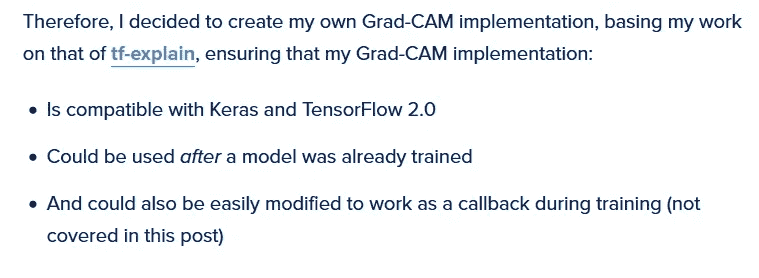

第三点激励我从事这个项目。我围绕这个`GRADCAM`实现构建了一个定制回调，并使用`wandb.log()`来记录激活映射。因此，通过使用这个回调，您可以在训练时使用 GradCAM。

## 第三步:使用`GRADCamLogger`并训练

鉴于我们正在处理一个简单的数据集，我只训练了几个时期，这个模型似乎工作得很好。

**下面是 GradCAM 自定义回调。**

```
class GRADCamLogger(tf.keras.callbacks.Callback):
    def __init__(self, validation_data, layer_name):
      super(GRADCamLogger, self).__init__()
      self.validation_data = validation_data
      self.layer_name = layer_name def on_epoch_end(self, logs, epoch):
      images = []
      grad_cam = [] ## Initialize GRADCam Class
      cam = GradCAM(model, self.layer_name) for image in self.validation_data:
        image = np.expand_dims(image, 0)
        pred = model.predict(image)
        classIDx = np.argmax(pred[0])

        ## Compute Heatmap
        heatmap = cam.compute_heatmap(image, classIDx)

        image = image.reshape(image.shape[1:])
        image = image*255
        image = image.astype(np.uint8) ## Overlay heatmap on original image
        heatmap = cv2.resize(heatmap, (image.shape[0],image.shape[1]))
        (heatmap, output) = cam.overlay_heatmap(heatmap, image, alpha=0.5) images.append(image)
        grad_cam.append(output) wandb.log({"images": [wandb.Image(image)
                            for image in images]})
      wandb.log({"gradcam": [wandb.Image(cam)
                            for cam in grad_cam]})
```

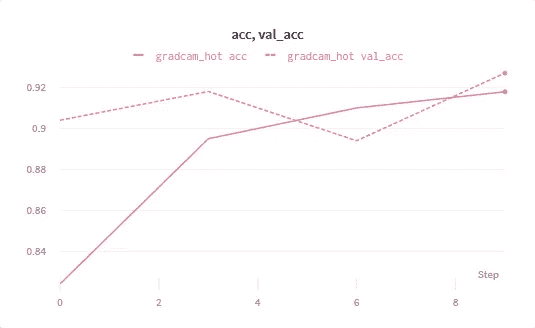

图 8:培训后的指标。

## 步骤 4:从 GradCAM 中得出结论

GradCAM 是 CAM 的严格概括，应优先于 CAM。为了理解这项技术的理论基础，我推荐阅读 Divyanshu Mishra 的[使用 GradCam](/demystifying-convolutional-neural-networks-using-gradcam-554a85dd4e48) 揭开卷积神经网络的神秘面纱，或者只是阅读链接的论文。我们可以得出一些有趣的结论，包括:

*   模型看着狗的脸来正确分类，而我不确定猫。

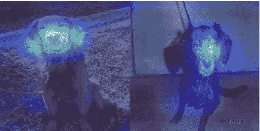

图 8:看狗狗的脸。

*   该模型能够在图像中定位该类的多个实例，即预测分数考虑了图像中的多个狗和猫。

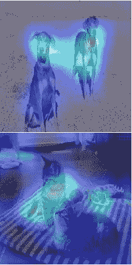

图 9:查看多次出现。

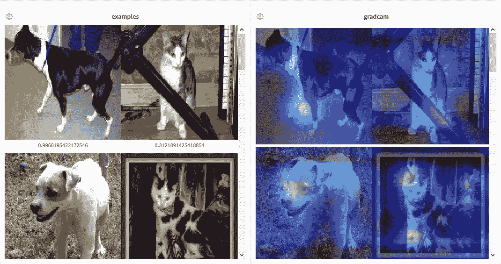

图 10:更多的例子。点击[此处](https://app.wandb.ai/ayush-thakur/interpretability/reports/Interpretability-in-Deep-Learning-with-W%26B-CAM-and-GradCAM--Vmlldzo5MTIyNw)查看更多此类示例。

# 结论

**类激活图**和 **Grad-CAMs** 是将一些可解释性/可解释性引入深度学习模型的几种方法，并且被相当广泛地使用。这些技术最吸引人的是执行目标定位任务的能力，即使没有事先训练模型的位置。GradCAM 在用于图像字幕时，可以帮助我们理解图像中的哪个区域用于生成某个单词。当用于视觉 Q & A 任务时，它可以帮助我们理解为什么模型会得出特定的答案。尽管 Grad-CAM 具有类别区分能力，并能定位相关图像区域，但它无法像像素空间梯度可视化方法(如引导反向传播和去卷积)那样突出精细细节。因此，作者将 Grad-CAM 与引导反向传播相结合。

感谢阅读这篇报道直到最后。我希望你发现这里介绍的回调对你的深度学习魔法有帮助。请随时在 Twitter( [@ayushthakur0](https://twitter.com/ayushthakur0) )上与我联系，获取对本报告的任何反馈。谢谢你。