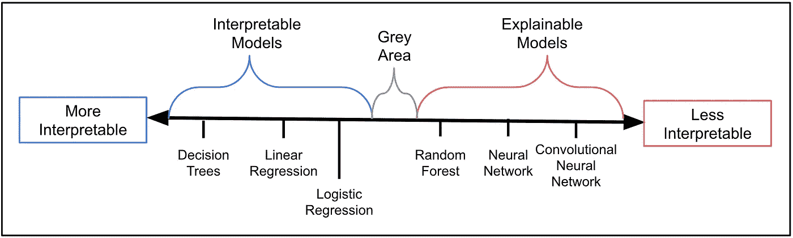

# 机器学习中的可解释性

> 原文：<https://towardsdatascience.com/interpretability-in-machine-learning-ab0cf2e66e1?source=collection_archive---------14----------------------->

## 为什么我们需要理解我们的模型如何做出预测

我们应该永远相信一个表现良好的模型吗？一个模特可能会拒绝你的抵押贷款申请或者诊断出你患有癌症。这些决定的后果是严重的，即使它们是正确的，我们也希望得到解释。一个人可以告诉你，你的收入太低，还不上抵押贷款，或者某个特定的细胞群可能是恶性的。一个提供类似解释的模型会比一个只提供预测的模型更有用。

来源: [flaticon](https://www.flaticon.com/premium-icon/cyborg_901032)

通过获得这些解释，我们说我们正在解释一个机器学习模型。在本文的其余部分，我们将更详细地解释可解释性的含义。然后，我们将继续讨论能够解释您的模型的重要性和好处。然而，仍然有一些不利因素。最后，我们将讨论这些问题，以及为什么在某些情况下，你可能更喜欢一个不太容易解释的模型。

# 我们所说的可解释性是什么意思？

[在之前的一篇文章中，](/interperable-vs-explainable-machine-learning-1fa525e12f48)我讨论了模型可解释性的概念，以及它与可解释的机器学习的关系。总而言之，可解释性是模型能够被人类理解的程度。如果人类更容易理解模型 A 如何做出预测，那么模型 A 比模型 B 更容易解释。例如，卷积神经网络比随机森林更难解释，而随机森林比决策树更难解释。

记住这一点，我们说一个模型是一个可解释的模型，如果它可以在没有任何其他帮助/技术的情况下被理解。可解释的模型是高度可解释的。相比之下，如果没有额外技术的帮助，可解释的模型太复杂而难以理解。我们说这些模型可解释性低。我们可以在图 1 中看到这些概念是如何关联的。一般来说，模型可以分为可解释的或可解释的，但人们会有不同意的灰色区域。

图 1:可解释性谱(来源:作者)

# 为什么可解释性很重要？

如前所述，我们需要额外的技术，如[特征重要性](https://machinelearningmastery.com/calculate-feature-importance-with-python/#:~:text=Feature%20importance%20refers%20to%20techniques,at%20predicting%20a%20target%20variable.)或[时间](https://github.com/marcotcr/lime)，来理解可解释模型是如何工作的。实现这些技术可能需要大量的工作，而且重要的是，它们仅仅提供了一个模型如何工作的近似值。所以，我们不能完全确定我们理解了一个可解释的模型。在比较可解释的模型时，我们可能会遇到类似的情况。

来源: [flaticon](https://www.flaticon.com/free-icon/interpretation_1935181)

例如，逻辑回归和决策树。这些都不需要额外的技术，但逻辑回归可能仍然需要更多的努力来解释。我们需要了解 sigmoid 函数以及系数与赔率/概率的关系。这种复杂性也可能导致我们解释上的错误。一般来说，模型的可解释性越强；越容易理解，我们就越能确定我们的理解是正确的。可解释性很重要，因为从中可以获得很多好处。

## 更容易解释

我们的第一个好处是，可解释的模型更容易向其他人解释。对于任何话题，我们理解得越好，就越容易解释。我们还应该能够用简单的术语解释它(即不提及技术细节)。在工业界，有许多人可能希望对你的模型如何工作有简单的解释。这些人不一定有机器学习的技术背景或经验。

例如，假设我们创建了一个模型来预测某人是否会提出人寿保险索赔。我们希望使用这种模式来实现公司人寿保险核保的自动化。为了在模型上签字，我们的老板会要求详细解释它是如何工作的。一个不满的顾客可能会要求解释为什么他们没有被批准投保人寿保险。监管者甚至可以要求法律做出这样的解释。

来源: [flaticon](https://www.flaticon.com/free-icon/einstein_892712)

试图向这些人解释神经网络如何进行预测可能会引起很多混乱。由于不确定性，他们甚至可能不接受解释。相比之下，像逻辑回归这样的可解释模型可以用人类的术语来理解。这意味着它们可以用人类的术语来解释。例如，我们可以准确地解释顾客的吸烟习惯在多大程度上增加了他们的死亡概率。

## 更容易检测、检查和修复错误

上述关系是因果关系(即吸烟导致癌症/死亡)。一般来说，机器学习模型只关心联想。例如，模型可以使用某人的原籍国来预测他们是否患有皮肤癌。然而，就像吸烟一样，我们能说某人的国家导致癌症吗？这是因为皮肤癌是由阳光引起的，而一些国家只是比其他国家更阳光。所以只能说皮肤癌和某些国家有关。

图 2:狼对哈士奇的实验(来源: [M .图里奥·里贝罗，s .辛格& C .盖斯特林](https://arxiv.org/abs/1602.04938)

华盛顿大学的研究人员做了一个实验，这是一个很好的例子，说明了联想可能出错的地方。研究人员训练了一个图像识别模型，将动物分类为哈士奇或狼。利用莱姆，他们试图理解他们的模型是如何做出预测的。在图 2 中，我们可以看到该模型基于图像背景进行预测。如果背景有雪，动物总是被归类为狼。他们基本上建立了一个探测雪的模型。

问题是狼与雪联系在一起。狼通常会出现在雪地上，而哈士奇则不会。这个例子告诉我们，模型不仅可以做出不正确的预测，还可以以错误的方式做出正确的预测。作为数据科学家，我们需要对我们的模型进行感官检查，以确保它们不会以这种方式做出预测。你的模型越容易解释，这就越容易做到。

来源: [flaticon](https://www.flaticon.com/premium-icon/man_3418023)

## 更容易确定未来的绩效

随着时间的推移，模型的预测能力可能会下降。这是因为模型特征和目标变量之间的关系可能会改变。例如，由于工资差距，收入目前可能是性别的良好预测因素。随着社会变得更加平等，收入将失去其预测力。我们需要意识到这些潜在的变化及其对我们模型的影响。对于可解释的模型来说，这更难做到。由于不太清楚特性是如何被使用的，即使我们知道对单个特性的影响，我们也不一定能说出对模型整体的影响。

## 更容易从模型中学习

试图在未知中寻找意义是人类的天性。机器学习可以帮助我们发现数据中我们不知道存在的模式。然而，我们不能仅仅通过观察模型的预测来识别这些模式。如果我们不能解释我们的模型，任何教训都会丢失。最终，一个模型越难解释，就越难从中学习。

来源: [flaticon](https://www.flaticon.com/premium-icon/cooperation_3317601)

## 算法公平性

重要的是，你的模型要做出公正的决定，这样它们就不会延续任何历史上的不公正。确定偏见的来源可能很困难。它通常来自模型特征和受保护变量(例如种族或性别)之间的关联。例如，由于南非强制隔离的历史，种族与某人的地理位置\邻里关系密切相关。位置可以作为种族的代表。使用位置的模型可能会偏向某个种族。

使用一个可解释的模型并不一定意味着你会有一个无偏的模型。这也不意味着更容易确定模型是否公平。这是因为大多数公平性度量(例如，假阳性率、不同影响)是模型不可知的。对于任何模型来说，它们都很容易计算。使用一个可解释的模型所做的是更容易识别和纠正偏差的来源。我们知道使用了哪些特性，并且可以检查哪些特性与受保护的变量相关联。

来源: [flaticon](https://www.flaticon.com/free-icon/fair_3260927?term=fairness&page=1&position=14)

# 可解释性的缺点

好的，我们明白了…可解释的模型很棒。它们更容易理解、解释和学习。它们还允许我们更好地检测当前绩效、未来绩效和模型公平性。然而，可解释性也有不好的一面，在某些情况下，我们更喜欢一个可解释的模型。

## 易受操纵

基于 ML 的系统容易受到操纵或欺诈。例如，假设我们有一个自动发放汽车贷款的系统。一个重要的特征可能是信用卡的数量。顾客的卡越多，她就越危险。如果客户知道这一点，他们可以暂时取消所有的卡，获得汽车贷款，然后重新申请所有的信用卡。

来源: [flaticon](https://www.flaticon.com/free-icon/hacker_3380378)

当客户取消信用卡时，她偿还贷款的概率不会改变。客户操纵模型做出了不正确的预测。模型的可解释性越强，操作起来就越透明和容易。即使模型的内部工作是保密的，情况也是如此。特征和目标变量之间的关系通常更简单，更容易猜测。

## 要学的更少

我们提到过，可解释的模型更容易学习。另一方面，他们不太可能教给我们新的东西。像神经网络这样的可解释模型可以自动对数据中的交互和非线性关系进行建模。通过解释这些模型，我们可以发现这些我们从来不知道存在的关系。

相比之下，像线性回归这样的算法只能模拟线性关系。为了对非线性关系建模，我们必须使用特征工程将任何相关变量包含在我们的数据集中。这将需要预先了解这些关系，这违背了解释模型的目的。

## 领域知识/专业技能要求

构建可解释的模型可能需要大量的领域知识和专业技能。通常，可解释的模型，如回归，只能对数据中的线性关系进行建模。为了模拟非线性关系，我们必须执行特征工程。例如，对于医疗诊断模型，我们可能希望使用身高和体重来计算身体质量指数。了解哪些特征是可预测的，以及要创建哪些特征需要特定领域的领域知识。

你的团队可能没有这方面的知识。或者，您可以使用一个可解释的模型，该模型将自动对数据中的非线性关系进行建模。这消除了创建任何新特征的需要；基本上把思考留给了计算机。不利的一面是，正如我们在上面已经彻底讨论过的，对如何使用特征进行预测的理解较差。

## 复杂性-准确性权衡

从上面我们可以看到，一般来说，越不复杂的模型越容易解释。因此，为了更高的可解释性，可能会有较低准确性的折衷。这是因为，在某些情况下，更简单的模型可能做出不太准确的预测。这真的取决于你要解决的问题。例如，使用逻辑回归进行图像识别会得到很差的结果。

对于许多问题来说，一个可解释的模型和一个可解释的模型表现得一样好。在下面的文章中，我们比较了一个可解释的模型，逻辑回归，和一个可解释的模型，神经网络。我们表明，通过对我们的问题进行一些思考并创建新的特征，我们可以用一个可解释的模型实现类似的准确性。它很好地实践了我们在本文中讨论的一些概念。

 [## 特征工程的力量

### 为什么您可能只应该使用逻辑回归来建模非线性决策边界(使用 Python 代码)

towardsdatascience.com](/the-power-of-feature-engineering-b6f3bb7de39c) 

## 图像来源

所有图片都是我自己的或从[www.flaticon.com](http://www.flaticon.com/)获得的。在后者的情况下，我拥有他们的[高级计划](https://support.flaticon.com/hc/en-us/articles/202798201-What-are-Flaticon-Premium-licenses-)中定义的“完全许可”。

## 参考

[1] C .莫尔纳尔，可解释机器学习(2020)【https://christophm.github.io/interpretable-ml-book/ 

[2] C. Rudin，停止解释高风险决策的黑盒机器学习模型，转而使用可解释的模型(2019)，[https://www.nature.com/articles/s42256-019-0048-x](https://www.nature.com/articles/s42256-019-0048-x)

[3] M .图里奥·里贝罗，s .辛格和 c .盖斯特林，“我为什么要相信你？”:解释任何分类器的预测(2016)【https://arxiv.org/abs/1602.04938 T2