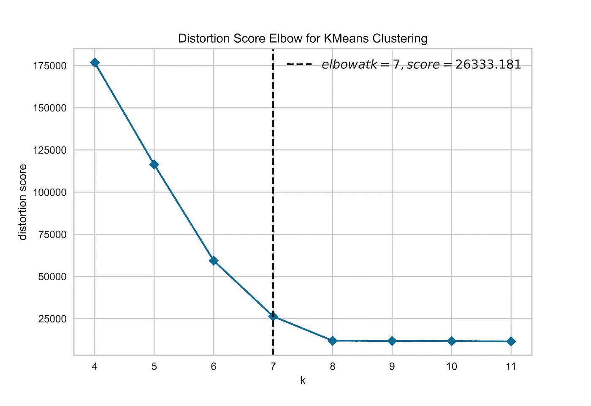
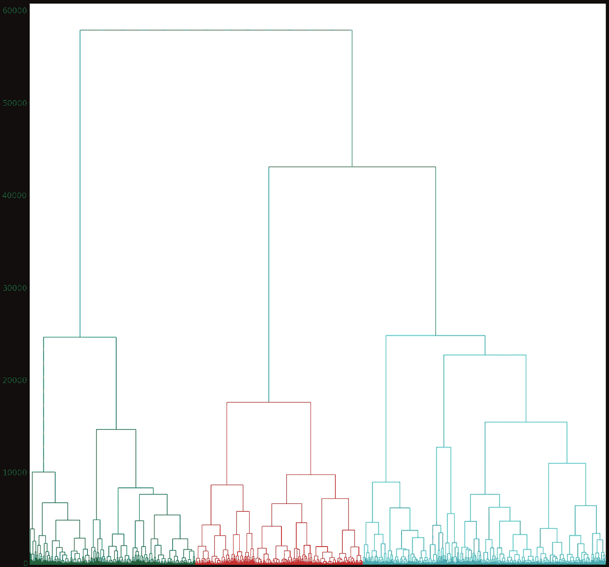
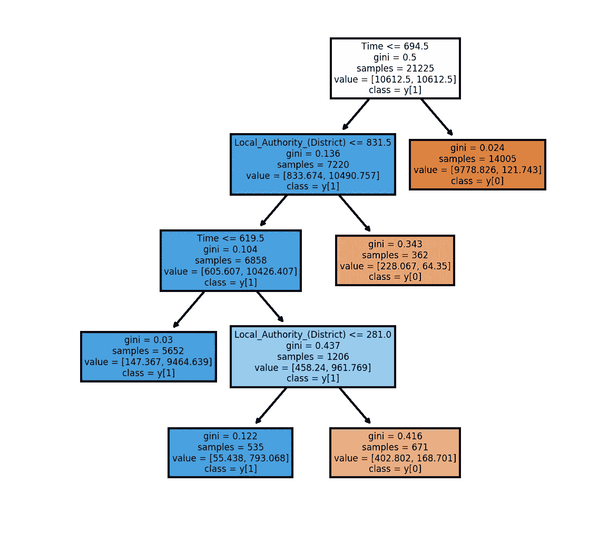

# 可解释聚类

> 原文：<https://towardsdatascience.com/interpretable-clustering-39b120f95a45?source=collection_archive---------36----------------------->


## 如何使用 CART 来消除描述集群时的猜测

聚类算法如 K-Means、凝聚聚类和 DBSCAN 是强大的无监督机器学习技术。然而，总结每个集群的关键特征需要相当定性的方法，成为需要领域专业知识的冗长且不严格的过程。

一项经常被忽视的技术可能是数据科学家武器库中的王牌:使用决策树来定量评估每个集群的特征。具体来说，在对未标记的数据进行聚类之后，我们可以将相应的聚类作为标签分配给每个样本。然后，我们可以使用标签作为目标变量来训练一个购物车模型，然后检查生成的决策树来突出显示集群的特征。

# 数据聚类

在对数据进行相应的处理后，我们可以选择我们喜欢的聚类算法。通常，选项有:

*   k 均值
*   凝聚聚类
*   基于密度的噪声应用空间聚类

## k 均值

K-Means 是最常见的无监督学习技术，主要是由于它的简单性和有效性。这是一种快速算法，可以在数百万次观察中运行，但它也有缺点。首先，它不能很好地处理非球形的数据结构。当点的密度不均匀时，也就是说在分布的某些区域中密度比其他区域中的密度高，它的表现也不好。最后，还必须选择聚类数 K，这需要做出某种程度上的定性决定。

虽然对于前两个问题，除了选择另一种算法之外没有补救方法，但是可以以相对严格的方式选择聚类的数量 K。我们可以迭代地运行 K-Means 算法，增加 K 的数量，直到一个稍大的数字(例如 50)。然后，我们可以在图表上为 K 的每个值绘制一个性能度量。通过检查图表，我们可以找到“肘部”，即性能达到峰值的地方，然后在较高的 K 值下产生边际回报。我们可以选择的 K 值正好是性能增益相对于 K 的增加处于边际的时候。在许多性能测量中，最常用的通常是轮廓系数、失真和差距统计。



## 凝聚聚类

凝聚聚类是一种分层聚类，它迭代地将样本分组在一起，从每个样本的一个聚类开始，到整体的单个聚类。这是执行聚类时的首选方法之一，因为它允许快速选择 k 的最佳值。事实上，我们可以绘制树状图，这是一种在 x 轴上显示样本分组的树结构，而在 y 轴上显示来自其他分组的信息增益。

类似于肘分析，我们可以简单地选择从进一步分裂中获得的信息略微增加的聚类数，因此不值得额外的复杂性。



## 基于密度的噪声应用空间聚类

最后，作为参考，DBSCAN 是另一种广泛用于聚类分析的技术。它的工作原理是检查附近样本的密度，如果密度足够高，就将样本分配给聚类。然而，由于凝聚聚类已经是一种成功的技术，DBSCAN 在实践中不太常见。

# 解释集群

现在我们已经对未标记的数据进行了聚类，我们可以提取聚类信息并将其作为标签分配给每个样本。

例如，使用凝聚聚类，我们可以首先选择我们选择的聚类数 K...

```
cut = scipy.cluster.hierarchy.cut_tree(Z, n_clusters=K)
```

...然后提取标签，将它们分配给数据:

```
labels = list([i[0] for i in cut])
labeled_data = pd.DataFrame(data, columns=data_columns)
labeled_data['label'] = labels
```

最后，我们可以继续使用标记数据集作为训练来训练决策树。为了避免一棵巨大的树，我建议把它构造成一个二元分类问题，如果一个点在所选的聚类中，y 等于 1，否则 y 等于 0。这将为每个集群重复，给你不同的更简单的决策树，更容易理解，并在以后提出。具体来说，我们可以绘制决策树，使用:

```
fig, axes = mp.subplots(nrows = 1, 
                        ncols = 1, 
                        figsize = (4,4), 
                        dpi=300)sklearn.tree.plot_tree(model,
                       feature_names = X.columns,
                       filled = True,
                       class_names=True);
```

通过检查决策树，我们可以突出相应聚类的特征。例如，我们可能会看到，只有在某些条件下，观测值才会被分配到这样的集群中。



# 摘要

我们可以通过结合无监督和有监督的学习技术来阐明聚类。具体来说，我们可以:

*   首先，使用 K-Means、凝聚聚类或 DBSCAN 对未标记的数据进行聚类
*   然后，我们可以选择要使用的聚类数 K
*   我们给每个样本分配标签，使其成为一个监督学习任务
*   我们训练一个决策树模型
*   最后，我们检查决策树的输出，以定量地突出集群的特征

# 参考

麻省理工学院的一些同事最近完成了一项有趣的工作，利用优化使聚类变得可解释。你可以在这里阅读更多相关信息[。](https://arxiv.org/pdf/1812.00539.pdf)

*要阅读更多类似的文章，请关注我的*[*Twitter*](https://twitter.com/jayzuccarelli)*[*LinkedIn*](https://www.linkedin.com/in/ezuccarelli)*或我的* [*网站*](https://eugeniozuccarelli.com/) *。**