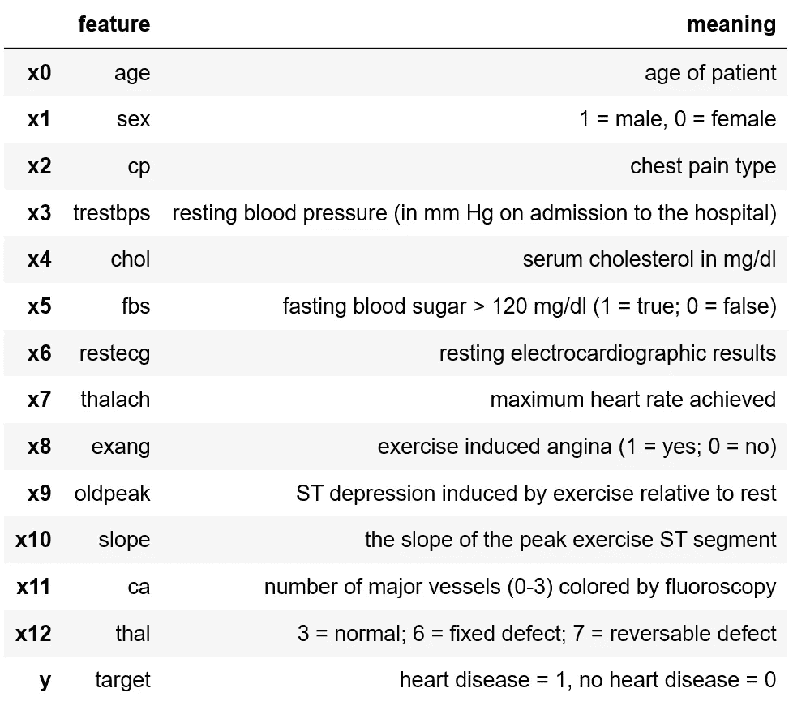
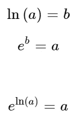
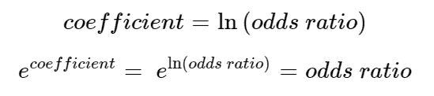
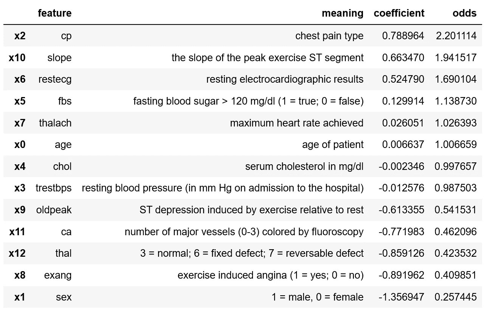
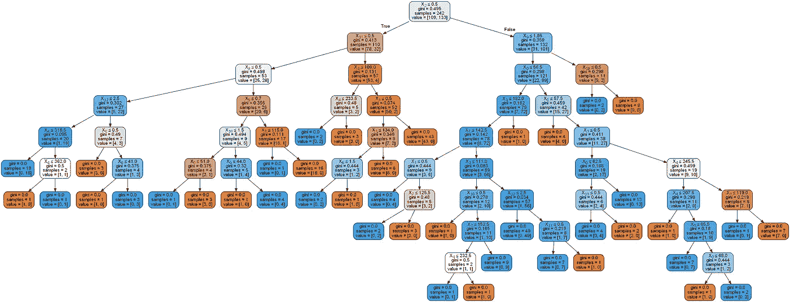
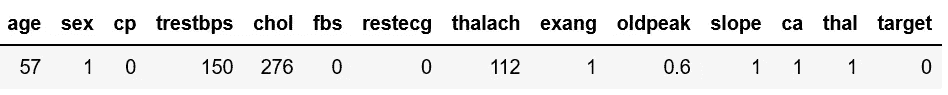
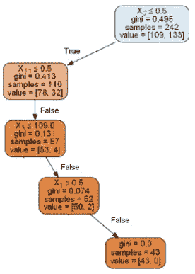

# 可解释的机器学习模型

> 原文：<https://towardsdatascience.com/interpretable-machine-learning-models-aef0c7be3fd9?source=collection_archive---------16----------------------->

## 对逻辑回归模型和决策树解释的全面介绍。

在 [Unsplash](https://unsplash.com?utm_source=medium&utm_medium=referral) 上由 [Fabrice Villard](https://unsplash.com/@fabulu75?utm_source=medium&utm_medium=referral) 拍摄的照片

**亚马逊的一个机器学习模型从一堆简历中只选择了男性。根据该模型，另一个模型解雇了表现不佳的教师。这种模式是歧视性的，可能对社会有害。他们会做出错误的决定，并以负面的方式影响人们的生活。要解决这个问题，您可以开始解释您的模型。可解释性意味着人类可以理解决策的原因。**

对于机器学习模型的可解释性已经做了很多研究。有不同的方式来解释你的机器学习模型。最容易的划分是在可解释模型和模型不可知方法之间。可解释的模型是解释它们自己的模型，例如从决策树中你可以很容易地提取决策规则。模型不可知方法是可以用于任何机器学习模型的方法，从支持向量机到神经网络。在本文中，重点将放在可解释的模型上，如线性回归、逻辑回归和决策树。这是另一篇关于模型无关方法的文章。

## 资料组

您可以使用模型可解释性的一个领域是医疗保健。为了了解模型如何决定一个人是否患有心脏病，我们使用了克利夫兰数据库中具有以下特征的数据集:

我们将尝试使用逻辑回归和决策树来预测目标，并解释我们建立的模型。你可以在 Kaggle 上找到[心脏病 UCI 数据集。](https://www.kaggle.com/ronitf/heart-disease-uci)

## 密码

这篇关于可解释模型的文章(以及关于模型不可知方法的文章)的代码可以在 [GitHub](https://github.com/henniedeharder/interpretability-heart/blob/master/Demo_Forest_SHAP_Heart.ipynb) 上找到。

# 可解释的模型

您可以解释的模型包括线性回归模型、逻辑回归模型和决策树。因此，在这些情况下，不需要模型不可知的方法，尽管您也可以使用它们来获得更多的见解。在简单介绍线性回归之后，我们将在数据集上构建一个逻辑回归模型和决策树，看看我们如何解释结果。

## *线性回归*

在线性回归中，您可以使用权重(或系数)来找出哪些特征是最重要的，这些特征具有最高的权重。对于一条记录，如果在保持其他记录不变的情况下将其中一条记录添加到某个特征值中，则预测值将根据该要素的权重而增加。

## *逻辑回归*

对于逻辑回归，解释的方式有点不同，因为一个系数是比值比的自然对数。要解释这些系数，您需要进行从系数到比值比的转换。我们可以使用下面的函数:

根据前两个等式，我们可以用 ln( *a* )代替 *b* ，得到 *a* 。所以如果我们把 *e* 提高到比值比的自然对数的幂(等于我们从逻辑回归模型得到的系数)，我们就得到比值比。

太好了！经过这种变换后，它有点像线性回归，但是当你改变一个特征值时，它不是增加，而是改变一个因子。值在 1 左右的比值比影响最小，而更高或更低的比值比影响更大。

因此，让我们在心脏病数据集上建立一个逻辑回归模型，以了解发生了什么。我们为每个特性获得了以下系数，我们可以对它们进行变换( *e* 的系数幂)以获得比值比。您可以在下表中看到这些值，这些值按降序排列:

现在我们可以开始解释这个模型了:

*   胸痛型影响高。当这个值增加 1 时，患心脏病的概率增加 120.1%。
*   如果斜率变量增加 1，概率增加 94.2%。
*   空腹血糖是一个二元变量。如果该值为 1(真)，患心脏病的几率比该值等于 0(假)时高 13.9%。
*   在底部我们看到性别变量。这个赔率在 1 以下，1/4 左右。这意味着女性患心脏病的可能性几乎是男性的四倍！

当这样的结果看起来很奇怪时，最好的办法就是调查你的数据。你可能想知道为什么年龄和胆固醇水平的影响很小。这个模型告诉我们，高胆固醇水平比低胆固醇水平好一点。这是事实吗？男性和女性的巨大差异也引发了质疑！为了研究这一点，我们可以使用一个目标图，你可以在 GitHub 上的[笔记本](https://github.com/henniedeharder/interpretability-heart/blob/master/Demo_Forest_SHAP_Heart.ipynb)中找到一个关于性别特征的图。

## *决策树*

让我们看看决策树向我们展示了什么！决策树就像一个规则系统，从根节点开始，然后沿着记录的路径到叶节点，在那里可以看到预测。当你的树有更高的深度时，很难解释，但是仍然可行。

下面你可以看到一个决策树的图像，建立在心脏病数据集上。

在每个决策节点上，您会看到四行文本。第一行代表决策规则。如果记录的条件为真，则沿着左边的分支，如果为假，则沿着右边的分支。第二行上的基尼系数是基尼系数的值，这个值越低，split⁴.越好第三行和第四行显示当前节点中有多少来自训练集的样本，以及它们是如何划分的。你可能想知道这些颜色意味着什么。如果一个节点是橙色或蓝色，这意味着对于该节点中样本的最大部分，目标变量(患有心脏病)分别等于 0 或 1。颜色越深，节点越均匀。

因此，让我们从测试集中提取一条记录，并跟踪树的节点，看看最终的预测会是什么。这是新的记录:

让我们从决策树的根节点开始。判定规则是:特征 X₂ (cp，胸痛型)小于或等于 0.5。对于我们的新记录，值是 0，所以小于 0.5。这种说法是正确的，我们沿着左边的分支。下面的特征是 X₁₁ (ca，透视着色的主要血管数)，这个值大于 0.5，所以该陈述是假的，我们继续看 X₃ (trestbps，静息血压)是否小于或等于 109。事实并非如此，因为它等于 150。又这么假。下一个节点检查 X₁(性别)是否小于 0.5。不，这个记录是 1，他是男性。现在我们找到了该记录的叶节点，预测值为 0。这个预测是正确的！所以对于这个记录，模型只用了四个特征，cp，ca，trestbps 和 sex。

新记录从根节点到叶节点的路径

好的，这是一种找出为什么一个记录有某种预测的方法。只有树的图像，很难看出哪些特征对模型是重要的。我们可以用不同的方法提取树的特征重要性。最简单的方法是使用 scikit-learn 的特性重要性。特征的重要性被计算为由该特征带来的标准的(标准化的)总缩减。它也被称为[基尼系数](https://scikit-learn.org/stable/modules/generated/sklearn.tree.DecisionTreeClassifier.html#sklearn.tree.DecisionTreeClassifier.feature_importances_)。

您应该相信这些特性的重要性吗？你可以说，像 cp、ca、chol 和年龄这样的特征在预测心脏病方面非常重要。这是可能的，但首先要测试你的模型！请记住，这些特性的重要性仅基于训练集和当前树。scikit-learn 中计算特性重要性的方法不是最好的。最好使用一种与模型无关的方法，比如置换特征重要性。好奇？在下一篇关于模型不可知方法的文章中阅读它！

[1] J. Dastin，[亚马逊废除了对女性有偏见的秘密人工智能招聘工具](https://www.reuters.com/article/us-amazon-com-jobs-automation-insight/amazon-scraps-secret-ai-recruiting-tool-that-showed-bias-against-women-idUSKCN1MK08G) (2018)，路透社

[2]c·奥尼尔，[数学毁灭的武器](https://we.riseup.net/assets/404114/Weapons+of+Math+Destruction+Cathy+O%27Neil.pdf) (2016)，新冠

[3] [我如何解释逻辑回归中的优势比？](https://stats.idre.ucla.edu/other/mult-pkg/faq/general/faq-how-do-i-interpret-odds-ratios-in-logistic-regression/)、UCLA:统计咨询集团