# 线性回归的解释

> 原文：<https://towardsdatascience.com/interpretation-of-linear-regression-dba45306e525?source=collection_archive---------4----------------------->

线性回归是从事 ML 和统计分析的人谈论最多的术语。顾名思义，线性回归就是对数据拟合一条线，在目标“y”变量和解释“x”变量之间建立关系。它可以用下面的等式来表征:

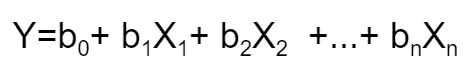

让我们来看一个样本数据集，它是我从 Coursera 上一门名为“**商业统计线性回归**”的课程中获得的。

数据集看起来像:

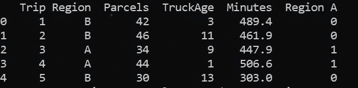

图一

第一行的解释是，第一次行程花费了 489.4 分钟，通过一辆使用了 3 年的卡车将 42 个包裹运送到区域 b。在这里，花费的时间是我们的目标变量，而“区域 A”、“卡车运输”和“包裹”是我们的解释变量。因为列“Region”是一个分类变量，所以应该用一个数值对它进行编码。

如果我们的分类变量中有“n”个标签，那么就增加“n-1”个额外的列来唯一地表示或编码分类变量。这里，区域 A 中的 1 表示行程是到区域 A，而 0 表示行程是到区域 b。

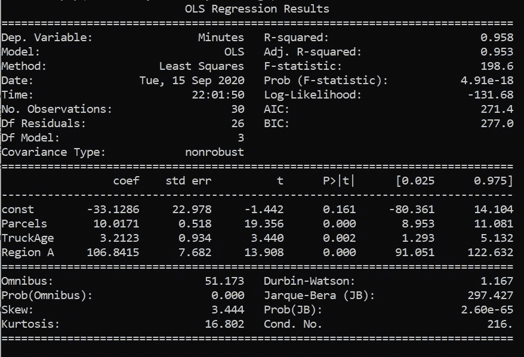

图二

以上是在数据集中进行的线性回归的总结。因此，根据上述结果，我们的线性方程为:

**分钟数=-33.1286+10.0171 *包裹量+ 3.21*卡车运输量+106.84 * A 区**

**释义:**

**b** ₁ **=10.0171:** 这意味着在其他变量保持不变的情况下，如果包裹数量增加 1，则需要多花 10.0171 分钟才能送达。

**b** ₂ **=3.21:** 这意味着如果车龄增加 1 个单位，交货时间将增加 3.21 分钟，其他变量保持不变。

**b** ₃ **=106.84:** 这意味着在其他变量保持不变的情况下，与 b 区域相比，a 区域的交货时间将多花 106.84 分钟。当解释一个分类变量的系数时，总有一个参考变量要比较，这里参考的是区域 B，因为我们给区域 B 赋值 0。

**b** ₀ **=-33.1286 :** 它在数学上是指一辆车龄为 0 的卡车将 0 个包裹运送到 b 地区所花费的时间，从商业角度来看这没有任何意义。有时截距可能会提供一些有意义的见解，有时它只是为了拟合数据。

但是，我们必须检查这是否定义了 x 变量和 y 变量之间的关系。我们得到的拟合只是对样本数据的估计，还不能得出结论说这种相同的关系可能存在于真实数据中。我们必须检查我们得到的参数在统计上是否有意义，或者只是为了使数据符合模型。因此，我们检查拟合优度和 x 变量的显著性是极其重要的。

**假设检验**

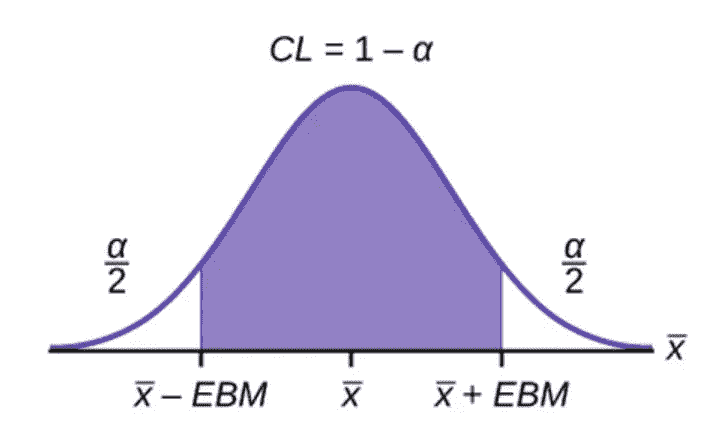

图 3，来源:流明学习

假设检验可以通过多种方式进行，如 t 统计检验、置信区间检验和 p 值检验。这里，我们将检查对应于每个系数的 p 值。

对于每个假设检验，我们定义一个置信区间，即(1-α),这样这个区域被称为接受区域，其余两侧面积为α/2 的区域(在双尾检验中)是拒绝区域。为了进行假设检验，我们必须假设一个无效假设和一个替代假设。

**零假设**:这个 x 变量对 y 变量没有影响，即 **H** ₀ **: b=0**

**替代假设**:这个 X 变量对 Y 变量有影响，即

**h**₁**:b**≦**0**

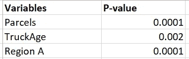

图 4

只有当 p 值大于α/2 时，零假设才被接受。从上表可以看出，所有的 p 值都小于 0.05/2(如果我们取 95%的置信区间)。这意味着 p 值位于拒绝区域的某处，因此，我们可以拒绝零假设。因此，我们所有的 x 变量在定义 y 变量时都很重要。并且，x 变量的系数在统计上是显著的，并且不仅仅是将数据拟合到模型中。

**我们自己的假设检验**

上面的假设是 statsmodel 自己做的默认假设。让我们假设，我们有一个普遍的信念，即在保持所有其他变量不变的情况下，随着车龄的增加，交付时间增加 5 分钟。现在我们可以测试这个信念在我们的模型中是否仍然成立。

**零假设 H₀ : b₂=5**

**备选假设 H₁ : b₂ ≠5**

OLS 回归结果表明，货车运输系数的取值范围为:**【1.293，5.132】**。对于这些系数值，该变量被认为具有统计显著性。区间的中点**【1.293，5.132】**就是我们由模型给出的估计系数。因为我们的检验统计量是 5 分钟，并且它在**【1.293，5.132】，**范围内，所以我们不能忽略零假设。因此，我们不能忽视这样一个普遍的观点，即通过一辆一年的旧卡车需要额外的 5 分钟时间。最后，b₂取 3.2123，只是假设提供了足够的证据，证明我们估计的 b₂是一个好的估计。然而，5 分钟也可以是对 b₂.的可能的良好估计

**测量拟合优度**

R 平方值用作拟合优度的度量。值 **0.958** 表示 Y 变量中 95.8%的变化可以用 X 变量来解释。Y 的其余变化无法解释。

**总 SS=回归 SS +剩余 SS**

**R 平方=回归 SS/总 SS**

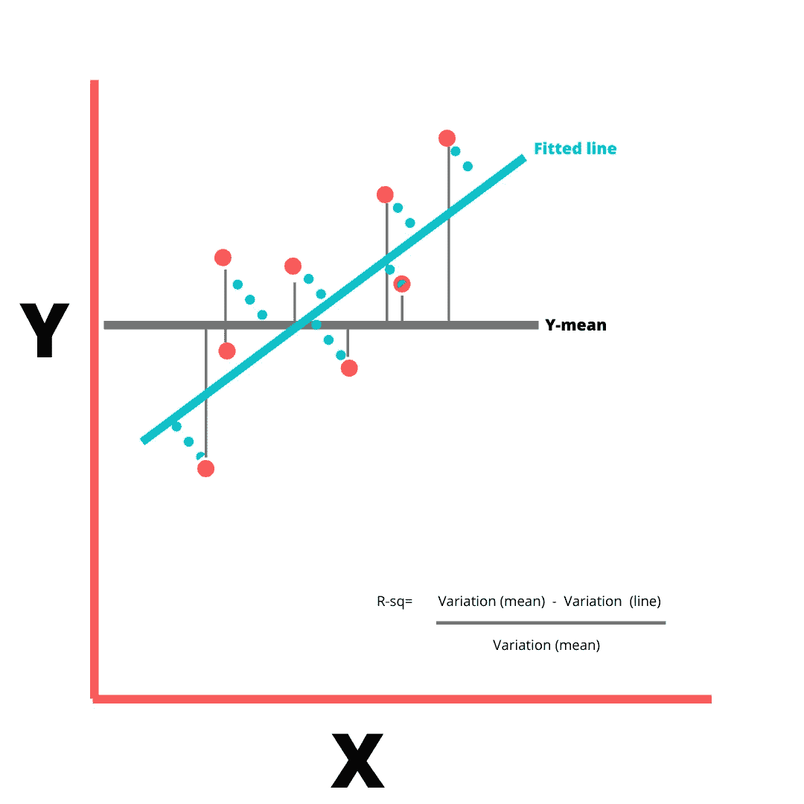

图 5，作者图

R 平方的最小值可以是 0，最大值可以是 1。较低的 R 平方值表明拟合度较差，并表明您可能遗漏了一些重要的解释变量。R 平方的值随着 X 变量的增加而增加，而不管增加的 X 变量是否重要。因此，为了对此进行调整，有一个**调整后的 R 平方**值，该值仅在额外的 X 变量对模型的改善超过偶然预期时增加，而在额外的变量对模型的改善小于偶然预期时减少。

**残差图**

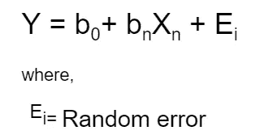

在进行线性回归之前，对这种随机误差有一些假设。

1.  随机误差的平均值为 0。
2.  随机误差具有恒定的方差。
3.  误差呈正态分布。
4.  错误实例是相互独立的

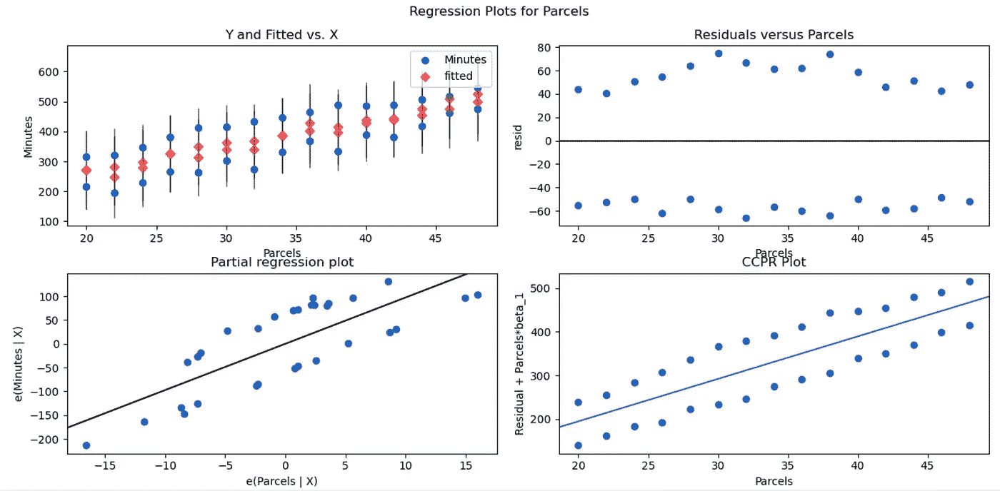

图 6

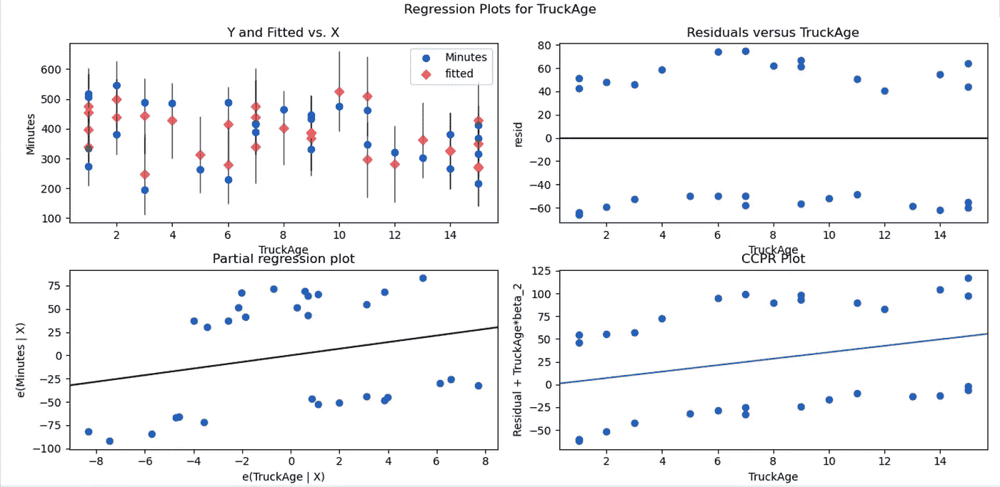

图 7

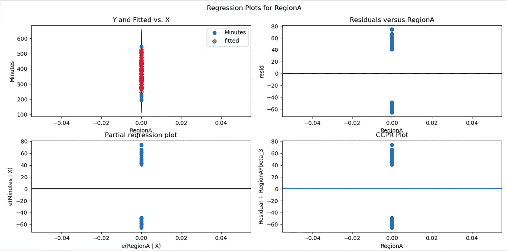

图 8

在上面的图中，残差与 X 变量图显示了我们的模型假设是否被违反。在图 6 中，残差与地块图似乎是分散的。残差围绕零随机分布，并且似乎具有恒定的方差。其他 x 变量的残差图也是如此。因此，关于随机误差的初始假设仍然成立。如果残差中存在任何曲率/趋势，或者方差似乎随着 x 变量(或任何其他维度)而变化，那么这可能意味着我们的线性模型存在巨大的问题，因为初始假设被违反了。在这种情况下，应执行 **box cox** 方法。这是一个过程，其中有问题的 x 变量经受像对数或平方根这样的变换，以便残差具有恒定的方差。x 变量的这种转换就像是一种试凑法。

**多重共线性**

多重共线性发生在多元回归模型中的独立变量之间存在高度相关性时，尽管独立变量被单独测试为重要，但这可能导致不显著的 p 值。

让我们考虑一下数据集:

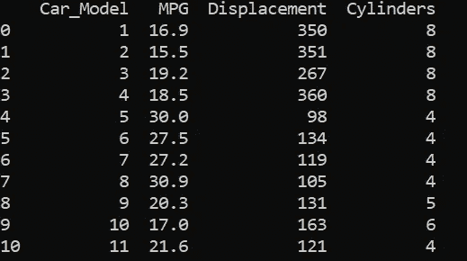

数据集来自**商业统计线性回归-Coursera**

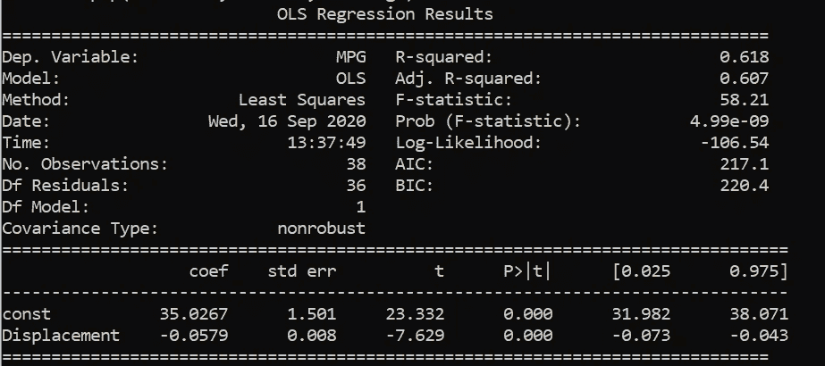

用 MPG 作为我们的响应变量，位移作为 X 变量来拟合数据。

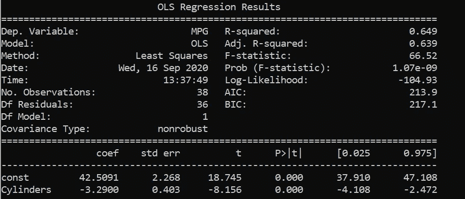

将 MPG 作为我们的响应变量，将气缸作为 X 变量来拟合数据。

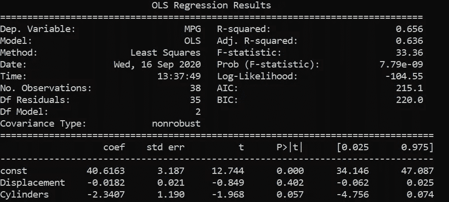

将 MPG 作为响应变量，将气缸和排量作为 X 变量来拟合数据。

从上述结果中，我们看到位移和圆柱体似乎是统计上重要的变量，因为在进行单变量线性回归的前两个结果中，它们的 p 值小于 alpha/2。

当进行多元线性回归时，两个 x 变量被证明是不重要的，因为它们的 p 值大于α/2。然而，根据前面的两个简单回归，这两个变量都很重要。这可能是由于数据集中的多重共线性造成的。

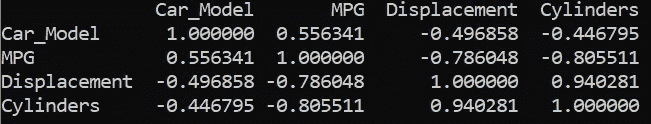

我们可以看到，排量和气缸之间有很强的相关性，相关系数为 0.94。因此，为了处理这样的问题，在线性回归中应该避免高度相关的变量之一。

整体代码可以在[这里](https://github.com/paridhi-parajuli/Linear-Regression)找到。

感谢阅读！