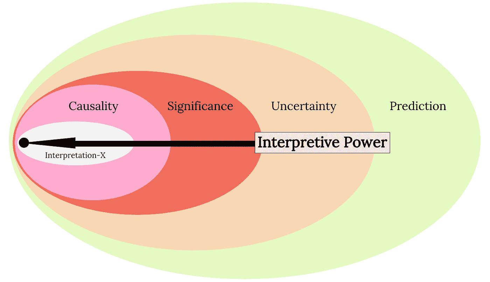
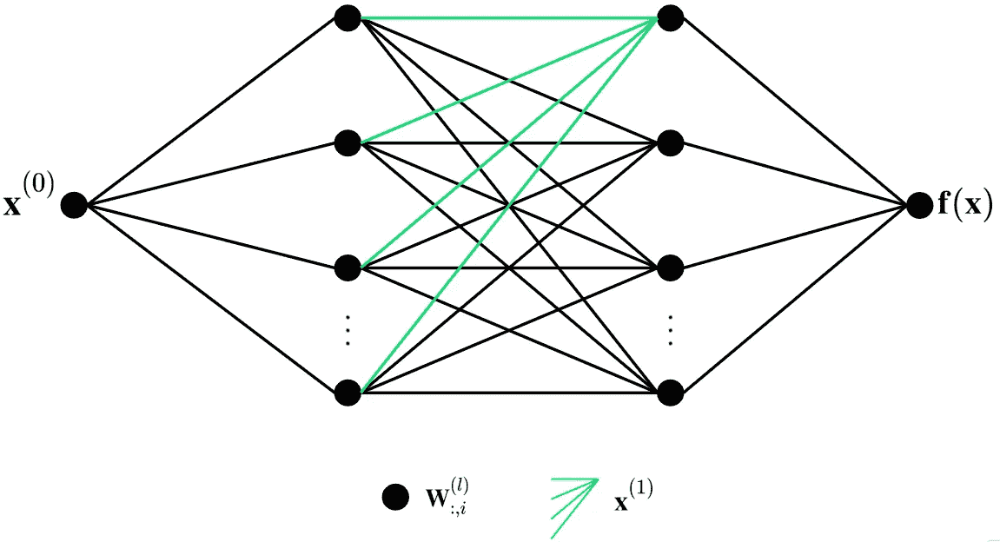
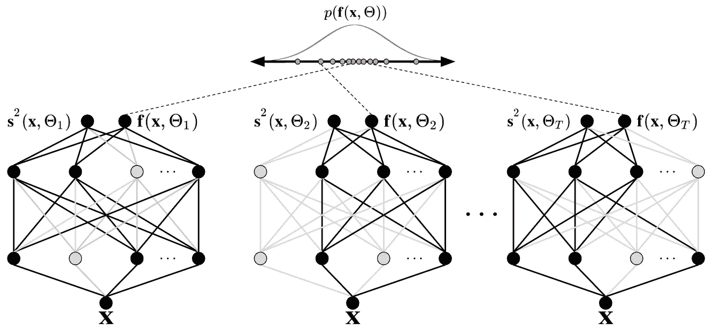
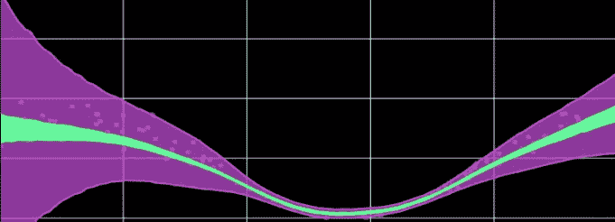
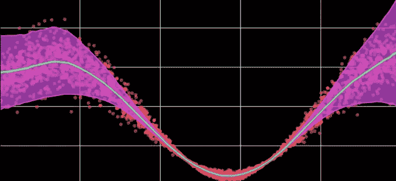
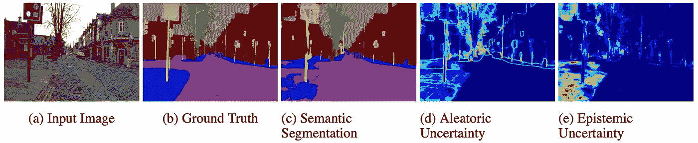
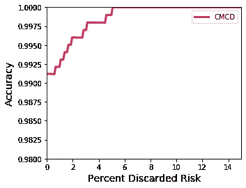

# 学习的诠释

> 原文：<https://towardsdatascience.com/interpretations-in-learning-part-1-4342c5741a71?source=collection_archive---------46----------------------->

## 深度学习的不确定性

## 为什么我们应该关注深度学习中的不确定性

**作者**:萨穆尔·麦克唐纳，[大学机器学习研究员马克斯·凯尔森](https://maxkelsen.com)

# 介绍

由于深度学习在图像分类  等非常具体的任务中的优势，人工智能(AI)在科学和工业领域都变得无处不在。虽然深度学习的成功值得庆祝，但我们必须意识到并协调以下两个事实:

1.  科学旨在解释现实，而
2.  深度学习努力解释自己

考虑到这种并列关系，我们可以相信深度学习是一种解释现实的科学工具，并反过来在工业中利用这些发现吗？可以说不是，因为我们被深度学习无法提供的隐藏风险和解释蒙蔽了双眼，尤其是在做出超出训练样本的预测时。

能够解释一个预测，然后解释问题，对于人工智能的一般性能来说是基本的，对于安全性、可靠性和公平性来说绝对是至关重要的。因此，为了推进人工智能，我们也必须推进对学习的解释。

在这篇博客中，我提供了关于深度学习的直观入门，并提出*不确定性*是我们在推理重要性和因果关系之前应该解决的第一级可解释性(图 1)。

*图 1:定量解释的规范结构。所有的模型都具备预测能力，这是不确定性的基础，而不确定性反过来又告知重要性和因果关系。有了因果关系，也许是终极的解释能力，我们可以回答反事实的“如果”和“为什么”类型的问题，并开始远离训练示例进行推理(一些统计和机器学习迄今无法做到的事情)* *。(作者图)*

# 深度学习和不确定性入门

最简单的说，深度神经网络是灵活的函数， *f* **，**映射一些高维输入， *x* **，**到一些目标 [⁴](https://www.deeplearningbook.org/) ，*y*=*f*(*x*)。这种从 *x* 到 *y* 的映射通常被称为*任务*，例如，读取基因组签名( *x* )并预测患者是否患有癌症(*y*= 1)(*y*= 0)。神经网络几乎自动地从经验(即数据)中学习任务，因此深度学习模型变得如此广泛。

传统神经网络(NNs)的可解释性的一个限制是它们通常是确定性的。这意味着给定单个输入 *x* ，确定性 NN 将预测每次重复正向传播的相同输出*y*=*f*(*x*)(见下图 2)。输出没有变化，这限制了网络模拟现实固有随机性的能力。此外，与概率性替代方法相比，确定性神经网络对不确定性的估计过于自信。因此，为了解释的安全性、稳健性和可靠性，我们必须采用一些概率方法；即贝叶斯神经网络 [⁵](https://link.springer.com/book/10.1007/978-1-4612-0745-0) 。

*图 2:一个前馈神经网络。每个黑点代表一个参数向量(或神经元)。一层神经元将转换数据(从左侧输入)并将激活向前传播到下一层。最终输出层产生预测。(图由作者提供)*

贝叶斯神经网络可以通过随机化模型的参数来扩展传统的神经网络。【 ***注:*** *证明贝叶斯神经网络是有特定的理论动机的，源于贝叶斯法则，但这对于大多数对统计学不感兴趣的人来说是深奥的，也是不必要的。我们现在可以忽略这一点，只需要理解为什么我们应该关心深度学习中的不确定性。* ]

每次 BNN 正向传播输入 *x* ，随机参数*的不同实现*将转换信息，以在每次重复时产生不同的输出 *f* ( *x* ，*)。这个过程重复足够多的次数，这样我们就可以得到预测值的分布**p*(*f*(*x*，*)(图 3)。***

****

***图 3:产生一个输出分布**p*(*f*(*x*，*)*带有蒙特卡洛漏失* [*⁶*](https://www.cs.ox.ac.uk/people/yarin.gal/website/blog_3d801aa532c1ce.html) *。每个模拟都有不同的权重配置，黑色节点表示活跃的神经元，灰色节点表示“退出”的神经元。退出的神经元中的参数都被设置为零。其思想是，多次向前传递，每次具有不同的重量配置，产生输出 p* ( *f* ( *x* ，*)*的分布。这反过来提供了一种检查模型不确定性(即方差或熵)的机制。(图由作者提供)*****

****p*(*f*(*x*，*))分布的方差定义了关于神经网络的*模型不确定性*的概念。模型不确定性是 BNN 提供的不确定性的两个不同组成部分之一，如果我们有更多的训练示例或更合适的模型架构，模型不确定性就会减少。****

***我们可以建模的不确定性的另一个组成部分是*数据不确定性*，它表明数据本身固有的随机性。(关于模型和数据不确定性之间差异的图示示例，请参见下面的图 4a 和 4b。)***

***这些不确定性为我们提供了必要的先决条件，以增加对重要性和因果关系进行推理的解释能力(回想上面的图 1)。此外，不确定性本身使得与可靠性、预测性能、优化、可解释性和风险管理相关的有用解释成为可能。***

******

****图 4a:对一些数据示例(洋红色点)进行训练时，数据不确定性为粉红色，模型不确定性为绿色。(图由作者提供)****

******

****图 4b:对许多数据示例(洋红色点)进行训练时，数据不确定性为粉红色，模型不确定性为绿色。(图由作者提供)****

***上面的图 4a 和 4b 说明了当 BNN 被给予更多的训练样本时，不确定性是如何降低的。这些数字还涉及到我将在本系列的下一篇博客文章中详述的内容。也就是说，使用 BNNs，总的不确定性可以分解为两个部分:数据不确定性(风险)和模型不确定性。***

# ***风险管理:不确定性的应用***

***当我们对不确定性(包括模型和数据)有了很好的估计时，许多应用程序就变得可用了。在这里，我将介绍一个这样的应用程序，它应该足以让您入门。本博客系列的第 2 部分将对不同种类的不确定性提供更加全面和技术性的解释，此外还有执行下面演示内容的示例代码。***

***许多任务涉及大量需要管理的风险，无论是为了安全、科学诚信还是经济利益。为了说明这一点，考虑下面图 5 中描述的案例研究。***

***如果无人驾驶车辆对图像进行推断(图 5a)以预测该图像的不同部分属于什么对象，并错误地预测部分路径属于道路(图 5c)，则汽车可能驶离道路并危及安全。通过拒绝不确定性高于某个合适阈值的预测，可以避免这种行为(图 5e)。因此，模型不确定性可以提高 AI 在生产中的预测性能和安全性。***

******

****图 5:图像分割的不确定性。我们看到，认知(模型)的不确定性在道路附近的人行道周围更大，这表明该模型可以通过在更多的例子上进行训练而受益，这些例子在阴天街道中承载与道路相邻的混凝土路径。图自肯达尔和加尔(2017)* [*⁷*](https://papers.nips.cc/paper/7141-what-uncertainties-do-we-need-in-bayesian-deep-learning-for-computer-vision) *。****

***那么，我们如何决定不确定性的阈值呢？一种方法是使用以下程序进行*风险规避*。首先，我们可以从最不确定到最不确定对预测进行排序。整套装置的误差率可能是，比方说 1/100(即 99%的精确度)，但是这可能不够精确，不能在工业中安全地实施。如果我们“放弃”(即丢弃)，比方说前 5%最不确定的预测(忽略该预测是否正确)，我们会期望发出一些错误的预测，因为错误的预测通常与大量的不确定性一致。因此，剩余的一组现在可以具有改进的误差率，比如 1/1000，这可以改进足以商业化的可靠性(图 6)。***

******

****图 6:使用 GTEX v8 数据预测组织类型任务的风险规避。这里的任务是在给定一些基因组信息的情况下，预测 45 种组织类型中的一种。细节不重要，任务也不是特别难。该图表明，通过去掉前 5%最不确定的预测，可以获得 100%的准确性。(图由作者提供)****

***应该注意的是，非贝叶斯模型可以执行类似的风险规避过程，但是这些不确定性的质量较差 [⁸](https://arxiv.org/abs/1906.02530v2) 。因此，与贝叶斯替代方法相比，非贝叶斯神经网络在风险管理中的效率较低，并且需要您放弃更多的示例来获得期望的可靠性增益(即预测性能)(我们将在本博客系列的后续部分进一步详细探讨这一概念)。***

# ***结论和未来工作***

***为深度学习配备改进的不确定性估计，允许新的应用程序提高我们提供的人工智能解决方案的准确性、公平性、科学完整性、可靠性和安全性。***

***这个博客系列的目的是展示可解释人工智能在实践中的价值。因此，在本博客系列的未来部分，我将:***

*   ***提供深度学习中不确定性的综合教程(包括风险管理的例子)；***
*   ***给出关于确定性过度自信的细节(即我们为什么要关心 BNNs)；***
*   ***展示我们对非分布数据稳健的方法；***
*   ***基准最先进的 BNNs***
*   ***提供不确定性的高级应用实例；和***
*   ***说明重要性和因果关系***

# ***承认***

***我要感谢来自昆士兰大学的 [Fred Roosta](https://people.smp.uq.edu.au/FredRoosta/) ，他在过去的一年里慷慨地为我提供了指导和监督，帮助我努力理解深度学习中的不确定性。感谢 Helena Foley 和 Maciej Trzaskowski 对本文的帮助。***

# ***参考***

1.  ***[https://www.springboard.com/blog/narrow-vs-general-ai/](https://www.springboard.com/blog/narrow-vs-general-ai/)***
2.  ***[*梅赫拉比，n .，莫尔斯塔特，f .，萨克塞纳，n .，勒曼，k .，高尔斯蒂安，a .，2019。机器学习中的偏见和公平问题综述。arXiv 预印本 arXiv:1908.09635*](https://arxiv.org/abs/1908.09635v2)***
3.  ***[*珍珠杂志，1995 年。实证研究的因果图。Biometrika，82(4)，第 669–688 页*](https://academic.oup.com/biomet/article-abstract/82/4/669/251647?redirectedFrom=fulltext)***
4.  ***伊恩·古德菲勒、约舒阿·本吉奥和亚伦·库维尔。深度学习。麻省理工出版社，2016***
5.  ***[*尼尔，R.M .，2012。神经网络的贝叶斯学习(卷 118)。施普林格科学&商业媒体*](https://link.springer.com/book/10.1007/978-1-4612-0745-0)***
6.  ***[https://www . cs . ox . AC . uk/people/yarin . gal/website/blog _ 3d 801 aa 532 C1 ce . html](https://www.cs.ox.ac.uk/people/yarin.gal/website/blog_3d801aa532c1ce.html)***
7.  ***[*肯德尔，a .和 Gal，Y. 2017。计算机视觉的贝叶斯深度学习需要哪些不确定性？《神经信息处理系统进展》,第 5574–5584 页*](https://papers.nips.cc/paper/7141-what-uncertainties-do-we-need-in-bayesian-deep-learning-for-computer-vision)***
8.  ***[*奥瓦迪亚，k .等人 2019。你能相信你的模型的不确定性吗？数据集转移下的预测不确定性评估。NeurIPS 大会 2019。*](https://arxiv.org/abs/1906.02530v2)***