# 使用 LIME 解释黑盒 ML 模型

> 原文：<https://towardsdatascience.com/interpreting-black-box-ml-models-using-lime-4fa439be9885?source=collection_archive---------24----------------------->

## [模型可解释性](https://towardsdatascience.com/tagged/Model-Interpretability)

## 通过乳腺癌数据建模直观地理解石灰

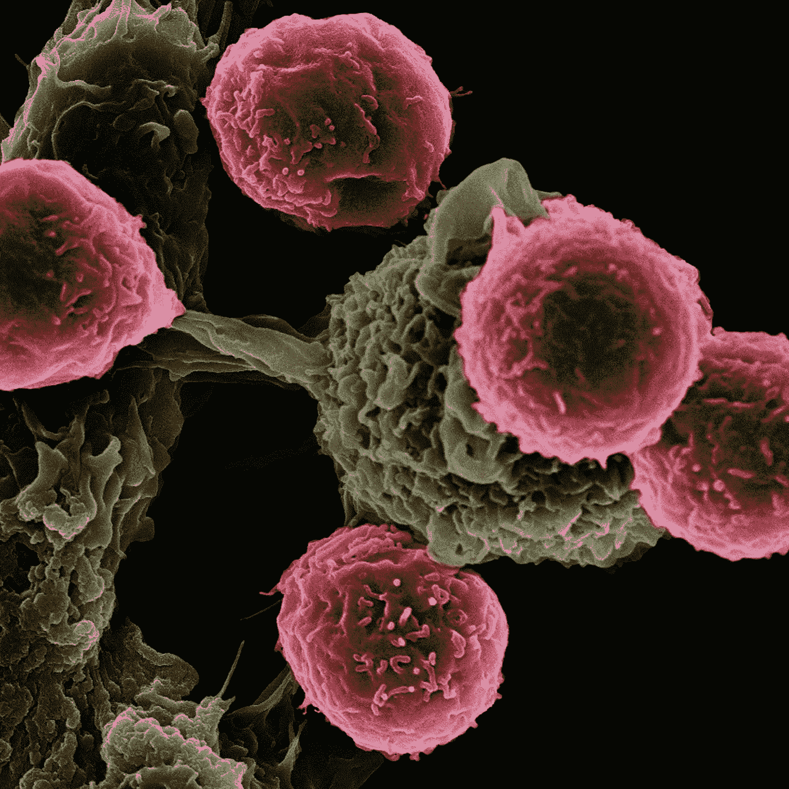

[国立癌症研究所](https://unsplash.com/@nci?utm_source=medium&utm_medium=referral)在 [Unsplash](https://unsplash.com?utm_source=medium&utm_medium=referral) 上拍摄的照片

对于任何人来说，在医学领域支持机器学习的潜力几乎是老生常谈。有很多例子可以支持这种说法——其中一个例子是微软利用医学成像数据帮助临床医生和放射科医生[做出准确的癌症诊断](https://www.microsoft.com/en-us/research/project/medical-image-analysis/)。同时，复杂的人工智能算法的发展极大地提高了这种诊断的准确性。毫无疑问，医学数据的应用如此惊人，人们有充分的理由对其好处感到兴奋。

然而，这种尖端算法是黑盒，可能很难解释。黑盒模型的一个例子是[深度神经网络](https://bdtechtalks.com/2020/07/27/black-box-ai-models/)，在输入数据通过网络中的数百万个神经元后做出单个决策。这种黑盒模型不允许临床医生用他们先前的知识和经验来验证模型的诊断，使得基于模型的诊断不太可信。

事实上，最近对欧洲放射科医生的调查描绘了一幅在放射学中使用黑盒模型的现实画面。**调查显示** [**只有 55.4%的临床医生**](https://insightsimaging.springeropen.com/articles/10.1186/s13244-019-0798-3) **认为患者不会接受没有医师监督的纯人工智能应用。** [1]

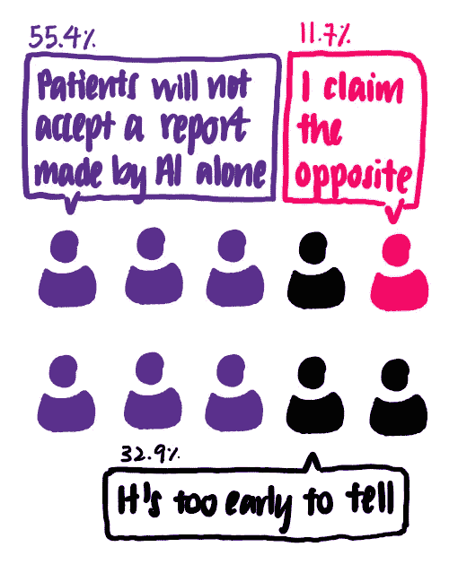

在接受调查的 635 名医生中，超过一半的人认为患者还没有准备好接受仅由 AI 生成的报告。图片作者。

> 下一个问题是:如果人工智能不能完全取代医生的角色，那么人工智能如何帮助医生提供准确的诊断？

**这促使我探索有助于解释机器学习模型的现有解决方案。**一般来说，机器学习模型可以分为可解释的模型和不可解释的模型。不严格地说，可解释的模型提供与每个输入特征的重要性相关的输出。此类模型的示例包括线性回归、逻辑回归、决策树和决策规则等。另一方面，神经网络形成了大量无法解释的模型。

有许多[解决方案](https://christophm.github.io/interpretable-ml-book/agnostic.html)可以帮助解释黑箱模型。这些解决方案包括 Shapley 值、部分依赖图和局部可解释模型不可知解释(LIME ),这些在机器学习实践者中很流行。今天，我将集中讨论石灰。

> 根据 Ribeiro 等人[2] 的 LIME [论文，LIME 的目标是*“在对分类器局部忠实的可解释表示上识别一个可解释模型”*。**换句话说，石灰能够解释*某个*特定点的分类结果。** LIME 也适用于所有类型的模型，使其*与模型无关。*](https://arxiv.org/pdf/1602.04938.pdf)

# E

这听起来很难理解。让我们一步一步地分解它。想象我们有下面的玩具数据集，有两个特征。每个数据点都与一个基本事实标签(正或负)相关联。

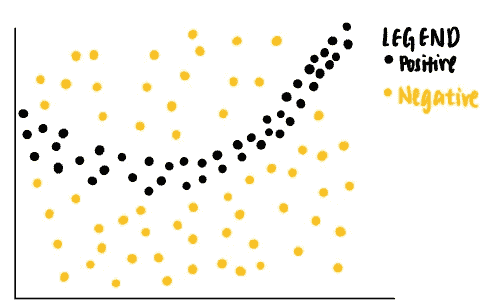

作者图片

从数据点可以看出，线性分类器将不能识别分隔阳性和阴性标记的边界。因此，我们可以训练一个非线性模型，比如神经网络，来对这些点进行分类。如果模型训练有素，它能够预测落在深灰色区域的新数据点为正，而落在浅灰色区域的另一个新数据点为负。

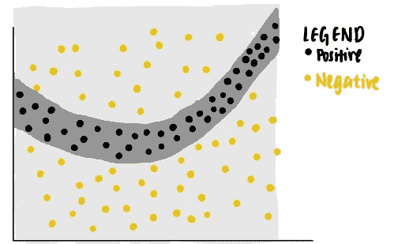

作者图片

现在，我们对模型在特定数据点(紫色)上做出的决定感到好奇。我们问自己，为什么这个特定的点会被神经网络预测为负值？

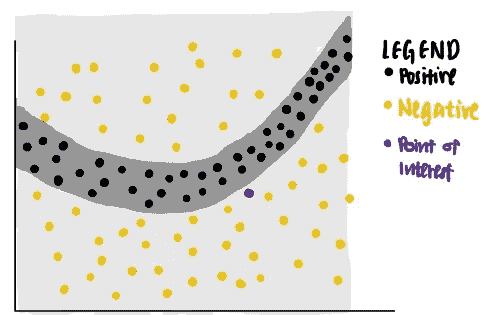

作者图片

我们可以用石灰来回答这个问题。LIME 首先从原始数据集中识别随机点，并根据它们到感兴趣的紫色点的距离为每个数据点分配权重。采样数据点离感兴趣的点越近，时间就越重要。(在图中，较大的点表示分配给数据点的权重较大。)

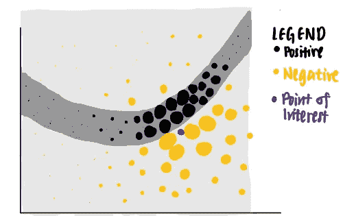

图片作者。

利用这些不同权重的点，LIME 提出了一个具有最高可解释性和局部保真度的解释。

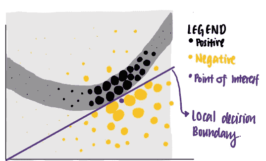

图片作者。

使用这组标准，LIME 将紫色线确定为兴趣点的学习解释。我们看到，紫色线能够解释神经网络在感兴趣的数据点附近的决策边界，但无法解释其更远的决策边界。换句话说，学习的解释具有高的局部保真度，但是低的全局保真度。

让我们看看 LIME 的作用:现在，我将重点关注 LIME 在解释使用威斯康星州乳腺癌数据训练的机器学习模型中的使用。

# 威斯康星乳腺癌数据集:了解癌细胞的预测因子

UCI 在 1992 年发表的[威斯康星州乳腺癌数据集](https://archive.ics.uci.edu/ml/datasets/Breast+Cancer+Wisconsin+(Diagnostic))【3】，包含 699 个数据点。每个数据点代表恶性或良性的细胞样本。对于以下特征，每个样品还被赋予 1 到 10 的数字。

*   团块厚度
*   细胞大小的均匀性
*   细胞形状的均匀性
*   单一上皮细胞大小
*   有丝分裂
*   正常核仁
*   平淡的染色质
*   裸核
*   边缘粘连

让我们试着去理解这些特征的意义。下图使用数据集的特征显示了良性和恶性细胞之间的差异。

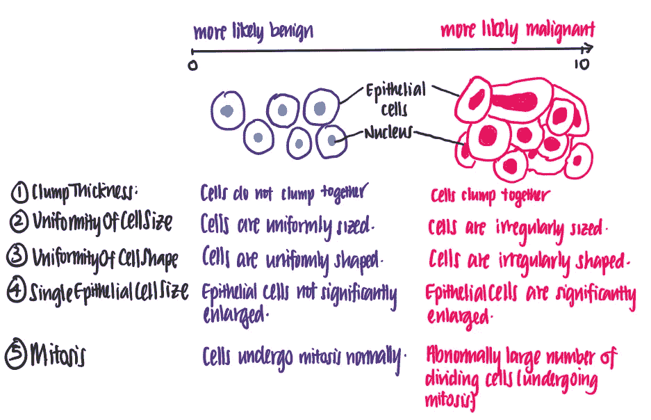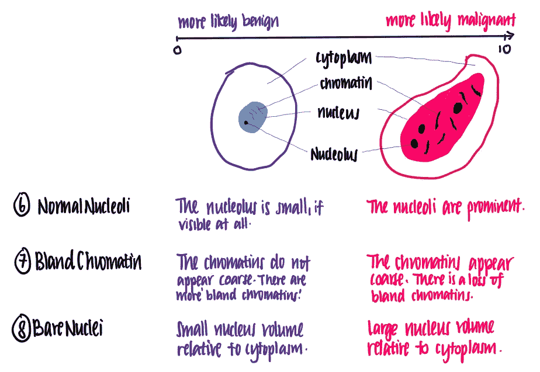

感谢我医学院的朋友岳婷对这些特性的解释。图片作者。

> 从该图中，我们看到每个特征的值越高，细胞越有可能是恶性的。

# 预测细胞是恶性的还是良性的

既然我们理解了数据的含义，让我们开始编码吧！我们首先读取数据，并通过删除不完整的数据点和重新格式化 class 列来清理数据。

## 数据导入、清理和浏览

```
**#Data Importing and Cleaning** import pandas as pddf = pd.read_csv("/BreastCancerWisconsin.csv", 
                 dtype = 'float', header = 0)
df = df.dropna() #All rows with missing values are removed.*# The original data set labels benign and malignant cell using a value of 2 and 4 in the Class column. This code block formats it such that a benign cell is of class 0 and a malignant cell is of class 1.*def reformat(value):
    if value == 2: 
        return 0 #benign
    elif value == 4:
        return 1 #malignantdf['Class'] = df.apply(lambda row: reformat(row['Class']), axis = 'columns')
```

去掉不完整的数据后，我们简单的探究一下数据。通过绘制细胞样品类别(恶性或良性)的分布图，我们发现良性(0 类)细胞样品比良性(1 类)细胞样品多。

```
import seaborn as sns
sns.countplot(y='Class', data=df)
```

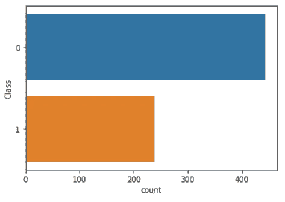

通过可视化每个特征的直方图，我们发现大多数特征具有 1 或 2 的模式，除了团块厚度和空白染色质，它们的分布从 1 到 10 更均匀地展开。这表明团块厚度和空白染色质可能是该类别的较弱预测因子。

```
from matplotlib import pyplot as plt
fig, axes = plt.subplots(4,3, figsize=(20,15))
for i in range(0,4):
    for j in range(0,3):
        axes[i,j].hist(df.iloc[:,1+i+j])
        axes[i,j].set_title(df.iloc[:,1+i+j].name)
```

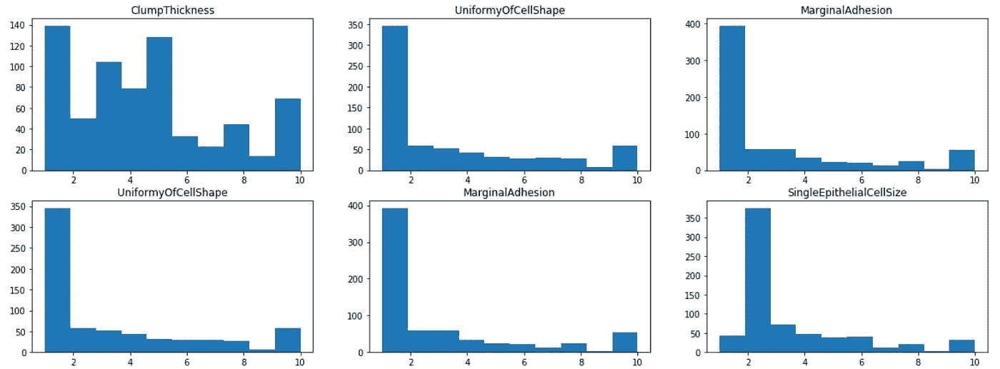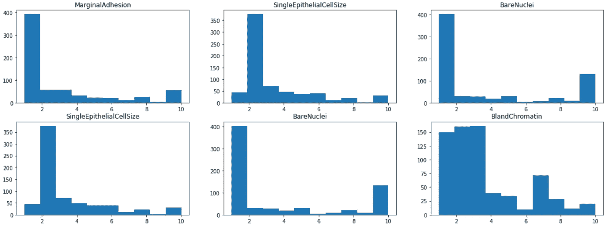

## 模型训练和测试

然后，将数据集以 80%-10%-10%的比例分成典型的训练-验证-测试集，并使用 Sklearn 建立 K-最近邻模型。经过一些超参数调整(未显示)，发现 k=10 的模型在评估阶段表现良好，其 F1 值为 0.9655。代码块如下所示。

```
from sklearn.model_selection import train_test_split
from sklearn.model_selection import KFold **# Train-test split**
X_traincv, X_test, y_traincv, y_test = train_test_split(data, target, test_size=0.1, random_state=42) **# K-Fold Validation** kf = KFold(n_splits=5, random_state=42, shuffle=True)for train_index, test_index in kf.split(X_traincv):
    X_train, X_cv = X_traincv.iloc[train_index], X_traincv.iloc[test_index]
    y_train, y_cv = y_traincv.iloc[train_index], y_traincv.iloc[test_index]from sklearn.neighbors import KNeighborsClassifier
from sklearn.metrics import f1_score,**# Train KNN Model** KNN = KNeighborsClassifier(k=10)
KNN.fit(X_train, y_train)**# Evaluate the KNN model** score =  f1_score(y_testset, y_pred, average="binary", pos_label = 4)
print ("{} => F1-Score is {}" .format(text, round(score,4)))
```

# 使用石灰的模型解释

一个 Kaggle 鉴赏家可能会说，这个结果很好，我们可以在这里结束这个项目。然而，人们应该对模型的决策持怀疑态度，即使模型在评估中表现良好。因此，我们用石灰来解释 KNN 模型对这个数据集做出的决定。这通过检查所做的决定是否符合我们的直觉来验证模型的有效性。

```
import lime
import lime.lime_tabular**# Preparation for LIME**
predict_fn_rf = lambda x: KNN.predict_proba(x).astype(float)**# Create a LIME Explainer**
X = X_test.values
explainer = lime.lime_tabular.LimeTabularExplainer(X,feature_names =X_test.columns, class_names = ['benign','malignant'], kernel_width = 5)**# Choose the data point to be explained**
chosen_index = X_test.index[j]
chosen_instance = X_test.loc[chosen_index].values**# Use the LIME explainer to explain the data point**
exp = explainer.explain_instance(chosen_instance, predict_fn_rf, num_features = 10)exp.show_in_notebook(show_all=False)
```

在这里，我挑选了三点来说明如何使用石灰。

## *解释样本被预测为恶性的原因*

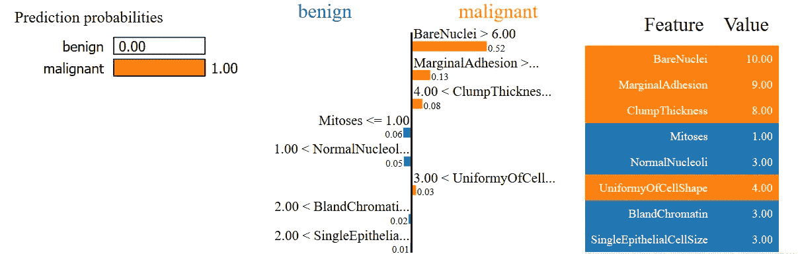

在这里，我们有一个数据点，实际上是恶性的，并预测是恶性的。在左图中，我们看到 KNN 模型预测该点有接近 100%的概率是恶性的。在中间，我们观察到 LIME 能够按照重要性的顺序，使用感兴趣的数据点的每个特征来解释这个预测。根据莱姆的说法，

1.  事实上，样本的裸细胞核值大于 6.0，这使其更有可能是恶性的。
2.  由于样本具有较高的边缘粘连，它更可能是恶性的而不是良性的。
3.  由于样本的凝块厚度大于 4，它更有可能是恶性的。
4.  另一方面，样本的有丝分裂值≤1.00 的事实使其更有可能是良性的。

总的来说，考虑到样本的所有特征(在右图中)，该样本被预测为恶性的。

这四个观察结果符合我们的直觉和我们对癌细胞的了解。了解了这一点，我们更加确信模型根据我们的直觉做出了正确的预测。让我们看另一个例子。

## *解释为什么样本被预测为良性*

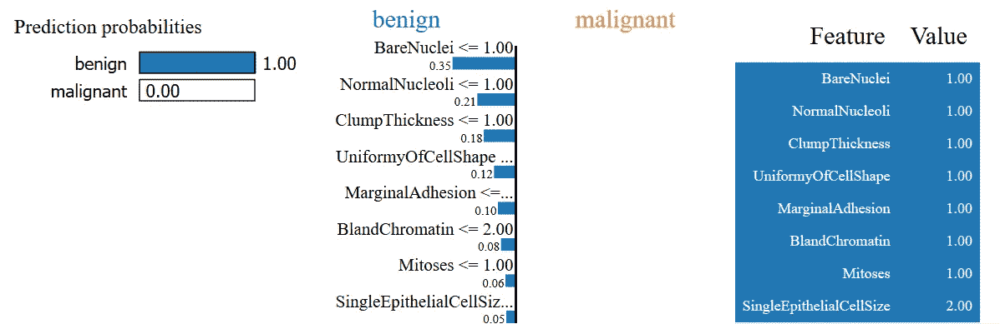

这里，我们有一个细胞样本，预测是良性的，实际上是良性的。LIME 通过引用(以及其他原因)解释了为什么会出现这种情况

1.  该样品的裸核值≤ 1
2.  该样品的正常核仁值≤ 1
3.  它还具有≤1 的簇厚度
4.  细胞形状的均匀性也≤ 1

同样，这些符合我们对为什么细胞是良性的直觉。

## *解释样本预测不明确的原因*

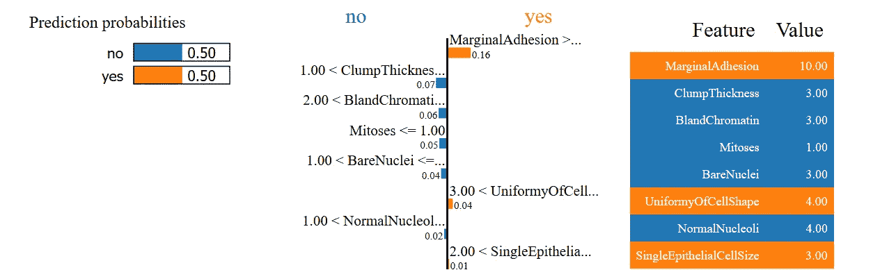

在最后一个例子中，我们看到该模型不能以很高的可信度预测细胞是良性的还是恶性的。使用 LIME 的解释，你能看出为什么会这样吗？

## 结论

LIME 的用途不仅限于表格数据，还包括文本和图像，这使得它的用途非常广泛。然而，仍有工作要做。例如，这篇论文的作者认为，当前的算法应用于图像时[太慢，没有用](https://github.com/marcotcr/lime/blob/master/CONTRIBUTING.md)。尽管如此，LIME 在弥合黑盒模型的有用性和难处理性之间的差距方面仍然非常有用。如果你想开始使用 LIME，一个很好的起点是 [LIME 的 Github 页面](https://github.com/marcotcr/lime)。

如果你对机器学习的可解释性感兴趣，一定要看看我的文章，这篇文章着重于使用[部分依赖图来解释黑盒模型。](/what-makes-a-wine-good-ea370601a8e4)

如果有任何反馈，请随时通过 LinkedIn 联系我。感谢您的宝贵时间！

[](https://www.linkedin.com/in/voon-hao-tang/) [## 特拉维斯唐| LinkedIn

Gojek 的数据分析师](https://www.linkedin.com/in/voon-hao-tang/) 

## 参考

[1] Codari，m .，Melazzini，l .，Morozov，S.P. *等人*，[人工智能对放射学的影响:欧洲放射学学会成员的 EuroAIM 调查](https://doi.org/10.1186/s13244-019-0798-3) (2019)，成像洞察

[2] M. Ribeiro，S. Singh 和 C. Guestrin，[‘我为什么要相信你？’解释任何分类者的预测](http://dx.doi.org/10.1145/2939672.2939778) (2016)，KDD

[3]威廉·h·沃尔伯格博士，[威斯康星乳腺癌数据库](https://archive.ics.uci.edu/ml/datasets/Breast+Cancer+Wisconsin+(Diagnostic)) (1991)，威斯康星大学医院，麦迪逊