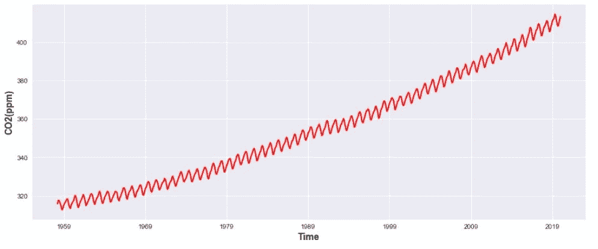
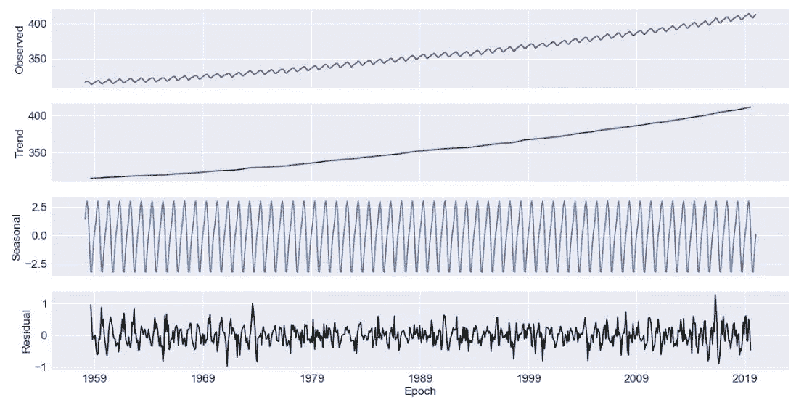
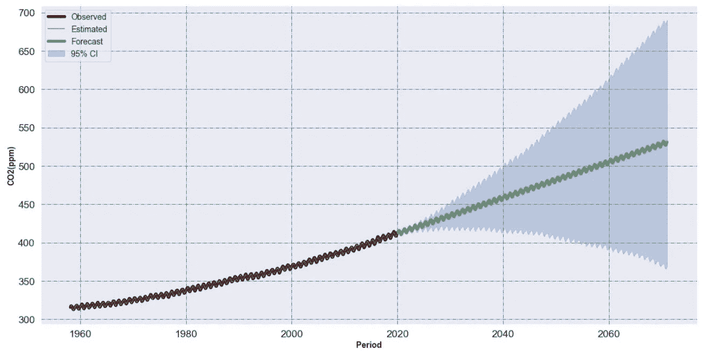

# 通过数据科学解读气候变化

> 原文：<https://towardsdatascience.com/interpreting-climate-change-through-data-science-321de6161baf?source=collection_archive---------48----------------------->

## 用 FB Prophet 预测未来 CO₂水平

图片由来自 Pixabay 的 Gerd Altmann 提供

被困在付费墙后面？点击[这里](/interpreting-climate-change-through-data-science-321de6161baf?sk=334b94d8985334bd8c11a6566d62e7e8)使用我的朋友链接阅读完整的故事！

在过去的几十年里，全球年平均气温的记录稳步上升。温度每增加一分，大气中积累的热量就会呈指数增加，从而导致局部和全球天气模式的变化。因此，在此期间，我们目睹了与天气相关的灾害稳步增加，如长期干旱、更严重的降水和洪水、严重的热带气旋，以及最近加州野火突然激增。气候变化的长期影响包括变化的天气模式、海岸侵蚀和海平面上升。

二氧化碳(CO₂)是一种重要的吸热(温室)气体，它是通过人类活动和燃烧化石燃料释放的。根据联合国政府间气候变化专门委员会(IPCC)的报告，自工业革命开始以来，截至 2018 年 1 月，CO₂浓度已从 280 ppm(百万分之一)上升至 407 ppm。在同一时期，全球平均气温比工业化前的基线上升了大约 1⁰C。 ***换句话说，进入地球大气层的额外 125 ppm 的 CO₂相当于全球气温上升了大约 1⁰C.***

任何与气候变化有关的事情都会引起激烈的争论，CO₂的变暖效应也不例外。与 CO₂推动全球气温上升的普遍观点相反，一些人认为气温的变化导致了大气 CO₂的变化——而不是相反。在使用冰芯研究过去的气候变化时，科学家观察到 CO₂滞后于温度。这使得一些人认为 CO₂滞后否定了 CO₂.的变暖效应事实上，争论的双方都站得住脚，因为 CO₂和全球气温之间存在正反馈循环。换句话说，变暖导致更多的 CO₂，更多的 CO₂导致变暖。这种正反馈循环进一步加剧了全球变暖的影响。

# 夏威夷莫纳罗亚天文台:

**夏威夷莫纳罗亚岛大气二氧化碳(ppm)**

[夏威夷莫纳罗亚天文台](https://www.esrl.noaa.gov/gmd/obop/mlo/)，是最古老的连续 CO₂监测站，由于其远离任何大陆的位置，已经成为 CO₂水平的全球标准。上图显示了在莫纳罗亚天文台测得的每月大气 CO₂水平。 *x 轴*代表时间， *y 轴*代表以百万分率(ppm)测量的每月 CO₂水平。随着时间的推移，CO₂浓度稳步上升，目前的浓度比几百万年来都要高。

# **预测未来 CO₂水平:**

> **为了将全球变暖限制在 1.5 ⁰摄氏度，到 2030 年，全球碳排放量需要在 2010 年的水平上惊人地下降 45%(IPCC，联合国)**

在这项研究中，让我们利用数据驱动建模的进步来预测未来的 CO₂水平。一旦建模，预测的未来 CO₂水平可以用来评估我们在实现 IPCC 排放目标方面还有多远，以及这对全球气温上升意味着什么。时间序列预测问题是一种困难的预测建模问题。与回归预测建模不同，时间序列还增加了输入变量之间序列相关性的复杂性。

## **co₂时间序列的分解:**

从莫纳罗亚火山观测大气 CO₂时间序列，我们可以看到有一个强季节性的上升趋势。CO₂的年度高峰出现在春季(5 月)，此时融化的积雪暴露了土壤微生物，释放出大量的 CO₂.秋季(9 月)CO₂水平通常较低，因为大气中的 CO₂被大量夏季植物吸走。时间序列分解技术允许我们将一个时间序列分解成单独的组成部分。分解技术背后的思想是，任何序列都可以表示为其组成部分的和(或积): a)水平，b)趋势，c)季节性，和 d)残差。为了执行这个数据分解，我们将使用 *statsmodel* 包中的*季节性分解*函数，如下所示:

**时间序列分解—可加模型:y(t) =趋势(t)+季节性(t)+残差(t)**

上图显示了时间序列的各个组成部分。由于季节变化在时间上是相同的量级，我们选择的加性模型分解是好的。

**趋势:**是指一个时间序列在一段较长的时间内自然地向相对较高或较低的值发展。从 CO₂的数据来看，我们看到了上升趋势。

**季节性:**固定时间段内重复的模式。季节性可以是每周、每月或每年。

**残差:**表示与其余数据不一致的随机和不规则(异常值和缺失值)影响。

## **建立预测模型:**

有几种时间序列预测方法和软件包可用，但[脸书的预言家](https://facebook.github.io/prophet/)是一种快速可靠的方法，可以在建模/预测时间序列数据的最初阶段获得非常好的结果。Prophet 是一个加法回归模型，通过将时间序列分解为趋势、季节性和残差分量来拟合非线性趋势。关于先知背后的数学细节，请阅读这篇[论文](https://peerj.com/preprints/3190/)。

从莫纳罗亚天文台，我们有从 1958 年 3 月到 2020 年 1 月近 62 年的月度数据。1958 年 3 月至 2013 年 10 月之间的月度数据用于“训练”模型，剩余的数据集(2013 年 11 月-2020 年 1 月)用于“验证”模型。一旦通过验证，该模型可用于预测未来 50 年的 CO₂水平。

**CO₂对 2070 年前未来 50 年的预测**

上图显示了 CO₂的观测值、估计值和预测值，以及 95%的置信区间。总的来说，FB Prophet 模型在捕捉长期趋势和季节性方面非常稳健。2015 年巴黎协定是最新的国际气候条约，旨在将本世纪全球气温上升幅度控制在 2 摄氏度以下，并有望限制在 1.5 度，低于工业化前的水平。

> 按照 CO₂目前的增长速度，50 年内污染水平将达到百万分之 530，使我们的气温上升幅度可能超过 3 摄氏度。

## **与 RCP 通路的关系:**

为了使气候研究和政策制定标准化，政府间气候变化专门委员会(IPCC)提出了四种预示不同气候未来的情景。四个代表性的浓度路径(RCP)通常被称为 RCP2.6、RCP4.5、RCP6.0 和 RCP 8.5。RCP 的数值(2.6、4.5、6.0 和 8.5)指的是 2100 年的目标辐射强迫(以瓦特/平方米测量)。这些情景旨在涵盖从非常高(RCP8.5)到非常低(RCP2.6)的未来温室气体浓度。通过预测未来的 CO₂水平，我们可以估计相应的地表温度变化和单位面积的能量变化率。这些相互关联的度量有助于定义不同的 RCP 场景并对其进行基准测试。

## **收尾思路:**

显然，世界各国在实现气候变化目标方面做得还不够，一切照旧。随着气温上升，我们可以预计，与极端天气相关的灾害的频率和严重程度将会增加，冰川融化和沿海洪水导致大规模迁移，干旱和火灾破坏雨林和全球食品供应链。应对气候变化和建设低碳未来需要做更多的工作。人们普遍认为，低碳未来意味着失去传统工作和更强劲的经济。与普遍的看法相反，像特斯拉这样的公司站在对抗碳排放的最前沿，并展示了实现这一目标的方法。

**如果你喜欢这篇文章，这里还有一些你可能喜欢的文章:**

 [## 使用深度学习的飓风路径预测

### 每年 6 月 1 日到 11 月 30 日之间的时间窗标志着北大西洋飓风季节。在此期间…

medium.com](https://medium.com/@kap923/hurricane-path-prediction-using-deep-learning-2f9fbb390f18)  [## 使用生成对抗网络的随机天气生成器

### 使用 GANs 对多元分布建模

towardsdatascience.com](/stochastic-weather-generator-using-generative-adversarial-networks-a9856b0f83ef)