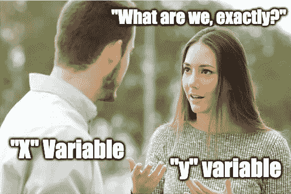
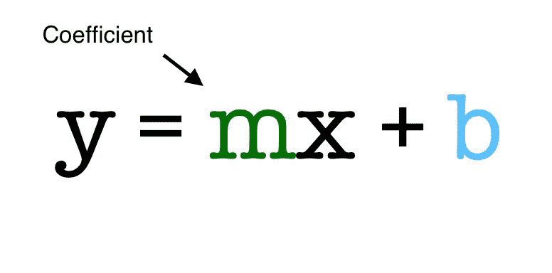
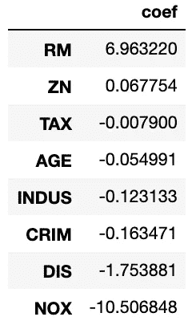
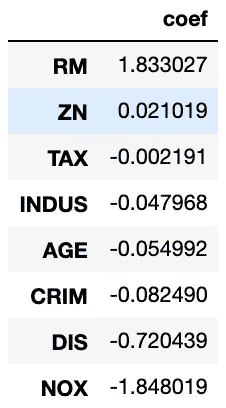
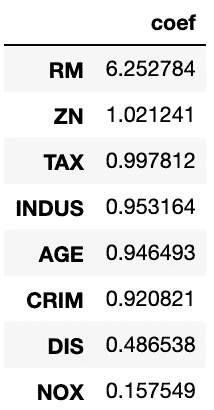

# 解释线性和逻辑回归中的系数

> 原文：<https://towardsdatascience.com/interpreting-coefficients-in-linear-and-logistic-regression-6ddf1295f6f1?source=collection_archive---------7----------------------->

## 如何解释你的系数，让每个人都能理解

*虽然我在下面简要总结了线性回归和逻辑回归，但这篇文章更关注模型的系数。有关线性和逻辑回归模型的更多信息，请点击* [*此处*](/linear-regression-detailed-view-ea73175f6e86) *和* [*此处*](/introduction-to-logistic-regression-66248243c148) *。*

我过去在一家餐馆工作时，每次换班开始时，员工们都会进行同样的谈话:我们会有多忙，为什么。*是假日周末吗？天气怎么样？安排了哪些大型体育赛事？*

尽管我们以行为经济学家的权威身份发言，但我们的预测更多地是基于轶事证据和直觉，而不是数据。但是我们有所发现。当然，许多因素(例如天气)和我们将会有多忙是有关系的。我们以自己的方式进行了一点民间回归分析。

# 回归分析

回归分析试图定义因变量(y)和任意数量的自变量(X)之间的关系。



来源:https://imgflip.com/memetemplate/151224298/

在线性回归中，y 变量是连续的(即有无限的可能性)。在逻辑回归中，y 变量是分类的(通常是二进制的)，但是使用 logit 函数可以将 y 变量视为连续的(了解更多关于此处[的信息](/logit-of-logistic-regression-understanding-the-fundamentals-f384152a33d1))。

在线性或逻辑回归中，每个 X 变量对 y 变量的影响用 X 变量的系数表示。虽然两个模型的系数看起来相似，但它们需要以非常不同的方式来解释，本文的其余部分将解释如何解释它们。



对于数学人来说

*(我将为这两个模型使用 sklearn 内置的“load_boston”房屋数据集。对于线性回归，目标变量是给定社区中自有住房的中值(以 10，000 美元计)；对于逻辑回归，我将 y 变量分为两类，超过 21k 美元的中值标为“1”，低于 21k 美元的中值标为“0”。)*

# 线性回归系数

首先，让我们看看更直接的系数:线性回归。在实例化和拟合模型之后，使用`.coef_`属性查看系数。

```
linreg = LinearRegression()
linreg.fit(X, y)
linreg.coef_
```

我喜欢创建一个熊猫数据框架，清楚地显示每个独立变量及其系数:

```
pd.DataFrame(linreg.coef_, 
             X.columns, 
             columns=['coef'])\
            .sort_values(by='coef', ascending=False)
```



如我所说，解释线性回归系数相当简单，您可以像这样口头描述这些系数:

*“当所有其他变量保持不变时，[X 变量]每增加一个单位，[y 变量]就增加[系数]。”*

因此，对于可变 RM(每所房子的平均房间数)，这意味着当平均房间数增加一个单位(想想“5”到“6”)时，在所有其他因素都不变的情况下，该社区房屋的中值增加了约 6960 美元。另一方面，随着一氧化氮浓度增加一个单位(以每 1000 万分之一计算)，房屋的中值将减少约 10，510 美元。

# 逻辑回归系数

逻辑回归模型以同样的方式进行实例化和拟合，`.coef_`属性也用于查看模型的系数。(注意:您需要使用`.coef_[0]`进行逻辑回归，将其放入数据框架中。)

```
logreg = LogisticRegression()
logreg.fit(X, y)
log_odds = logreg.coef_[0]pd.DataFrame(log_odds, 
             X.columns, 
             columns=['coef'])\
            .sort_values(by='coef', ascending=False)
```



对数赔率

然而，逻辑回归系数并不容易解释。这是因为逻辑回归使用 logit link 函数来“弯曲”我们的最佳拟合线，并将我们的分类问题转换为回归问题。(再次，了解更多[这里](/logit-of-logistic-regression-understanding-the-fundamentals-f384152a33d1)。)

由于使用了 logit 函数，逻辑回归系数表示给定 X 变量的值时，观察值在目标类(“1”)中的*对数概率*。因此，需要将这些对数奇系数转换为常规奇系数，以便理解它们。幸运的是，这可以通过简单地对对数概率系数求幂来实现，你可以用`np.exp()`来实现:

```
odds = np.exp(logreg.coef_[0])
pd.DataFrame(odds, 
             X.columns, 
             columns=['coef'])\
            .sort_values(by='coef', ascending=False)
```



可能性

现在这些系数开始变得更有意义了，你可以这样口头描述几率系数:

*“当所有其他变量保持不变时，【X 变量】每增加一个单位，观察值在(y 类)的几率是观察值不在(y 类)的几率的【系数】倍。”*

因此，随着变量 RM(同样，房间的平均数量)增加一个单位，观察中表示的房屋在目标类(“1”)中的几率是它们不在目标类中的几率的 6 倍以上。另一方面，当一氧化氮浓度增加一个单位时，房屋处于目标类别的几率仅为 0.15。对于小于 1 的赔率(我们的负系数)，我们可以取 1/赔率来更好地理解它们。所以一氧化氮增加 1，房子不在目标类的几率是 1/0.15 或者 6.66x(不祥！)和它在目标类中的几率一样大。

# 结束了

够简单！但是，当我第一次学习如何使用线性和逻辑回归对数据建模时，模型系数的这种差异对我来说并不清楚，我也不太确定如何口头解释逻辑回归模型的系数。我希望这能帮助刚接触这些概念的学生理解如何解释线性和逻辑回归中的系数。