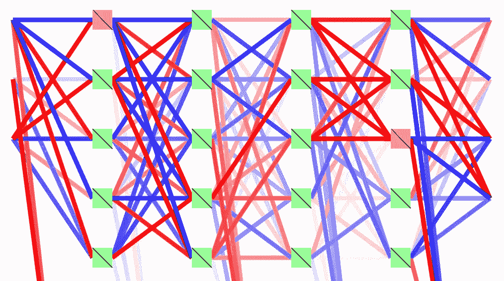
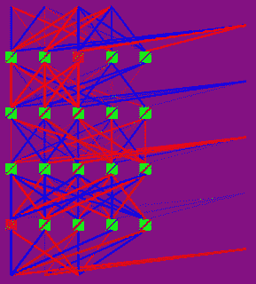

# 通过减少训练期间的非线性来解释神经网络

> 原文：<https://towardsdatascience.com/interpreting-neural-networks-by-reducing-nonlinearities-during-training-eca0fa7cbbf0?source=collection_archive---------61----------------------->



作者图片

机器学习和神经网络被越来越广泛地使用，尽管事实上它们大多是作为黑盒运行的，我们对它们如何产生输出几乎没有什么洞察力。这使得使用这些系统做出的决策很难仔细检查和说明。

在这篇笔记中，我描述了一个简单的解决方案，它使得从一个采用参数校正线性单元(PReLUs)的神经网络中提取规则成为可能。这是通过引入一个与反向传播平行施加的力来实现的，该力旨在将前序简化为单位函数，然后使神经网络折叠成一个更小的线性函数和不等式系统，适合人类决策者审查或使用。

由于这种力量降低了神经网络的能力，预计它也有助于避免过度拟合。

**简介**

机器学习解决方案，更具体地说，神经网络，被用于我们生活中越来越多的领域。同时，由于很难在任何层面上掌握它们是如何运作的，因此它们可以被视为黑箱，对于需要对业务和/或法律原因负责的公司来说，不太愿意采用它们。这一事实也会影响这类系统中公共场所的信任度。

正因为如此，提供能够帮助我们理解这些模型如何得出某个决定的工具是一个活跃的研究领域。这些工具包括可视化工具、识别最重要输入的工具、允许对输入数据进行实验以了解模型对不同信号的相对重要性的工具，以及本笔记的重点，显著降低神经网络的复杂性，使其能够从中提取决策“规则”，然后供人类决策者审查甚至使用。

这些规则可以采取的一种形式是封闭的、相对简单的代数表达式(例如，线性函数),其行为对于人类来说比由涉及数百万范围内的参数和非线性函数的神经网络实现的完整功能更可预测。

在这篇笔记中，我描述了一种在训练过程中降低神经网络复杂性的方法，这种方法允许将其输出描述为一个简单的线性函数系统，该系统限于由线性不等式定义的区域。特别地，考虑前馈神经网络，其中所有非线性是参数校正线性单元(PReLUs ),定义为

*f* ( *x* ) = max(0， *x* ) + *a* min(0， *x* )，

其中 0 ≤ *a* ≤ 1。

设网络的输入为向量(或张量，我们将其展平) *I* = ( *i* [1】， *i* [2]，。。。， *i* [ *n* ])，输出为向量(或张量) *O* = (o[1]，o[1]，。。。，o[ *m* ])。

**作为线性函数组合的神经网络**

很容易看出，这样一个网络的输出 *O* 可以表示为一组 *i* [ *x* ]的线性组合，每个组合都被一组关于 *i* [ *x* ](条件)的线性不等式限制在输入值的特定区域内。

直觉上，这是正确的，因为只要(也就是说，在可能的输入向量的区域内)PReLUs 的输入没有从负到正的交叉，输出就是输入的线性函数，反之亦然；并且因为这些区域的边界也是线性的。

更正式地说，我们可以通过为任何给定的神经网络构建一个合适的线性组合和不等式系统来证明这种说法是正确的。对于网络中的所有预试，让我们决定它们的输入是负的还是非负的。如果前奏的数量是δ，这意味着 2**δ个可能的场景。在每种情况下，神经网络都变得完全线性，输出是输入的线性函数，事实上，网络内部的所有部分结果也是输入的线性函数。这需要 PReLUs 的输入也是输入 *I* 的线性函数，产生δ线性不等式(条件),其标出了该场景适用的输入空间的区域。

自然地，产生输出的 2**δ线性组合的这个系统，每个由δ条件控制，很可能是多余的，因为条件可能不是独立的，或者可能是矛盾的，在这种情况下，输入空间的一些 2**δ区域将是空的。但是该系统将是神经网络输出的精确描述。

虽然对于我们人类来说，线性函数似乎很容易解释和预测，但很明显，如果δ在大多数现代神经网络中处于数千或数百万的范围内，2**δ函数就不是这样了。因此，我们需要构建我们的神经网络的输出的近似，其在输入空间的大得多的区域中是线性的，并且具有小得多的不同区域。这相当于试图找到另一个很好地逼近我们网络的神经网络，但只包含少量的预序。

**将预序简化为线性**

这可以通过继续训练原始神经网络，同时在它的每个前序上施加力，使它的参数 *a* 向 1 移动来实现。

注意，如果 *a* = 1，那么 PReLU 退化为恒等函数 *f* ( *x* ) = *x* ，不再是非线性。在某种意义上，它消失了，并且神经网络围绕着它“崩溃”,因为在退化的预露之前的线性映射和在它之后的线性映射现在可以合并成单个线性映射。

因此，这种力量在逼近训练数据和减少预试次数之间找到了平衡，从而产生了一种神经网络，这种神经网络可以表达为一组线性函数和人类消耗的不等式。通过消除非线性，这种力也降低了神经网络的能力，因此可以预期它有助于避免过拟合。

我选择了一个独立于 *a* 的力，并在每个反向传播步骤后施加，以调整率η移动参数，但不会超过 1:

*a*[*t*+1]= max(0，min(1，*a*[*t*]+ηSGN(1*a*[*t*))。

在我的研究中，我认为任何前提都是完全线性的，如果

*一*一> 0.9995。

η还依赖于网络表现出的当前误差，以允许网络最初无干扰地训练，然后越来越积极地将 PReLU 参数拉到 1。特别是，

η = η[0] 0.01 最大值(0，log(*err*)-2)

其中η[0] = 0.01 是整个模型的学习率，log()是 10 的底，而 *err* 是训练误差。这意味着当训练误差下降到 0.01 以下时，η将开始变得非零，并且可以随着训练误差下降而无限增长(尽管 a 参数无论如何都会被限幅)。

**例子**

演示上述内容的示例代码可在[https://github.com/csirmaz/trained-linearization](https://github.com/csirmaz/trained-linearization)获得。该代码实现用 PReLU 参数上的力来训练小型神经网络，并且包含从模型的权重和其他参数中提取线性不等式和组合的系统的逻辑。

神经网络本身有 4 个输入节点、3 个输出节点和 4 个隐藏层，每层有 5 个节点。这些层由可训练的完全连接层链接，随后是 PReLU 激活，最后一个完全连接层除外，它只是提供输出。

期望网络学习以下关系:

out[1]= in[1]xor in[2]
out[2]= in[3]xor in[4]
out[3]= in[1]in[2]

其中所有的输入和输出都是 0 或 1，一些额外的噪声被添加到输入中。对于输入的 0 和 1 的所有 2**4 种可能组合，代码根据上述表达式生成训练数据。为每批训练数据生成新的噪声。

下图显示了一个经过训练的模型。两个非线性足以解决这个问题，实际上训练确定了一个解决方案，其中只有两个预实验是非线性的。



作者图片

(有 4 个输入节点(顶部)和 3 个输出节点(底部)。红线表示正重量，蓝线表示负重量。从右边引出的线表示偏差值。绿色方框标记被认为是线性的预课，而红色方框标记非线性预课。)

虽然在视觉化中，输入和输出之间的关系还很不清楚，但是一旦其他的前奏被认为是线性的，所有的权重都被压缩成非常简单的表达式。下面是代码的输出，列出了两个非线性初值产生的两种情况的表达式。这些完全对应于训练数据中的关系。

```
IF +0.00*in1 +0.00*in2 -1.00*in3 -1.00*in4 +1.00 < 0
  (PReLU #3 on level 1 is neg. ln(1-weight)=-2.58)
IF +1.00*in1 +1.00*in2 -0.00*in3 -0.00*in4 -1.00 < 0
  (PReLU #1 on level 4 is neg. ln(1-weight)=-2.60)
THEN
  out1 = +1.01*in1 +1.01*in2 -0.00*in3 -0.00*in4 +0.00
  out2 = -0.00*in1 -0.00*in2 -1.03*in3 -1.03*in4 +2.04
  out3 = -0.00*in1 -0.00*in2 +0.00*in3 +0.00*in4 -0.00IF +0.00*in1 +0.00*in2 -1.00*in3 -1.00*in4 +1.00 < 0
  (PReLU #3 on level 1 is neg. ln(1-weight)=-2.58)
IF +1.00*in1 +1.00*in2 -0.00*in3 -0.00*in4 -1.00 > 0
  (PReLU #1 on level 4 is pos. ln(1-weight)=-2.60) 
THEN 
  out1 = -1.01*in1 -1.01*in2 +0.00*in3 +0.00*in4 +2.02 
  out2 = -0.00*in1 -0.00*in2 -1.03*in3 -1.03*in4 +2.04 
  out3 = +1.00*in1 +1.00*in2 +0.00*in3 +0.00*in4 -1.01 IF +0.00*in1 +0.00*in2 -1.00*in3 -1.00*in4 +1.00 > 0
  (PReLU #3 on level 1 is pos. ln(1-weight)=-2.58) 
IF +1.00*in1 +1.00*in2 +0.00*in3 +0.00*in4 -1.00 < 0
  (PReLU #1 on level 4 is neg. ln(1-weight)=-2.60) 
THEN 
  out1 = +1.01*in1 +1.01*in2 +0.00*in3 +0.00*in4 +0.00 
  out2 = -0.00*in1 -0.00*in2 +1.00*in3 +1.00*in4 +0.01 
  out3 = -0.00*in1 -0.00*in2 -0.00*in3 -0.00*in4 +0.00 IF +0.00*in1 +0.00*in2 -1.00*in3 -1.00*in4 +1.00 > 0 
  (PReLU #3 on level 1 is pos. ln(1-weight)=-2.58) 
IF +1.00*in1 +1.00*in2 +0.00*in3 +0.00*in4 -1.00 > 0 
  (PReLU #1 on level 4 is pos. ln(1-weight)=-2.60) 
THEN 
  out1 = -1.01*in1 -1.01*in2 -0.00*in3 -0.00*in4 +2.02 
  out2 = -0.00*in1 -0.00*in2 +1.00*in3 +1.00*in4 +0.01 
  out3 = +1.00*in1 +1.00*in2 -0.00*in3 -0.00*in4 -1.01
```

**参考文献**

[1]何、、任、，“深入研究整流器:在 ImageNet 分类上超越人类水平的性能”，微软研究院，2015 年 2 月 6 日。http://arxiv.org/abs/1502.01852[。](http://arxiv.org/abs/1502.01852)

【https://epcsirmaz.blogspot.com】最初发表于[](https://epcsirmaz.blogspot.com/2020/06/interpreting-neural-networks-by.html)**。**