# 解释基于文本的机器学习模型

> 原文：<https://towardsdatascience.com/interpreting-text-based-machine-learning-models-aa37218195c9?source=collection_archive---------19----------------------->


本·怀特在 [Unsplash](https://unsplash.com/s/photos/reading?utm_source=unsplash&utm_medium=referral&utm_content=creditCopyText) 上的照片

## 可解释文本预测的工具和技术

就像任何其他机器学习任务一样，重要的是要有工具来解释基于文本的机器学习模型如何得出它们的预测。

能够理解和解释机器学习模型如何得出预测是非常重要的。对模型如何得出结论的准确理解将使您能够构建更好、更准确的模型，并确保这些模型不会传播数据集中可能存在的偏差。

在这篇文章中，我想分享一些解释基于语言的机器学习的工具和技术。

## 用黄砖想象

为机器学习准备文本数据的一个常见步骤是对单词进行标记。这一步将语言片段分解成它们的组成部分，通常是单词。在建立模型之前，了解您正在处理的数据的大致模式会很有用。这可以为您使用的处理技术提供信息，甚至在您建立模型之前，就有可能揭示偏差的趋势。

[Yellowbrick](https://www.scikit-yb.org/en/latest/) 是一个基于 scikit-learn 构建的机器学习模型可视化库。在其他可视化中，它包含了一些有用的可视化文本标记的方法。

为了说明其中的一些技术，我将使用当前 Kaggle 竞赛中的一个数据集，它可以在这里下载。这个数据集包含许多推文和一个目标标签，它告诉我们一条推文是否是关于一场真正的灾难。

在使用这个数据集之前，我已经执行了一些基本的文本清理任务。其中包括删除标点符号、特殊字符和停用词。

下面的代码读入数据并执行这些任务。

```
import pandas as pd
pd.set_option('display.max_colwidth', -1)
import re
import nltk.corpus
nltk.download('stopwords')
from nltk.corpus import stopwords
stop = stopwords.words('english')# Reads in the data
train_data = pd.read_csv('train.csv')# Drops all columns text and target
cols_to_drop = ['id', 'keyword', 'location']
train_data = train_data.drop(cols_to_drop, axis=1)# Removes punctuation and special characters
def  clean_text(df, text_field, new_text_field_name):
    df[new_text_field_name] = df[text_field].str.lower()
    df[new_text_field_name] = df[new_text_field_name].apply(lambda elem: re.sub(r"(@[A-Za-z0-9]+)|([^0-9A-Za-z \t])|(\w+:\/\/\S+)|^rt|http.+?", "", elem))  
    # remove numbers
    df[new_text_field_name] = df[new_text_field_name].apply(lambda elem: re.sub(r"\d+", "", elem))

    return dfdata_clean = clean_text(train_data, 'text', 'text')# Removes stop words 
data_clean['text'] = data_clean['text'].apply(lambda x: ' '.join([word for word in x.split() if word not in (stop)]))
```

干净数据集的前几行如下所示。

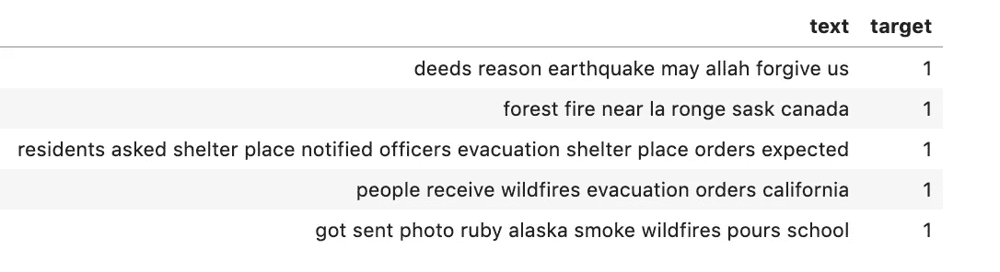

接下来，我们将使用 yellowbrick 库来标记文本并检查频繁出现的单词。

```
import matplotlib.pyplot as plt
%matplotlib inline
from sklearn.feature_extraction.text import CountVectorizer
from yellowbrick.text import FreqDistVisualizervectorizer = CountVectorizer()
docs       = vectorizer.fit_transform(data_clean['text'])
features   = vectorizer.get_feature_names()visualizer = FreqDistVisualizer(features=features, orient='v')
visualizer.fit(docs)
visualizer.show()
```

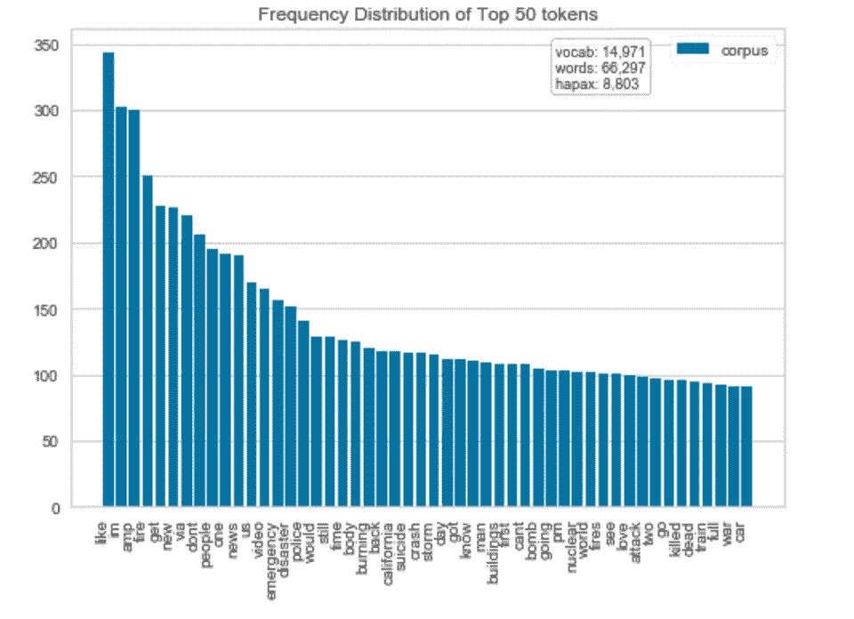

一个有用的练习可能是将这两个目标标签的数据分别可视化，以理解模型可以用来进行预测的数据中的模式。

灾难推文的代码和输出如下所示。

```
disaster_tweets = data_clean[data_clean['target'] == 1]
vectorizer = CountVectorizer()
docs       = vectorizer.fit_transform(disaster_tweets['text'])
features_disaster   = vectorizer.get_feature_names()visualizer_disaster = FreqDistVisualizer(features=features_disaster, orient='v')
visualizer_disaster.fit(docs)
visualizer_disaster.show()
```

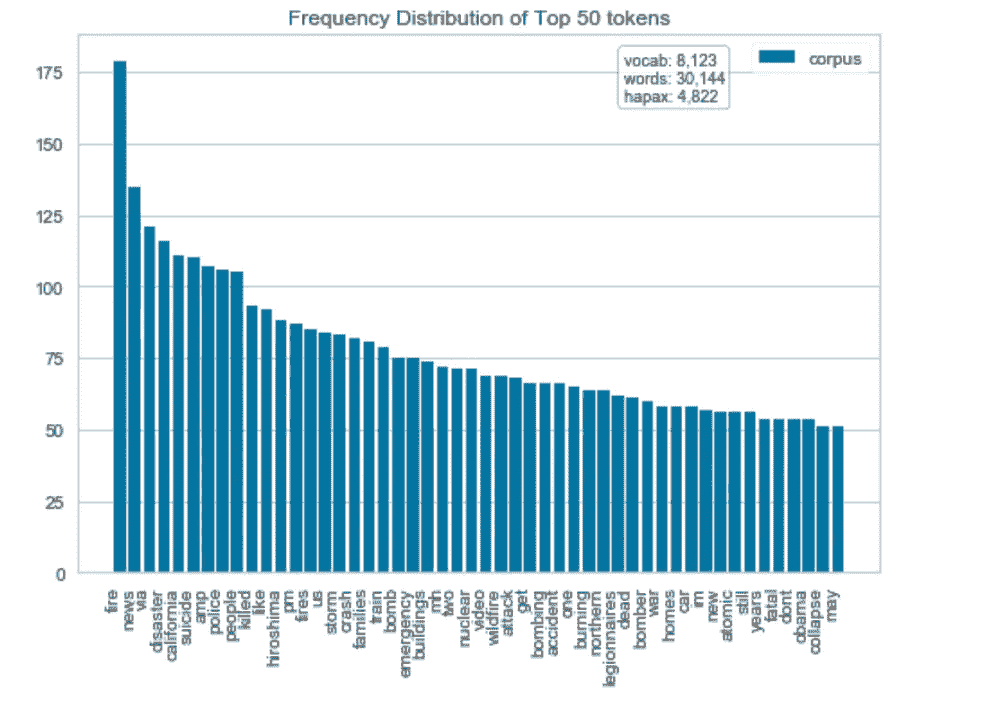

接下来，我们对非灾难性的推文重复这个过程。

```
non_disaster_tweets = data_clean[data_clean['target'] == 0]vectorizer = CountVectorizer()
docs       = vectorizer.fit_transform(non_disaster_tweets['text'])
features_non_disaster   = vectorizer.get_feature_names()visualizer_non_disaster = FreqDistVisualizer(features=features_non_disaster, orient='v')
visualizer_non_disaster.fit(docs)
visualizer_non_disaster.show()
```

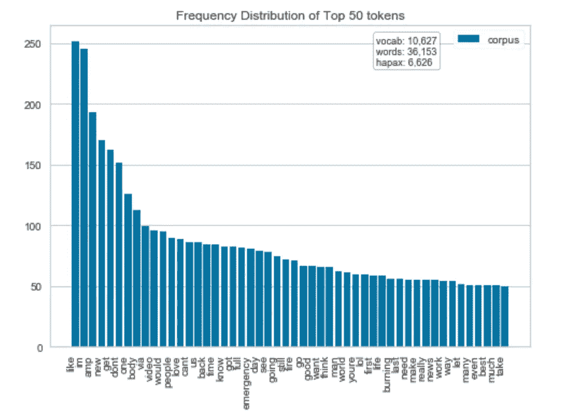

从这个分析中我们可以看到，有很多表示灾难的词，如**火灾**、**新闻**和**灾难**在灾难微博中出现得非常频繁，但在非灾难微博中出现得很少。

## 用 Shap 解释模型

[Shap](https://github.com/slundberg/shap)(SHapley Additive explaints)是一个 python 库，它使用博弈论的方法来为从机器学习模型中得出的预测提供解释。它包括解释基于文本的模型的功能，并与包括 scikit-learn 在内的各种机器学习和深度学习库一起工作。

在我们使用这个库来解释一个模型之前，我们首先需要建立一个模型。下面的代码将我们的数据分成训练集和测试集，并训练一个简单的基于逻辑回归的分类模型。

```
from sklearn.model_selection import train_test_split
from sklearn.feature_extraction.text import TfidfVectorizer
import sklearn X_train, X_test, y_train, y_test = train_test_split(data_clean['text'],data_clean['target'],random_state = 0)vectorizer = TfidfVectorizer(min_df=10)
X_train = vectorizer.fit_transform(X_train)
X_test = vectorizer.transform(X_test)model = sklearn.linear_model.LogisticRegression(penalty="l1", C=0.1)
model.fit(X_train, y_train)
```

接下来，我们将导入 shap 并使用`summary_plot`函数来探索模型中使用的特性重要性。

```
import shap
shap.initjs()explainer = shap.LinearExplainer(model, X_train, feature_dependence="independent")
shap_values = explainer.shap_values(X_test)
X_test_array = X_test.toarray()shap.summary_plot(shap_values, X_test_array, feature_names=vectorizer.get_feature_names())
```

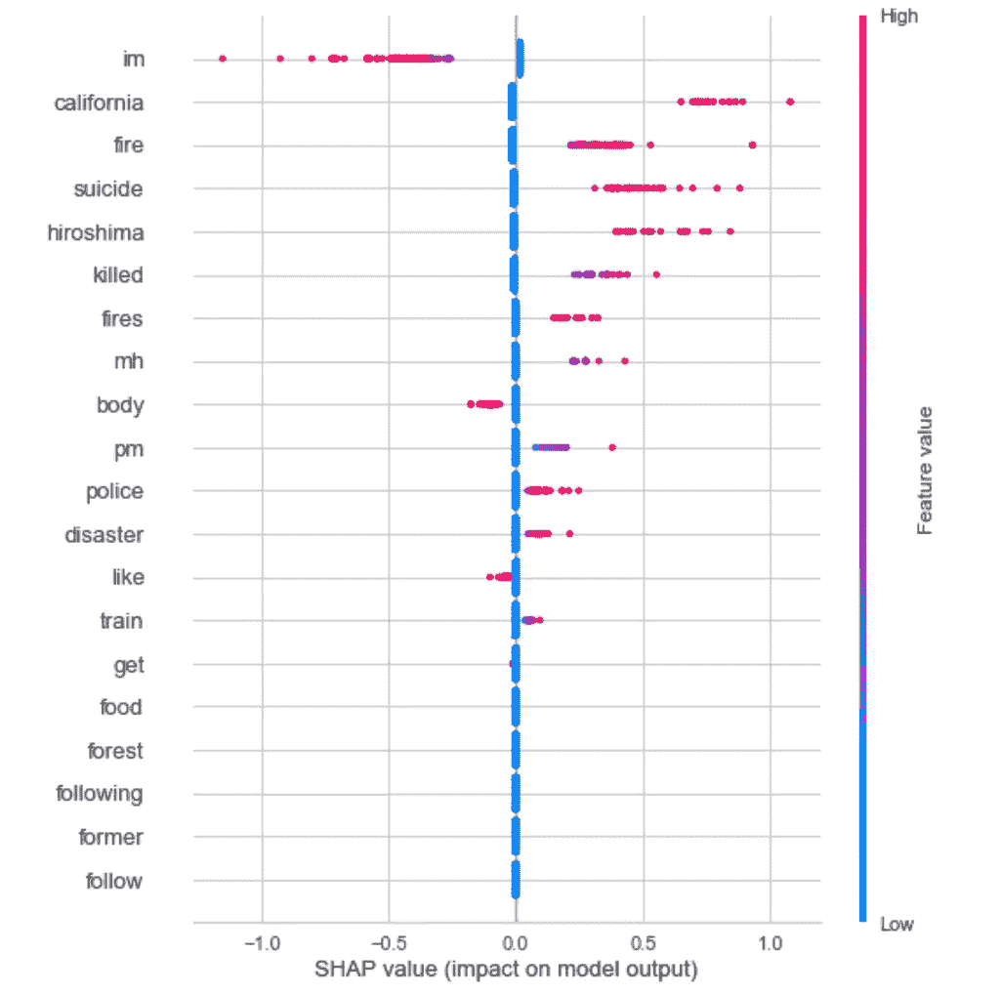

我们可以看到，我们用 yellowbrick 探索的灾难推文中频繁出现的许多词具有很高的特征值。

我们也可以用 shap 来解释个别预测。

```
ind = 0
shap.force_plot(
    explainer.expected_value, shap_values[ind,:], X_test_array[ind,:],
    feature_names=vectorizer.get_feature_names()
)
```

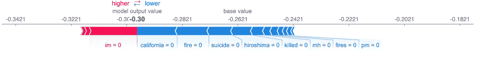

## 用 ELI5 进行解释

ELI5 是另一个 python 库，它同样为预测提供解释。它有一些非常好的渲染，特别是对基于文本的模型的解释。

它支持大多数常用的机器学习库，包括 scikit-learn、XGBoost 和 Keras。它还可以很好地与 scikit-learn 管道一起工作。

与 shap 类似，ELI5 提供了特征重要性的权重，这有助于在全局范围内为模型提供解释。

使用我们上面训练的模型，并提供用于预处理文本的矢量器，我们可以产生如下所示的可视化效果。默认情况下，对于二元分类，ELI5 将显示阳性类的要素权重。

```
import eli5eli5.show_weights(model, vec=vectorizer, top=10)
```

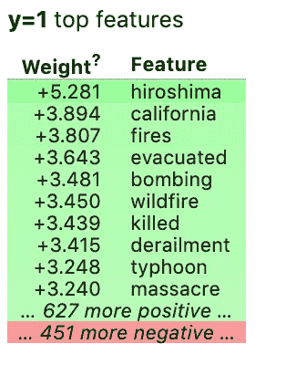

这个库中我最喜欢的功能是一个工具，它可以在原始文本上叠加对单个预测的解释。第一条推文的例子如下所示。我们可以看到，该模型预测这是一条灾难性的推文，并且该模型使用了突出显示的单词来进行预测。

```
eli5.show_prediction(model, data_clean['text'].iloc[0], vec=vectorizer)
```

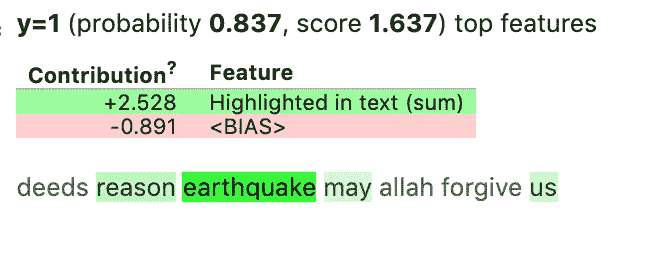

原始数据集中的行显示这是正确预测的，是一条灾难性的推文。

```
print(data_clean.iloc[0])
```

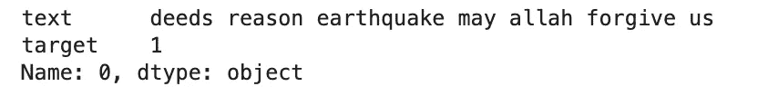

让我们看一个非灾难推文的例子。

```
eli5.show_prediction(model, data_clean['text'].iloc[57], vec=vectorizer)print(data_clean.iloc[57])
```

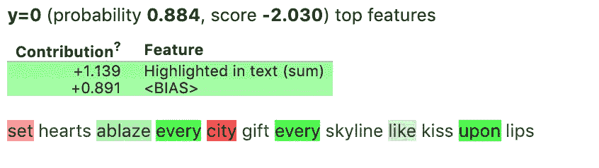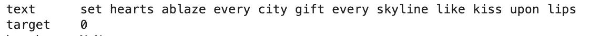

这让我们了解了模型是如何进行预测的，并可能揭示模型中的任何偏见或道德问题。

本文简要概述了解释和调试基于文本的机器学习模型的技术。所有这些工具都有更多的功能，可以让您更深入地了解模型是如何执行的。值得看一看每一项的文档，并探索其他可用的特性。

如果您想探索自然语言处理中的更多概念，我最近写了两篇文章，在本文中使用了相同的数据集。它们包括:

[构建机器学习模型参加 Kaggle 比赛的指南](/how-to-enter-your-first-kaggle-competition-4717e7b232db)。

自然语言处理的[文本清理方法指南](/text-cleaning-methods-for-natural-language-processing-f2fc1796e8c7)。

感谢阅读！