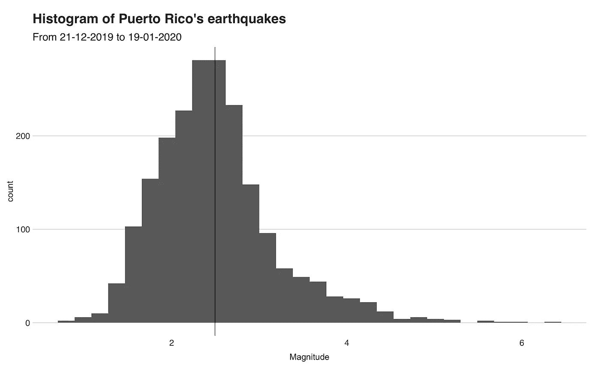
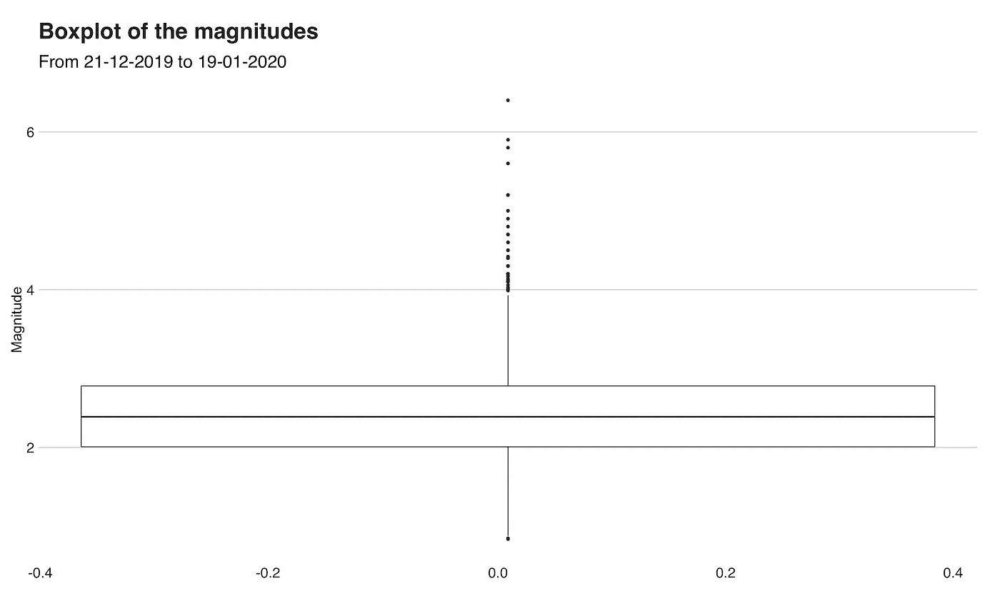
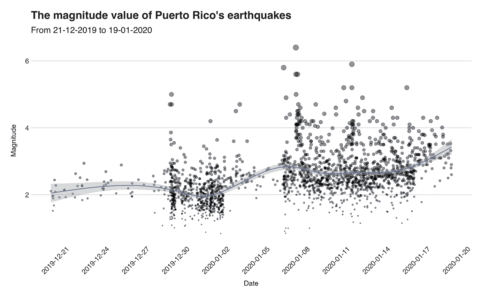
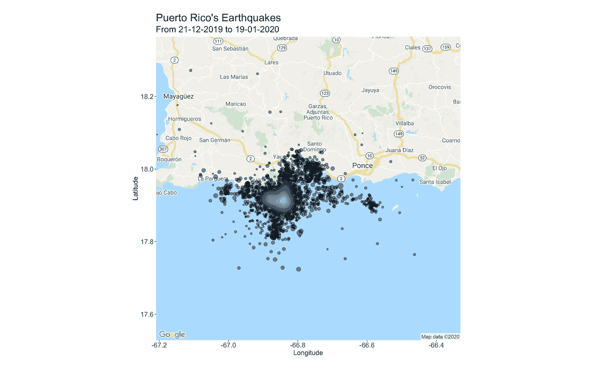
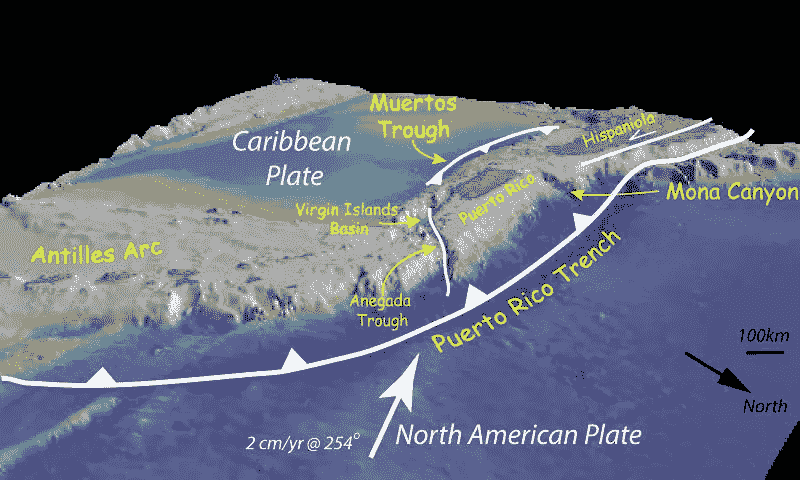
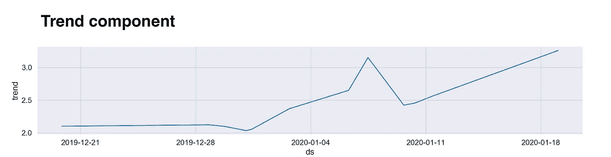
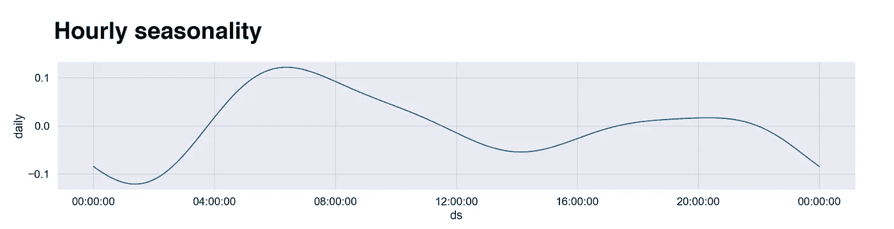
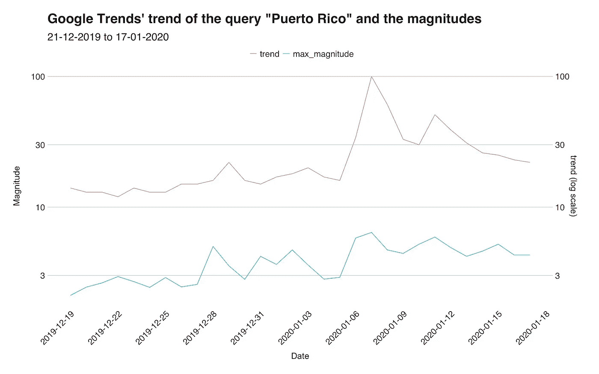

# 用数据解读 2020 年波多黎各地震群

> 原文：<https://towardsdatascience.com/interpreting-the-2020-puerto-rico-earthquakes-with-data-e241cdb2a14e?source=collection_archive---------19----------------------->

## 使用可视化，地图，时间序列和谷歌趋势数据来描述这一事件

波多黎各的圣胡安。照片由 [me](https://www.instagram.com/juandesr/) 拍摄。

自 2019 年 12 月下旬至 2020 年 1 月初，波多黎各岛的西南部地区经历了一系列地震，在波多黎各人中留下了一系列破坏和不确定性。根据美国地质调查局(USGS)的说法，导致这些地震的原因是北美和加勒比板块的汇聚。位于波多黎各北部的北美板块正在与加勒比板块汇合，而在南部，加勒比板块在 Muertos 海槽处隐没在波多黎各之下([来源](https://earthquake.usgs.gov/earthquakes/eventpage/us70006vll/executive))。

在本文中，我们将使用统计、可视化、时间序列分析来探索这些地震的几个属性，此外，查看谷歌搜索“波多黎各”和地震震级之间的相关性。

# 数据

这份报告的数据集由 USGS 报告的 2019 年 12 月 20 日至 2020 年 1 月 19 日半径 50 公里范围内的地震组成。从纬度 19.949 和经度-66.851。它有 2041 条记录，每条记录代表一次单独的地震，有 22 列记录了事件的属性。然而，根据这些特征，我们将只使用坐标、时间和事件的大小。

这是用于获取数据的查询。
https://earthquake.usgs.gov/fdsnws/event/1/query?format=csv&start time = 2019-12-20&end time = 2020-01-19&纬度=17.949 &经度=-66.851 & maxradiuskm=50

在数据集中，我过滤掉那些报告的震级低于 0 的条目(根据 USGS 文档，较低值可以是-1.0)。您可以在本文的代码库中找到数据集的副本。

除了这个主数据集之外，在这个项目中，我还使用了第二个数据集，由 Google Trends 从 2019 年 12 月 19 日到 2020 年 1 月 17 日的查询词“波多黎各”的数据组成。

# 工具

数据分析和大多数可视化都是在 r 中完成的。库 [**ggmap**](https://cran.r-project.org/web/packages/ggmap/ggmap.pdf) 用于生成地震位置的图形，时间序列分析是使用 Python 中的库 [**Prophet**](https://facebook.github.io/prophet/) 完成的。趋势数据来自谷歌趋势。

# 了解地震

在 2019 年 12 月 20 日至 2020 年 1 月 19 日期间，总共报告了 **2041** 起事件，平均每天 **66** 。其中，2019 年 12 月 31 日是最活跃的一天，发生了 220 次**地震，平均震级为 **1.966** 。总体而言，最强烈的地震发生在当地时间 2020 年 1 月 7 日 04:24:26，震级为 **6.40** ，而平均震级为 **2.467** ，标准差为 **0.687** ，中位数为 **2.390** 。下面的直方图显示了震级得分的分布。**

如果不是直方图最右侧的异常值点，这个分布将是一个正常分布，其中大多数值都接近平均值(黑线)。在下面的箱线图中，我们可以更好地看到异常值。

这个箱线图是一个偏右箱线图的例子，在这个例子中，盒子和变量值都在刻度的低端。在这里，我们可以看到第一个四分位数(方框底部)、第三个四分位数(方框顶部)和中间值(粗体线)之间的对称性，中间值代表直方图中的峰值。然后，方框上方是异常点，包括最强的 6.4 级地震。

我想展示的下一个图像是一个散点图，显示了地震发生当天的震级。该图还包括一条平滑线，指出属性的演变。

在图表中，我们可以看到虫群是如何在 2019 年的最后几天开始的。然后，在 1 月 2 日左右，活动稍微停止，直到 1 月 6 日和 7 日，当强大的一个到达时，在前一个是 5.80 小时后。在接下来的日子里，几次强烈的余震袭击了这个岛屿，包括 1 月 11 日的 5.90 级余震。回到图表的开头，你会发现一些震级值在 2 左右的地震。这些对应于波多黎各经常发生的“正常”但微弱的地震(大多数地震一般感觉不到)。

# 地点

正如引言中所述，蜂群出现在波多黎各的西南部地区，靠近 Muertos 海槽。更准确地说，受影响的地区位于纬度(17.8，18.0)和经度(-67.2，-66.6)，该地区包括或靠近瓜尼卡、瓜亚尼亚、庞塞和亚乌科等城镇，这些地方遭受了严重的损失。在接下来的可视化中，我们将看到该地区的地图，其中显示了发生地震的震中位置。

平均地震发生在纬度 17.92564，经度-66.83728。

Muertos 槽，来源:[https://ocean explorer . NOAA . gov/oke anos/explorations/ex 1502/background/geology/welcome . html](https://oceanexplorer.noaa.gov/okeanos/explorations/ex1502/background/geology/welcome.html)

# 趋势和每日季节性

从上面呈现的散点图的平滑线，你可以了解自震群开始以来地震的强度是如何变化的。这条线虽然有用，但并不代表这个变量的最终趋势。

为了阐明这个问题，并更好地了解地震的震级是如何发展的，我使用时间序列工具 Prophet 计算了总体趋势和每日季节性。下面你会发现趋势。

这条线描述了自 2019 年 12 月 19 日以来震级的演变。在那一周，趋势线处于低位，与上面解释的“正常”行为相对应。然后，一旦地震开始，因为有很多低震级的地震，平均值就会下降。然而，紧接着，我们有大地震及其余震，随后又是一次下降。在写这篇文章的时候，地震活动仍然活跃，这解释了为什么这条线一直在增长。

为了澄清任何可能的混淆，我想快速解释一下你在图的 y 轴上看到的数字背后的含义。这些值不是实际的大小。相反，我们可以将它们解释为趋势部分当天的增量效应。例如，在图表的第一天，y 值为 2.0，这意味着这一天对 y 的影响为+2.0。

这一部分的第二张图是每小时的季节性。根据我的知识(如果我错了，请有人纠正我)，地震是不遵循任何模式的**随机**事件。尽管如此，即使知道这一点，我还是想计算一下每小时的季节性，因为我得到的印象是(请注意，我不在波多黎各，所以我的“印象”是指我在新闻和社交媒体上看到的)，大多数地震都发生在夜间。下图显示了数据。

首先映入眼帘的是凌晨 4 点后的全球最大值，也就是大地震发生的时间。然后，就在它之后，曲线下降，直到下午 4 点，然后再次上升(也许这就是为什么我认为它们发生在晚上)，最后一次下降，直到凌晨 1 点左右达到最低位置。

# 谷歌趋势

通常，当像这样的自然事件发生时，相关国家会受到世界的关注。你会在新闻、当地报纸、社交媒体等等中看到提及。为了验证这个想法，我使用 Google Trends 的每日趋势分数作为搜索查询“波多黎各”，并将其与当天的最大震级值相关联。我认为地震越剧烈，关于波多黎各的谷歌搜索就越多。这个假设成立吗？下面你会找到数据。

这个可视化用红色(顶线)表示 Google Trends 的“趋势”值，用蓝色(底线)表示最大值。在 x 轴上，您将找到日期，在 y 轴上，您将找到值。请注意，y 轴使用对数刻度。关于相关性，两条线似乎遵循类似的模式，包括 28 日和 29 日左右的一个小高峰，随后在 1 月 7 日下降和再次上升。为了将这种关联转换并总结为一个数字，我计算了两个变量之间的*皮尔逊相关*，得到了 **0.7186471** 的值，这意味着中高正相关(1 是完全正相关)。所以，从某种意义上说，我的假设是正确的。

然而，尽管联系似乎很好，但我们不能盲目地确认或说这纯粹是由“人们因为地震而谷歌波多黎各”引起的。虽然这看起来确实是正确的，但我们必须记住，这种联系背后可能有其他原因。尽管如此，我个人的观点是这是。

# 概述

目前，波多黎各岛正在经历几十年来最严重的地震群。在本文中，我们使用美国地质调查局获得的数据分析了这些地震的几个属性，以更好地了解这一事件的行为和模式。通过数据，我们发现了事件的几个统计特性，如平均值和异常值，并发现我们的平均震级为 2.467，最活跃的一天是 2019 年 12 月 31 日。然后，我们进行了时间序列分析，以找出总体趋势和每小时的季节性，并发现一些最强烈的地震发生在夜间。最后，我们用谷歌趋势数据计算了最大震级之间的相关性，并确定了这两者之间可能的联系。

想了解更多关于地震的信息，我推荐美国地质勘探局的这份报告。此外，对于显示震级的互动图，请查看波多黎各大学 Humberto Ortiz-Zuazaga 教授创建的这个[网络应用](https://ccom.uprrp.edu/~humberto/temblores/?fbclid=IwAR3xKaIA5IZ6yEUwuUBU9JctgxHbExT7OgDU0bIk5r5_YZRw1HgxELdqVD8)。

感谢阅读。

您可以在下面的资源库中找到这个分析中使用的代码:【https://github.com/juandes/pr-earthquakes-analysis

 [## 胡安·德迪奥斯·桑托斯

### 胡安·德迪奥斯·桑托斯的最新推文(@ jdiossantos)。我喜欢数据，也喜欢写数据。口袋妖怪大师，还有…

twitter.com](https://twitter.com/jdiossantos)