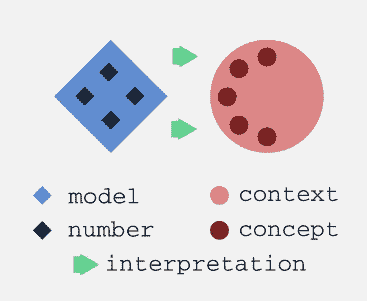
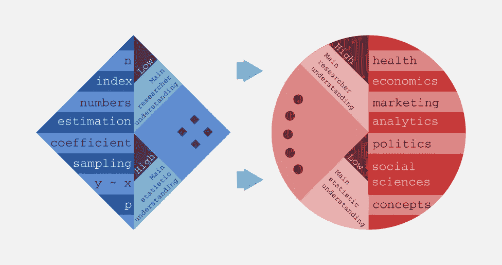

# 解释模型是人类的事，不是计算机的事

> 原文：<https://towardsdatascience.com/interpreting-the-model-is-for-humans-not-for-computers-9a857011ff3?source=collection_archive---------55----------------------->

这是关于翻译，而不是重新措辞。

由[克鲁兹𝒥𝓊𝓁𝒾𝒶𝓃](https://medium.com/u/4877ca64be33?source=post_page-----9a857011ff3--------------------------------) 和[瓦莱里娅丰塞卡迪亚兹](https://medium.com/u/6e363caf1c79?source=post_page-----9a857011ff3--------------------------------)

**纯粹解释批判**

科学方法作为一种工具，帮助我们找到关于事物如何运作和做出决策的解释，也给我们带来了最大的挑战，这种挑战直到 2020 年我们可能仍未克服:给数字提供有用的叙述。又称“解读”。

作为一个澄清的问题，科学方法是寻找证据来证明或否定假说的管道。从自然科学到经济科学，科学和事物如何运作就是一切。但最令人高兴的是，通过证据，不仅我们的意思，但人类理解“数据”。数据不能少于数字。

留有一般性的空间，解释的问题沿着科学方法管道内的统计分析的道路特别有趣。这意味着找到用数学语言编写的模型，并在提供数据的上下文中找到对它们的解释。

解释一个模型有两个重要的含义，这是许多科学家或科学技术人员长期以来忽略的(希望不要忘记)。第一个依赖于这样一个事实，即如果有一个**模型**来解释现在的*，那么在之前一定有一个研究问题*在**环境**中提出来，并提供数据来建立这样一个模型。第二个是，我们需要为我们的模型创建的叙述可以通过在研究问题的背景下表达关于一个数字的想法来做得更多，而不是纯粹在模型内部。毕竟，直到 2020 年，决策是由人类根据这些数字的含义做出的，而不是真正由计算机做出的。最后这句话很重要，因为在 21 世纪，我们可能真的会到达这样一个点，计算机在许多任务中接管我们，它们可能最终会为我们做决定。为此，他们需要在他们的网络中交流这些决定。就在那时，人类的叙述将不算数，因为计算机只理解数字。**

*作为统计学家，我们一直采用这样的做法:*寻找*要解决的问题,*寻找*要回答的问题，并用可用数据解释答案。这种心态让我们在一个无意义的叙述和解释的循环中运行，因为 ***问题没有被发现或寻找*** 。不同现象的所有持续互动和反应都会产生问题。这一事实意味着统计模型和/或其他分析方法是用于核心中心问题的工具，而不是支柱。*

*这种对一些数据进行线性回归拟合并说“当 *x* 增加一个单位时，*β*系数是 *y* 增加的单位数”的丑陋艺术，或者计算平均值并说“这是我们可以找到大多数数据点的值”的艺术，是我们统计学家向科学方法提供的无情产品。*

***泡沫的解释***

*统计学教学让我们清楚地知道，人们可以完全理解模型的工作方式，以及如何训练他们来得到数字。然而，我们仍然没有消化的事实是，在训练模型时产生的所有数字中，大多数对于非统计人员来说只是不可传达的。让我们展示一些沟通不畅的数字:*

*——*p 值*是一个特殊的概念，事实上它本身可能值得写一整篇文章。例如，在社交媒体上，我们经常看到人们询问对 p 值的解释，马上就有一场统计学家给出他们自己的解释的风暴。*

*——这场辩论中的*胜率*明星。在这个领域工作了 10 年之后，我们必须承认，向另一个领域的专家解释如何考虑比值比从来都是不可能的。甚至维基百科也尝试过，在我们看来，不仅仅是失败了。*

**-* 逻辑回归中虚拟变量的*β系数是同类的。我们感觉它们是类别相对于基线类别的比值比。但是，我们如何使它在实践中可以理解和操作呢？这一点我们根本不知道。**

*这个问题是科学和统计界的核心问题。由于缺乏解释，我们训练的模型失去了价值。*

*几年来，我们一直在和同事们讨论这个问题，并寻找一个合适的框架来解决口译的问题，在此之后，我们得出了一个显而易见的结论:口译过程是存在的，而且只能在特定的语境中发生。争取模型内部的解释过程是没有意义的。模型的内部过程都是数字的，这些结果只能由数字统计人员交流和理解。在模型内部对数字做出解释是**换句话说**的泡沫。为了解释模型的结果，使它们成为采取行动的工具，必须牢记数据来源和研究问题提出的背景。*

*我们最喜欢的一个清晰描述解释之争的例子是，当*解释模型*时，当试图解决分类问题时，普遍倾向于逻辑回归而不是神经网络。众所周知，社区说，并发表论文说，当我们需要解释参数时，逻辑回归是好的，如果我们的目的只是预测，神经网络做这项工作。宣称我们更喜欢逻辑回归沉入比值比的湖泊？但这正是想要解释模型中的数字的效果。如果我们的问题包括解决一个分类问题，并且我们想要了解控制变量的影响，那么为这些控制变量设置假设场景并检查结果是或否的决定怎么样呢？我们认为，收入管理公司甚至会为这些假设情景支付比 PowerPoint 幻灯片更多的钱，幻灯片上说*贝塔*是我们二元问题的赔率。同样，巨大的知识可以从医学和生物学中的假设场景中茁壮成长，而*优势比*永远不会带给我们。*

**

*解释的过程*

***泡沫破裂***

*建立使解释成为可能的框架需要精确定义哪些条件涉及到*模型*中，哪些条件涉及到*上下文中。**

*在模型建立阶段，我们使用的知识是数字的、统计的和技术的。我们的核心概念和关注点是关于我们用来建立模型的方法的准确性和稳健性。量、参数、数学公式、算法是这个世界的主要组成部分。因此，主要研究人员不需要完全理解这个过程中的每一个组件，因为大多数组件只是保持大型机器运行所需的组件。*

*另一方面，上下文基本上充满了非统计的技术知识。这个世界的概念被改变了。例如，代表数据的数字被**转换为计量单位的**。我们不把数据作为数学或计算的表示，我们用米、公斤、秒、人、家等来谈论这个数字。对这些概念的理解是首席研究员的主要能力。就像以前一样，技术统计师可能对上下文中的所有概念都没有深刻的理解，但他们理解赋予两个世界意义的问题的大图景是至关重要的。*

*也就是说，解释过程就是将模型中的数字与上下文中的概念联系起来。这关系到泡沫的破灭。*

*如果我们从语言学的角度来考虑这个过程，在语义学中有单义(一个意思)和多义词(多个意思)。还有外延意义(字典的意思)和内涵意义(上下文中的意思)。因此，在语义词中，传统的统计解释过程是关于给一个数字只有一个意义，如统计学教科书中所呈现的那样，这是一种单素的外延方式。我们认为，在不同的语境下赋予一个数字多种含义，即以一种多义的隐含方式，是对非统计人员统计理解的一种提高。*

*让我们来看看其他大大小小的例子。在财务分析中，一项资产收益的标准差被称为*波动率*。术语*波动率*是金融领域的一个概念，这个数字和概念之间的联系在这个领域之外没有任何意义。电影摄影也是如此，电影标点符号的标准偏差被称为*争议*。在质量控制和过程改进方面，*六适马*标准的目标是一百万个产品中有 3.4 个错误。我们发现更多这样的例子，比如经济学中的弹性，市场营销中的满意度，毒理学中的致死剂量等等。正如我们所看到的，这个连接正是一个**翻译**。这种翻译使得以有意义的方式读取数字成为可能。*

*我们甚至不需要将这场辩论缩小到统计和研究界。截至 2020 年，每一个接入互联网的公民都可能在新冠肺炎疫情期间遇到过著名的“曲线”。所有的媒体都在谈论“曲线变平”的目标。嗯，这个“拉平曲线”可能是将模型转换到上下文中最令人愉快的例子。“曲线”正是我们这里所说的“模型”。对此没什么好说的了。这个模型有一个非常具体的数学公式，它将感染病例的数量、有感染风险的病例等联系起来。，随着时间的推移。现在，这个模型中非常具体的数字定义了人口在死亡前承受疾病的能力。不需要花费精力去寻找数字与上下文的联系，因为模型是为这个上下文而创建的。虽然随着更多数据的到来和模型的重新估计，这些数字在负责的统计学家手中发生了变化，但专家们等待着被告知曲线是否变平的那一刻，以便他们向我们传达我们作为公民能做什么和不能做什么。*

*在这场辩论中，我们可以更接近统计界更熟悉的东西:解释 PCA(主成分分析)。这是以多种不同方式处理数据的方法之一。我们使用 PCA 进行可视化、数据清洗、降维等。这也是学术界和工业界无数研究领域中使用的方法之一。然而，我们问，我们在多大程度上真正利用了这种类型的统计工具的潜力？。让我们考虑社会科学中的一个典型案例，其中研究人员有人口统计和社会变量，为了“理解数据和变量之间的关系”，实施了 PCA。请注意，这里已经有一个框架缺陷，因为“理解数据和变量之间的关系”不是一个研究问题或目标。但是好吧。计算完 PCA 数后，我们要做的事情之一是构建一个分数图，表明每个轴保留的方差百分比。那么，这个方差百分比是什么意思呢？如果说第一个分量保留了数据中 30%的可变性，我们真正得到了什么？实际上没什么。然而，想象我们的变量是*薪水*和*爱好数量*，研究者假设了一个*快乐*潜在特质。告诉研究人员这些变量的多少信息同时解释了假设的特征怎么样？那将是 30%,所以有 70%的*工资*和*爱好数量*说明了一些其他潜在的特质。除此之外，大多数双标图、特征值等在这种情况下可能意义不大。*

**

*从计算机语言到人类叙事*

***突发后的重建***

*我们对这一框架的考察使我们得出了一些我们认为是正确的说法。*

***第一个**。不是每个数字都有从模型到上下文的翻译，因为不一定存在一个概念来连接每个数字。例如，这发生在神经网络中，其输出具有容易的解释，但是大多数情况下内层权重没有直接的解释。*

***第二个**。数字和概念之间的联系并不总是很明显。有些数字能比其他数字更直接地找到它们的概念。在经济学中， *GDP* (特定时期内生产的所有最终商品和服务的市场价值)的概念，根据定义，与一个数字相关联。因此，当从模型(即抽样和估计)计算数字时，这种联系是瞬时的、明显的和尖锐的。另一方面，同样在经济学中，*不平等*(人口群体之间经济福祉的差异)的概念是一个完全抽象的概念。这里，它在模型中作为 GINI 系数(即洛伦兹曲线上方的区域)的表现并不明显。在第一个例子中，这个概念是一个有单位的数，这个数是对它的估计。在第二个例子中，概念是一个抽象的概念，数字是两条曲线之间的区域。*

***第三个**。解释的目标是了解问题背景的人和将模型作为解决方案的人之间的交流，这种想法也不是很明显。这最后一句话非常有力。最初，你可以认为这个想法没有改变什么，但它确实改变了。解释是不同世界之间的交流行为，这一概念以前从未被最深刻地使用过。我们必须承认，传统的解释范围在于重新表述模型中的数字，用统计术语、数学公式和毫不留情的交流来谈论这些数字。*

***现在发生了什么***

*我们承认这种解释方法具有挑战性，但我们希望明确可以采取的行动。*

*在统计模型作为工具的一些研究领域，定义和构建解释框架是一个基本步骤。发现不同领域中最常用模型的意义不仅可以为非统计研究人员和用户提供更好的可用性，增强他们的分析体验，而且还可以建立和传播更好的统计文化。*

*为开发这一框架进行研究，以便对模型进行良好的解释实践，这是新兴的培训。一些语义学概念的引入使我们认为有大量的理论有待发展。统计解释是一个语言科学尚未涉及的交流过程。*

*在学院内外传播消息。讲座，研讨会，会议等需要在统计学院举行。我们需要创造一个环境来提出这个讨论和它的含义。统计学和语言学的学生都必须参与进来，以形成一种准确的统计学交流方法。*