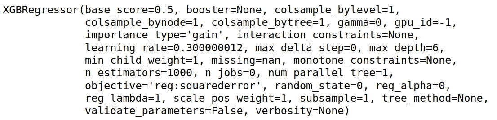

# SVM 和 XGBoost 模型分析

> 原文：<https://towardsdatascience.com/interpretml-analysis-of-svm-and-xgboost-models-e68062f7299f?source=collection_archive---------46----------------------->

## 使用微软的 MimicExplainer 进行回归建模


来源:图片由 [geralt](https://pixabay.com/users/geralt-9301/) 从 [Pixabay](https://pixabay.com/illustrations/network-earth-block-chain-globe-3537401/) 拍摄

[微软的 InterpretML](https://github.com/interpretml/interpret) 旨在扩展机器学习模型的**可解释性**。换句话说，让那些模型更容易理解，最终便于人类解释。

微软的 [Interpret-Community](https://github.com/interpretml/interpret-community) 是这个知识库的扩展，它包含了额外的可解释性技术。

特别是，一个有用的特性是所谓的 **MimicExplainer。**这是一种[全局代理模型](https://christophm.github.io/interpretable-ml-book/global.html)，允许任何黑盒模型的可解释性。

# 背景

在本例中，MimicExplainer 用于解释使用 SVM(支持向量机)和 XGBRegressor (XGBoost 用于回归问题)构建的回归模型。

具体来说，这两个模型的用法如下:

1.  SVM 用于预测使用特定特征的客户的**平均日费率**，例如他们的原产国、细分市场等。[原始调查结果见此处。](/support-vector-machines-and-regression-analysis-ad5d94ac857f?source=---------23----------------------------)
2.  XGBRegressor 用作时间序列回归模型，通过将滞后序列与实际序列进行回归来预测每周取消的数量，即序列滞后高达 t-5 的 5 个滞后序列用作模型中的特征，以预测时间 **t** 的取消值。原始发现可在此获得。

原始数据来自 [Antonio、Almeida 和 Nunes (2019):酒店预订需求数据集](https://www.sciencedirect.com/science/article/pii/S2352340918315191)。

为了演示 MimicExplainer 如何工作，我们展示了原始模型和结果，并提供了关于 MimicExplainer 如何使这些结果更具可解释性的更多信息。

# SVM

为了预测酒店预订的平均每日价格(或客户平均每日支付的价格)，构建了一个具有以下特征的 SVM 模型:

*   取消(无论客户是否取消预订)
*   原产国
*   细分市场
*   存款类型
*   客户类型
*   所需的停车位
*   抵达周

该模型被训练如下:

```
>>> from sklearn.svm import LinearSVR
>>> svm_reg = LinearSVR(epsilon=1.5)
>>> svm_reg.fit(X_train, y_train)LinearSVR(C=1.0, dual=True, epsilon=1.5, fit_intercept=True,
intercept_scaling=1.0, loss='epsilon_insensitive', max_iter=1000, random_state=None, tol=0.0001, verbose=0)>>> predictions = svm_reg.predict(X_val)
>>> predictionsarray([100.75090575, 109.08222631,  79.81544167, ...,  94.50700112,
        55.65495607,  65.5248653 ])
```

当根据测试集验证该模型时，获得了 44.6 的 RMSE(均方根误差)，以及 29.5 的 MAE(平均绝对误差)。平均 ADR 为 105，该模型在估计客户 ADR 值时显示了一定程度的预测能力。

下面是我们如何使用 MimicExplainer 来进一步解释这些结果。

```
from interpret.ext.blackbox import MimicExplainerfrom interpret.ext.glassbox import LinearExplainableModelexplainer = MimicExplainer(svm_reg, 
                           X_train, 
                           LinearExplainableModel)
```

MimicExplainer 是黑盒模型，而 LinearExplainableModel 被用作这个黑盒模型的全局代理。

请注意，在运行模型时，如果处理高维数据，即列数超过行数的情况，可以设置 **augment_data = True** 。这允许对初始化样本进行过采样。

但是，假设情况并非如此，即数据集的行数比列数(要素)多得多，则不会调用此功能。

接下来，打印出一个全局解释，其中包括前 K 个特性及其重要性值:

```
global_explanation = explainer.explain_global(X_val)sorted_global_importance_values = global_explanation.get_ranked_global_values()sorted_global_importance_names = global_explanation.get_ranked_global_names()
dict(zip(sorted_global_importance_names, sorted_global_importance_values))global_explanation.get_feature_importance_dict()
```

以下是输出:

```
{3: 8.81513709127725,
 7: 4.9616362270740995,
 1: 4.959263897550327,
 6: 2.593931464493208,
 2: 0.9707145503848649,
 5: 0.8455564214901589,
 4: 0.505321879369921,
 0: 0.0}
```

从上面可以看出，特征号 **3** (细分市场) **7** (抵达周)和 **1** (预订取消)是影响客户 ADR 的最重要特征。

也就是说，如果我们希望在验证数据中分离出某些观察结果呢？例如，假设我们只想确定选定的几个客户的特征重要性？

这里有一个例子。

根据验证集，为订购 10 到 15 的客户确定重要特性及其值。

```
local_explanation = explainer.explain_local(X_val[10:15])sorted_local_importance_names = local_explanation.get_ranked_local_names()sorted_local_importance_values = local_explanation.get_ranked_local_values()
```

以下是已确定的重要特性及其价值:

```
>>> sorted_local_importance_names[[1, 3, 2, 6,  5, 4, 0, 7], [7, 3, 2, 6, 5, 4, 1, 0], [6, 5, 4, 1, 0, 2, 7, 3], [6, 3,  5, 4, 1, 0, 2, 7], [3, 7, 6, 5, 4, 1, 0, 2]]>>> sorted_local_importance_values[[17.833762274315003,  9.1394041860457, 1.1694515257954607, 0.0, -0.0, -0.0, 0.0,  -1.707920714865971], [9.955928069584559, 9.1394041860457,  1.1694515257954607, 0.0, -0.0, -0.0, 0.0, 0.0], [0.0, -0.0, -0.0, 0.0,  0.0, -0.5708037209239748, -11.288939359236048, -13.709106279068548],  [19.017733248096473, 9.1394041860457, -0.0, -0.0, 0.0, 0.0,  -0.7448292455959183, -5.040448938994693], [9.1394041860457,  6.623399845455836, 0.0, -0.0, -0.0, 0.0, 0.0, -0.9884649801366393]]
```

这允许客户隔离特性的重要性。例如，功能 1(预订取消)是对客户 10 影响最大的因素，而功能 7(抵达周)是对客户 11 影响最大的因素。

# XGBRegressor

如上所述，最初使用 XGBRegressor 模型是为了预测有问题的酒店的每周取消数量。

该模型定义如下:

```
from xgboost import XGBRegressormodel = XGBRegressor(objective='reg:squarederror', n_estimators=1000)
model.fit(X_train, Y_train)
```

以下是定义的模型参数:



来源:Jupyter 笔记本输出

从上面我们可以看到，在训练 XGBRegressor 时，有许多模型参数可以修改。但是，在这种情况下，n_estimators 被设置为 1000。这定义了 XGBoost 模型中树的数量。目标设置为[‘reg:squarederror’](https://xgboost.readthedocs.io/en/latest/parameter.html)，即平方损失回归，对极值误差的惩罚更重。

验证集的 RMSE 为 50.14，平均相对误差为 38.63，低于验证集的平均值 109。

使用 MimicExplainer，模型结果的可解释性现在可以以与上一个示例类似的方式生成:

```
from interpret.ext.blackbox import MimicExplainerfrom interpret.ext.glassbox import LinearExplainableModelexplainer = MimicExplainer(model, 
                           X_train, 
                           LinearExplainableModel)
```

为此，我们可以确定在时间 **t** 确定每周酒店取消价值时最重要的特征。然而，假设这是一个时间序列，该模型有效地指示了哪个滞后值在预测特定周的取消时最具信息性，例如，在影响时间 **t** 的取消时，最重要的是 1 周滞后还是 3 周滞后？

```
global_explanation = explainer.explain_global(X_val)sorted_global_importance_values = global_explanation.get_ranked_global_values()sorted_global_importance_names = global_explanation.get_ranked_global_names()dict(zip(sorted_global_importance_names, sorted_global_importance_values))global_explanation.get_feature_importance_dict()
```

结果如下:

```
{3: 10.580821439553645,
 2: 7.795196757642633,
 1: 4.973377270096975,
 4: 2.329894438847138,
 0: 1.382442979985477}
```

从上面可以看出，当预测时间 **t** 的每周酒店取消时，特征 3 (t-4)的滞后是最重要的。

但是，如果我们希望隔离某些周，该怎么办呢？

采用验证集，让我们将观察值 **8** 到 **13** 中的周分离出来(对应于 2017 年，第 13 到 18 周)。

```
local_explanation = explainer.explain_local(X_val[8:13])sorted_local_importance_names = local_explanation.get_ranked_local_names()sorted_local_importance_values = local_explanation.get_ranked_local_values()
```

以下是研究结果:

```
>>> sorted_local_importance_names
[[4, 0, 2, 1, 3], [3, 4, 1, 0, 2], [3, 4, 1, 2, 0], [3, 2, 0, 4, 1], [2, 3, 4, 0, 1]]>>> sorted_local_importance_values
[[1.2079747395122986, 0.655418467841234, -2.068988871651338,  -5.677678197831921, -16.414222669030814], [5.880283637250306,  1.524120206263528, 1.157876862894971, -1.807324914948728,  -11.282397723111108], [7.472748373413244, 7.056665874410039,  6.562734352772048, 3.8926286204696896, 0.353858053622055],  [35.340881256264645, 4.976559073582604, 2.0627004008640695,  1.1289383728244913, -2.3393838658490202], [23.945342003058602,  5.4821674532095725, 1.287011106200106, -0.7518634651816014,  -2.975249452893382]]
```

以这种方式识别跨时间序列的重要性特征可以潜在地产生关于滞后值在预测跨不同周的取消中的重要性的有用见解。例如，我们可以看到，在预测第 13 周的取消时，t-5 的滞后(特征 4)被确定为最重要的特征。

然而，当预测第 18 周的取消时，t-3 的滞后(特征 2)被认为是最重要的。

与使用一刀切的预测模型相反，可解释性可以为特定时间点确定合适的预测方法，反过来又允许在不同时期定制时间序列预测方法。

# 结论

在这个例子中，我们看到了可解释性如何在分析机器学习输出时产生有价值的见解——当简单地使用黑盒 ML 模型时，这将更加困难。

具体来说，我们已经看到:

*   如何将 MimicExplainer 用作全局代理模型，以允许任何黑盒模型的可解释性
*   在回归问题中使用 MimicExplainer
*   如何解释 MimicExplainer 的结果并衡量特征重要性

非常感谢您的宝贵时间，非常感谢您的任何问题或反馈。以上例子的相关 Jupyter 笔记本可以在[这里](https://github.com/MGCodesandStats/hotel-cancellations/tree/master/notebooks%20and%20datasets/regression)找到。

*免责声明:本文是在“原样”的基础上编写的，没有担保。本文旨在提供数据科学概念的概述，不应被解释为任何形式的专业建议。调查结果是作者的，与上述任何第三方无关。*