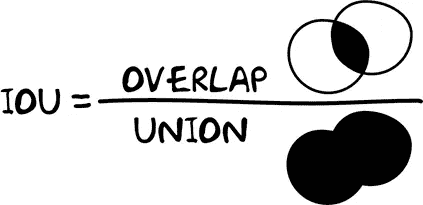
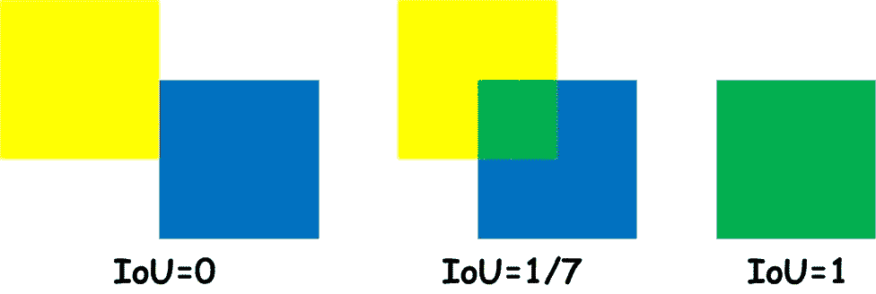
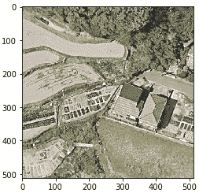
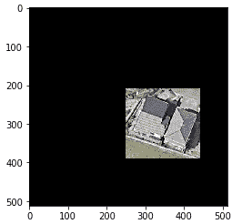
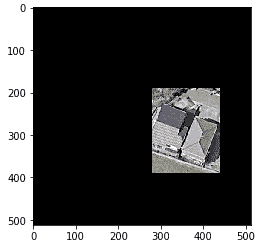

# 用于评估图像分割模型的交集(IoU)计算

> 原文：<https://towardsdatascience.com/intersection-over-union-iou-calculation-for-evaluating-an-image-segmentation-model-8b22e2e84686?source=collection_archive---------6----------------------->

## 一个计算 IoU 度量的实际例子，它允许我们评估一个预测的边界框与地面真实框有多相似

在最简单的情况下，分割是将数字图像分成几个片段的过程。使用[遮罩 R-CNN](https://github.com/matterport/Mask_RCNN) 进行实例分割的结果是应用于所需对象的遮罩和围绕该对象的边界框。

在我解决的一个实际任务中，有必要确定谷歌地球照片中的建筑物。这项任务成功地完成了使用掩模 R-CNN 的实例分割。在训练模型之后，有必要评估它的质量以预测建筑物周围的包围盒。我想让读者熟悉我用来评估预测边界框坐标的质量的方法(用代码)。

[并集上的交集](https://www.pyimagesearch.com/2016/11/07/intersection-over-union-iou-for-object-detection/) (IoU)被认为是测量两个边界框或遮罩之间重叠的良好度量。



图片由 Oleksii Sheremet 用[微软 Visio](https://www.microsoft.com/uk-ua/microsoft-365/visio/flowchart-software) 创建

如果预测完全正确，IoU = 1。IoU 越低，预测结果越差。



图片由 Oleksii Sheremet 使用 [Microsoft Visio](https://www.microsoft.com/uk-ua/microsoft-365/visio/flowchart-software) 创建

所有代码都是在 Google Colab 中实现的。让我们仔细看看。导入库并加载源图像:

```
import cv2import numpyimport matplotlib.pyplot as pltimg = cv2.imread(“./some_image.jpg”)plt.imshow(cv2.cvtColor(img, cv2.COLOR_BGR2RGB))
```



图像由 Oleksii Sheremet 使用 [matplotlib](https://matplotlib.org/) 模块创建

导入库并加载源图像:

```
# An example of first bounding boxfirst_bb_points = [[250, 210], [440, 210], [440, 390], [250, 390]]stencil = numpy.zeros(img.shape).astype(img.dtype)contours = [numpy.array(first_bb_points)]color = [255, 255, 255]cv2.fillPoly(stencil, contours, color)result1 = cv2.bitwise_and(img, stencil)result1 = cv2.cvtColor(result1, cv2.COLOR_BGR2RGB)plt.imshow(result1)
```

让我们设置原始边界框的坐标，并用黑色填充边界框外照片的全部内容:



图像由 Oleksii Sheremet 使用 [matplotlib](https://matplotlib.org/) 模块创建

作为预测的结果，获得第二边界框的坐标:

```
# An example of second bounding boxsecond_bb_points = [[280, 190], [438, 190], [438, 390], [280, 390]]stencil = numpy.zeros(img.shape).astype(img.dtype)contours = [numpy.array(second_bb_points)]color = [255, 255, 255]cv2.fillPoly(stencil, contours, color)result2 = cv2.bitwise_and(img, stencil)result2 = cv2.cvtColor(result2, cv2.COLOR_BGR2RGB)plt.imshow(result2)
```

像上一个例子一样，用黑色填充边界框外的所有内容:



图像由 Oleksii Sheremet 使用 [matplotlib](https://matplotlib.org/) 模块创建

通过在边界框外用黑色填充图像，感兴趣区域外的像素不会影响 IoU 计算:

```
# IoU calculationintersection = numpy.logical_and(result1, result2)union = numpy.logical_or(result1, result2)iou_score = numpy.sum(intersection) / numpy.sum(union)print(‘IoU is %s’ % iou_score)
```

因此，我们得到以下结果:

```
IoU is 0.7625239952938262
```

**结论**

所提出的方法在实践中运行良好。可以定义图像区域之间的重叠，不一定是矩形的。例如，您可以使用 [OpenCV](https://opencv.org/) 计算被遮罩对象周围轮廓的坐标。然后，利用这些点和上述方法，可以计算两个掩膜之间的 IoU。

**参考文献**

*   [屏蔽 R-CNN 进行目标检测和分割](https://github.com/matterport/Mask_RCNN)
*   [打开计算机视觉库](https://opencv.org/)
*   [用于对象检测的并集交集(IoU)](https://www.pyimagesearch.com/2016/11/07/intersection-over-union-iou-for-object-detection/)