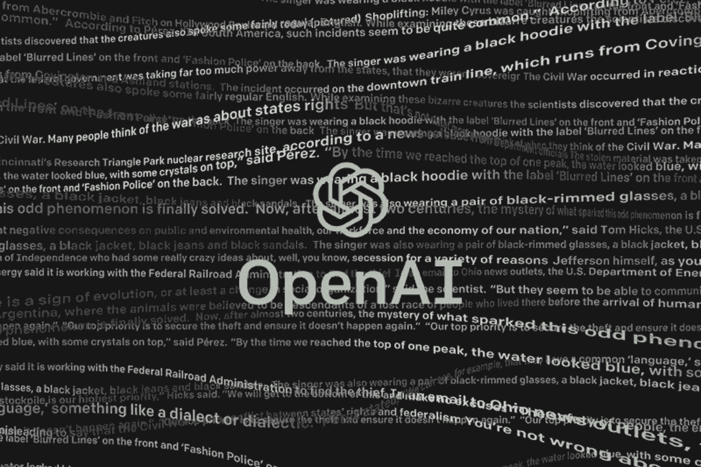

# OpenAI 采访 1.5 亿 GPT-2 模型

> 原文：<https://towardsdatascience.com/interviewing-the-1-5b-gpt-2-model-by-openai-b7f30fbbb8a6?source=collection_archive---------20----------------------->

## GPT 新协议对数据科学有什么看法？

[https://medium . com/synced review/open ai-releases-1-50 亿-parameter-GPT-2-model-c 34 e 97 da 56 c 0](https://medium.com/syncedreview/openai-releases-1-5-billion-parameter-gpt-2-model-c34e97da56c0)

# 人类书写的内容

使用 1558MB 版本的 [OpenAI 的 GPT-2 模型](https://openai.com/blog/better-language-models/)(最大版本)和 Max Woolf 在 github 上的 [gpt2-simple package](https://github.com/minimaxir/gpt-2-simple) ，由 Google colaboratory 提供支持，我生成了以下文本，其中包含数据科学方面的提示。这个项目的 github repo 位于[这里](https://github.com/charlesxjyang/Medium-GPT2)。所有用**粗体**表示的文字都是人类书写的。向下滚动，查看关于这项技术含义的元分析，以及更多关于我如何创建这项技术的内容。

# GPT 新协议生成的内容

**数据科学是**一套对大型数据集进行复杂多维分析的技术。数据科学是一个广阔的领域，包括从数学和统计学到计算机科学和机器学习的各种学科。

在不久的将来，人工智能将会变得非常强大，它将能够在几乎任何任务上超越人类，这将对社会产生深远的影响。但是影响不会好。这将意味着人类对自己生活的控制越来越少。

**机器学习是**训练计算机理解和预测数据的过程。流行的 Python 编程语言的最新版本现在包括一个可用于训练神经网络的库。该技术可用于训练神经网络，根据输入数据预测一个人的性别。

学习如何编码是学习写软件的一个很好的方法。然而，有很多人不会编码，或者不擅长编码。我认为人们不学习如何编码的最大原因是他们认为他们不会。我听到很多人说，他们不认为他们可以学习编码，因为他们没有计算机科学学位。这只是一个巨大的误解。

**神经网络能够**从它们的经验中学习，并从中归纳，以改进它们之前的行为。然而，神经网络的问题是，它们不太适合需要持续学习的任务。问题是，神经网络无法从它们的经验中学习，并从中归纳以改进它们以前的行为。这是因为神经网络不能够记住过去。

**谷歌**的安卓软件，驱动着全球超过三分之一的智能手机，也是这个星球上最受欢迎的操作系统，在全球拥有超过 7 亿用户。该报告发现，全球大多数 Android 用户都是通过智能手机访问该软件的，其中 80%的用户是通过智能手机访问该软件的。在欧洲，Android 是最受欢迎的操作系统，超过三分之一的欧洲智能手机用户通过智能手机访问该软件。

OpenAI 最初的目标是开发一种通用的人工智能，可以解决自动驾驶汽车、机器人和医疗保健领域的问题。该公司的目标已经演变成一个更普遍的目标:让人们更容易构建人工智能系统。

谷歌旗下 DeepMind 人工智能项目背后的公司 OpenAI 发布了一份白皮书，概述了其对人工智能未来的愿景。这篇题为“人工智能未来的初级读本”的论文由蒙特利尔大学教授 Yann LeCun 和该公司人工智能实验室的研究员 Shane Legg 共同撰写。

**深度学习** (ML)是机器学习极其重要的工具。它是算法背后的技术，允许我们识别和理解图像、视频和文本。这个世界充满了数据，这些数据以一种易于识别模式的方式进行组织。该数据可以是任意大小。最常见的例子是文本，一个句子可能是这样构成的:“我看见一条蛇”

# 人类书写的内容

**生成文本分析和模型训练**

1558MB 版本的 GPT-2 能够为各种提示生成连贯的文本。有趣的是，它能够相当准确地描述神经网络、深度学习、机器学习和数据科学。然而，这些语言模型仍然缺乏世界的内在模型。例如，它生成(ML)作为深度学习的不正确缩写；它认为 OpenAI 创立了 DeepMind，尽管也称其为“谷歌所有”；目前还没有题为“人工智能未来入门”的论文，Yann Lecun 是 NYU 大学的教授，不是蒙特利尔大学的教授。显然，GPT-2 能够学习短语之间的频繁配对，但实际上并没有一个清晰的世界关系模型。

通过人工审查来检测合成生成的文本是非常耗时的。拥抱脸，一个 NLP 研究初创公司，已经开源了一个 [GPT-2 输出检测器](https://huggingface.co/openai-detector/)，它在上面生成的文本上表现非常好，以超过 99%的置信度将上面生成的文本分类为“假”GPT-2 生成的文本。有趣的是，即使有人对文本进行轻微的修饰，检测器也相当不错，这表明这种检测器甚至可以检测出“编辑过的”虚假文本。这种“深度造假检测器”的开发为抵御虚假书面文献的潜在泛滥提供了一个小小的壁垒，尽管人们可以想象已经有研究人员在开发更难以检测的生成模型。

当我第一次着手这个项目时，我实际上试图首先在一个具有数据科学相关标签的中型文章数据集上微调 355MB GPT-2 模型，但事实证明，微调后的 355MB 模型实际上比未微调的 1558MB 模型表现更差(你可以在这里找到我的 github repo)。这可能是由于对更大模型的更好的语言理解以及它合成长期连贯文本的能力。不幸的是，由于 RAM 的限制，在单个 GPU 上微调 1558MB 的模型是不可行的，尽管一些有趣的未来工作可以微调大型模型的蒸馏版本，这些模型可以适合单个 GPU[ [arxiv](https://arxiv.org/pdf/1910.01108.pdf) ， [medium post](https://medium.com/huggingface/distilbert-8cf3380435b5) ， [github](https://github.com/huggingface/transformers/tree/master/examples/distillation) ]。令人惊讶的是，1558MB 版本仍然相当“了解”数据科学和机器学习，没有对特定领域的数据集进行微调。

**含义**

[Max Woolf 的 gpt2-simple github 包](https://github.com/minimaxir/gpt-2-simple)允许用户旋转单个谷歌合作实验室笔记本，加载各种大小的 GPT-2 模型，在谷歌合作实验室提供的免费 GPU 上对其进行微调，并生成合成文本段落，只需几行简短的代码。这种高级软件的存在和任何用户都可以轻松使用的事实是由于深度学习中两个强大趋势的融合:轻松、廉价地访问专门的硬件和高级抽象编程范式。

谷歌联合实验室为谷歌联合实验室笔记本的任何实例提供免费的 NVIDIA T40 或 K80 GPU。谷歌这样做的财务动机是鼓励用户采用自己专有的谷歌合作笔记本，而不是开源软件 jupyter notebook。由于云计算的可扩展性(以及谷歌的雄厚财力)，提供如此多硬件的低成本是可能的。因此，任何有互联网连接的人现在都可以使用基于服务器的高端 GPU，并通过谷歌联合实验室获得相当大的计算能力。这种免费提供的计算机使任何个人都能够训练和利用非常大和强大的深度学习模型。

除了廉价计算，深度学习创新的另一个核心驱动因素是引入高级编程范式和用于创建深度学习模型的包。例如， [keras](https://keras.io/) 是一个高级包，它是用于较低级别的神经网络实现包(如 Tensorflow 和 Pytorch)的 API。使用 keras，任何人都可以轻松地用几行代码创建简单的神经网络。这种软件降低了任何人使用这种工具的门槛，有助于加速研究和创新。类似地，gpt2-simple 通过使用标准化的 NLP 微调过程抽象掉了所有的模型训练，并为生成文本提供了良好的包装函数。

这两种趋势的融合，以及最近 NLP 架构和性能的惊人改进，现在允许任何人合成类似人类的文本。OpenAI[ [1](https://openai.com/blog/gpt-2-1-5b-release/) 、 [2](https://openai.com/blog/better-language-models/) 、 [3](https://openai.com/blog/gpt-2-6-month-follow-up/) 已经讨论了这种模型架构的含义。

人们可以很容易地想象，像 GPT-2 这样的文本生成模型有一天将能够编写关于数据科学、编程、机器学习等的全媒体文章。到那时，我们将不得不面对一些棘手的问题。比如谁有署名权？实现和运行代码的程序员？创建模型的作者是谁？微调语料库中文本的集体作者？

随着诸如 GPT-2 这样的现实文本生成模型变得越来越普遍(特别是随着高级软件实现的进展)，我们将会看到越来越多的在特定领域数据集上训练的微调 NLP 模型的例子。尽管较大的、未微调的 1558MB GPT-2 版本比较小的、微调的 355MB GPT-2 版本性能更好，但人们可以想象具有更具体的文本的域，并且不同于 GPT-2 在其上训练的大型语料库，例如[化学科学文摘](https://www.nature.com/articles/s41586-019-1335-8)

**我的外卖**

对我来说，我在寒假期间开始了这个项目，以了解更多关于被称为 NLP 年的这些令人兴奋的突破，以及熟悉 NLP 模型的软件环境，最著名的是拥抱脸的[变形金刚](https://github.com/huggingface/transformers)包。我有一些在我创建的文本语料库上微调 GPT-2 的实践经验，在单个 GPU 上处理 RAM 问题，并探索知识提炼方法。如果你想自己尝试一下，可以看看[我的回购](https://github.com/charlesxjyang/Medium-GPT2)或者[马克斯·伍尔夫的伟大的入门博客](https://minimaxir.com/2019/09/howto-gpt2/)。一如既往，负责任地使用和分享。

*我最近开始了一个关于机器学习和人工智能在科学领域和工程问题中的应用的免费通讯(ml4sci)。你可以在 ml4sci.substack.com 的***上找到。请随意发表建议的文章或主题，如果你真的喜欢你所看到的，请订阅！**