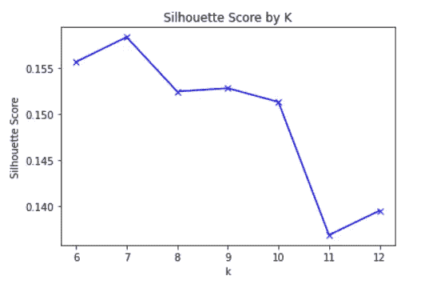
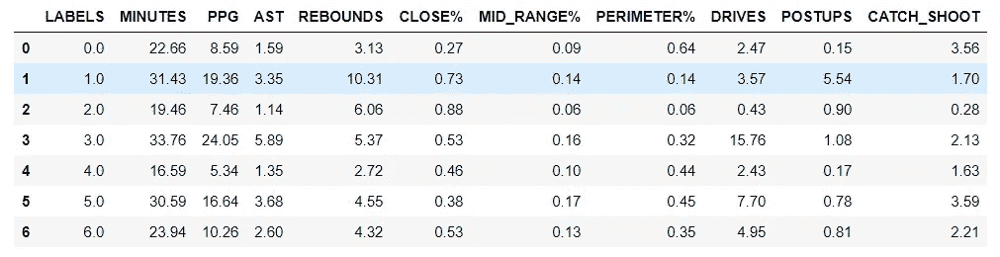
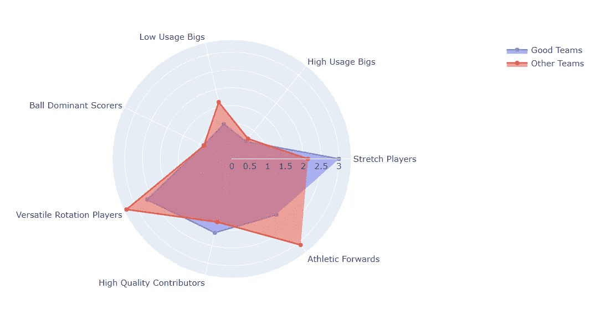

# 一种使用数据分析法对 NBA 球员进行分类的新方法

> 原文：<https://towardsdatascience.com/into-a-new-way-to-classify-nba-players-using-analytics-44e292526e47?source=collection_archive---------42----------------------->

## 因为 5 个传统职位已经不够了


来源:[https://unsplash.com/photos/UegcSdRtmlg](https://unsplash.com/photos/UegcSdRtmlg)

大约 5 个月前，我在网上偶然发现了[这篇](https://www.thescore.com/nba/news/1974726)的文章。总结:传统的 5 个位置已经不足以描述 NBA 球员了。游戏毕竟变了。作者提出了一种方法，根据玩家玩游戏的方式将他们分为 9 类。

在这篇文章中，我将根据球员在球场上的表现，对他们进行分类。但是，我将使用数据科学，更准确地说是 K-Means 聚类来做这件事。

我还将深入探讨是什么造就了一支胜利的球队，也就是说，什么类型的球员应该被组合在一起才能成为一支成功的球队。

我们开始吧！

## 准备数据

我从直接从 NBA.com 获取数据开始。总之，我收集了 2019-2020 年联盟中所有 529 名球员的 28 项统计数据。

以及传统的统计数据(场均得分、助攻、篮板等。)，我还收集了描述投篮位置，进攻类型(驱动，iso 等)的统计数据。)防守效率和使用率。

然后，我决定淘汰每场比赛上场时间少于 12 分钟的球员，因为我觉得根据他们几乎不上场时的表现来对球员进行分类不会提供准确的结果。

```
**#Remove players with at less than 12min per game** df=df[df.MINUTES > 12]
df = df.reset_index(drop=True)
```

我们总共有 412 名玩家。

## **特征创建**

我决定创造 3 个新的变量，描述一个球员的投篮命中率来自于球场的哪个位置(内线、中距离或三分线)。

```
**#Get total FG attempts** shot_attempts=df.filter(regex='FGA').sum(axis=1)**#Get new variables** df['CLOSE']=df['PAINT_FGA']/shot_attempts
df['MID_RANGE']=df['MR_FGA']/shot_attempts
df['PERIMETER']=shots_perimeter/shot_attempts
```

这里是最终使用的数据帧的快照，总共包含 31 列和 412 行。

```
df.head()
```


## 玩家聚类

让我们从缩放数据开始。缩放意味着在不改变分布的情况下改变值的范围。这很有用，因为当要素处于相同比例时，机器学习算法会工作得更好。

以下是如何缩放数据。

```
data = df.iloc[:,5:34]
scaled_data = StandardScaler().fit_transform(data)
```

然后，是时候找出最佳的聚类数了。为了做到这一点，我将使用轮廓得分，这是可用的使用`scikit-learn`。

轮廓分数是一种度量聚类质量的指标。它的范围在 1 到-1 之间，分数为 1 意味着集群彼此相距很远，并且明显不同(这正是我们想要的)。

简而言之，我们想要最高的侧影分数。

以下循环计算 6 到 12 之间每个 k 的轮廓分数。我在 6 点开始循环，因为在 5 点，它基本上按位置分类球员。

```
**#Find best number of clusters** sil = []
kmax = 12
my_range=range(5,kmax+1)for i in my_range:
    kmeans = KMeans(n_clusters = i).fit(scaled_data)
    labels = kmeans.labels_
    sil.append(silhouette_score(scaled_data, labels, metric =  
    'correlation'))
```

这是分数图。

```
**#Plot it** plt.plot(my_range, sil, 'bx-')
plt.xlabel('k')
plt.ylabel('Silhouette Score')
plt.title('Silhouette Score by K')
plt.show()
```



作者图片

我们看到，我们应该使用总共 7 个集群来根据 NBA 球员打球的方式对他们进行分类。

让我们看看那些集群。



看到这里，我想到了下面的集群名称。

*   **拉伸选手**。优秀的球员，主要是为了拓展球场。高效的三分射手。像丹尼·格伦、豪斯、雷迪克这样的球员。
*   **高使用率 bigs** 。大个子球员，伟大的篮板手，从低位得分。像武切维奇，约基奇，恩比德这样的球员。
*   **使用率低的 Bigs** 。通常大中心通常不会开始。没有真正参与进攻。像祖巴克，比永博，麦基这样的球员。
*   **球优势得分手**。投篮次数多的球员可以从任何地方得分。优秀的组织者和控球者。主要明星。像哈登、米切尔、勒布朗(又名山羊)这样的球员。
*   **全能轮换球员**。高效但使用率低的播放器，通常较小。像卡鲁索，德拉维多瓦，康诺顿这样的球员。
*   **优质投稿人**。优秀的球员，二级控球手。典型的三分射手，全能球员。像托拜厄斯·哈里斯，米德尔顿，布莱索这样的人。
*   **竞技前锋**。喜欢突破或者低位进攻的球员，不是优秀的射手。像阿隆·戈登、德里克·琼斯、贾巴里·帕克这样的球员。

## 那么好的团队是由什么组成的呢？

记住所有这些，看看今年好的队伍是如何组成的会很有趣。

对于这个练习，我认为好的球队是今年季后赛的最后 8 支球队。下面的代码使用 Plotly 将团队分开并创建一个雷达图。



作者图片

这张雷达图显示了一些有趣的事情。首先，我们看到糟糕的球队在“运动前锋”群体中有更多的球员(每队 3.1 比 1.9)。这种类型的球员似乎不能帮助创造一个竞争者。

好的球队也倾向于有更多的 strech 球员(每队 3 对 2.1)。这并不奇怪。拥有属于“球优势得分手”群体的球员是等式的一部分(这显然非常重要)。在他们周围安排优秀的射手来扩展防守也是至关重要的。

## 结论

在 NBA 赢的方法不止一种。然而，在你的明星球员周围放置合适的棋子是至关重要的一部分。希望这篇文章能让你对此有所了解。

非常感谢你的阅读！