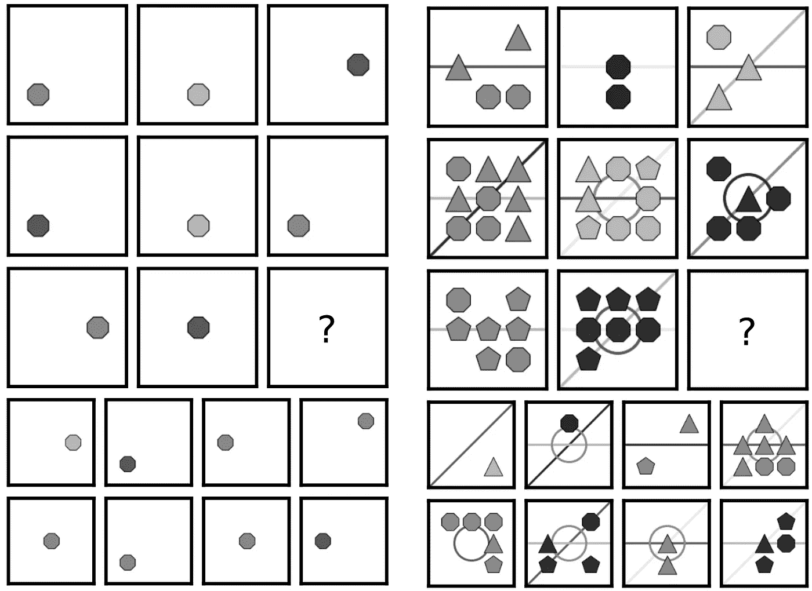
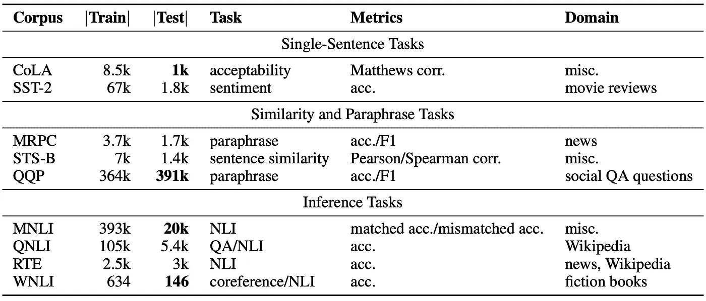
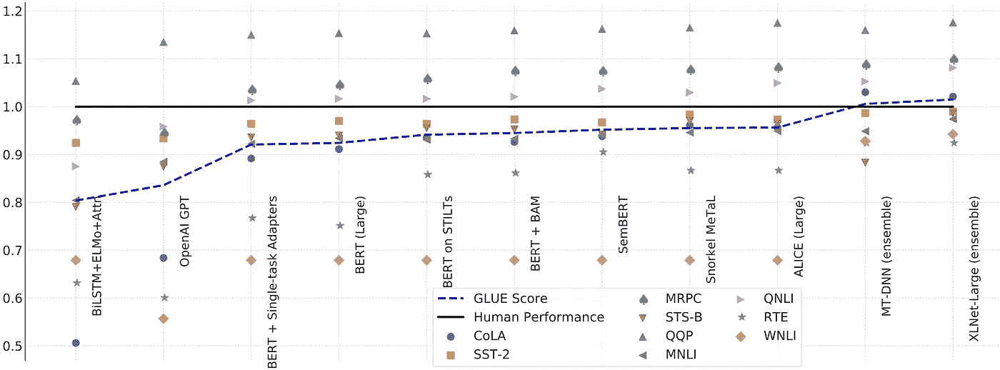

# 有趣的智商测试来测量人工智能的智力

> 原文：<https://towardsdatascience.com/intriguing-iq-tests-to-measure-the-intelligence-of-your-ai-75b861a118ca?source=collection_archive---------55----------------------->

## 衡量人类理解任何智力任务的能力。

图片由 [2081671](https://pixabay.com/users/2081671-2081671/?utm_source=link-attribution&utm_medium=referral&utm_campaign=image&utm_content=3046518) 来自 [Pixabay](https://pixabay.com/?utm_source=link-attribution&utm_medium=referral&utm_campaign=image&utm_content=3046518)

人工智能的长期目标之一是开发抽象推理能力等同于或优于人类的机器。虽然在神经网络的推理和学习方面也取得了实质性的进展，但这些模型在多大程度上表现出类似于一般抽象推理的能力仍是许多争论的主题。

神经网络完善了识别图像中的猫并将其从一种语言翻译成另一种语言的技术。那是智力还是他们只是擅长记忆？我们如何衡量神经网络的智能？

一些研究人员一直在开发评估神经网络智能的方法。它没有使用均方误差或熵损失。但是他们给神经网络一个智商测试，高中数学问题，和理解问题。

# 模式匹配

一个人的抽象推理能力可以通过心理学家约翰·瑞文在 1936 年开发的视觉智商测试来评估:T4 瑞文渐进矩阵(RPMs)。RPMs 背后的前提很简单:人们必须对感知上明显的视觉特征(如形状位置或线条颜色)之间的关系进行推理，并选择一幅图像来完成矩阵。

瑞文渐进矩阵测试中的智商测试项目。给定八种模式，受试者必须识别缺失的第九种模式。【来源:[维基百科](https://en.wikipedia.org/wiki/Raven%27s_Progressive_Matrices)

由于人工智能的目标之一是开发与人类具有类似抽象推理能力的机器，Deepmind 的研究人员提出了一种针对人工智能的智商测试，旨在探索他们的抽象视觉推理能力。为了在这个挑战中取得成功，模型必须能够很好地概括每个问题。

2 个关于 1)等差数列和 2)异或关系的瑞文式渐进矩阵问题。“A”是两者的正确选择。【来源[论文](https://arxiv.org/abs/1807.04225)

在这项[研究](https://arxiv.org/abs/1807.04225)中，他们比较了几种标准深度神经网络的性能，并提出了两种模型，其中包括专门为抽象推理设计的模块:

*   标准 CNN-MLP:(带批量归一化和 ReLU 的四层卷积神经网络)
*   ResNet-50:如[何等(2016)](https://arxiv.org/abs/1512.03385) 所述
*   LSTM: 4 层 CNN 其次是 LSTM
*   野生关系网络(WReN):使用为关系推理设计的[关系网络](https://arxiv.org/abs/1706.01427)来选择和评估答案
*   wild-ResNet:ResNet 的变体，旨在为每个答案提供分数
*   上下文无关 ResNet: ResNet-50 模型，具有八个多项选择面板作为输入[，不考虑上下文](http://openaccess.thecvf.com/content_cvpr_2017/html/Johnson_CLEVR_A_Diagnostic_CVPR_2017_paper.html)

智商测试题挑战性不够；因此，他们添加了各种形状、不同粗细的线条和颜色，以分散注意力。

各种形状、线条粗细和颜色增加了令人分心的东西。【来源[论文](https://arxiv.org/abs/1807.04225)

表现最好的型号是鹪鹩型号！这是因为关系网络模块是为推理对象之间的关系而专门设计的。排除干扰后，鹪鹩模型的表现明显更好，为 78.3%，而有干扰时为 62.6%。

左:所有型号的性能。右图:WReN 模型在不同泛化机制下的泛化性能。【来源[论文](https://arxiv.org/abs/1807.04225)

# 数学推理

数学推理是人类智能的核心能力之一。数学提出了一些独特的挑战，因为人类主要不是基于经验理解和解决数学问题。数学推理也基于推断、学习和遵循符号操作规则的能力。

研究人员 Deepmind 发布了一个由 200 万道数学问题组成的数据集[。这些问题是为测量数学推理的神经网络设计的。每个问题的长度不超过 160 个字符，回答不超过 30 个字符。这些主题包括:](https://github.com/deepmind/mathematics_dataset)

*   代数(线性方程、多项式根、序列)
*   算术(成对运算和混合表达式，surds)
*   微积分(微分)
*   比较(最接近的数字、成对比较、排序)
*   测量(转换，使用时间)
*   数字(基数转换、余数、公约数和倍数、素性、位值、舍入数字)
*   多项式(加法、简化、合成、求值、扩展)
*   概率(无替换抽样)

数据集中的示例问题。【来源[论文](https://arxiv.org/abs/1904.01557)

数据集带有两组测试:

*   插值(*正常难度*):一组多样化的题型
*   外推(*疯狂模式*):难度超过训练数据集时看到的难度，问题涉及更大的数字、更多的数字、更多的成分和更大的样本

在他们的[研究](https://arxiv.org/abs/1904.01557)中，他们调查了一个简单的 LSTM 模型、注意力 LSTM 和[变压器](/illustrated-guide-to-transformer-cf6969ffa067)。注意力 LSTM 和变压器架构用编码器解析问题，解码器将一次一个字符地产生预测的答案。

注意力 LSTM 和变压器架构用编码器解析问题，解码器将一次一个字符地产生预测的答案。【来源[论文](https://arxiv.org/abs/1904.01557)

他们还用[关系内存核心](http://papers.nips.cc/paper/7960-relational-recurrent-neural-networks)取代了 LSTM，关系内存核心由多个通过注意力交互的内存插槽组成。理论上，这些内存插槽似乎对数学推理很有用，因为模型可以学习使用插槽来存储数学实体。

模型预测正确答案的准确性。【来源[论文](https://arxiv.org/abs/1904.01557)

这是他们的发现:

*   关系内存核心对性能没有帮助。他们推断，也许学习使用插槽来操作数学实体是有挑战性的。
*   单纯 LSTM 和注意力 LSTM 都有相似的表现。也许注意力模块没有学会从算法上分析问题。
*   Transformer 优于其他模型，因为它可能更类似于人类解决数学问题的顺序推理。

# 语言理解

近年来，许多自然语言处理方法都取得了显著进展，如 [ELMo](https://arxiv.org/abs/1802.05365) 、 [OpenAI GPT](https://openai.com/blog/language-unsupervised/) 和 [BERT](https://arxiv.org/abs/1810.04805) 。

研究人员在 2019 年推出了[通用语言理解评估(GLUE)](https://arxiv.org/abs/1804.07461) 基准，旨在评估模型在九项英语句子理解任务中的表现，如问答、情感分析和文本蕴涵。这些问题涵盖了广泛的领域(类型)和困难。

任务的描述和统计。【来源[论文](https://arxiv.org/abs/1804.07461)

在人类表现为 1.0 的情况下，这些是每个语言模型的粘合分数。就在胶水问世的同一年，研究人员开发出了超越人类表现的方法。对于神经网络来说，胶水似乎太容易了；因此，这个基准不再适用。

粘合各种型号的基准性能。【来源[论文](https://arxiv.org/abs/1905.00537)

强力胶作为一种新的基准被引入，旨在提出一种更严格的语言理解测试。SuperGLUE 的动机和 GLUE 一样，都是为了提供一种难以用游戏来衡量的英语通用语言理解技术的进步。

强力胶任务的问题。【来源[论文](https://arxiv.org/abs/1905.00537)

研究人员评估了基于 BERT 的模型，发现它们仍然落后人类近 20 个百分点。鉴于强力胶的困难，在多任务、转移和无监督/自我监督学习技术方面的进一步进展将是必要的，以在基准上接近人类水平的性能。

让我们看看机器学习模型再次超越人类能力需要多长时间，这样就必须开发新的测试。

