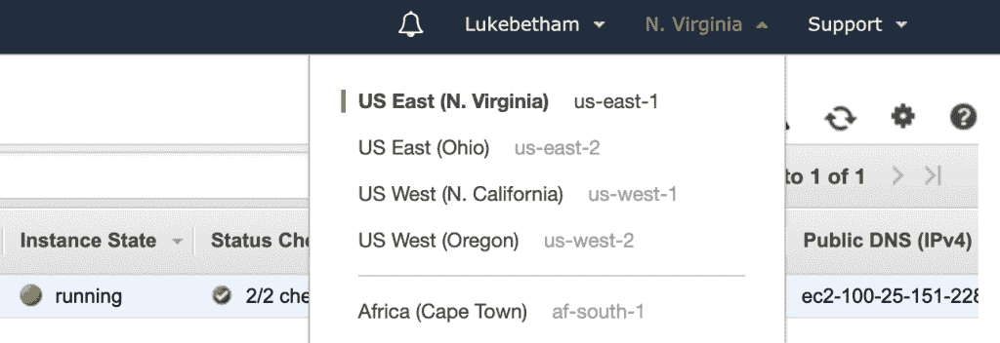
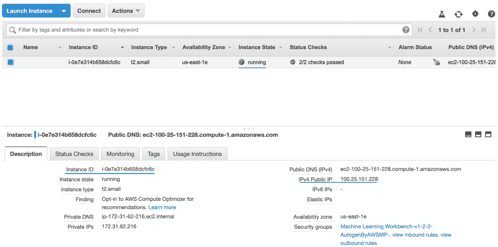
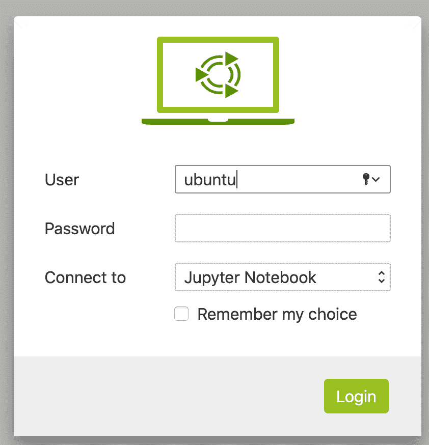
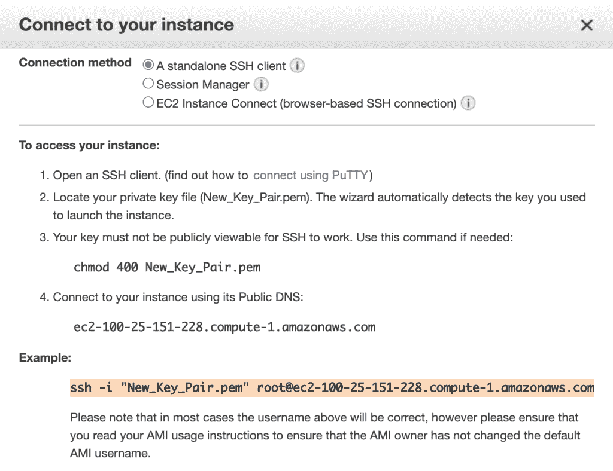

# 机器学习 AWS 简介

> 原文：<https://towardsdatascience.com/intro-to-aws-for-machine-learning-3c73afc0214f?source=collection_archive---------76----------------------->

## 使用 AWS 机器学习工作台加速 Jupyter 笔记本和 Gridsearches。

机器学习工作台—网络立方体

使用 scikit-learn 和 tensor-flow 创建强大的算法并不容易，然而，适当地调整它们需要时间；几乎所有的模型都有数千种不同的参数组合。此外，改进模型的一个好的经验法则是增加用于训练的数据量-预测值或观察值。因此，即使你有最新的 MacBook Pro，你也会很快发现自己在查看参数化网格搜索，这可能需要几个小时，甚至几天。幸运的是，将所有的处理外包给俄亥俄州某处 AWS 仓库的计算机是很简单的！

# 开始使用 AWS

第一步是建立一个 AWS 帐户，并将您的密钥文件下载到您计算机上的一个安全位置。建立一个 AWS 账户很简单，然而，如果你遇到困难，这里有一个很好的设置视频。请记住，即使您注册了 12 个月的免费试用，您也需要提供信用卡的详细信息，因为并非所有信息都包含在试用中。

成本:在我最近的项目中，我使用了一个中等规模的实例进行了多天的处理，总费用大约为 4 美元。您可以在不使用实例时将其关闭，每小时的成本非常低。成本完全取决于您租用的实例的能力，从 2 核 2gb 内存的实例每小时约 5 美分到 96 核 768gb 内存的巨型超级计算机每小时约 30 美元不等。如果你想估算成本，只需去[机器学习工作台页面](https://aws.amazon.com/marketplace/pp/netCubed-Machine-Learning-Workbench/B07MP6Y8XT)的底部。

图片由 Elias Sch 提供。来自 Pixabay

# 打开机器学习工作台

一旦您的 AWS 帐户启动并运行，您就可以开始使用了。机器学习工作台只是一个 EC2 实例，已经配置了 Jupyter、Jupyter Notebooks、Scikit-learn、Tensorflow 和许多标准 python 包，如 pandas 和 matplotlib。为了设置好它，请按照这个[机器学习工作簿链接](https://aws.amazon.com/marketplace/pp/netCubed-Machine-Learning-Workbench/B07MP6Y8XT)。

在那里，按照步骤继续订阅，接受条款，继续配置，然后继续启动。它为您提供了支付一年订阅费的选项，但是您现在可以忽略这一点，如果您坚持下去，它将允许您简单地按小时租用实例。一旦进入“启动该软件”屏幕，我发现通过 EC2 设置实例更简单，所以选择下面的选项。

从这里开始，您可以选择您需要的计算能力。在此阶段，您可以选择许多其他配置，但最简单的是直接单击右下角的“查看并启动”，然后再次单击“启动”。此时，它会询问您希望使用哪个密钥对来设置这个实例。为了能够从命令行远程访问 EC2 实例，这是必需的。如果您已经有一个用于 AWS 的密钥对，请使用它，否则创建一个新的密钥对。

一旦您下载了新的密钥对，它将允许您单击“启动实例”。您现在已经创建了 EC2 机器学习实例，它将开始在后台配置自己！

跟踪实例设置的最简单方法是直接单击实例 id。然而，如果您导航离开该页面，您总是可以通过返回到您的 [EC2 实例屏幕](https://console.aws.amazon.com/ec2/v2/home?region=us-east-1#Instances:sort=instanceId)来返回到该页面。如果您在启动 EC2 实例后返回到 EC2 实例，并且在那里没有看到您的实例，请仔细检查您是否在正确的区域，您可能在不同的区域设置了您的工作台。您可以在 EC2 屏幕的右上角找到所有区域。

一旦实例在实例状态中亮起绿灯，就可以打开实例了。最简单的方法是直接从浏览器。为此，在新的浏览器选项卡中，只需键入' [https://IPv4](https://ipv4/) Public IP '并按 enter 键，其中 IPv4 Public IP 是下面带下划线的公共 IP 号。如果你停留在数字的右边，你可以点击图标进行复制。一旦你导航到这个 IP 地址，你可能会从你的浏览器得到一个警告，让你知道这个连接不是私人的。根据您使用的浏览器，按照高级选项忽略错误并继续您的实例。如果您很难通过，请尝试其他浏览器，因为它们可能有不同的安全设置。

一旦你完成，它应该带你到这个登录屏幕。登录密码是上面突出显示的实例 ID。你可以直接连接到虚拟桌面或直接进入 Jupyter 笔记本开始训练你的模型。第一次登录应该需要一分钟左右的时间，但是之后你就可以开始 jupyter 笔记本会话了！

# 常见问题—安全组

如果你没有任何问题，跳过这一点！但是，如果您正在努力连接到 IP 地址，并且它一直超时，很可能是 EC2 实例的安全组没有自动正确设置。这很容易解决，只需遵循以下步骤。

*   回到主 [EC2 实例屏幕](https://console.aws.amazon.com/ec2/v2/home?region=us-east-1#Instances:sort=instanceId)，在那里你可以看到你的实例滚动，直到你看到列标题“安全组”。单击已分配给实例的任何安全组的链接。
*   这将把您带到一个允许您编辑安全设置的页面。为了实现这一点，您需要编辑您的入站规则，以包括 HTTPS，并为源是 0.0.0.0/0(这意味着任何 IP 地址)。参见下面的例子。
*   更改后，您可以返回到浏览器中的 IP 地址，它应该会停止超时。如果您遇到任何与此相关的问题，请随时评论或让我知道。

# 加载数据和笔记本

将数据加载到实例中最简单的方法是使用方便的 upload 按钮，如下所示。这允许您快速、轻松地将数据从笔记本电脑直接上传到远程实例。一旦你的数据和笔记本上传，打开笔记本，开始运行代码！

但是应该注意的是，如果你需要上传非常大的文件，这种上传方式会很昂贵并且很慢。或者文件可能不在你的电脑上，而是安全地存储在 S3 桶里。不用担心，也可以直接从 S3 存储桶中加载文件。如果你以前没有遇到过这种情况，S3 水桶只是一个数据和文件的存储盒，安全，易于从任何地方访问。本教程不包括设置 S3 桶，但这很容易做到，网上已经有很多这方面的指导。

如果您想直接从机器学习工作台中的 jupyter 笔记本访问 S3 存储桶，您首先需要授予对此实例的访问权限，以访问您的 S3 存储桶。最简单的方法是使用命令行从本地计算机直接登录到实例。为此，返回到 [EC2 实例屏幕](https://console.aws.amazon.com/ec2/v2/home?region=us-east-1#Instances:sort=instanceId)，选择您的实例并按下 connect。这将打开下面的屏幕。复制下面突出显示的示例(您的示例会有所不同)。将该命令复制到命令行中，确保将第三项替换为密钥文件的完整文件路径，并将单词“root”替换为“ubuntu”。按 enter 键，您应该直接登录到您的实例。如果它询问您是否要继续，请键入“是”。

如果您得到一个错误，提示您的私钥文件未受保护，请通过运行下面的命令行命令来保护该文件，然后重试
`chmod 400 New_Key_Pair.pem`
用您的私钥文件的完整文件路径替换命令中的最后一项。

一旦你在你的命令行应该看起来如上。从这里—要授权您的 S3 存储桶，请运行以下命令行命令:

`aws configure`

然后你所需要做的就是输入密钥 ID 和秘密密钥，你就可以开始工作了！这意味着您将能够直接从 S3 向您的实例中导入文件。关于如何在 AWS 上做到这一点，有更多的参考资料，但是下面是从 EC2 实例使用 S3 的一些常用命令:

列出你的 AWS 桶:
`aws s3 ls`

移动文件(或整个文件夹！)入斗:
`aws s3 cp /Documents/data.csv s3://bucket/folder_name`

您可以通过
`aws s3 cp s3://bucket/file_to_copy file_to_copy`反过来复制文件

如果你想给出一个完整的路径名，看起来像:
`aws s3 cp s3://bucket/file_to_copy ~/folder/subfolder/.`

一旦在命令行中配置完实例，只需在命令行中键入 exit，它就会关闭连接。

# 核心和处理

我见过的一个常见错误是，当人们为了加快处理速度而将笔记本电脑转移到 AWS 时，他们会忘记修改代码，以便在新电脑上使用。他们将笔记本电脑复制到一台更强大的 8 核计算机上，然后惊讶地发现网格搜索用了同样长的时间…

例如，sklearn 的大多数模型函数中都有一个名为 n_jobs 的参数，它允许您指定要使用多少个内核来训练模型。默认值为 None，这意味着它将只使用一个内核。如果您不更改此默认设置，迁移到具有更多内核的计算机将不会有任何影响。您可以手动将其设置为想要使用的内核数量，或者简单地输入-1，这将使用所有可用的内核。

要知道 n_jobs 可能不是唯一的限制因素。有些解算器不支持多重处理，因此会忽略您的 n_jobs 输入(例如，带有 sklearn LogisticRegression 的 Sag 解算器)。

# 在后台运行脚本

因此，您已经将数据放在工作台上，准备开始训练您的模型，但是如果，即使有额外的 AWS 计算能力，看起来您的 gridsearch 还需要几天时间呢？登录机器学习工作台 jupyter 笔记本的缺点是，如果你退出笔记本，它不会继续在后台运行。如果你关闭 jupyter 笔记本，它将中断这个过程，你将不得不从头开始。你有三个真正的选择。

1.  咖啡因:第一种也是最简单的一种，要求你的电脑一直开着，所以这并不理想，但我会提到它，因为它更简单！基本上，选择一是让你的 jupyter 笔记本运行，并确保你的电脑不会进入睡眠状态。为了做到这一点，为你的电脑安装一个类似咖啡因或安非他命的应用程序，以便在实例运行时让它保持清醒。如果你需要合上笔记本电脑，情况会变得稍微复杂一些，因为 Macbooks 不允许你在电脑合上时保持清醒。有办法解决这个问题——显然，即使你关闭屏幕，一款名为 InsomniaX 的应用程序也会让你的 Macbook 继续运行。
2.  **不挂断:**第二种选择更稳健。对于此选项，您将需要在命令行上登录到实例并运行脚本，让实例知道即使您从实例断开连接，您也希望脚本继续运行。为了连接到实例，请回顾上一节中的步骤(加载数据和笔记本)。一旦您登录并导入了想要运行的脚本，您可以使用下面的命令行命令在后台运行它:
    `nohup python script.py &`
    这将强制实例在后台运行程序，并且在您断开连接时不会“挂断”,并且会为您提供一个进程 ID。为了做到这一点，你必须将你的笔记本转换成 python。py)文件，并确保脚本运行的任何结果都被保存下来。一些有助于确保脚本正在运行的附加命令是:
    检查所有 python 正在运行的进程
    `ps aux | grep python` 终止特定进程
    `kill -9 [insert process number]`
3.  **终端多路复用器:**您的第三个选择——可能也是最可靠的——是设置一个终端多路复用器。终端多路复用器允许您通过客户端窗口连接到实例或服务器。它允许您确保即使客户端断开连接，实例也将继续运行。您可以关闭计算机，只要在启动备份时重新连接到客户端，实例就会继续运行。把它想象成一个虚拟终端。因此，您仍然需要运行脚本，而不是直接使用 jupyter 笔记本。一种常用的终端多路复用器被称为 tmux，您可以在这里访问关于如何设置[的简单指南](https://www.linode.com/docs/networking/ssh/persistent-terminal-sessions-with-tmux/)。

# 关闭实例

记得这样做！如果你忘记了，你很容易就有一大笔账单，所以在关闭你的实例之前不要去度假。这里有两种选择，停止实例和终止它。

在这两种情况下，实例将被关闭，您的虚拟机将被永久删除，您将不再因实例使用而付费。在这两种情况下，您都会丢失保存在实例的临时存储上的任何数据。停止和终止实例的主要区别在于，当您停止时，附加的可引导 EBS 卷不会被删除。这意味着该实例将仍然存在于 EC2 实例窗口中，并且您可以随时使用与以前相同的设置和设置再次启动它。但是请注意，如果您再次启动它，连接的连接路径和 IP 地址将会改变。还要注意，将 EBS 卷保持在停止状态可能会有费用(虽然费用很少，而且在免费试用期间，很多费用都是免费的)，但是请记住，如果您打算让它长时间停止，那么终止实例会更好。

这就对了。将 AWS 计算能力用于机器学习任务的基础知识——这是加速任何数据科学项目的一个好方法。