# BigQuery 及其免费数据集简介

> 原文：<https://towardsdatascience.com/intro-to-bigquery-and-its-free-data-sets-3cdc5cee4dbd?source=collection_archive---------75----------------------->

## 快速介绍如何使用免费的公共数据集访问和查询 Google 的 BigQuery。

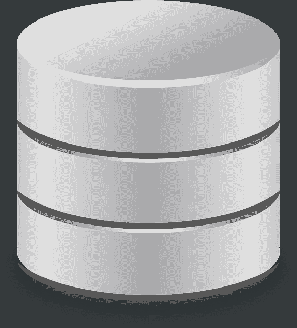

来自 Pixabay 的图片

查找和访问数据很难做到——尤其是免费数据。然而，谷歌的 BigQuery 有一个巨大的免费数据库，访问起来再简单不过了。访问数据库的查询是在 SQL 中进行的，但是，界面非常用户友好，您只需要基本的理解就可以开始访问数据。

# 公共数据集

目前，BigQuery 上有近 200 个公共数据集，并且一直在增加新的数据集。大多数数据库都保持完全更新，每天都有新的数据。例如，在过去的 3 个月里，新冠肺炎增加了 22 个新的数据集，这些数据集每天更新，以帮助提高数据的可用性和辅助研究。要细读这些数据集，只需前往谷歌市场的[数据集。](https://console.cloud.google.com/marketplace/browse?filter=solution-type:dataset)数据范围巨大，从诺亚极端天气数据到历史加密货币交易量和价格。数据集已经分类，以便于根据您感兴趣的数据类型进行筛选。

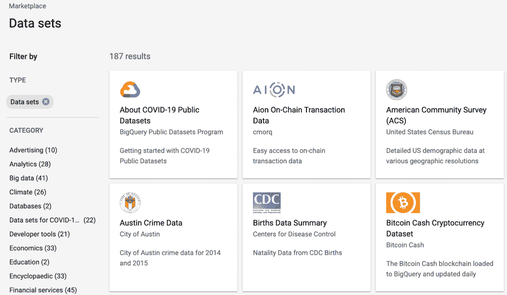

# 云控制台

一旦你决定了一个数据集，点击它，然后点击查看数据集——这将把你直接带到谷歌云控制台。请注意，您需要使用 google 帐户登录或设置一个帐户才能访问控制台。如果这是你的第一次，你将获得一年的免费试用，价值 300 美元(或等值的本国货币)的免费数据访问信用。在这里，你应该在屏幕的左上方建立一个新的项目。这允许您跟踪您的数据集和查询，允许您保存查询并查看您过去的所有作业。

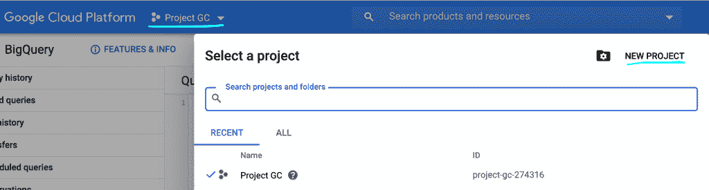

点击进入新项目界面，用你喜欢的名字设置项目——你会得到一个警告，让你知道你的免费账户上还有多少项目。一旦你设置好了，你就可以开始了！

# 探索数据集

在控制台中，您可以更详细地浏览数据集。导航数据集的主要部分位于控制台左下角的 resources 选项卡中。这允许您浏览大量公共数据集，添加额外的公共数据集，甚至链接外部数据源。

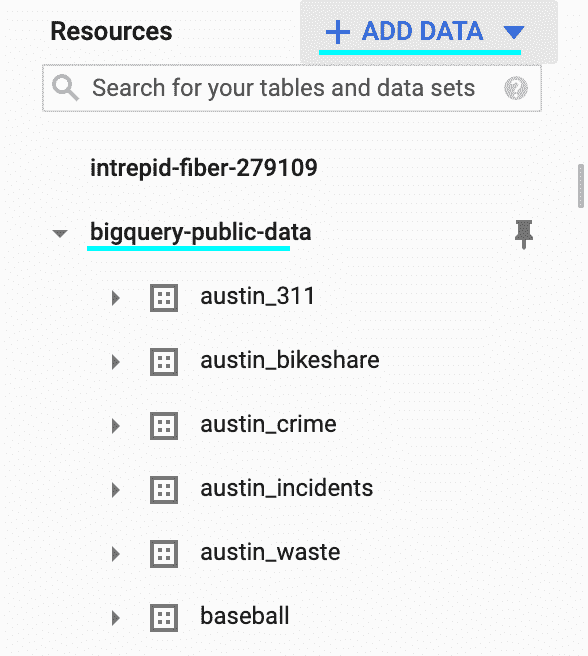

在“添加数据”屏幕中，您可以搜索市场中的所有相同数据集，并将其添加到此资源选项卡中的固定数据集。对于任何给定的项目，将所有数据集放在一个地方都很简单。

除此之外，BigQuery 还为所有数据表提供了简洁明了的汇总屏幕。为了访问它，浏览数据库中的资源，只需选择您感兴趣的数据表，查看更多详细信息。

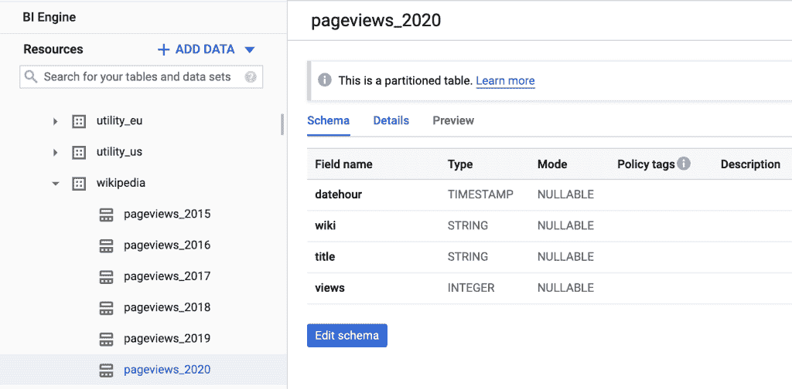

第一个数据屏幕是 Schema 屏幕，它提供了关于表中每个字段的字段名称和数据类型的更多信息。有些数据集甚至详细描述了字段名的含义或代表的内容。策略标签允许数据库所有者设置特定字段的权限(例如，敏感数据)，然而，这并不用于大多数公共数据集中，因为它们是公共的。

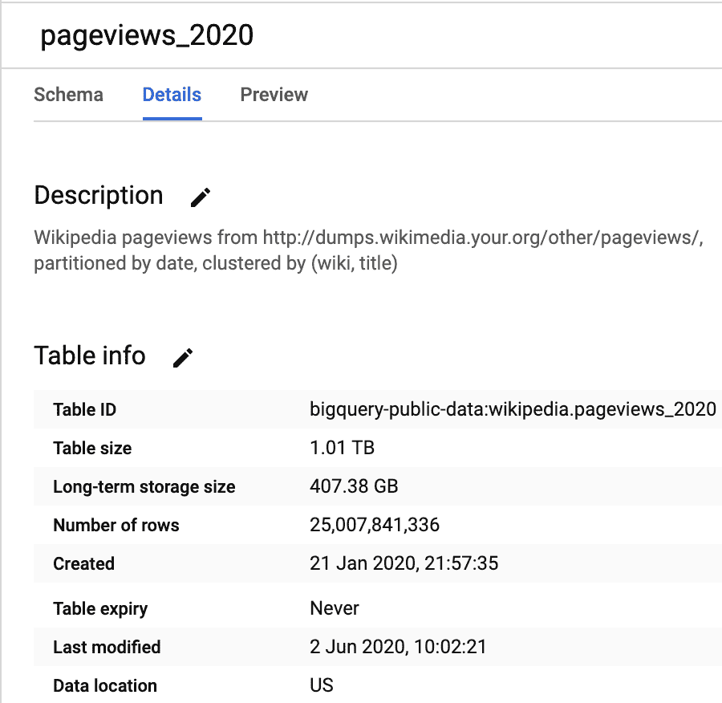

第二个选项卡是 Details 选项卡，它提供了表的概要信息。即数据集的大小和长度(维基百科 2020 年页面浏览量表有 250 亿行数据！)，还包括数据有多旧，以及更新的频率。此外，一些公共数据集只在一定时期内发布，您可以看到表何时到期(尽管这种情况非常罕见)。

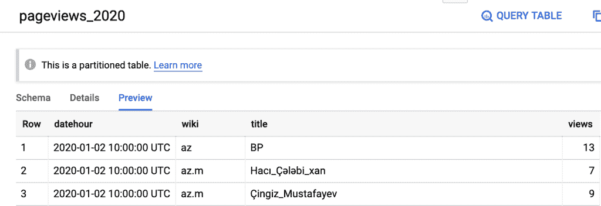

如果前两个还不够，甚至还有一个预览选项卡，它将允许您查看前几行数据，因此您可以看到数据格式的示例。这使得描绘你的数据库，查看它是如何组合在一起的，以及决定你到底想要查询哪些信息变得非常容易！

# 查询数据集

一旦您准备好开始访问数据，BigQuery 还使构建查询和修改查询变得非常简单。显然，如果您是一个 SQL 奇才，您可以在查询框中开始编写查询，但即使这样，使用 BigQuery 快捷方式开始也要快得多。选择您想要查询的表，然后简单地点击右下角的查询表按钮。

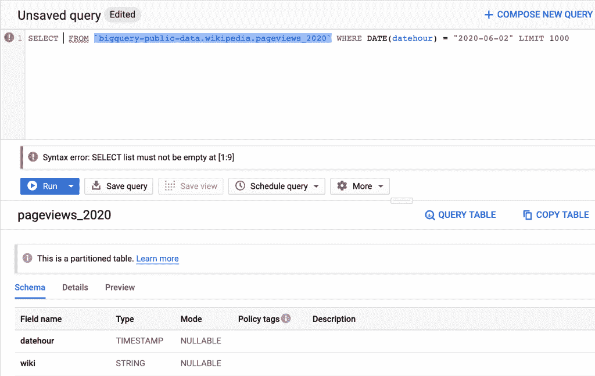

这将用一个几乎完整构建的查询自动填充您的查询。您最初会看到一个语法错误，这是因为它不会自动填充要查询的字段。为了进行选择，您可以简单地从 Schema 菜单中单击字段名称，它将为您填充查询(当然，如果您想要所有字段，您可以简单地在 SELECT 之后键入一个' * '来选择所有字段)。

请注意，它们会自动在查询中填充一个限制。除非你 100%确定你在做什么，否则不要删除它。这不仅是一个好的实践，也意味着您不会因为试图在一个简单的打字错误后返回 1tb 的数据而意外地使用了所有的免费使用限制。这些数据集大部分都很庞大，因此很容易出错。一旦您准备好您的查询，您将得到一个绿色的复选标记，告诉您该查询是有效的，并且您还可以在查询屏幕的右下角得到关于搜索大小的信息，作为一个额外的完整性检查。这是一个较高的估计，大多数情况下，如果你有一个限制，实际的过程会少得多。

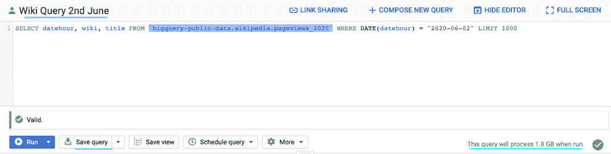

从这里，您可以轻松地构建多个查询，并在实际运行之前保存它们。组织查询再简单不过了。完成后，只需单击保存查询。然后，可以从左侧的菜单中再次访问保存的查询。您甚至可以计划在特定时间运行查询！

这不是一篇关于 SQL 的文章，但是包含了一些简单的附加命令，在构建查询时可能会有用:

从字段
`SELECT DISTINCT field1 FROM table`
中选择唯一值按某个字段分组并聚合其他字段
`SELECT field1, sum(field2) FROM table GROUPBY field1`
将表连接在一起(可以是左、右、内或外)
`SELECT f1 FROM table INNER JOIN table2 ON table.f1 = table2.f1` 用条件选择
`SELECT f1 FROM table WHERE f1 = "legend" or f1 LIKE "%leg%"`
对输出排序
`SELECT f1 FROM table ORDER BY f1 DESC`
选择日期部分并重命名字段
`SELECT date_part('year', my_date) AS year FROM table`

这只是皮毛，但有了它，你可以走得更远！

如果您对查询感到满意，请按“运行”按钮，查询将运行，然后用结果填充底部菜单。还要注意的是，一旦运行，查询结果就会出现在左边的查询历史菜单中，没有必要重新运行。

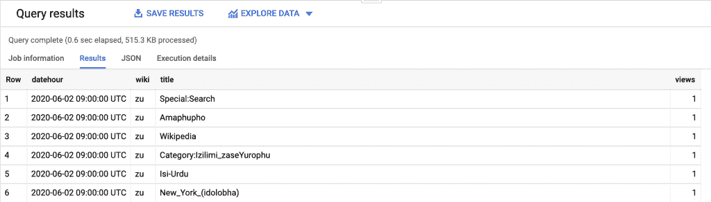

您可以在适当的地方看到表格格式的结果(尽管您一次最多可以看到 100 行)，甚至可以直接使用 data studio 来浏览数据。如果你点击探索数据按钮，它会自动链接到一个数据工作室表，所以你可以玩可视化和 EDA。几秒钟内你就可以看到有用的数据摘要。

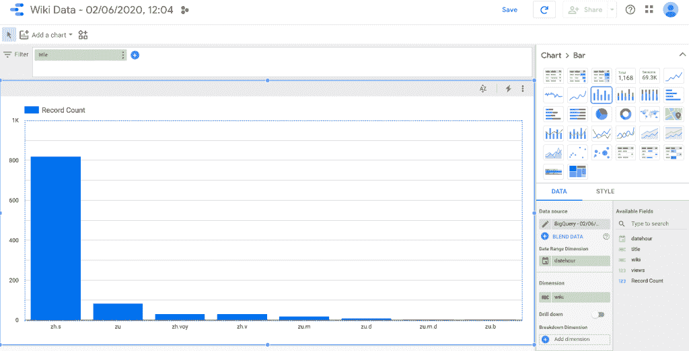

Google 的 DataStudio 的更好的工作方式是另外一个故事，但一般来说，它非常用户友好，可以帮助快速分析查询，以确保它们正确运行或数据有意义，这样你就可以根据需要定制你的查询。

# 保存或提取数据

对查询满意后，您可能希望提取数据以进行进一步的分析或建模。这里有相当多的选项，如果您单击“保存结果”按钮，它将为您提供所有选项的详细描述以及限制。

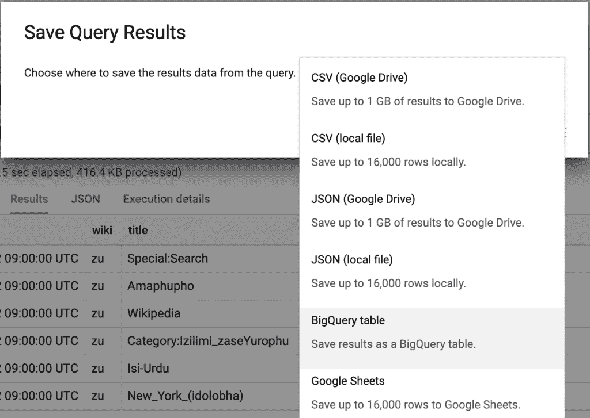

简单地说，如果你把结果保存在 google drive 上，你可以节省 1gb，但是如果你想把它保存在你的电脑上，下载限制是 16k 行。将文件保存到 google drive 意味着你可以保存更大的查询，从 google drive 可以很容易地从 google colab 访问 csv，从 jupyter 笔记本访问[，你只需要设置一个 API 键。](https://medium.com/@umdfirecoml/a-step-by-step-guide-on-how-to-download-your-google-drive-data-to-your-jupyter-notebook-using-the-52f4ce63c66c)

现在，您可以免费访问数百 TB 的，非常适合您的下一个数据科学项目！