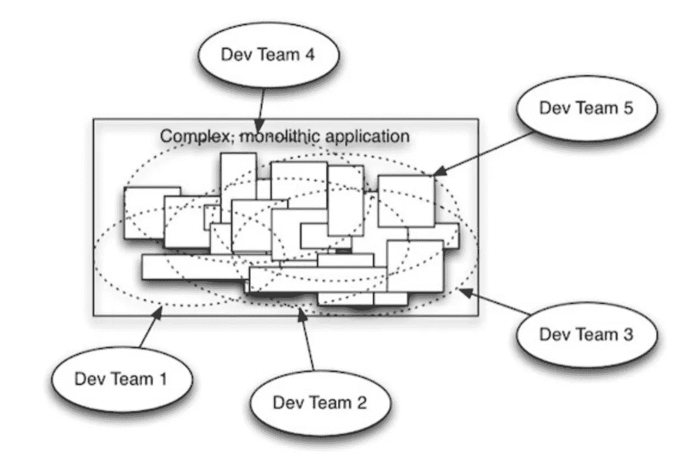
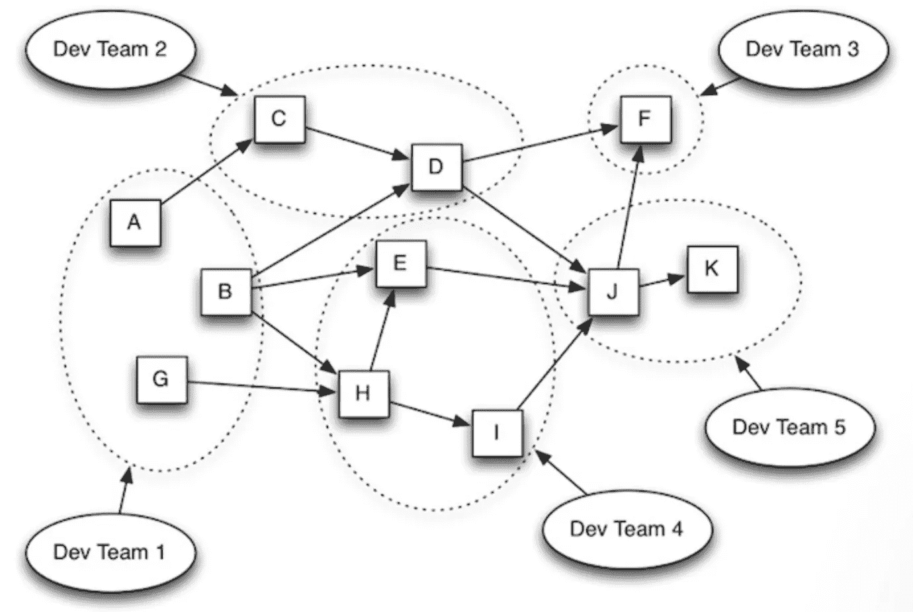
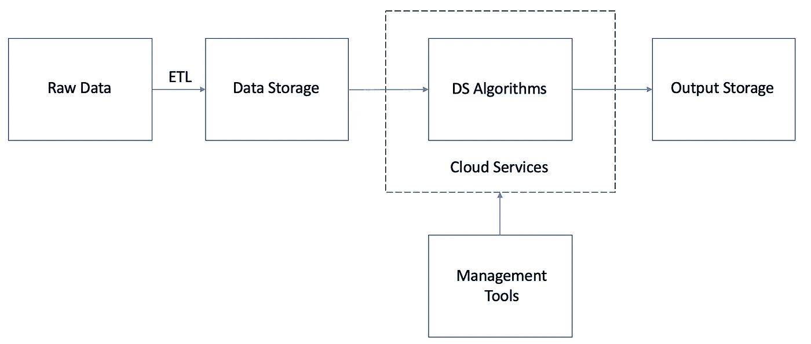
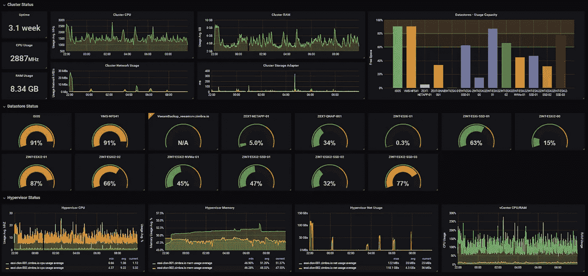
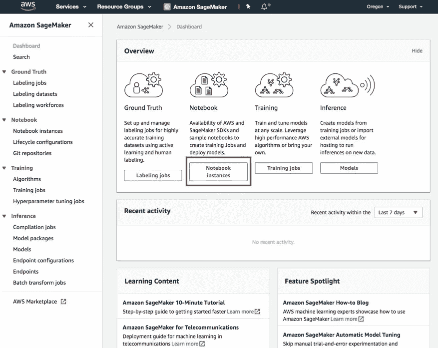

# 面向数据科学家的数据工程介绍

> 原文：<https://towardsdatascience.com/intro-to-data-engineering-for-data-scientists-fa6c864a3ecc?source=collection_archive---------39----------------------->

马库斯·斯皮斯克在 [Unsplash](https://unsplash.com?utm_source=medium&utm_medium=referral) 上的照片

## 数据基础架构概述，这是采访中经常被问到的问题

在我过去几年为我的雇主进行面试的过程中，我发现应届数据科学毕业生通常不太了解数据工程领域。他们通常在机器学习算法的海洋中游泳，很少关注他们上游和下游的工作。然而，许多公司都非常重视与数据工程师合作的经历，因为这对于平稳高效地部署数据科学模型至关重要。理解大局很重要。它有助于你了解一家公司解决业务问题所需的所有要素，以及你和你的工作在公司中所扮演的角色。

本文将帮助您掌握数据基础设施的各种元素，并熟悉每个步骤中使用的一些常用工具和软件。

让我们开始吧。

# 基本概念

这里有一些你会经常听到数据工程师提到的基本术语。让我们先理清这些概念:

*   **服务器**:把服务器想象成“远程计算机”，可以通过 API 从本地计算机(称为客户端)访问它们。
*   API:把它看作一个 URL 或者一个库，你可以在那里访问或者执行它，运行一个软件或者一个模型。
*   **微服务:**公司正在搭建的端系统。工程师不是构建复杂的整体应用程序来满足多种业务需求，而是将软件功能隔离到多个独立的模块中，这些模块分别负责执行独立的任务。这些模块通过通用的 API 相互通信。更详细的解释，请看[这个链接](https://blog.newrelic.com/technology/microservices-what-they-are-why-to-use-them/)。

单一应用程序:开发团队在同一软件的不同功能上工作

微服务:将每个功能构建为独立的应用程序，并通过 API 相互访问

*   Docker 容器可以理解为存储库和打包运行代码所需的应用程序的地方。在维护软件包版本的一致性和消除在不同的计算机和服务器上运行时重新安装软件包的麻烦方面，它非常方便。Docker 容器是使用 docker 映像构建的—如果您将 docker 容器视为一个操作系统(就像您的 windows 系统、IOS 系统或虚拟机)，docker 映像就是该系统在某个时间点的快照。当您刚启动 docker 容器时，您有一个 docker 映像，并且您可以创建附加的 docker 映像来存储您的工作。当你与他人共享 docker 映像时，他们将能够像你一样运行一切。关于 docker 如何工作的更多细节，请查看[这个链接](https://stackify.com/docker-image-vs-container-everything-you-need-to-know/)。

# 数据基础设施概述

一个**数据基础设施**是一个促进数据共享和消费的数字框架。简而言之，它意味着数据需要在组织中流动并被不同部门使用的元素的组合。典型的数据基础设施如下所示:

让我们一步一步地浏览这个图表:

*   原始数据可以是结构化的，也可以是非结构化的，通常在第一次流入时存储在数据库中。常用的关系数据库包括 MySQL、Postgres、Redshift、Vertica、Snowflake 等。
*   很多时候，原始数据还不能被数据科学算法或商业智能引擎直接使用。可能是因为太乱了，也可能是因为数据格式不理想。因此，通常需要数据预处理步骤(也称为 ETL)来标准化传入的数据。ETL 是提取、转换和加载的缩写。这三个数据库功能被组合到一个工具中，从一个数据库中提取数据，将其转换成所需的格式，然后放入另一个数据库中。有时 ETL 作业被安排在特定的时间间隔运行。其他时候，当新的原始数据通过使用类似于 [Apache Kafka](https://kafka.apache.org/) 的工具进入时，它们会被自动触发。

一个简单的工作流，使用 Kafka 在新数据进入时加速模型训练和部署。这个图中没有显示 ETL 过程。

*   处理后的数据将被运行在云服务上的数据科学算法使用。由于这一步可能涉及到许多工具，我将在后面深入讨论这一部分。
*   当在云上运行作业时，组织需要监控它们的使用情况和错误。这就是管理工具发挥作用的地方。常见的监控服务包括 [Kubernetes](https://en.wikipedia.org/wiki/Kubernetes) (分组和管理 docker 容器) [Datadog](https://en.wikipedia.org/wiki/Datadog) (管理日志、安全、用户等。)、 [Grafana](https://en.wikipedia.org/wiki/Grafana) (管理内存、服务器请求、页面加载等等)等。

Grafana 仪表板的屏幕截图

*   最后，算法输出被保存回数据库或网络存储器，如 [AWS S3](https://en.wikipedia.org/wiki/Amazon_S3) 。

# 在云上运行 DS 算法

有许多方法可以在云上部署数据科学算法。人们可以通过使用 Flask 这样的包来创建端点 API，并在 AWS Elastic Beanstalk 这样的 web 服务上托管这样的 API。或者他们可以直接在云服务上运行脚本，如 AWS Lambda、AWS EC2 实例或 AWS Sagemaker。

在 AWS Lambda 上，可以编写在特定条件下触发的函数，比如当一个新文件进入链接的 AWS S3 数据存储桶时。缺点是 AWS Lambda 函数通常是简单快捷的函数，并且在它们可以执行的操作类型方面受到限制。但是，它会自动处理缩放和大小决定，因此不需要担心调整实例和内存的数量等问题。当交通流量增加时。这也是 AWS Lambda 被称为无服务器计算的部分原因——用于运行应用程序代码的服务器基础设施环境隐藏在后台，这样你就不必考虑服务器了。

简单的 AWS Lambda 工作流

另一方面，AWS EC2 允许用户调整和缩放服务器实例。因为用户可以完全控制服务器和代码运行环境，所以用户可以部署更复杂的脚本。运行在 EC2 上的应用程序需要打包到 Docker 容器中。

AWS Sagemaker 是建立在 AWS EC2 之上的云服务。它带有预构建的容器，专为数据科学家训练和部署机器学习模型而设计。它看起来像一个 Jupyter 笔记本，但在云服务上。您还可以通过 AWS APIs 访问它，并在本地机器上编写代码。

如果您有多个脚本需要按照一定的顺序运行，那么您将需要 Apache Airflow。Airflow 是一种管理工具，可以帮助云服务按照设计在工作流(称为 DAG)中运行代码，它有一个日志系统，可以在 DAG 中断时显示故障组件。

Airflow 可用于云服务上的 ETL 过程和模型训练/部署过程。

就是这样！为了更容易理解，我简化了许多概念。希望这篇文章能帮助您对数据工程概念有一个基本的了解，从而促进将来更好的合作。有关问题和评论，让我们连线 [Linkedin](https://www.linkedin.com/in/wiw5087/) 和 [Twitter](https://twitter.com/WeiW5087) 。