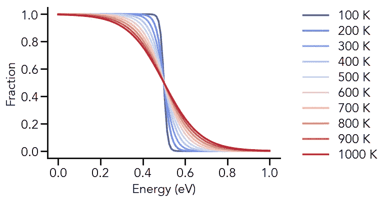
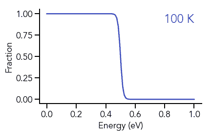
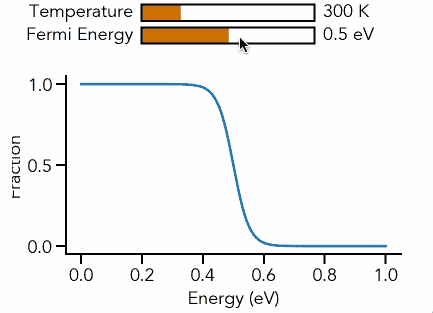

# Python 动态可视化简介-动画和交互式绘图

> 原文：<https://towardsdatascience.com/intro-to-dynamic-visualization-with-python-animations-and-interactive-plots-f72a7fb69245?source=collection_archive---------3----------------------->

## Python 科学绘图

## 用 Python 制作基本动画和交互式绘图


照片由[卡蒂亚·奥斯丁](https://unsplash.com/@katya?utm_source=unsplash&utm_medium=referral&utm_content=creditCopyText)在 [Unsplash](https://unsplash.com/s/photos/interactive?utm_source=unsplash&utm_medium=referral&utm_content=creditCopyText) 拍摄

有时，您可能希望创建一个像视频一样随时间变化的动态图形，或者根据交互式用户输入进行调整。这些可视化做了大量的工作，真实地展示了输出如何随着输入而变化。在本文中，我将把相同的数据呈现为静态图、动画和交互式图。为了与我以前文章的物理科学主题保持一致，我绘制的数据将来自固态物理学中最广泛使用的方程之一:费米-狄拉克分布，它描述了电子在固体中的占有率。等式如下所示，它将占据能量 *E* 的态的分数作为费米能量和温度的函数。


费米-狄拉克分布

# **静态图**

我们的第一个图将是一个静态图，其中将有不同温度下的 *f(E)* 曲线。首先，我们导入所需的包:

```
# Import packages
import matplotlib as mpl
import matplotlib.pyplot as plt
import numpy as np
```

由于我们要多次计算费米-狄拉克分布，我们应该写一个函数来为我们做这个计算:

```
# Fermi-Dirac Distribution
def fermi(E: float, E_f: float, T: float) -> float:
    k_b = 8.617 * (10**-5) # eV/K
    return 1/(np.exp((E - E_f)/(k_b * T)) + 1)
```

现在我们可以开始绘制数据了！首先，我将编辑一些常规的绘图参数:

```
# General plot parameters
mpl.rcParams['font.family'] = 'Avenir'
mpl.rcParams['font.size'] = 18mpl.rcParams['axes.linewidth'] = 2
mpl.rcParams['axes.spines.top'] = False
mpl.rcParams['axes.spines.right'] = Falsempl.rcParams['xtick.major.size'] = 10
mpl.rcParams['xtick.major.width'] = 2
mpl.rcParams['ytick.major.size'] = 10
mpl.rcParams['ytick.major.width'] = 2
```

我们创建我们的图形，并向其添加轴对象:

```
# Create figure and add axes
fig = plt.figure(figsize=(6, 4))
ax = fig.add_subplot(111)
```

为了向我们的费米-狄拉克函数提供变化的温度数据，我们使用`numpy.linspace`生成 100 K 到 1000 K 之间的一组值:

```
# Temperature values
T = np.linspace(100, 1000, 10)
```

对于这些温度值中的每一个，我们需要将不同的颜色映射到其结果曲线上。我们将从`coolwarm`色图中生成颜色，因为我们实际上是在处理不断变化的温度。由于我们已经在上面生成了 10 个温度值，我们将从`coolwarm`色图中提取 10 种颜色。

```
# Get colors from coolwarm colormap
colors = plt.get_cmap('coolwarm', 10)
```

绘制数据的最简单方法是循环遍历所有温度值，并每次绘制相应的曲线。为了生成 x 轴值，我们再次使用`numpy.linspace`来创建一个由 0 到 1 之间的 100 个等距值组成的数组。此外，我们在所有计算中使用 0.5 eV 的固定费米能量值。

```
# Plot F-D data
for i in range(len(T)):
    x = np.linspace(0, 1, 100)
    y = fermi(x, 0.5, T[i])
    ax.plot(x, y, color=colors(i), linewidth=2.5)
```

我们的图需要的最后一个元素是一种区分不同颜色温度曲线的方法。为此，我们将创建一个图例，首先创建一个标签列表，然后将它们传递给`axes.legend`方法。

```
# Add legendlabels = ['100 K', '200 K', '300 K', '400 K', '500 K', '600 K', 
          '700 K', '800 K', '900 K', '1000 K']ax.legend(labels, bbox_to_anchor=(1.05, -0.1), loc='lower left', 
          frameon=False, labelspacing=0.2)
```

`labelspacing` —图例条目之间的垂直间距(默认为`0.5`)

最后，在添加轴标签后，我们将看到以下图形:



费米能级为 0.5 eV 时费米-狄拉克分布的温度依赖性

# **动画剧情**

现在，假设我们想要呈现与上面相同的数据，但是作为一个视频，我们该怎么做呢？原来我们用`matplotlib`就可以很轻松的做到这一点！我们必须导入以下内容才能使用该功能:

```
# Import animation package
from matplotlib.animation import FuncAnimation
```

如果我们使用的是 Jupyter 笔记本，我们也应该改变`matplotlib`用来渲染其数字的后端，以便允许交互式绘图。

```
# Change matplotlib backend
%matplotlib notebook
```

对于我们的动画，我们需要做以下工作:

(1)将对绘制曲线的引用存储为变量

(2)使用带有该变量的函数调用来不断更新绘图数据

我们将首先绘制空数组，并将该图存储为一个名为`f_d`的变量。此外，我们将添加一个显示当前绘图温度的文本注释，因此我们也将存储一个对此的变量引用。我们将文本注释的右上角与 axes 对象的右上角对齐。

```
# Create variable reference to plot
f_d, = ax.plot([], [], linewidth=2.5)# Add text annotation and create variable reference
temp = ax.text(1, 1, '', ha='right', va='top', fontsize=24)
```

现在来看看我们动画的核心——动画功能。该函数将接受索引`i`的输入，并在每次调用时更新绘图。它还会用当前温度和(只是为了好玩！)根据`coolwarm`色图中的相同颜色改变绘图和文本的颜色。

```
# Animation function
def animate(i):
    x = np.linspace(0, 1, 100)
    y = fermi(x, 0.5, T[i])
    f_d.set_data(x, y)
    f_d.set_color(colors(i))
    temp.set_text(str(int(T[i])) + ' K')
    temp.set_color(colors(i))
```

`set_data(x, y)` —为绘图设置新的`x`和`y`数据

现在，为了让奇迹发生，我们使用下面一行代码:

```
# Create animation
ani = FuncAnimation(fig=fig, func=animate, frames=range(len(T)), interval=500, repeat=True)
```

`fig` —传递给动画功能的图形

`func` —剧情的动画功能

`frames` —一个数组，从 0 开始，代表动画的帧。在这种情况下，我们传递一个长度等于我们正在制作动画的温度数的值(这也是传递给`func`的索引`i`)。

`interval` —帧之间的延迟，单位为毫秒

`repeat` —是否在动画结束时重复播放



费米能量值为 0.5 eV 时费米-狄拉克分布的温度依赖性的动画图

在那里！现在，如果您的轴标签或部分绘图被截断，您可以尝试添加以下代码行，以确保所有元素都在图形的视图中。

```
# Ensure the entire plot is visible
fig.tight_layout()
```

现在，为了保存我们的动画，我们使用如下:

```
# Save and show animation
ani.save('AnimatedPlot.gif', writer='imagemagick', fps=2)
```

为了生成`.gif`文件，我使用了 [ImageMagick](https://imagemagick.org/index.php)

`fps` —动画的每秒帧数(因为我们只有 10 帧，所以我使用 fps 值 2 来模拟之前 500 毫秒的间隔延迟)

# **互动剧情**

最后，如果我们想让用户摆弄输入参数，观察它们在输出上的变化，我们可以制作一个交互式的图形。我们从导入所需的包开始。

```
# Import slider package
from matplotlib.widgets import Slider
```

我们再次开始创建一个图形和轴对象来保存我们的绘图。然而，这一次，我们调整了绘图的大小，以便为将要添加的滑块腾出空间。

```
# Create main axis
ax = fig.add_subplot(111)
fig.subplots_adjust(bottom=0.2, top=0.75)
```

`figure.subplots_adjust()`接受`top`、`bottom`、`left`和`right`的输入，指示在何处绘制轴边界框的四个角。在这种情况下，我们确保顶部不超过 0.75，这样我们就可以将滑块放在图的顶部。

滑块开始就像任何其他轴对象。在这里，我们将两者都加在图上(一个用来改变费米能，一个用来改变温度)。此外，由于我们更改了全局绘图设置，删除了右侧和顶部脊线，因此我们将它们添加回滑块。

```
# Create axes for sliders
ax_Ef = fig.add_axes([0.3, 0.85, 0.4, 0.05])
ax_Ef.spines['top'].set_visible(True)
ax_Ef.spines['right'].set_visible(True)ax_T = fig.add_axes([0.3, 0.92, 0.4, 0.05])
ax_T.spines['top'].set_visible(True)
ax_T.spines['right'].set_visible(True)
```

现在，我们必须将这些轴对象转换成滑块:

```
# Create sliderss_Ef = Slider(ax=ax_Ef, label='Fermi Energy ', valmin=0, valmax=1.0,
              valfmt=' %1.1f eV', facecolor='#cc7000')s_T = Slider(ax=ax_T, 'Temperature ', valmin=100, valmax=1000, 
             valinit=100, valfmt='%i K', facecolor='#cc7000')
```

`ax` —要转换为滑块的轴对象

`label` —位于滑块左侧的滑块标签

`valmin` —滑块的最小值

`valmax` —滑块的最大值

`valfmt` —显示为滑块值的字符串，位于右侧。`%1.1f`是一个带 1 个小数点的浮点数，`%i`是一个整数

`facecolor` —填充滑块的颜色

现在我们已经创建了滑块，让我们绘制“默认”数据集，它将显示图形首次加载的时间(费米能量为 0.5 eV，温度为 300 K):

```
# Plot default data
x = np.linspace(-0, 1, 100)
Ef_0 = 0.5
T_0 = 100
y = fermi(x, Ef_0, T_0)
f_d, = ax.plot(x, y, linewidth=2.5)
```

就像在动画情节中一样，我们现在将定义`update`函数，它将随着滑块的更新而改变数据。此`update`函数获取滑块的当前值，更改绘图中的数据，并重新绘制图形。

```
# Update values
def update(val):
    Ef = s_Ef.val
    T = s_T.val
    f_d.set_data(x, fermi(x, Ef, T))
    fig.canvas.draw_idle()s_Ef.on_changed(update)
s_T.on_changed(update)
```

当滑块值改变时，`Slider.on_changed(func)`调用更新`func`。最后，当我们展示我们的阴谋，我们得到这个很酷的互动图！



费米-狄拉克分布温度依赖性的交互图

# **结论**

我希望这篇文章展示了如何通过动画和交互式滑块使数据可视化变得动态。感谢您的阅读——我感谢任何评论和反馈。本文中展示的所有例子都可以在这个 [Github 资源库](https://github.com/venkatesannaveen/python-science-tutorial)中找到。你可以在 Twitter 上关注我，或者在 LinkedIn 上联系我，获取更多文章和更新。