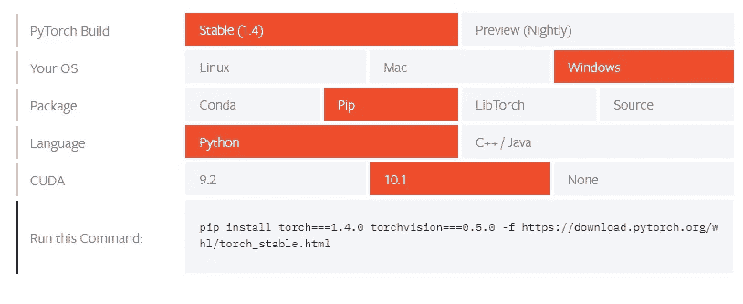
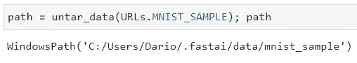
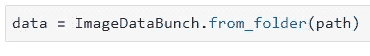
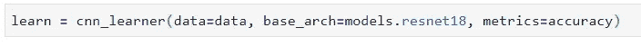
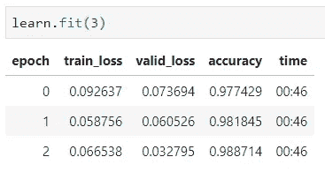
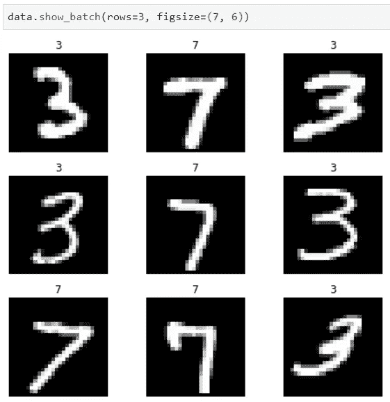
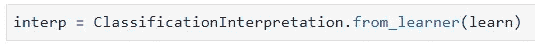
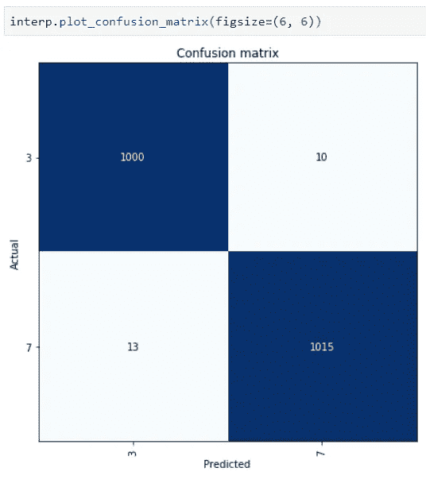
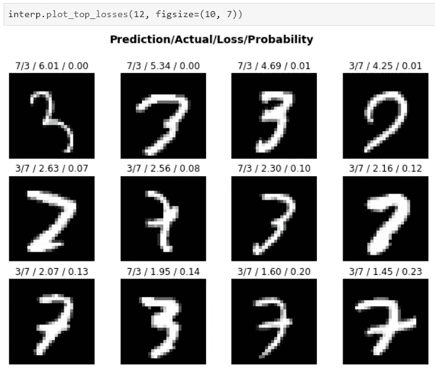

# FastAI 简介:安装和构建我们的第一个分类器

> 原文：<https://towardsdatascience.com/intro-to-fastai-installation-and-building-our-first-classifier-938e95fd97d3?source=collection_archive---------7----------------------->

## 提示:仅用 5 行代码就能在 MNIST 上达到 98%的准确率！

FastAI 是一个简化神经网络训练的库。它基于深度学习最佳实践的研究。开箱即用支持:

*   视力
*   文本
*   表列数据
*   协同过滤


让·格柏在 [Unsplash](https://unsplash.com?utm_source=medium&utm_medium=referral) 上的照片

在接下来的文章中会有更多的介绍。现在，我只想说我是**而不是**这个库的所有者，我只是一个用户，我不打算以任何方式、形状或形式推销这个产品。你在这里读到的一切都是基于个人经验。现在回到文章。

对每一个深度学习库的介绍都是从它处理 **MNIST 数据集**的能力开始的，这是一个包含手写数字的 28x28 像素照片的标准数据集。我以前在 Tensorflow 和 Keras 中训练过这个模型，虽然这几乎是一件微不足道的事情(只要你对神经网络有基本的了解)，但它不可能与 FastAI 竞争，至少在实现速度方面。

以下是如何使用 **ResNet18** (预训练卷积神经网络)对 MNIST 数据集样本进行训练:

```
path = untar_data(URLs.MNIST_SAMPLE)
data = ImageDataBunch.from_folder(path)
learn = cnn_learner(data, models.resnet18, metrics=accuracy)
learn.fit(1)
```

是的，那只有 4 行代码(好吧，我们没有计算一行用于导入)，但是只有这样才能给你 97%的准确率。但是我想得太多了。在我们实际训练模型并做出预测之前，我们需要正确地**设置**这个该死的东西，所以下一节将会介绍这个过程。

# 安装选项

FastAI 库的所有者建议您拥有一台带 GPU 的计算机。如果你没有，这并不是世界末日，因为有很多可行的选择。

以下是您拥有的**选项**:

*   本地安装(你应该有一个 GPU)
*   使用 [Google Colab](https://course.fast.ai/start_colab.html)
*   使用其他[在线 Jupyter 环境](https://course.fast.ai/#ready-to-run-one-click-jupyter)

由于我的笔记本电脑上的 GPU 相当不错，我将深入讨论第一个选项。其他选项在提供的链接中有很好的介绍。

# FastAI 本地安装

以下是我的机器的一些细节:

*   Windows 10 x64
*   英伟达 GeForce GTX 1650
*   16GB 内存

首先你需要下载 **Visual Studio、** **Nvidia CUDA Toolkit** 和 **cuDNN** 。幸运的是，我已经就此写了一篇文章:

[](/an-utterly-simple-guide-on-installing-tensorflow-gpu-2-0-on-windows-10-198368dc07a1) [## 在 Windows 10 上安装 Tensorflow-GPU 2.0 的简单指南

### 根据你的网速，不会超过 15 分钟。

towardsdatascience.com](/an-utterly-simple-guide-on-installing-tensorflow-gpu-2-0-on-windows-10-198368dc07a1) 

不要因为它说 Tensorflow 而感到困惑，你只需要设置上面提到的 3 件事，然后你就可以回到这篇文章。

***好的，进展顺利吗？*** 我们继续吧。

开始时，你需要 PyTorch，因为 FastAI 是基于它的。因为我运行的是没有 Anaconda 的 Windows 机器，并且安装了 CUDA 版本 10.1 或更高版本，所以我必须在命令提示符下执行:

```
pip install torch===1.4.0 torchvision===0.5.0 -f [https://download.pytorch.org/whl/torch_stable.html](https://download.pytorch.org/whl/torch_stable.html)
```

然而，你的可能会不同。您可以在这里找到它[，只需确保点击与您的配置相关的内容:](https://pytorch.org/get-started/locally/˛)



对我来说，下载大约需要 750MB，所以可能需要一段时间，这取决于你的网速。一旦完成，我们可以继续进行。在安装 FastAI 本身之前，唯一需要的是 **Jupyter 笔记本扩展**(如果你正在使用 Jupyter，确保不要跳过这些)。之后，我们可以安装 FastAI:

```
pip install jupyter_contrib_nbextensions
pip install fastai
```

太好了，我们现在已经在支持 GPU 的机器上安装了 FastAI。让我们看看如何使用它，真的很快。

# 示例—包含 5 行代码的 MNIST 分类器

提示—包括导入。现在，我们将探索只用 5 行代码训练一个简单的图像(数字)分类器有多容易。

首先，建议做一件让我有点焦虑的事情，那就是从一个库中**导入 star** (*)。基本上，这意味着我们将能够使用库提供的函数，而无需在每次调用前提供库名或前缀。这看起来是个好主意，但是一旦你的代码库变大，就很难确定这个函数是来自纯 Python，还是来自你的一些函数，或者其他什么地方。

尽管如此，这种约定是作者推荐的，所以我将在这里使用它，但是在你的项目中，想想这是否是你想要遵循的。让我们从导入开始:


如果我们没有任何**图像**，那么制作图像分类器就毫无意义。
幸运的是，FastAI 提供了`untar_data()`函数，如果 URL 不存在的话，它会将 URL 下载到目的地。现在，只需要第一个参数，因为我们可以将数据集下载到默认位置。

对于 URL，我们也可以从 FastAI 的`URLs`中受益——它有指向数据集的 web 位置的预定义变量。为了让这种简单的第一次动手体验变得更快，我们可以使用`MNIST_SAMPLE`数据集，它只包含数字 3 和 7 的图像。

这可能看起来像一个小数据集，但本文只是为了证明一点。数据集的路径将被存储到一个名为`path`的变量中，这样我们就可以看到数据集存储在哪里:



现在，当这些完成后，我们需要**加载**下载的数据。我们可以在一个`ImageDataBunch`类的帮助下做到这一点，并调用一个方法`from_folder`，顾名思义，该方法将从指定的文件夹中加载图像。

`path`变量可以作为参数传入，以指示图像存储的位置:



终于到了**训练我们模特**的时候了！

FastAI 再次让这个过程变得非常简单，因为它只基于一个函数调用。我们将使用期望三个参数的函数`cnn_learner()`:

*   `data` —您的图像
*   `base_arch` —基础模型架构，这里我们将使用 ResNet18
*   `metrics` —您想要用来评估模型的指标(为了简单起见，我在这里使用精确度)

代码实现:



现在我们准备好训练了！函数拟合将为我们的模型训练所需数量的**时期**，我将该参数设置为 **3** :



仅经过三个时期，模型就达到了令人印象深刻的 98.8%的准确率。现在让我们探索一下输入图像看起来是什么样子，以及模型在哪里做了错误的分类。

# 模型评估

函数`show_batch()`可用于显示模型中的数据。代码实现非常简单，无需进一步解释:



这里我还想介绍另外两件事，第一件是如何绘制**混乱矩阵**。为此，我们需要从 CNN 学习者那里创建一个`ClassificationInterpretation`对象。

代码显示如下:



从这里我们可以使用`plot_confusion_matrix()`函数来可视化模型错误分类的内容:



从对角线上可以看出，大多数分类是正确的。我们对一些图片进行了错误的分类，但是这没什么大不了的，对于 5 行代码来说仍然令人印象深刻。

FastAI 可以做的另一件方便的事情是向您实际显示模型错误分类的图像。我们可以通过使用`plot_top_loses()`功能来实现。

我决定展示前 12 个错误分类:



第一个值表示模型预测的值，第二个值表示实际值。

对于一些例子，我们不能真的责怪模型，因为图像是如此相似。

# 在你走之前

最后，这篇文章比我希望的要长一些，但我想做一个实际的演示，而不仅仅是谈论理论。

如果你对 FastAI 库感兴趣，请继续关注*的数据科学*和我的个人资料，因为还会有更多类似的文章。

感谢阅读。

*喜欢这篇文章吗？成为* [*中等会员*](https://medium.com/@radecicdario/membership) *继续无限制学习。如果你使用下面的链接，我会收到你的一部分会员费，不需要你额外付费。*

[](https://medium.com/@radecicdario/membership) [## 通过我的推荐链接加入 Medium-Dario rade ci

### 作为一个媒体会员，你的会员费的一部分会给你阅读的作家，你可以完全接触到每一个故事…

medium.com](https://medium.com/@radecicdario/membership)