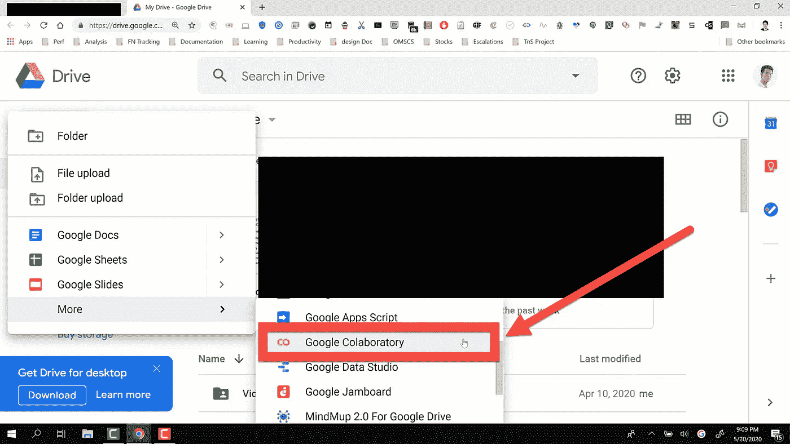
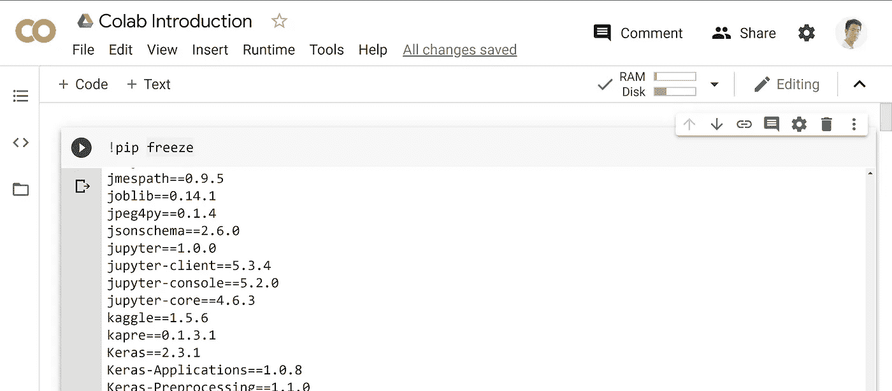
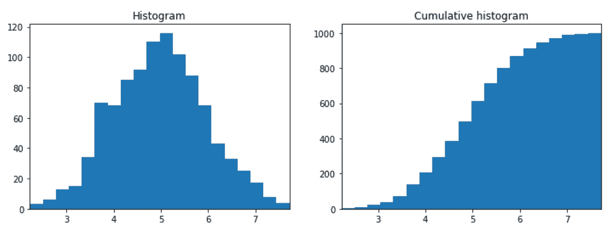
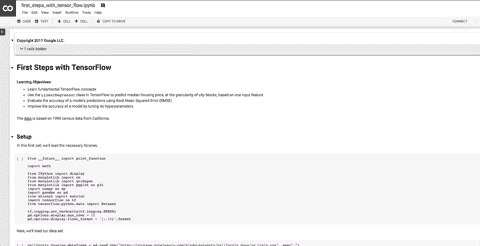
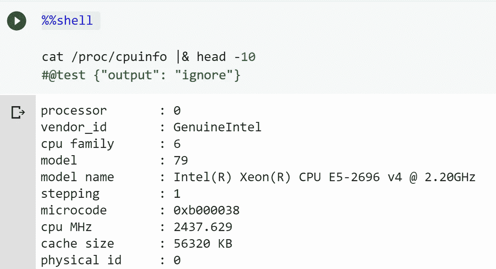
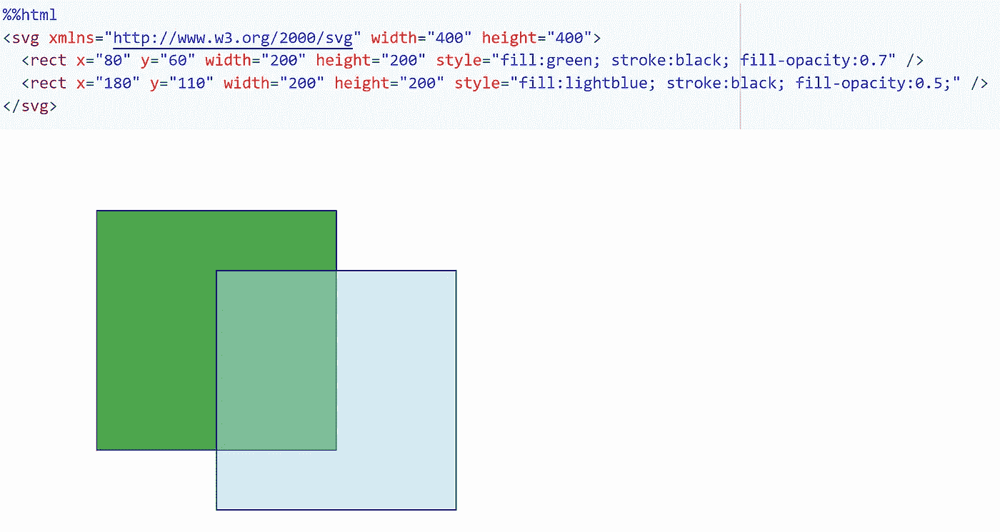
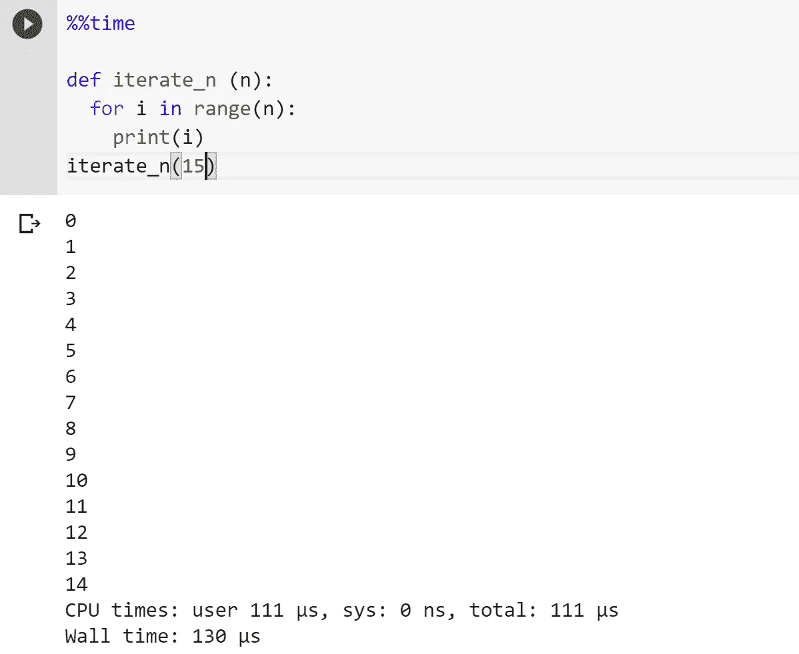
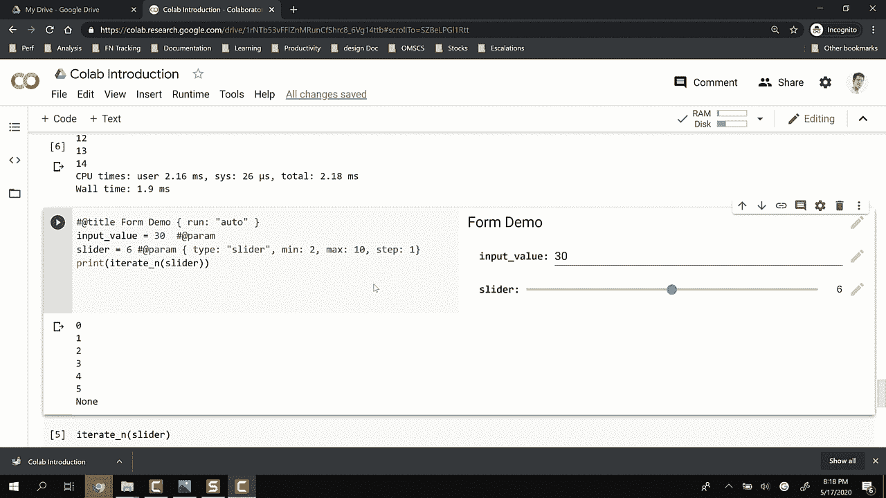
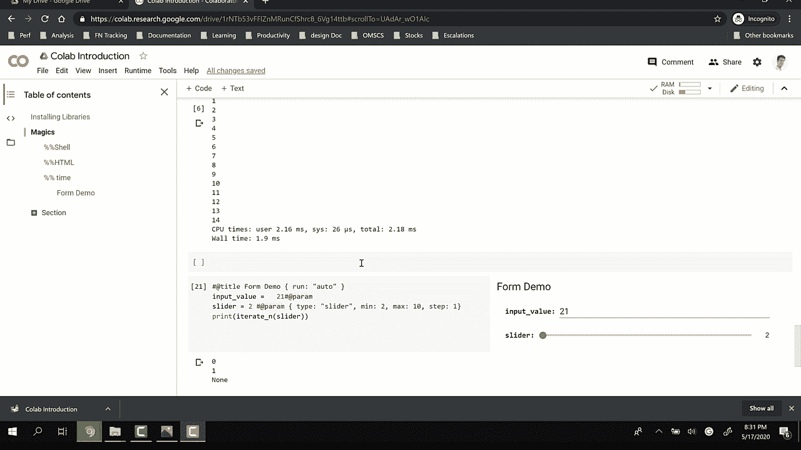
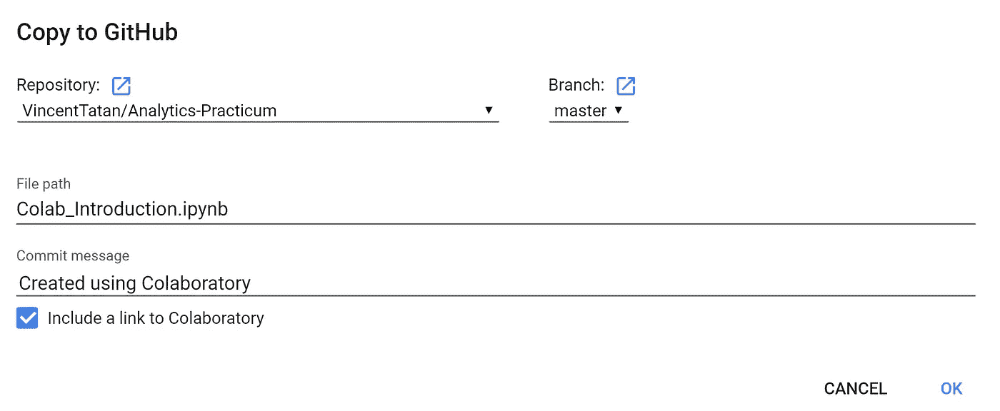

# Google Colab 数据分析简介

> 原文：<https://towardsdatascience.com/intro-to-google-colab-for-data-analytics-da5e3a37af8a?source=collection_archive---------34----------------------->

## 我对有抱负的数据科学家的建议

## 面向数据科学家的终极云交互式笔记本电脑


来源( [Unsplash](https://www.google.com/search?q=google+colab&source=lmns&bih=939&biw=2034&rlz=1C1GCEA_enSG866SG866&hl=en&ved=2ahUKEwjs66at9rrpAhW25jgGHZWuD7YQ_AUoAHoECAEQAA) )

> 我的笔记本电脑中安装了太多 Python！我很困惑。
> 
> 设置 Tensorflow 太费时间了！
> 
> 发送 Jupyter 笔记本版本是浪费时间！

您是否曾经希望有一个现成的启动环境，可以直接启动您的分析，而无需安装库和依赖项？

在本教程中，我想与你分享我日常工作中经常使用的神奇产品——Google Colab。

Google Colab (Colaboratory)是一个数据分析工具，它将代码、输出和描述性文本合并到一个文档中— [来源](https://colab.sandbox.google.com/notebooks/welcome.ipynb)

本质上，您可以获得 TPU 和 GPU 处理，它们已经针对云中的数据分析管道进行了优化。

这使得你可以使用流行的库，如 Theano，Tensorflow 和 Keras，直接运行深度学习。类似地，您可以生成图形并共享分析输出，就像文档和工作表一样。

> 感兴趣吗？我们开始吧！！

# Google Colab 是什么？

> **Google Colab 是 Jupyter 笔记本+云+ Google Drive**

Colaboratory 是一个数据分析工具，它将代码、输出和描述性文本合并到一个文档中(交互式笔记本)。

**Colab 提供 GPU，完全免费。通过使用 Google Colab，您可以:**

*   在标准化环境中快速构建您的分析产品。
*   促进流行的 DL 库，如 PyTorch 和 TensorFlow
*   在您的 Google Drive 中共享代码和结果
*   保存副本并创建知识共享的游乐场模式
*   Colab 可以在云上运行，也可以在带有 Jupyter 的本地服务器上运行

colab 的免费版本没有保证和限制；使用限制经常波动，这是 Colab 免费提供这些资源所必需的。

好消息是，你可以订阅 [Colab Pro](https://colab.research.google.com/signup?utm_source=faq&utm_medium=link&utm_campaign=seems_too_good) 或者用[谷歌云产品](https://medium.com/@senthilnathangautham/colab-gcp-compute-how-to-link-them-together-98747e8d940e)运行专用服务器。这两个选项都很简单，部署只需 20 分钟。

如果您想跟随下面的教程，请随意使用这个 Colab 文件。运行它，了解 Colab 如何简化您作为数据分析师/科学家的工作。

[](https://drive.google.com/file/d/1rNTb53vFFlZnMRunCfShrc8_6Vg14ttb/view?usp=sharing) [## Colab 简介

### 合作笔记本

drive.google.com](https://drive.google.com/file/d/1rNTb53vFFlZnMRunCfShrc8_6Vg14ttb/view?usp=sharing) 

# 准备好使用 Google Colab

有了 Colab，你可以在 Google Drive 中编写一个可共享的 Python 交互式笔记本。在本教程中，我们将进行 6 个简单的实践来使用 Google Colab。

# 打开 Google Colab



查找 Google Colab

1.  打开你的 google drive
2.  右键单击并打开 Google Colab
3.  重命名您的笔记本
4.  搞定了。好好享受你的笔记本。

# 安装库

令人欣慰的是，Colab 已经在每个运行时提供了大量的 python 库。

有时，您可能会遇到对附加库的需求。在这种情况下，您应该使用 Colab 中的 pip 或 apt 包管理器 bash 命令下载它们。

您需要做的就是用`!`启动 bash 命令，这告诉 Colab 这个笔记本单元不是 python 代码，而是命令行脚本。

要运行 bash 命令，应该在代码行之前添加`!`。例如`!pip freeze`或 `!pip install <DL Library>`

Google 协作运行时的免费版本不是持久的，因为它会为每个终止的会话跳转。这意味着每次连接到 Colab 笔记本电脑时，您都需要重新安装库。

要获得已经可用的库，你可以使用`!pip freeze`



注意，包括 Keras、Tensorflow、Theano 在内的顶级深度学习库已经存在，随时可以使用。

> 所有这些都不需要一次又一次地安装一个库。

# 运行代码和可视化

像往常一样在 python 笔记本中运行它们。导入库并立即使用它。您不需要添加`%matplotlib inline` 来显示 Colab 中的可视化。

> 这些已经在 Colab 运行时中进行了配置。



Colab 运行时的可视化

# 快捷指令

快捷键类似于 Jupyter Notebook，只是在 Jupyter Notebook 的快捷键前加了一个前缀`CTRL/CMD + M` 。



**查看快捷列表 CTRL/Command + M + H**

**创建和运行新单元**

*   CTRL/CMD M + A →在选择上方创建单元格
*   CTRL/CMD M + B →在所选内容下方创建单元格
*   CTLR/CMD M +M →切换到降价模式
*   CTRL/CMD M + Y →切换到代码编辑模式。
*   CTRL/CMD M + D→删除单元格

**运行电池也有类似的快捷方式**

*   SHIFT + ENTER →运行并移动到下面的单元格/如果不存在则添加
*   ALT+ ENTER →运行并在下面添加单元格
*   CTRL + ENTER →运行并停留在选定的单元格处

# 魔法

[Colab](http://go/colab-magic-reference) 和 [IPython](http://go/colab-magic-reference#ipython-built-in-magics) 都有“魔力”，可以让你把 Python 和其他语言(比如 shell 或者 Dremel SQL)混合使用。

这些是我经常用来提高效率的一些魔术。

> 一个重要的警告:单元格魔术(以`%%`开头的魔术)必须是单元格中第**个**非注释行。这意味着你不能在单个细胞中导入和使用细胞魔法。

## % %外壳

Shell magic 有助于查看当前的服务器环境规格。为了改进当前的服务器规格，您需要启动 Google 云平台(GCP)虚拟机(VM)并将连接重定向到 Colab 运行时(端口转发)。



## %%HTML

在 Colab 中构建 HTML 命令可以方便地运行 Python 库中没有的可视化。它还允许我们很好地适应 HTML 和 CSS 中的 web 平台。在这种情况下，我们使用 SVG 来绘制可伸缩的矢量图。



## % %时间

我们总是需要从小样本开始探索。

在将它扩展到我们的生产量之前，测量算法运行的时间是有意义的。我们需要进行优化，然后对其进行扩展，以便对大型生产数据集进行更快的分析。



> 而且还有[更有](https://www.tutorialspoint.com/google_colab/google_colab_magics.htm)

# 构建交互式表单

交互式表单为您的客户增强了演示/用户可视化。您应该使用表单为您的客户提供与数据交互的方法。

为此，您需要从以下语法开始

```
----Form starter---
#@title <title of the form> {<attribute>}
----Form Item ---
variable = <value> #@param {<attribute>} 
```

`form starter` 将在 Google Colab 中呈现交互表单。

`form items` 是直观的。只需在属性中添加#@param，就可以控制交互。Google Colab 会将值注入到变量中，然后在每次更改值时运行单元格。



多功能且易于构建的交互式表单

# 存储/下载/插入到 Github

在 Colab 之外，您可以进行 3 种导出:

1.  下载到。ipynb，。py，甚至。超文本标记语言
2.  存储在 Google Drive 中并提取共享链接
3.  直接把它连接到你的 Github 库:这是一个开发你的作品集的简单方法。它将笔记本上传到你的 Github 库。

> 非常方便地开发您的数据科学家组合



[Github 链接已创建](https://github.com/VincentTatan/Analytics-Practicum/blob/master/Colab_Introduction.ipynb)

# 最后的想法


来源: [Unsplash](https://unsplash.com/photos/_dpmh_NbXOo)

我相信这些代码很容易在您的第一次 Colab 探索中直接实现。

一如既往，如有任何问题，请通过 Linkedin 联系我。如果时间允许，我很乐意回答你的问题。

索利·德奥·格洛丽亚

# 关于作者

文森特用 ML @ Google 对抗网络滥用。文森特使用高级数据分析、机器学习和软件工程来保护 Chrome 和 Gmail 用户。

除了在谷歌的工作，Vincent 还是《走向数据科学媒体》的特约撰稿人，为全球 50 万以上的观众提供有抱负的 ML 和数据从业者的指导。

在空闲时间，文森特在佐治亚理工学院攻读硕士学位，并为铁人三项/自行车旅行进行训练。

最后，请通过[**LinkedIn**](http://www.linkedin.com/in/vincenttatan/?source=post_page---------------------------)**[**Medium**](https://medium.com/@vincentkernn?source=post_page---------------------------)**或** [**Youtube 频道**](https://www.youtube.com/user/vincelance1/videos?source=post_page---------------------------) 联系文森特**