# 马尔可夫链蒙特卡罗简介

> 原文：<https://towardsdatascience.com/intro-to-markov-chain-monte-carlo-c6f217e00345?source=collection_archive---------19----------------------->

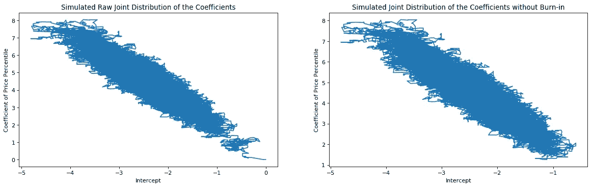

## MCMC 解释并应用于逻辑回归

在之前的一篇[文章](/bayesian-stats-101-for-data-scientists-a8c145a84259)中，我对贝叶斯统计做了一个简短的介绍，并告诉你贝叶斯分析如何结合你先前的信念和数据来找到感兴趣的参数的后验分布。我在文章中使用的问题是因为它很容易通过分析找到后验分布。通常情况并非如此，这个问题需要一个数值解。马尔可夫链蒙特卡罗(MCMC)算法就是这样一种模拟某些参数后验分布的方法。

在进一步阅读之前，你对贝叶斯统计有基本的了解吗？如果是，请继续阅读。如果没有，请在继续之前查看[这篇文章](/bayesian-stats-101-for-data-scientists-a8c145a84259)。它涵盖了学习马尔可夫链蒙特卡罗(MCMC)之前需要知道的一切。

## 大都会-黑斯廷斯算法

Metropolis-Hastings 算法是对 MCMC 采样的一个很好的介绍。有 5 个步骤。在深入研究之前，让我们先定义一些参数和函数。

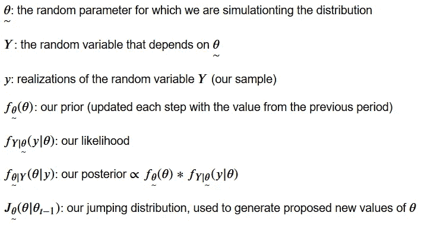

现在我们已经定义了参数、变量和函数，我们可以继续进行 Metropolis-Hastings 算法的 5 个步骤。

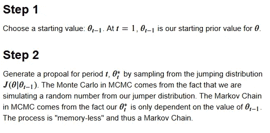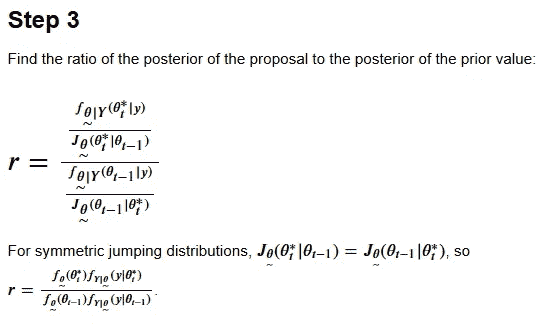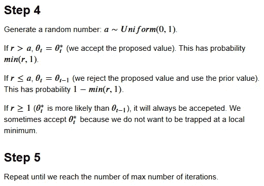

一旦你知道它是如何工作的，就没那么可怕了，对吗？

通常使用正态分布作为跳跃分布，因为以 0 为中心的正态分布可以产生小于或大于前一个建议的建议。跳跃分布的标准偏差是一个重要的调整参数。如果你的先验远离数字线上后验的密集部分，并且你的跳跃分布的标准偏差很小，那么在你开始从数字线的正确部分生成建议之前，将需要很长时间。如果您的跳跃分布的标准差相对于参数的真实分布太大，您的模拟后验概率将会有很多缺口，因为在这些位置没有生成建议。幸运的是，MCMC 的最佳软件包对它们的跳跃分布有自适应的标准偏差，所以在实践中你不必太担心这个参数。

一旦你生成了模拟的后验，标准的做法是“烧掉”一部分。这是因为该算法可能需要多次迭代来搜索参数空间中可能的值。要使用 10%老化，只需丢弃前 10%的模拟值。在去除“老化”之后，我们有了可以用于贝叶斯推断的模拟后验概率，例如构建可信区间。

## 应用改进的 Metropolis-Hastings 法进行逻辑回归

现在我们了解了 Metropolis-Hastings，我们可以对其进行修改，以适应逻辑回归模型中的系数。被估计的参数是 **𝛽𝑗** 对 **𝑗=1,2,…𝑘** 的，其中 **𝑘** 是模型中系数的数量。主要区别在于将有多个参数需要估计，而不是一个。我通过为每一轮的每一个 **𝛽𝑗** 生成提议来处理这个问题，但是每一轮都将**𝛽𝑗***的顺序随机化。*

*为了构建适合逻辑回归模型的 MCMC 算法，我需要定义 4 个函数。这将允许我们在 MCMC 算法的每一步计算我们的后验概率与建议的 **𝛽𝑗** 的比率。*

***功能 1***

*第一个是 ***inv_logit*** ，撤销一个 logit 转换。logit 变换将概率转换为对数概率。*

*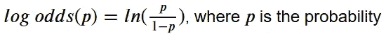*

*对数优势公式*

*逻辑回归的输出是对数优势格式。给定我们的数据，在计算我们的 **𝛽** 向量的对数似然时，我们需要这个函数来将预测的对数几率转换成概率。*

*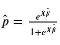*

*逻辑回归的逆 Logit 方程*

***功能 2***

*第二个是 **normal_log_prior** ，它计算我们的 **𝛽** 向量的先验对数，给出我们关于个体 **𝛽𝑗** 的均值和标准差的先验信念。它是多元正态分布密度的自然对数，其中每个元素是 **𝑁∼( *先验均值 j* 、*先验标准差。戴夫。j* )** 在 **𝛽** 处。我们使用自然对数来防止下溢。*

***功能 3***

*第三个是 **log_likelihood** ，它在给定数据的情况下计算我们的 **𝛽** 向量的似然对数。当我们用我们的逻辑回归对一个 2 类问题建模时，单个观察值具有伯努利概率质量函数( *PMF* )。*

*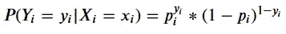*

*伯努利·PMF*

*给定数据，我们的 **𝛽** 向量的可能性是单个 PMF 的乘积。*

*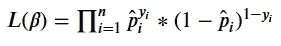*

*给定数据，我们的 **𝛽** 向量的可能性*

*对数似然率为:*

*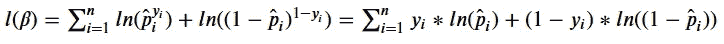*

*我们使用自然对数来防止下溢。*

***功能 4***

*最后， **log_posterior** 根据给定的数据和我们的先验信念计算出 **𝛽** 向量的后验概率。 **𝑝𝑜𝑠𝑡𝑒𝑟𝑖𝑜𝑟 ∝ 𝑝𝑟𝑖𝑜𝑟∗𝑙𝑖𝑘𝑒𝑙𝑖ℎ𝑜𝑜𝑑，所以𝑙𝑛(𝑝𝑜𝑠𝑡𝑒𝑟𝑖𝑜𝑟)∝𝑙𝑛(𝑝𝑟𝑖𝑜𝑟)+𝑙𝑛(𝑙𝑖𝑘𝑒𝑙𝑖ℎ𝑜𝑜𝑑)**。*

*有了这些定义，我就能够实现一个修改过的 Metropolis-Hastings。我还添加了一些功能来消除“老化”，计算可信区间，并进行预测。为了进行预测，用户需要指定他们是否想要使用每个 **𝛽𝑗** 的模拟后验概率的中值、平均值或模式作为 **𝛽** 的估计中的系数。*

*定义好类后，我们可以在真实数据上测试它。*

## *MCMC 逻辑回归在实际数据中的应用*

*为了测试 MCMC 逻辑回归模型，我使用了这个包含 86 种糖果数据的[数据集](https://www.kaggle.com/fivethirtyeight/the-ultimate-halloween-candy-power-ranking/)。我选择了一个简单的模型，包含截距和“pricepercent”(相对于集合中其他部分的单位价格百分比)。)来预测糖果是巧克力的概率。*

*模型是:*

*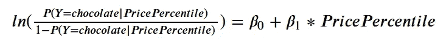**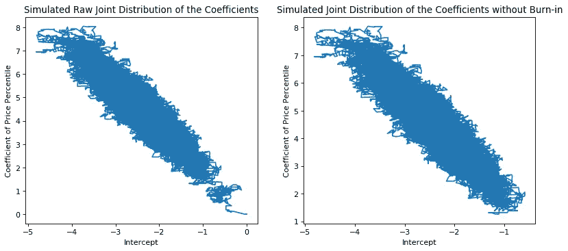*

*如你所见， **𝛽0** 和 **𝛽1** 的模拟联合分布正在形成一个椭圆区域(就像广义线性模型中的联合分布一样)。在包含预烧回合的联合分布图中，系数从原点“行走”，在一个圆中走了一段，然后到达椭圆区域。这是从先验到我们可以认为是“真实的”模拟联合分布的区域的系数。*

*𝛽0 的 95%可信区间为[-3.67，-1.32]，𝛽1**的 95%可信区间为[2.50，6.72]。𝛽0** 的模拟中值为-2.44，𝛽1**的模拟中值为 4.48。价格越贵，糖果成为巧克力的可能性就越大。***

*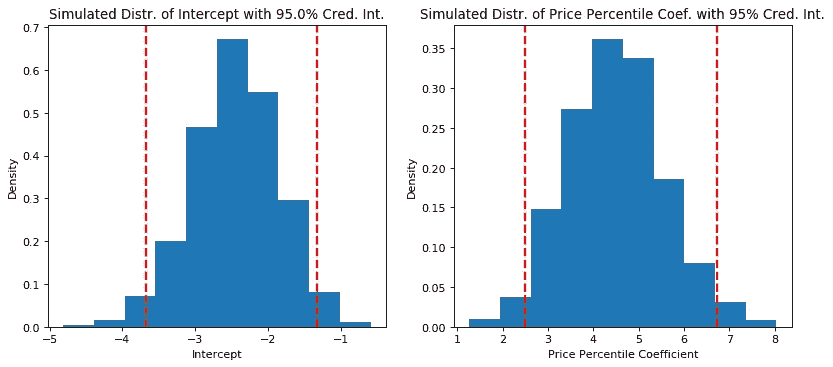*

*查看价格百分位数与巧克力概率的关系图，我们可以看到我们的模型有一个很好的 S 曲线形状，如逻辑回归教科书中所示。它似乎在将糖果归类为巧克力方面做得不太好(与真阳性相比有很多假阴性)，所以可能需要一个更复杂的模型。**

*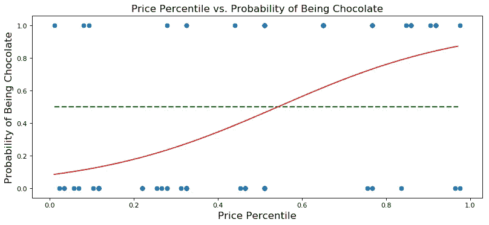*

**当然，在构建真正的预测模型时，您应该使用验证和测试数据集来评估模型的性能。训练、验证、测试过程不是本文的主题；应用 MCMC 是。*

## *与用 MLE 估计的逻辑回归相比*

*现在，我们已经用修改的 Metropolis-Hastings 算法拟合了逻辑回归，让我们将结果与标准的最大似然估计进行比较。结果很像！*

*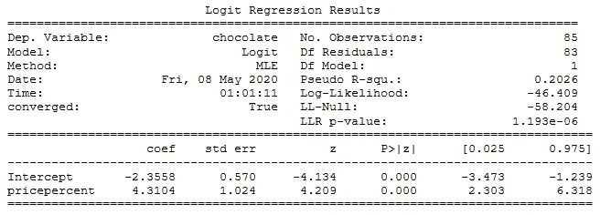*

*极大似然逻辑回归模型综述*

*如果我做对了，你知道理解 MCMC 背后的想法，特别是 Metropolis-Hastings，并且理解它们如何应用于实际问题，例如拟合逻辑回归模型。*

*感谢阅读！如果你对 MCMC 和贝叶斯统计建模和机器学习感兴趣，请查看 [pymc3](https://docs.pymc.io/) 。*

*在这里找到我的项目库。*