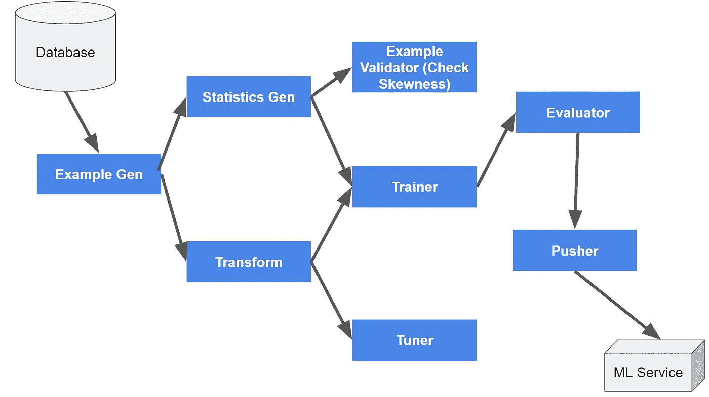

# ML 操作简介:Tensorflow Extended (TFX)

> 原文：<https://towardsdatascience.com/intro-to-ml-ops-tensorflow-extended-tfx-39b6ab1c7dd7?source=collection_archive---------23----------------------->

## 我对 ML 工程师和数据科学家的建议

## Google、AirBnB 和 Twitter 如何可靠地部署他们的 ML 系统。

来源 [Unsplash](https://unsplash.com/photos/u_RiRTA_TtY)

# 为什么技术债务会让你做噩梦？

> 我们中的许多人在没有适当的开发和技术债务管理的情况下就投入了 ML/AI 的炒作。这和用牙签造机器人是一样的。 *—文森特·塔坦* [*上 MLOps，技术债*](/intro-to-mlops-ml-technical-debt-9d3d6107cd95)

在过去的博客中，我谈到了 MLOps 和技术债务，它们将你的 ML 系统变成了一个巨大的噩梦，带来了大量的金钱损失。

开发 ML 系统就像经营一家酒店；如果不加以处理，问题就会出现，害虫滋生，服务变得不稳定。这个错误导致亚马逊损失了数百万美元，因为他们的“ [ML 定价推荐器”在黄金时段](https://www.washingtonpost.com/technology/2019/07/20/amazons-best-prime-day-deal-was-likely-an-accident/)出了问题。

 [## MLOps 简介:ML 技术债务

### 为什么 ML 会成为你最大的噩梦

towardsdatascience.com](/intro-to-mlops-ml-technical-debt-9d3d6107cd95) 

在本文中，我们将讨论补救措施:谷歌 TFX (Tensorflow Extended)。一个很棒的 MLOps 工具，可以与 flow pipeline 一起构建一个健壮、透明的 ML 系统。如果使用得当，它可以让您更轻松地保持最先进的 ML 性能，同时减缓 ML Ops 技术债务。

**免责声明:文中表达的观点、想法和意见仅属于作者，不一定属于作者的雇主、组织、委员会或其他团体或个人**。**所有信息纯粹是为了我自己的学习目的，是从公开的** [**TFX 文档中总结出来的，加上我自己在谷歌与 TFX 共事的亲身经历。我写作纯粹是为了我自己的副业，绝不是出于任何隐藏的目的。**](https://www.tensorflow.org/tfx/api_docs/python/tfx/components/ModelValidator)

# 如何处理 ML 技术债？

根据我的经验，要可靠地部署您的 ML 系统，有 3 个最重要的考虑因素。

## ML 模型组件的精心编排

> 假设你是一名新的 ML 工程师，正在开发一个系统来生产一个可靠的模型。
> 
> 你如何管理和跟踪你的模型组件和版本？

每个 ML 操作阶段(取样、培训、评估和服务)都需要很好的理解。当数据分布和最佳拟合 ML 模型随时间变化时，这变得具有挑战性。几个月之后，您将不得不储备 ML 模型版本，并且可能会因为没有维护好的模型清洁度而停机。

我认识一个朋友，他用定制脚本和粘合代码解决了 ML 中断问题。虽然这在短期内行得通，但这会导致脆弱的代码、多余的翻译工作以及让他们困惑的大量技术债务。它变得如此荒谬，以至于可能需要一年多的时间才能在系统中引入一个小的政策变化。不用说，这家初创公司正在努力实现商业价值。

为了确保正确的版本控制和维护，我们需要一个透明可靠地跟踪 ML Ops 组件的系统。没有适当的跟踪和回滚系统的 ML 工程师团队将无法成功部署可靠的 ML 模型。

> ML 操作需要清晰和一致。新的 ML 工程师需要了解 ML 培训和服务流程，以管理他们的版本和解决中断。

## 简化快速可控的变更，以满足业务需求

> 我们如何可靠地培训和服务不同的模型？

ML 工程工作对业务至关重要。想象一下亚马逊上一个定价推荐的例子。这个 ML 系统将总是需要保持不断变化的业务变化。想象一下促销力度、价格下限/上限，甚至竞争对手的公平数据政策。不同的外部因素会对 ML 推荐系统堆积复杂的更新。这将导致可能导致奇怪结果的错误(还记得亚马逊 Prime Day 丑闻)。

> 模型和系统的每一个变化都需要透明。每个模型和数据验证都被正确地标记和版本化。跟踪所有修复。

## 对业务和生产指标的一致评估

> 如何确保我们的模型不会失控并给我们带来巨大损失？

当您部署一个模型时，您将需要一个适当的仪表板来展示您的模型在现实生活数据中是否表现良好。集成测试是这里的关键。在谷歌，我们总是有实验、调试和生产模型。

每个 ML 模型都需要经过每个宇宙。它需要通过模拟测试在实验层面进行培训和验证。一旦我们准备好将它发布到真实的数据中，我们就将它推向调试，以控制有限的流量和沙箱。在我们调整调试阈值和微调模型之后，我们将把它投入实际生产。我们需要遵循数据清洁度(分布、偏斜度)、业务需求(精度、召回、货币结果)和生产指标(延迟、规模和可靠性)。

> 测试和影响评估对于确保可靠和高质量的 ML 生产系统至关重要

# 输入谷歌 TFX (Tensorflow 扩展版)

谷歌 TFX(公共[来源](https://www.tensorflow.org/tfx)

TFX 是一个基于 Tensorflow 的平台，用于托管端到端的机器学习管道。使用 TFX 配置框架，您将准备管道来清理数据、训练和服务于生产就绪的机器学习系统。TFX 在谷歌非常受欢迎，我们几乎在每部 ML 作品中都使用 TFX。

TFX 允许您创建一个强大的 ML 生产管道。TFX 提供模块化、灵活、协作、可访问和易于使用的 ML Ops 平台。每个 TFX 组件都允许对 ML 模型进行适当的存储、配置和编排。

从本质上来说，TFX 是研究人员和工程师之间快速安全采用 ML 的伟大联姻。TFX 的特点是公平、稀有条件、数据生命周期管理和软件开发生命周期问题(SDLC)。

## TFX 管弦乐团

Orchestrators 自动执行任务并监控 TF 组件。最大的 TFX 管弦乐队之一是阿帕奇梁。Apache Beam 是统一的批处理和流分布式 API，它充当运行在分布式处理框架之上的抽象层。这允许您在不同的后端上工作，例如 Apache Spark、Local、Dataflow 等。

## 元数据存储

元数据是一个开源框架，用于在通用数据库中存储 ML 元数据，该通用数据库可由基于 SQL 的语言访问。此元数据保存所有组件记录，并允许我们将结果与以前的模型进行比较，并从模型中继承。它审计并优化了管道，将重点放在数据缓存上，并允许我们向前跟踪，从我们停止的地方开始。

在 TFX 的生产部署中，您使用 ML 元数据(MLMD) API 访问元数据，该 API 将属性存储在 MySQL 数据库或持久存储中。

## TFX 组件

我起草并试验的样本流

TFX 使用 Flow/DAG 来模块化 ML 管道的组件。这里是一些初学者的入门组件。

1.  **ExampleGen** 将样本数据接收到基目录中。示例生成格式转换、连接等。您可以使用`CsvExampleGen`从 csv 或 n 张量生成原始数据。
2.  **StatisticsGen** 计算统计数据，如数据分布和异常检测。您可以使用`StatisticsGen` 来计算描述性统计数据，以进行数据完整性检查。
3.  [**SchemaGen**](https://www.tensorflow.org/tfx/guide/schemagen) 使用 TF 数据验证库来定义预期的界限、类型和属性，以确保数据的有效性和整洁性。想象一下，如果我们有性别特征，而系统在没有准备好的情况下开始输入“躁郁症、LGBT 等”,未知标签会使系统崩溃。
4.  **示例验证器**使用 TF 数据验证库来检测数据中的异常。默认情况下，它根据模式验证统计数据，以检测分布异常。这是识别不可靠数据的金丝雀过程。
5.  **Transform (TF Transform)** 生成 `tf.transform` 图和`transformed_example`作为培训和服务的特征工程师输出。它提供了运行作业、创建转换图和运送到训练器组件的实用函数。tf.transform graph 既指向包含预处理数据模式的`transformed_metadata` ，又指向包含实际预处理图的`transform_fn` 。
6.  **训练师**:实现 TF 模式。我们通过 tf 进行集成。学习对决策树/定制评估器建模。教练有缓存，允许我们在中断后继续。培训师培训两种服务模式:生产和评估。
7.  **调谐器**:进行超参数调谐。在谷歌，我们使用众所周知的[维齐尔](https://static.googleusercontent.com/media/research.google.com/en//pubs/archive/46180.pdf)。
8.  **评估器**:评估模型性能指标，验证新训练的模型是否优于之前的模型。它为频繁的 ML 模型训练和服务运行自动健全检查。
9.  **Pusher** :将经过充分验证的模型推送到可配置的目标，例如用于移动设备的 TF Lite 和用于服务器群的 TF Serving。推送器还管理`_serving_model_dir` 和回滚。
10.  **模型验证器**:根据规定的基线对候选模型进行质量验证。模型验证器比较并决定最后一次验证，以推动所服务的当前模型。
11.  **InfraValidator** :执行服务基础设施验证以确保模型服务。
12.  **其他组件**:标签根、取样器、标签杆

# 文件和规范的参考

如果你想了解更多，请随时从 [TFX 文档](https://www.tensorflow.org/tfx)和 [Colab](https://colab.sandbox.google.com/github/tensorflow/tfx/blob/master/docs/tutorials/tfx/components_keras.ipynb#scrollTo=N-ePgV0Lj68Q) 获取全部细节。就我个人而言，我充分利用了这些资源，并在工作中贯彻了这些理念。

# 结论

通过在您的 ML 管道中实施 TFX 及其工作流程。您将获得以下好处:

1.  **ML 模型组件的精心编排。**您可以跟踪 DAG 管道中的组件。您可以快速理解一个新的 ML 项目，并了解每个组件如何协同工作以产生健壮的 ML 生产模型。
2.  **简化快速可控的变更，以满足业务需求。**您可以快速分离和编辑相关组件，以满足业务需求。例如，如果您需要更多地惩罚 FN，您可以在使用相同的缓存样本时替换模型版本。
3.  **对业务和生产指标的一致评估。**验证器和评估器组件确保您的新模型比之前的模型更加健壮可靠，即使在自动推送过程中也是如此。

我希望这是一本很好的读物，也是你发展和创新的灵感来源。

请在下面的**评论**提出建议和反馈。和你一样，我也在学习如何成为一名更好的数据科学家和工程师。请帮助我改进，这样我可以在下一篇文章中更好地帮助你。

索利·德奥·格洛丽亚

# 关于作者

Vincent Tatan 是一名数据和技术爱好者，拥有在 Google LLC、Visa Inc .和 Lazada 开展微服务架构、商业智能和分析管道项目的相关工作经验[。](https://bit.ly/2I8jkWV.?source=post_page---------------------------)

Vincent 是土生土长的印度尼西亚人，在解决问题方面成绩斐然，擅长全栈开发、数据分析和战略规划。

他一直积极咨询 SMU BI & Analytics Club，指导有抱负的数据科学家和工程师，并为企业开发产品开放他的专业知识。

最后，请通过[**LinkedIn**](http://www.linkedin.com/in/vincenttatan/?source=post_page---------------------------)**，**[**Medium**](https://medium.com/@vincentkernn?source=post_page---------------------------)**或** [**Youtube 频道**](https://www.youtube.com/user/vincelance1/videos?source=post_page---------------------------) 联系文森特