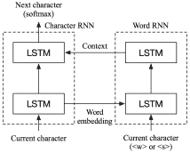
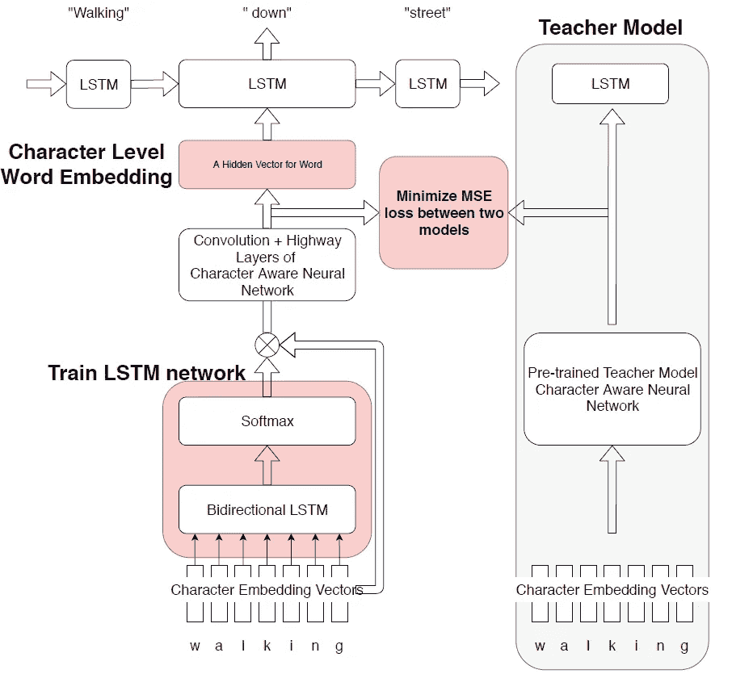
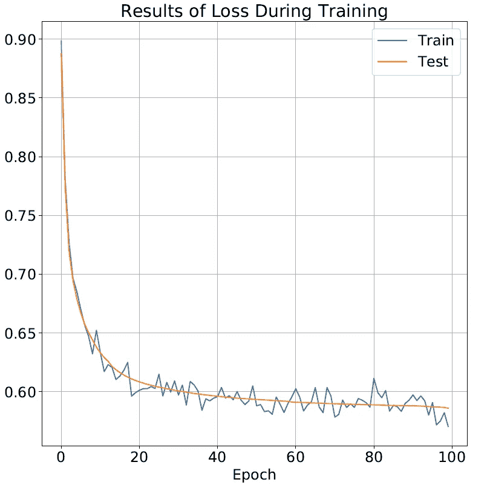
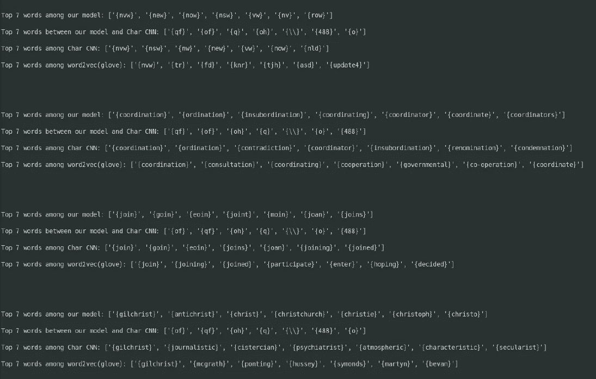
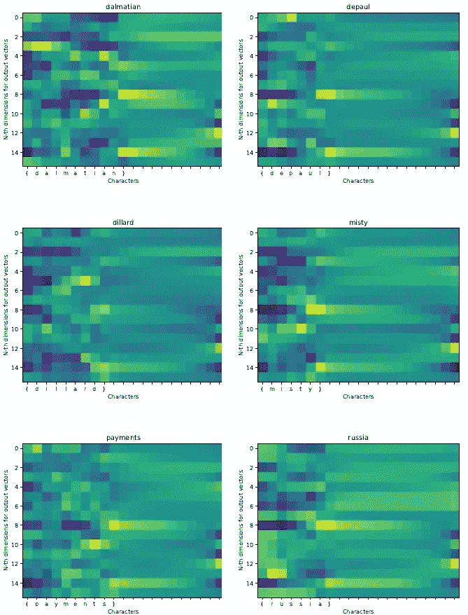

# 字符级语言建模

> 原文：<https://towardsdatascience.com/intro-to-nlp-and-language-models-47e85f9202e4?source=collection_archive---------23----------------------->

## 在 NLP 模型中利用知识蒸馏

等级 RNN(一个灵感)

语言模型是自然语言处理中的一个关键要素。好的 LM 可以描述单词之间的关系，帮助机器理解单词或句子的意思。目前，研究更倾向于单词嵌入而不是字符嵌入(单词的基本元素)。在本文中，我们主要研究字符级的单词嵌入。一个字符的体积比一个单词的体积小。因此，我们采用知识提炼的方法来训练我们的模型。我们试图让模型从变压器(BERT)字符感知卷积神经网络的双向嵌入表示中学习。然后我们用这个模型来检验几个相似单词的例子。

# 1 导言

LMs 根据文本中的例子学习一个句子或单词出现的概率。它们被应用于句子生成器、问题回答、情感分析、机器翻译等。最初，像 N-grams 这样的统计方法被用作 LMs。最近，神经语言模型，如基于神经网络的 LM (NNLM)已经远远超过了 N-grams，并取得了明显更好的[结果【1](#_bookmark1) 】。基于卷积和递归神经网络(分别为 CNN[[2](#_bookmark2)和 RNNs)的方法也已经被开发出来。为了对一个词进行建模，需要理解上下文。语境是由几个词构成的，为此发展了注意力的概念，其中焦点指向特定的词，以便产生句子的语境。基于这种注意机制，开发了变压器模型，其中使用多个层来分析上下文和聚焦单词[ [3](#_bookmark3) ]。自从引入 BERT 模型以来，现在的转换器使用双向层来分析上下文[ [4](#_bookmark4) ]。

# 2 相关工作

**传统 LMs 和单词嵌入**。传统的 LMs 使用 N 阶序列马尔可夫模型，其中平滑和计数用于计算 N 元概率[【5](#_bookmark5)】。对这些基于计数的技术进行训练是简单的，然而，尽管有这些平滑技术，由于数据的稀疏性，对稀有 N 元语法概率的估计可能会减少。相比之下，NNLMs 采用单词嵌入:参数在训练过程中学习，语义接近的单词的单词嵌入在向量空间中显示相似性[ [5](#_bookmark5) ]。例如，他们不能在无事件、无事件、有事件和有事件的向量空间中建立单词嵌入的先验。

**自然语言处理模型的可解释性**。NNLM 模型具有很高的精度，但与其他深度神经网络(DNN)模型一样，也存在同样的可解释性问题。计算机视觉的新方法

协助评估 DNNs[ [6](#_bookmark6) ]，使用潜在表示法，并附有可解释的输入值，如单词或图像像素，这有助于评估输入的显著性和贡献。现有的群体分为三类:基于梯度的方法，包括逐层传播和基于反演的传播。这些方法表明，中间层的定量评估提高了人们对 DNNs 内层的理解[ [6](#_bookmark6) ]。

**自我关注更深的 LMs**。到目前为止，角色级 LMs 一直由 rnn 主导。诸如 LSTMs 的 RNN 变体已经为角色级别的 LMs 提供了很好的结果。因为它涉及到我们的模型。艾尔。的工作展示了使用 64 个堆叠变压器层的网络时，字节级 LMs 的性能如何优于字 LMs。重要的是，他们表明深度转换模型可以提供比典型的 RNN 更好的结果，在中间序列和外层增加了损失函数。

**形态学分割**科特雷尔等。艾尔。[【8](#_bookmark8)】提出了一种上下文无关语法(CFG)方法，其中 I)单词本身的直觉被捕获，并且可能属于不同的组成成分，ii)词缀被附加的顺序以分层结构表示。这种基于 CFG 的方法是新颖的，并且有人认为这种分层方法比马尔可夫模型中的标准扁平分段更合适。从他们的研究中得出的结论是，层次结构可以提供更大的词素分割，并在总体上导致更大的准确性。

# 3 模型架构

我们使用了一个改进的字符感知 CNN 模型[ [5](#_bookmark5) ]，增加了一个字符嵌入门，如图 1 所示:

图 1:提议的模型架构

基本思想是使模型输出与预先训练的角色级 LM 相匹配。我们通过让 CNN 扮演一个“老师”的角色来做到这一点。字符感知 CNN 由字符嵌入层、CNN 层(具有几个内核大小的过滤器)、字符顺序方向的池、高速公路架构(Gate)和 LSTM 组成。我们还建议在字符嵌入层和 CNN 之间增加一个双向 LSTM 和 Softmax 门。Softmax gate 预计将调节来自每个字符的信息:模型输出(来自公路层的 525 维向量输出)和预训练的字符感知 CNN 的输出之间的均方误差(MSE)。如果模型的输出可以匹配预训练模型的输出，双向 LSTM 门可以避免不必要的字符嵌入进入 CNN 和公路层，允许 CNN 获得分段的字符级嵌入。我们期望双向 LSTM 门能够以某种方式将单词分割成变体。

# 4 个结果

我们使用手套数据集训练我们的模型。培训损失下降，如图 2 所示:

图 2:培训损失

其中根据训练和测试数据，两个模型都具有低损失。我们分析了模型高速公路层的单词嵌入输出，检查了随机选择的单词中 7 个最接近的单词嵌入，如图 3 所示:

图 3:相似词的结果

经由双向 LSTM 选通结果如图 4 所示:

图 4:LSTM 门的结果

单词被分成单词和填充区域。然而，我们无法观察到任何变形边界。

# 5 结论

我们构建了一个双向 LSTM 来实现输入字符级嵌入的门。该门有望减少投入和培训损失。提出的网络能够找到相似的字符级单词。然而，所提出的网络不能通过 LSTM 输出发现变体间隙，并且它不能学习教师模型的嵌入。可能的改进点包括:在第二个或第三个相似的隐藏层添加损失，以及在损失中实现互信息。具有字符意识的神经网络似乎不太适合学习，因为它们不能很好地找到相似的单词。

*我和我的同事撰写的原始乳胶文件*

# 参考

[【1】](http://www.jmlr.org/papers/volume3/bengio03a/bengio03a.pdf)约舒阿·本吉奥、雷让·杜查梅、帕斯卡尔·文森特和克里斯蒂安·贾乌文。一种神经概率语言模型。*机器学习研究杂志*，3(2 月):1137–1155，2003。

Yann LeCun，Léon Bottou，Yoshua Bengio 和 Patrick Haffner。基于梯度的学习在文档识别中的应用。电气和电子工程师学会会议录，86(11):2278–2324，1998 年。

[【3】](https://arxiv.org/abs/1706.03762)Ashish vas Wani、Noam Shazeer、Niki Parmar、Jakob Uszkoreit、Llion Jones、Aidan Gomez、ukasz Kaiser 和 Illia Polosukhin。你需要的只是关注。在*神经信息处理系统进展*中，第 5998–6008 页，2017 年。

雅各布·德夫林、张明蔚、肯顿·李和克里斯蒂娜·图塔诺娃。Bert:用于语言理解的深度双向转换器的预训练。 *arXiv 预印本 arXiv:1810.04805* ，2018。

Yoon Kim，Yacine Jernite，David Sontag 和 Alexander M Rush。字符感知神经语言模型。在*2016 年第三十届 AAAI 人工智能大会*。

[【6】](http://proceedings.mlr.press/v97/guan19a.html)关、王希庭、张全世、陈、狄鹤、邢燮。对自然语言处理中深层神经模型的深入和统一的理解。2019.

[【7】](https://arxiv.org/abs/1808.04444)Choe 等人。具有更深自我关注的字符级语言模型。*谷歌 AI 语言*，2018。

[【8】](https://www.aclweb.org/anthology/D16-1256/)库马尔·科特雷尔和舒茨。由内向外的形态学分割。 *ENMLP* ，2016。