# 面向地球科学计算的开放式数据库简介:第 1 部分，共 2 部分

> 原文：<https://towardsdatascience.com/intro-to-open-database-for-geoscience-computing-part-1-of-2-2ad214fc2388?source=collection_archive---------46----------------------->

## 了解如何在 Google Colab 中访问大量在线开放地球科学数据库


开放式地球科学计算。背景图像是 Dutch-F3 地震剖面。

如今，开放的地球科学数据对于研究、基准测试和项目目的非常重要。它们非常有用，在能源行业(石油、天然气和地热)和学术界工作的人利用这些数据集对他们的方法进行基准测试，也可以作为高等院校学生的可复制教材。与此同时，并不是所有的机构都能够获得广泛的工业商业软件或应用程序来计算和处理这些数据集。本文的目的是介绍如何充分利用开放数据库的教程。

我已经在互联网上编辑了至少三个大型开放式地球科学数据库，我相信现在每个人都可以“在同一个屋檐下”访问它们！这是三个开放的地球科学数据库。

*   Google Drive 中的公共地球科学数据
*   SEG Wiki 开放数据
*   地热数据储存库

***公共地球科学数据*** 是一个开放的数据库，可以作为 Google Drive 使用，由彼得·阿姆斯特兰德创建。该数据库包含广泛的可复制数据集，如**荷兰 F3** 和 **Canning** 项目的地震 3D 数据，GEOLINK 编制的**北海**项目的测井文件，用于训练和测试**机器学习**研究中数据集的各种地球科学图像，等等。

***SEG Wiki 开放数据*** 是勘探地球物理学家协会(SEG)拥有的可用开放地球物理数据目录。该目录包含 30 多个地球物理数据集，如**海上和陆上**地震数据和测井文件、**新西兰 3D** 项目、地球物理综合基准模型，如 **BP 基准模型**、**马尔穆西模型**、**KFUPM-考斯特红海模型**、重磁数据和地形-水深数据。

***地热数据仓库*** 或 ***GDR OpenEI*** 是由美国能源部(DoE)提供，美国国家可再生能源实验室(NREL)开发的开放式地热能源数据门户。顾名思义，这个数据门户主要关注地热和热液勘探数据，例如犹他州米尔福德附近的 **FORGE 项目**数据。

## Google Colab 是什么，为什么要用？

使用 Python 作为开源编程语言使人们能够开发各种功能强大的程序，因为它在地球科学目的中的应用也不可避免地得到了很好的认可。Python 编程语言现在也正在成为开发者中的“**沟通语言**”。毫无疑问，使用商业软件受限的人可以使用 Python 开发自己的程序。

此外，在云服务中运行是提高计算效率的绝佳机会。一个**不需要在本地计算机中为内存**占用大量空间。 ***谷歌合作实验室*** (或 *Colab* )是谷歌的一项研究计划，旨在让 Python 中的**计算在云中成为可能**。我们在 *Google Colab* 中工作的 Python shell 类型是一个 ***IPython 笔记本*** 。

本文由 **3 个教程**组成，从如何访问*公共地学数据* Google Drive 开始，然后如何解压打开简单文件，最后如何从网站直接访问 SEG Wiki 和 GDR OpenEI 到 Google Colab。

## 教程 1:如何访问公共地球科学数据

打开 Google Drive [*公共地学数据*](https://drive.google.com/drive/u/0/folders/0B7brcf-eGK8CRUhfRW9rSG91bW8) 链接。一旦你点击了这个链接，你就会在你的*与我共享*目录中得到这个数据库的一个拷贝。您的下一步是将公共地球科学数据从您的*与我共享*目录传输到您的*我的驱动器*。您可能不知道如何在 Google Drive 中执行此操作。下面的 *GIF* 动画为你指路！

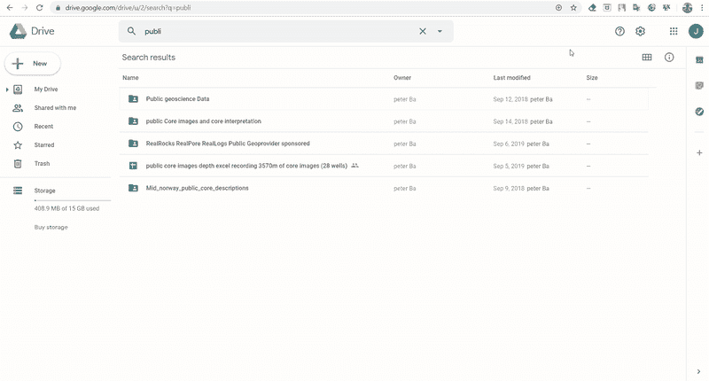

GIF 教程将文件夹从“与我共享”转移到我的驱动器目录

*公共地球科学数据*现在存储在您的 *My Drive* 目录中。确保通过访问您的 *My Drive* 目录并搜索 *Public geoscience Data* 文件夹来存储它。现在打开文件夹。你会发现里面有 12 个文件夹和 2 个文件。

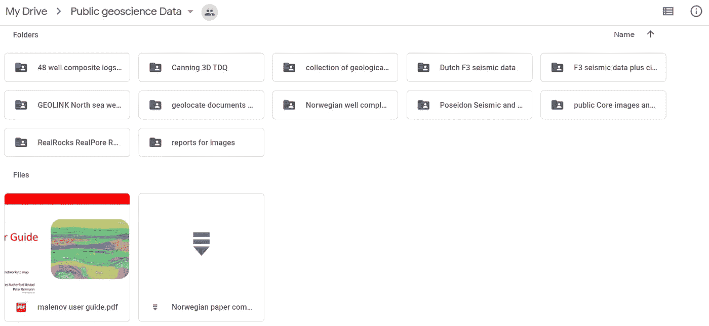

我的驱动器目录中的公共地球科学数据文件夹的屏幕截图

然而，并不是所有在公共地球科学数据中的文件夹和文件都包含地球科学数据集，供你进一步处理、分析和计算。例如， *report for images* 文件夹包含斯塔万格大学和奥斯陆大学发布的地球科学文档(以 *PDF* 和图像格式)。这些文件应该对研究参考非常有价值，但对计算(地震处理、测井分析等)没有价值。如果你对内容感到好奇，这是我列的清单。

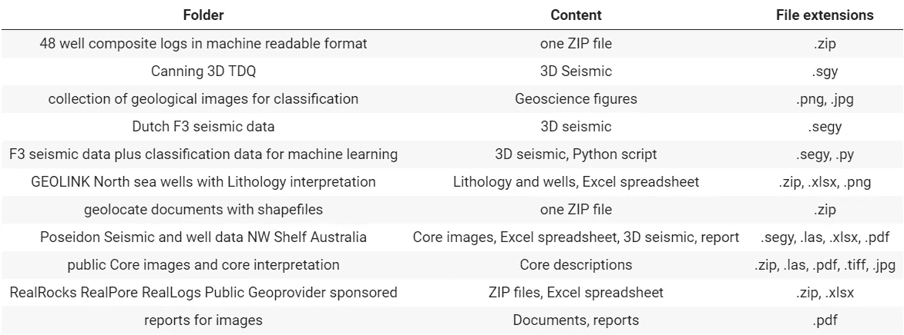

表 1。公共地学数据中每个文件夹的内容

在上面的列表中，你会发现一些文件夹包含 ***ZIP* 文件夹**和一些**简单文件**比如格式 *PNG* 和 *JPG* 的图片。在本文的教程 2 中，您将学习如何在 Google Colab 中解压缩文件并打开这些图像。但是，如何访问**大文件**(即地学数据集)的教程，如**地震数据 *SEGY* 或 *SGY*** 和 ***测井数据 LAS*** 文件，在这里就不赘述了，因为我们需要进行很长的讨论。但是，**不要担心**，我们将在本系列教程的下一个**第 2 部分**中介绍这一点。在第 2 部分的后面，我们将更多地介绍 Python 代码。

> 另一篇教程文章:面向地球科学计算的开放数据库介绍，第 2 部分，共 2 部分

因此，经过整理，我筛选了 6 个包含数据集的文件夹，如下所示:

*   坎宁三维 TDQ 地震
*   荷兰 F3 地震数据
*   GEOLINK 北海油井
*   波塞冬地震
*   核心图像
*   48 口井的综合测井

接下来，如果您只检查了 6 个文件夹中的一个，例如在*扫描 3D TDQ* 中，您会发现一个名为`canning3d_GDA94_UTM50s.sgy` 的地震数据文件，其文件大小为 103 千兆字节！如果您在石油和天然气行业，您不会感到惊讶，因为事实上，通常大多数地震数据都是如此，文件大小非常大。在你的本地电脑上下载如此大量的地震数据不是一个明智的决定。这就是为什么我给你介绍一个有效的方法**在*云*打开这个文件**。我这里说的*云服务*就是 Google Colab。

所以现在我们去 Google Colab。访问这个[链接](https://colab.research.google.com/)将你重定向到 Google Colab。在你访问 Google Colab 时弹出的第一个窗口，点击*新建笔记本*创建一个新的 *IPython 笔记本*。

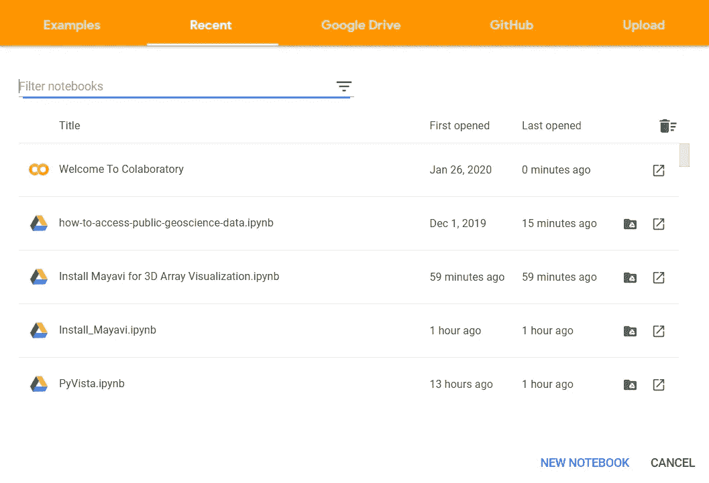

在[谷歌 Colab](https://colab.research.google.com/) 的第一次遭遇

然后，您将被重定向到新笔记本。现在，您已经有了一个新的空白笔记本，您将在其中放置打开*公共地球科学数据*的代码。下面是一个笔记本的结构。

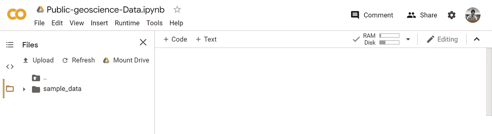

Google Colab 中 IPython 笔记本的结构

在你的新*笔记本*上面，你会看到`Untitled.ipynb`。这是您笔记本的名称，因此请将其更改为您喜欢的名称，但切记不要删除扩展名*。ipynb* ，因为它是 *IPython 笔记本*的典型扩展。例如，将我们的新笔记本命名为`**Public-geoscience-Data.ipynb**`。

你也看到 ***代码*** *。**代码*用于在笔记本中创建新的单元格代码，因此每当您创建代码脚本时，单击它即可添加新的单元格。为了预热，您可以创建一些代码，如下所示。要运行你的代码，点击单元格左边的 ***播放*** 按钮，或者干脆做`CTRL + ENTER`。

在笔记本的最左边，你也可以找到三个符号。最底部的符号是 ***文件夹*** ，在这里你可以浏览你正在处理的目录。默认情况下，如果你点击它，只有一个名为 *sample_data* 的文件夹。它是由 Colab 为您创建的，但在这里，我们不使用它。

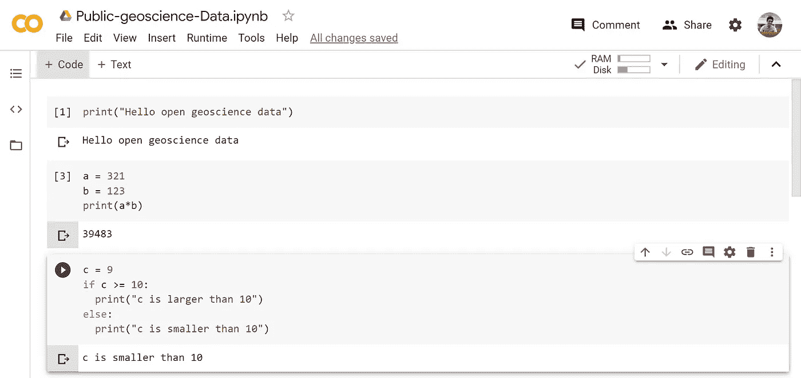

样本代码写在笔记本上

现在，让我们开始访问你的 Google Colab 的 Google Drive 中的*公共地球科学数据*文件夹。通过点击*代码*按钮添加一个新的单元格，并运行下面的脚本。

```
from google.colab import drivedrive.mount('/content/drive')
```

将出现以下消息。该邮件提供了一个 Google Drive 链接。点击该链接，并按照您需要的说明**访问您的 Google Drive 帐户**。一个新的链接将再次提供给您，复制它，并将链接粘贴回您的笔记本单元格内的“输入您的授权码:”然后，按`ENTER`。请等待**授权**过程完成。

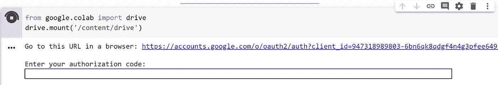

Google Colab 中的 Google Drive 帐户授权

如果你已经完成了授权，你可以在 ***文件夹*** 按钮中查看你的 Google Drive 文件夹(之前讨论过)。如果找不到，请点击`REFRESH`。然后浏览你的 Google Drive 文件夹，找到 ***公共地球科学数据*** 。这是该文件夹的路径。

```
"/content/My Drive/Public geoscience Data"
```

文件夹应该在那里。如果您没有找到该文件夹，您可能无法成功地将公共地球科学数据从您与我共享的*移动到您的 *My Drive。在这种情况下，你应该再次查看上面的教程。**

确保*公共地球科学数据*在路径中的另一种方法是，运行以下脚本。

```
cd "/content/drive/My Drive/Public geoscience Data"
```

如果它返回罚款，那么罚款，没有问题。如果出现“没有这样的文件或目录”的信息，这意味着您需要确保您已经成功地将文件夹移动到您的 *My Drive* 中。

下一步，**查看文件夹**的内容。你有两种方法可以做到这一点。最简单的方法是导航到笔记本最左侧的 ***文件夹*** 部分，展开文件夹，就像在 PC 中操作一样。另一种优雅的方式是运行下面的脚本。

```
ls "/content/drive/My Drive/Public geoscience Data"
```

你会发现以下内容。

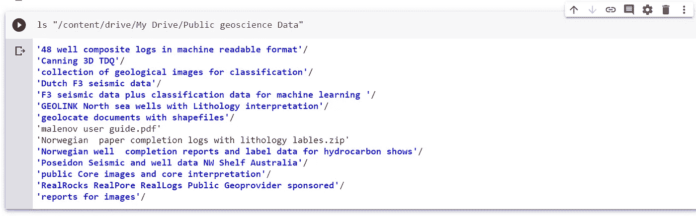

通过运行“ls”脚本公开地学数据的内容

> 脚本`ls`用于检查文件夹，而前面提到的`cd`用于转到我们工作目录中的某个文件夹。它被称为 *Bash 脚本*，一种 Linux 中的命令行编程语言。这是一个有趣的话题，我们暂时不需要关注那一个！

**恭喜！你现在已经在你的 Google Colab 中拥有了你的开放数据库！如前所述，在这个公共地球科学数据中，只有 6 个文件被认为是数据集。**

此外，如果您查看一些文件夹(回忆:**表 1** )，例如 *GEOLINK 北海油井*，您将会看到。再次运行`ls`来检查这个文件夹中的文件。

```
ls "/content/drive/My Drive/Public geoscience Data/GEOLINK North sea wells with Lithology interpretation"
```

有一个名为`GEOLINK_Lithology and wells NORTH SEA.zip`的 *ZIP* 文件，还有一个名为`Lithology code in the well.png`的 *PNG* 格式的图像文件。在接下来的**教程 2** 中，你将学习如何解压缩这个文件，并在你的 Google Colab 笔记本中打开一个图像。

## 教程 2:如何解压文件夹和打开简单的文件

使用 Google Colab 的优势是可行的，你可以解压一个文件，而不需要下载到你的本地电脑，也不需要使用任何解压程序。到上面的 *GEOLINK North Sea ZIP 文件*，运行以下脚本来解压缩该文件。

```
!unzip '/content/drive/My Drive/Public geoscience Data/GEOLINK North sea wells with Lithology interpretation/GEOLINK_Lithology and wells NORTH SEA.zip' -d '/content/GEOLINK North Sea'
```

解压缩文件需要一些时间。完成后，解压缩后的文件将出现在您的工作目录`/content`下的一个新文件夹中，名为`GEOLINK North Sea`。

> 上面的脚本可以分成四个语法:`!unzip ‘zip_file_path’ -d ‘to_new_folder’`。第一个语法`!unzip`指示 Colab 解压文件，第二个语法`‘zip_file_path’`是 zip 文件的路径，第三个语法`-d`告诉 Colab 将解压后的文件存储到一个新的目录中，其中新的目录路径名在第四个语法`‘to_new_folder’`中。

**恭喜你！你现在知道如何解压文件了。因为解压缩后的文件现在存储在一个新目录中，所以运行`ls`来检查内容。**

```
ls '/content/GEOLINK North Sea'
```

你会在*中找到大约 200 个*测井 LAS 文件*。*

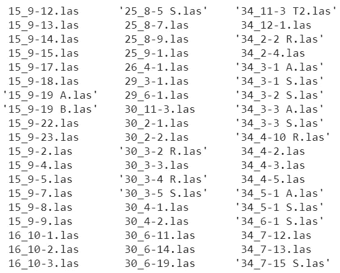

GEOLINK 北海油井文件夹的测井 LAS 文件内容

这些是在北海钻的井。同样，关于如何打开这些 LAS 文件的教程将在**第二部分**的后续文章中介绍。

我们现在将关注另一个任务，**打开一个简单的文件，例如 *PNG* 或 *JPG* 图像**。如果你回到原来的 *GEOLINK 北海油井文件夹*，你会发现一个名为`location of geolink wells.png`的图像文件。这是这些井的位置图。

我们将使用名为`Pillow`或`PIL`的 Python 库。首先，我们需要**从** `**PIL**` **导入一个模块，命名为** `**Image**` 到我们的 Colab 笔记本中(`PIL`已经在 Colab 中了，所以我们不需要安装。)

```
from PIL import Image
```

接下来，运行以下脚本打开图像。图像文件路径为`/content/GEOLINK North Sea/location of wells.png`。我们使用`Image`模块中的`open`函数来实现。

```
img = Image.open("/content/GEOLINK North Sea/location of wells.png")img
```

当您运行该脚本时，一个图像将出现在您的 Colab 笔记本中！正如你已经猜到的，这是包含油井位置的北海地图。这是斯诺尔油田附近的一个海上油田。

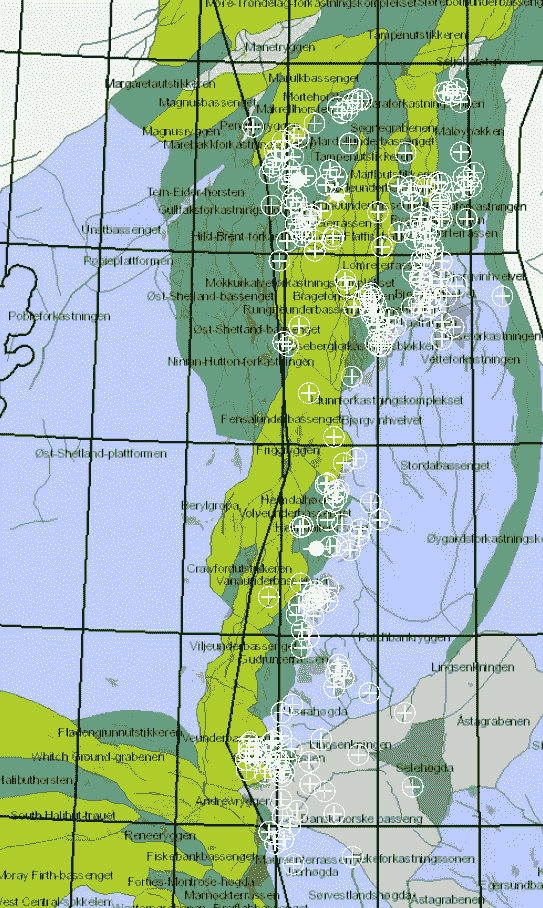

在 Colab 打开的北海油井的位置(数据所有者:[https://github.com/bolgebrygg/MalenoV](https://github.com/bolgebrygg/MalenoV))

**恭喜你！您已经知道如何在 Colab 中打开图像。在此讨论之前，您已经足够了解如何从*公共地球科学数据* Google Drive 访问一些数据集。当然，在第 1 部分的文章中还讨论了很多未涉及的文件，比如地震数据和测井文件，所以请继续关注第 2 部分的文章。至少，你知道如何通过 Google Drive 直接访问 Google Colab 中的一个地球科学数据库。**

接下来，在**教程 3** 中，我们将讨论如何访问其他开放数据库，即 SEG Wiki 开放数据和 GDR OpenEI。

## 教程 3:如何访问 SEG Wiki 开放数据和 GDR OpenEI

要访问这两个数据库，我们不再需要上面的 Google Drive 工作流了！我们可以直接从网页上流式下载数据集**到我们的 Colab 笔记本**。

我们需要看看这两个开放数据库的网页是什么样子的。首先，我们将访问 [SEG 维基开放数据网页](https://wiki.seg.org/wiki/Open_data)。

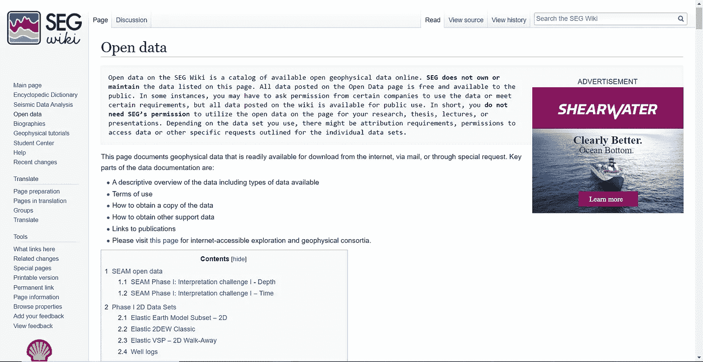

[SEG Wiki 开放数据的网页](https://wiki.seg.org/wiki/Open_data)

在内容中，您将看到 30 多个开放数据集。我们建议首先访问您想要访问 Google Colab 的数据的内容链接。您将找到数据的详细信息，并单击相关链接。例如，访问此链接 [Stratton 3D 地震数据集](https://wiki.seg.org/wiki/Stratton_3D_survey)。

在 Stratton 3D 网页中向下滚动到*如何下载*部分，有带链接的文件。现在，我们将使用第三行中的`3D filtered migration file`，右键单击它，并选择**，复制链接地址**。

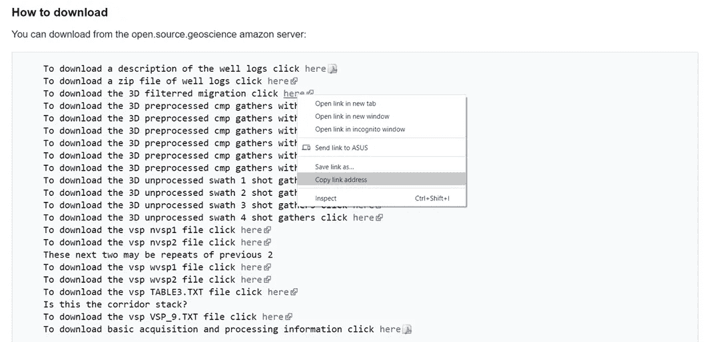

右键点击 [Stratton 3D 网页](https://wiki.seg.org/wiki/Stratton_3D_survey)

链接已经被复制，现在回到您的 Colab 笔记本，将复制的 URL 粘贴到下面的脚本中，并运行该脚本。记得将复制的 URL 粘贴在单引号内。

```
!wget 'your_copied_URL' -P '/content/Stratton/seismic'
```

这里，我们使用`!wget`语法下载 URL 中的数据集。传递下一个语法`-P`，将下载的数据存储到一个新文件夹中，在下一个语法中命名为 `'/content/Stratton/seismic’`。这个`!wget`语法是通用的，这意味着你可以以 URL 的形式下载任何数据集。

正如我们在下载数据集 URL 时注意到的，文件大小为 423 兆字节！想象一下，我们将这个数据集下载到我们的本地计算机，它肯定会占用很大的空间。

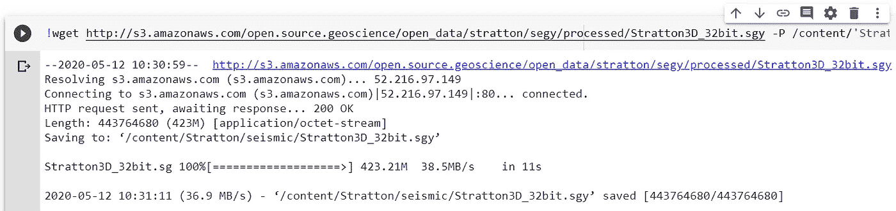

Google Colab 中下载数据集的过程

如果我们导航到`Stratton`内新创建的文件夹`seismic`，我们将看到一个名为`Stratton3D_32bit.sgy`的地震数据。在**第二部分**文章中，我们将讨论如何打开这些地震数据。

**恭喜你！**你现在知道如何从***SEG Wiki Open Data****直接下载数据集到 Google Colab。同样的使用`!wget`的方法我们也将适用于另一个 ***GDR OpenEI 数据库*** 。*

*接下来，让我们访问[地热数据储存库(GDR) OpenEI 网页](https://gdr.openei.org/)。第一次相遇，你需要浏览一个带有某个关键词的数据集进行搜索。只需输入`gravity forge`。我们将使用犹他州米尔福德附近的 FORGE 站点的 3D 重力数据实例。*

*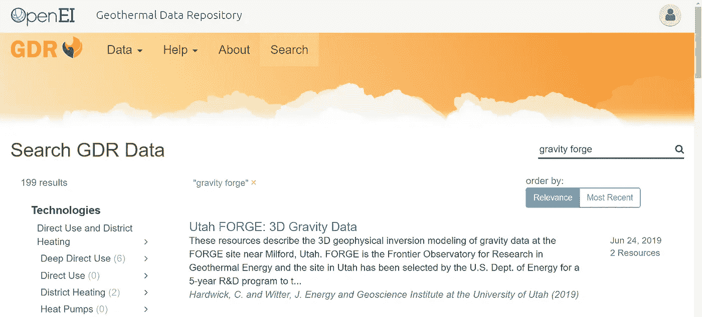*

*犹他州伪造重力数据[搜索网页](https://gdr.openei.org/)*

*访问搜索网页中出现的`Utah FORGE: 3D Gravity Data`。除非你找到了，只需在“搜索”块中浏览完整的名字。在页面内，向下滚动找到`ZIP`文件`FORGE_3D_gravity.zip`，右键点击“下载”，同样“**复制链接地址**”。*

*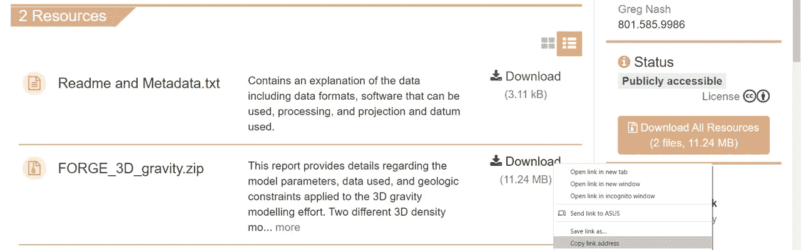*

*右键单击下载重力数据集*

*再次，回到 Colab 笔记本，这一次我们将把它留给你！如果您还记得(我们确信您记得)，使用`!wget`下载 URL，然后指定目标文件夹。*

```
*!wget 'https://gdr.openei.org/files/1144/FORGE_3D_gravity%20(1).zip' -P /content/FORGE*
```

*您现在可以在新创建的文件夹`FORGE`中获得下载的文件。如您所知，这是一个 *ZIP* 文件。你肯定已经知道怎么解压了。运行以下脚本。*

```
*!unzip '/content/FORGE_3D_gravity (1).zip' -d '/content/FORGE'*
```

*恭喜你！您已经使用`!wget`从 ***GDR OpenEI*** 访问了一些数据集*

## *结论*

*在这个关于在 *Google Colab* 云环境中使用 Python 的介绍性文章系列的第一部分中，我们讨论了三个教程，涵盖了访问开放数据集的基本工作流。*

*作为总结，**我创建了一个 Colab 笔记本**，其中包含了本教程中讨论的所有代码。打开笔记本[这里](https://colab.research.google.com/drive/1vAAXnZN-2EWreWx4AE94tNnVu3daIsGP?usp=sharing)。*

*除了这篇文章，**我还制作了一个 GitHub 知识库**，其中包含了关于开放地球科学计算的分步教程。游览此 [**环节**](https://github.com/yohanesnuwara/open-geoscience-repository\) 开始旅程。*

*最后但同样重要的是，强烈建议任何对使用开放数据集感兴趣的人引用这些数据，以尊重数据所有者。 ***引文维基*** 可在[我的 GitHub 维基页面](https://github.com/yohanesnuwara/open-geoscience-repository/wiki)上获得。引用内容也会经常更新。*

*享受您的开放地球科学计算，并继续关注第 2 部分！*

> **到达我的 GitHub:github.com/yohanesnuwara**
> 
> **到达我的邮箱:ign.nuwara97@gmail.com**
> 
> **到达我的领英:*[*https://www.linkedin.com/in/yohanes-nuwara-5492b4118/*](https://www.linkedin.com/in/yohanes-nuwara-5492b4118/)*