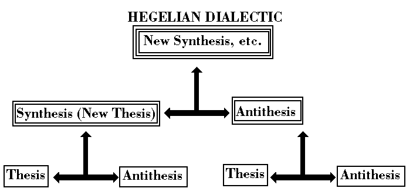

# 数据科学家后结构主义法国哲学导论(上)

> 原文：<https://towardsdatascience.com/intro-to-post-structuralist-french-philosophy-for-data-scientists-c74019122f17?source=collection_archive---------24----------------------->

## 数据科学家的哲学

## 人文学科如何看待数据科学

如果你没注意到，那是一只穿着法国国旗衬衫的可爱的狗。查尔斯·德鲁维奥在 [Unsplash](https://unsplash.com?utm_source=medium&utm_medium=referral) 上拍摄的照片

在这一系列的文章中，我想简单介绍一些对人文学科产生巨大影响的法国重要思想家。特别是，我想把重点放在旨在理解和解释数据挖掘的现代实践的人文/哲学工作上，包括数据收集和自动化剖析。然而，由于这项工作的复杂性，我将需要分几期进行。

在这些哲学家中，我们将会看到米歇尔·福柯、皮埃尔·布迪厄、吉勒·德勒兹、布鲁诺·拉图尔、江泽龙·利奥塔、雅克·德里达、保罗·里科尔和让·波德里亚。这篇文章将关注福柯和德勒兹，并通过对尼采、黑格尔和马克思的相对随意的介绍来提供一些必要的背景。

## 为什么在乎？

例如，根据最近的统计，米歇尔·福柯被引用了近 40 万次。相比之下，皮埃尔·布迪厄只有区区 18.8 万英镑。这些作者的单本书被引用的次数比大多数学者都多。如今，很难读到来自人文学科的关于个人数据、隐私和算法歧视的讨论，这些讨论没有提到这些和其他法国哲学家的工作。例如，约翰·切尼-李波德的 [*一个新的算法身份:软生物政治和控制的调制*](https://journals.sagepub.com/doi/full/10.1177/0263276411424420?casa_token=4SMWpqZ5DSgAAAAA%3ApeBVgNjh4Kf40ZZPn3n8QIY7UyfhUpMJolIt55WbTBA9zXudqRGuKr6gjD62T0GOKFUWAfxjZV3q) *，*从一个文化和数字研究教授的角度呈现了对自动机器学习的一个有影响力的观点。

如果没有这些哲学家和社会学家的思想背景(事实上很难将他们中的许多人归入一个单一的学科)，目前发表在社会科学、人文科学和[营销期刊](https://www.tandfonline.com/doi/abs/10.1080/0267257X.2014.958518)上的许多内容可能很难理解，似乎过于抽象，并且充满了新词和各种“后现代术语”我会尽我所能为你解开这些谜团，但是理解他们工作的一部分在于学习他们的概念词汇。

此外，如果你对任何类型的定性社会科学研究感兴趣，你可能会遇到这些名字，因为他们的思想是反对维也纳圈思想家开创的更实证/定量方法的哲学基础。

> 为什么写这个帖子？我们需要在数据和计算机科学家、工程师、社会科学家和人文主义者之间培养跨学科的“思想交汇”。

鉴于数据挖掘在我们日常生活中的无处不在，我们必须弥合科学家和小说家 CP Snow 曾经提到的将科学和人文分开的两种文化*。*

## *数据科学家能从人文学科中获得什么？*

*这个问题值得单独发帖，我现在就不深究了。可以说，人文学科通常关注对文本、事件、行为和符号的 ***解释，以及与人类体验相关的*** 等许多其他事物。*

*如果你认为诠释是懦弱的、戴着贝雷帽的、啜饮着键盘的战士们的事，想想有多少人因为他们对一本书或一件事的诠释被认为是“错误的”而被杀害对于数百万人来说，这是一件事关生死的大事。(我在看你们毛斯大林)。例如，现在在美国，激烈的文化辩论正在激烈地进行着，关于为那些从奴隶所有权中获利的人竖立雕像和建造纪念碑是什么意思。约翰·梅纳德·凯恩斯这样描述人文学科的力量:*

> *“经济学家和政治哲学家的观点，无论是对的还是错的，都比我们通常理解的更有力量。事实上，这个世界很少被别的东西所统治。务实的人认为自己完全不受任何知识分子的影响，他们通常是一些已故经济学家的奴隶。”*

*凯恩斯实际上是在召唤工程师和数据科学家，他们幸福地意识到——有时骄傲地意识到——他们只是社会机器中的一个齿轮，很可能是某个被遗忘已久的哲学家在某本落满灰尘的旧书中虚构出来的。如果不接受这些想法，不考虑你在这个系统中的角色，你很可能成为别人乌托邦愿景中的一枚棋子。我在另一篇名为[数据科学家和权力伦理](/data-scientists-and-the-ethics-of-power-ae91e6dd188?source=friends_link&sk=c4ea3c317089d096b71021315909bb91)的文章中进一步探讨了这一点。*

*人文学科发挥的其他关键功能包括:解释、发现和证明体现在技术中的 ***价值观*** ，阐明社会政治系统的更好和更坏 ***愿景*** ，以及探索(后)人类的本质 ***经验*** 。简而言之，如果没有人文学科的道德想象力，现代生活可能会很有效率，但却极其贫瘠，并且完全被对利润的追求所驱动。*

****:*****我不是现代/后现代哲学的学者，所以请不要误以为我对这些思想家的著作的颇为独特的解释构成了这一领域专家的共识。***

## **快速背景:黑格尔(1770-1831)，马克思(1818-1883)，尼采(1844-1900)**

**我们将要探索的许多现代法国哲学思想都深受德国哲学家的影响 [G.W.F .黑格尔](https://en.wikipedia.org/wiki/Hegelianism)、[弗里德里希·尼采、](https://en.wikipedia.org/wiki/Friedrich_Nietzsche)和[卡尔·马克思](https://en.wikipedia.org/wiki/Karl_Marx)。不简要地触及他们引入的一些关键概念，就很难给出福柯、德勒兹和其他人的后期作品的背景。因此，在接下来的内容中，我将试着列出你需要知道的东西，以便以后理解。请记住，后结构主义者倾向于避免直接论证，而倾向于发展广阔的、全面的哲学视野。他们与其说是在论证，不如说是在向读者展示现实的另一种可能性。如果我有时显得漫无边际，我道歉。**

****

**黑格尔声称发现了思维的突现逻辑。矛盾的是，概念包含相反的方面(命题和对偶)，它们在更高的层次上被解决(综合)。来源:丹尼斯·斯皮维的 [Pinterest](https://www.pinterest.com/pin/66709638203851681/) 。**

## **黑格尔:概念动力和模糊逻辑**

**很难在几个段落中公正地评价黑格尔，所以我将只关注我认为与数据科学最相关的黑格尔的一些方面。首先，黑格尔的想法暗示了对*监督的*机器学习解释现实的能力的概念限制。**

**黑格尔不喜欢二进制、非此即彼的逻辑，这种逻辑体现在机器学习中使用的传统统计学的清晰集合理论中。事物可以同时存在也可以不存在。例如，严格地说，你已经不是昨天的那个*了。构成你身体的数十亿个细胞已经死亡，并被新的细胞取代。然而你们看起来是同一个人，我们用同样的名字来称呼你们。儿童特拉维斯和成人特拉维斯明显不同，但仍然是同一个人。我们如何调和这一事实？从这个角度来看，黑格尔可以被认为是[洛夫蒂·扎德的模糊集合论](https://en.wikipedia.org/wiki/Lotfi_A._Zadeh)的知识先驱，该理论假定清晰集合论是一个特例，其中*集合* *隶属函数*仅取值 1/0。黑格尔的思辨逻辑和“[可能性理论](https://en.wikipedia.org/wiki/Possibility_theory)”(与概率论相对)在我看来有着共同的概念根源。***

*黑格尔对科学思维逻辑的理解是*内在的*本质。他的意思是，概念本身包含着它们自己的否定。从表面上看，这听起来自相矛盾，违反了支撑现代概率论的排中律(*某物要么是 p，要么不是 p* )，但它与许多精神概念有相似之处，如佛教中的 [*轮回*](https://en.wikipedia.org/wiki/Sa%E1%B9%83s%C4%81ra) 。*

*上图通过整合这些积极和消极的内在方面，说明了概念是如何随着时间的推移而演变的。综合是一种创造性的行为，由命题和对立面在创造性的破坏行为中“消灭”彼此而产生(因此是轮回参考)。我们应该注意到，毁灭是自我实现的必要步骤。看似矛盾的东西实际上可以在一个更高的统一中得到调和，如果我们愿意继续下去的话。在数学中，我们经常发现一些抽象仅仅是一个更抽象概念的特例。例如，点积是更抽象的内积的特例。*

> *如果我们要以绝对的形式理解精神的本质(艾斯特),矛盾不是要被避免，而是要被拥抱。*

*黑格尔最出名的可能是他声称历史是有逻辑的，它根据理性的秩序展开，而作为有意识的理性主体的个体人类也参与其中。对于黑格尔来说，理性和自由是联系在一起的:自由正是理性在这种理性秩序中的展开，因为它朝着总体性或独特性的点努力，在这一点上它理解自己。我们所看到的理性实际上只是理性在这个辩证旅程中的自我表达运动，表现在人类意识、人类制度、艺术作品等等。作为理性的、自我意识的生物，我们充其量只能随波逐流，但我们无法逃脱“理性的狡猾”。黑格尔有一句著名的话“历史的屠宰场”，他认为好的和坏的事件都是“绝对精神”自我实现的必然实现。理性是不可驯服的。*

> *在我看来，欧洲大陆学派和 T2 分析学派的主要区别在于逻辑的本质。它是否如黑格尔所主张的那样具有内在的动态性和自由性？或者它能像弗雷格、怀特海和罗素所希望的那样被抑制和形式化吗？*

*黑格尔的*科学逻辑*中有一种独特的禅宗元素。根据斯蒂芬·侯盖特的*《黑格尔逻辑的开篇:从存在到无限》，*黑格尔对科学思维本质的探索是基于对思维自身动态的无预设观察。换句话说，黑格尔旨在通过让思想自行运动来揭示思想的本质。我们不应该像康德那样，假定思想必须被限制在某些先验的类别中。*

*在现代形式中，[超人类运动](https://en.wikipedia.org/wiki/Transhumanism)将人类物种视为绝对精神自我实现的更大宇宙展开中的一步(所谓的 [*奇点*](https://en.wikipedia.org/wiki/Technological_singularity) )。我们还应该指出，这种合理展开历史的思想是马克思提出的。马克思的共产主义乌托邦是人类历史的最终实现:资本主义应该只是途中的一站。*

*解释主义的社会科学已经被胡塞尔的[现象学](https://en.wikipedia.org/wiki/Phenomenology_(philosophy))的类似思想所塑造，其目的是将意识的对象*精确地* *作为意识的对象来研究，拒绝早期理性主义者关于精神和身体的物质可以完全分离的主张。沉浸在启蒙理性主义中的自然科学家最初可能会对黑格尔的辩证思维感到不舒服，这种思维避免了简单的二元对立*自我-他者*、*内外*、*好-坏*和*男女*。事实上，自我和他人之间的明确界限可以而且确实在生物和分子水平上被打破，正如那些患有自身免疫疾病的人可以证明的那样。**

## *自我意识和争取他人认可的斗争*

*黑格尔可能是第一个明确阐述认知中的自我意识和反身性的哲学家。对他来说，“他人”的认可为作为客体的自我提供了温床。换句话说，自我实现——承认自己是一个“自我”——从根本上取决于其他自主对象(人)的社会认可，这些自主对象(人)承认你是一个具有独特愿望和目标的个性化的人。我们的个人身份依赖于这种被他人认可的行为。我们不是脱离实体的笛卡尔式自我:我们是相互依存的，是嵌入社会环境中的社会性生物。*

*阿克塞尔·霍耐特扩展了黑格尔的观点，将边缘化群体对社会不公的哭喊解释为争取认可的斗争。根据这一观点，受压迫群体正在为获得承认和社会合法性而斗争。[朱迪斯·巴特勒](https://en.wikipedia.org/wiki/Judith_Butler)在她的书*消除性别*中，以一种强调黑格尔对模糊逻辑先驱的承诺的方式解释了争取认可的斗争:*

> *“被称为复制品，被称为不真实，是一种可以被压迫的方式，但考虑到它比那更根本。被压迫意味着你已经作为某种主体存在，你作为主主体的可见的被压迫的他者存在，作为一个可能的或潜在的主体，但不真实又是另一回事。要被压迫，你必须首先变得可理解。发现你根本不可理解(事实上，文化和语言的法则发现你是不可能的)就是发现你还没有接近人类，发现你只是说话，并且总是好像你是人类，但感觉你不是，发现你的语言是空洞的，没有识别即将到来，因为识别发生的规范对你不利。”*

*从克里斯普集合论的局限来看，跨性别者和其他边缘人群是作为矛盾体出现的。我们被教导性别认同必须是非此即彼，1 或 0。像跨性别身份这样的东西的存在威胁着破坏现实的最基本的分裂，导致一些人对这种形而上学的否认产生暴力和愤怒。但是黑格尔会说，通过学会接受矛盾，我们实际上可以理解更伟大的东西。*

**

*工业化的社会效应深深影响了马克思。今天，我们正在处理算法化的社会外部性。维多利亚博物馆在 [Unsplash](https://unsplash.com?utm_source=medium&utm_medium=referral) 拍摄的照片*

## *马克思:异化与意识形态上层建筑*

*作为黑格尔的追随者，马克思当然因他的《共产党宣言》而闻名，但他对社会科学的贡献根深蒂固，即使在今天。尽管他的许多历史预言从未实现，但他对资本主义体系和概念方法的批判仍然极具影响力。一个很好的例子，见肖莎娜·祖博夫的巨著*监视资本主义*。*

*借用黑格尔的话，马克思认为历史发展有一个合理的形状或弧线，最终将在未来的某个时刻导致共产主义乌托邦，在那里被压迫的无产阶级的“枷锁”将被撕掉。同时，人们常说马克思“颠倒了黑格尔”或“颠倒了”他的思想。对于黑格尔来说，思想的动力最终解释了我们对现实的体验，这是一种被称为*唯心主义*的哲学立场。黑格尔有句名言，“什么是**理性就是真实的**，什么是**真实的**就是**理性。但是在马克思那里，是物质的、经济的事实说明了现实。因此，当黑格尔是一个理想主义者时，马克思是一个唯物主义者。***

*在马克思的思想中，关于物质对象的生产方式的事实决定了社会的结构。如上所述，马克思在这个意义上是一个唯物主义者，因为他认为一个社会的物质条件(即资本家和劳动者之间的经济关系)决定了它的非物质结构。马克思主义者把生产资料称为社会赖以形成的基础。其他一切，包括所有的社会规范、道德、法律和文化都是上层建筑的一部分。*

## *资本主义上层建筑*

*马克思关心的是他那个时代的工厂制度如何有效地把孤独的工人从他的劳动果实中分离出来以换取工资。这个观察很重要，因为马克思认为人类从他们的生产活动中获得意义和享受。人类本质上是劳动的产物，能够建造和创造新奇的物品来满足他们的需求。因此，资本主义统治阶级剥夺他们的劳动成果令马克思深感不安。*

*简而言之，资本主义疏远了人们的工作，用金钱符号取代了道德价值问题。此外，资本主义体系中组织固有的过度专业化导致了法国社会学家涂尔干在他的“失范”概念中所捕捉到的东西。在你醒着的大部分时间里，组装小配件——或者焊接 iPhone 部件——肯定不是马克思认为有利于人类繁荣的生活。*

*我们已经可以看到一些学者使用这种剥夺的图像来解释人们如何在谷歌和脸书等公司追求广告利润的过程中被剥夺了个人数据。如果你有兴趣阅读更多关于这种想法以及它如何应用于主要的行为大数据(BBD)平台的信息，请查看 Zuboff 的*监视资本主义*。*

**

*尼采认为基督教道德从根本上是倒退的:它恰恰评价了那些阻止个人伟大和创造力的东西。克里斯托夫·施密德在 [Unsplash](https://unsplash.com?utm_source=medium&utm_medium=referral) 上的照片*

## *尼采:奴隶道德和权力意志*

*尼采本可以成为一名伟大的数字营销者:他知道如何利用震撼价值来吸引读者的注意力。在他的经典之作《道德谱系的 T4》中，尼采对西方犹太-基督教价值观进行了强有力的批判。根据尼采的心理分析，基督教道德是建立在罗马上层社会价值观的复归之上的。受压迫的早期基督徒利用他们的“怨恨”来美化他们的社会和政治弱点。因此，温顺、平等和其他缺乏权力的表现被捧为道德理想，而事实上它们仅仅是尼采认为的流氓无产阶级的一种“奴隶道德”的表现。*

*尼采会说，我们西方人被这种奴隶道德所欺骗，导致了一种道德和精神发育障碍，阻止我们以最充实、最有创造性和最有激情的方式生活。从这个意义上说，这与马克思关于意识形态上层建筑的概念有着明显的相似之处，在这一概念中，资产阶级的道德已经取代了我们更基本的、工业化前的生活方式。卢梭会同意，我们现代人似乎已经失去了对生活的欲望。*

*众所周知，尼采是个精英主义者。例如，他信奉一种由荷马的《奥德赛》中的希腊英雄所体现的独特的、有创造力的和强大的个人的神话。在历史的大格局中，我们忘记了大众，记住了社会的伟大推动者和震撼者。我们真的只关心培养那些黑天鹅，他们的生活给后代留下了不可磨灭的印记，不管是好是坏。注意到安·兰德和她的技术沙文主义追随者的相似之处。*

*基于他的道德谱系，很明显，尼采认为道德价值观不是基于任何深刻的、不变的形而上学真理，而是基于统治阶级的利益和价值观。*强权即公理。这种道德*透视主义*的思想可以追溯到苏格拉底的时代，但是尼采将它发挥到了逻辑的极致。罗伯特·所罗门在他的《与尼采一起生活》一书中解释说，透视主义是这样一种观点，即“所有的学说和观点都是片面的，并且受到特定观点的限制。”因此，我们所知道的本质上受限于我们的认知环境、感知局限、语言、社会教养等等。尼采认为，没有上帝的视角。在后面的章节中，我们会看到福柯、德里达和拉图尔复活了这个观点。**

*目前，我们已经可以看到这种观点似乎如何限制了对 ML 客观性的主张，特别是当盈利性公司决定收集哪些数据时。尼采会同意原始数据是一个矛盾。然而，与此同时，尼采可能会谴责社会正义战士为实现更大的平等所做的努力，并声称这些关于人的新数据表示——无论是否有偏见——是脸书和谷歌公司权力意志的表达。我们不应该隐瞒。*

**

*福柯声称“凝视”(持续监视)的力量来自于它被内化的能力，从而创造了消费主义大众的“温顺的身体”。由[paweczerwiński](https://unsplash.com/@pawel_czerwinski?utm_source=medium&utm_medium=referral)在 [Unsplash](https://unsplash.com?utm_source=medium&utm_medium=referral) 上拍摄的照片*

## *福柯(1926-1984):规训权力&圆形监狱，*

*米歇尔·福柯也许是理解当前科技领域社会公正问题的最重要的思想家。福柯真正感兴趣的是剖析和阐释权力的“无形”形式。他对国家对公民的政治镇压或暴力的明显例子不太感兴趣，而是对社会规范微妙地“生产”带有容易区分标签的主题的方式感兴趣。像尼采一样，福柯也担心墨守成规的大众对独特个体的压迫。事实上，福柯看到了统计理论的进步，随着它对理论人口的使用，作为这种对个人的压迫和他所谓的*的出现的一个例子。**

**对福柯来说，分类标签(例如，“精神错乱”、“男人”、“女人”、“黑人”)允许国家实现或多或少与身体暴力相同程度的一致性，但带有启蒙人文主义的色彩。与中世纪的欧洲不同，在现代社会，偏离规范的行为不是通过身体暴力来惩罚，而是通过标签和与之相关的制度来惩罚。对福柯来说，学校、监狱和医院被设计成产生*温顺的身体*和塑造大众。我们可以清楚地看到，福柯正在发起对现代生活方式的批判。此外，我们可以看到尼采的影响，他拒绝奴隶道德(赞美独特、强大和热情的个人)和支持行使我们与生俱来的权力意志，这有助于区分我们作为独特的个人。**

**福柯最著名的是通过他对*圆形监狱*的比喻阐明了权力的无形本质。在这种轮辐式的监狱设计中，一名中央警卫可以监视每个单独的牢房，但没有囚犯知道自己被监视着。不需要对囚犯进行身体上的虐待，狱警们可以仅仅通过凝视的可能性来实现一致性。根据福柯的说法，凝视的力量来自于它被个人内化的能力。一旦内化，凝视的功能是影响和控制个人的性情，使其在没有任何身体干预的情况下以某种方式行事。这是一种无形的力量。**

## **作为权力表达的知识和话语**

**鲁哈·本雅明的新书《技术之后的种族》从福柯探索的各种观点中汲取了深刻的思想。像他之前的马克思一样，福柯关注于描述与各个社会历史时期相关的“意识形态上层建筑”，从文艺复兴时期到现代时期。结合弗洛伊德的无意识理论，福柯在他的书《事物的秩序》中称这些上层结构为知识，并着手揭示决定特定时期话语形式的无意识“规则”。认识论可以被认为是各种*话语*的可能性的前提条件，这些话语为知识规定了各种各样的、通常是无意识的标准。他们为什么有价值，什么没有价值，什么有价值，什么没有价值制定了规则。托马斯·库恩关于科学范式的想法是这种想法的一个很好的例子。在一个给定的范式之外，有些问题问起来甚至没有意义。**

**对福柯来说，支配一个时期的知识的能力才是真正的力量:这是一种塑造主体的存在主义叙事的力量，这些主体必须在给定的话语范围内运作。福柯最初认为，话语在决定我们的经验、制度和社会实践方面占据主导地位。维特根斯坦也认为，我们无法逃避这些塑造我们思维和行为的语言和社会话语。从这个结论中，我们看到了科学技术研究(STS)中的主张，例如，t *没有独立于我们的语言和认知机构的原始数据这种东西。***

**最后，我还应该提到，一些批评家不喜欢福柯把人的能动性从人身上去除，并把他们置于当前社会话语的支配之下的方式。如果我们无力在主流话语之外采取行动，为什么要抵制或抗议变革呢？**

****

**德勒兹对单一物体被分割和分配的方式很感兴趣，这种方式产生了新的存在形式和可能性。照片由[马特·阿特兹](https://unsplash.com/@mattartz?utm_source=medium&utm_medium=referral)在 [Unsplash](https://unsplash.com?utm_source=medium&utm_medium=referral) 上拍摄**

## **德勒兹(1925–1995):控制、调制和个体**

**让我们的最后一位哲学家 Gilles Deleuze 来发表这篇文章。像他之前的福柯和尼采一样，德勒兹着迷于权力、创造性表达和视角。但是他根据计算机和数字革命的时代更新了他们的工作。**

**与福柯更老的“纪律社会”不同，德勒兹认为我们现在生活在“控制社会”中，这种社会通过“永久训练”(如学校)来调节人，以达到一致性。福柯描述的封闭空间现在被分布式网络所取代。纪律团体的集体/个人区别不再成立。当我们进入这个被描述为超人类时代的新技术时代时，黑格尔的辩证思维再次出现。人类和非人类之间的传统界限因此变得模糊。然而，正如我们将会看到的，这对德勒兹来说未必是件坏事。**

**在大数据时代，个人现在是个体，通过数据库和社交网络数字化传播。权力是通过把单一的事物分解成分散的形式来行使的。一旦物体被切割并还原成它们的组成部分，同一性的问题就不再清楚了。虽然福柯的纪律社会依靠机械物体如“杠杆、滑轮和时钟”来行使权力，但控制社会更多的是关于“能量、熵和计算机”。**

**按照德勒兹的说法，我们已经进入了资本主义的新阶段，在这个阶段，服务而不是产品是目标。公司已经取代了工厂。我们没有人，但是有模糊的“编码数字”，比如“股东”他们没有面孔，没有明确的身份。市场营销，而不是商品生产，已经成为“公司的中心或‘灵魂’”数字技术将个人分割开来，并找到新的方式将他们重新组合并提取价值。正如营销理论家 [Cluley & Brown (2015)](http://irep.ntu.ac.uk/id/eprint/38966/1/1270077_Brown.pdf) 解释的那样:“权力是通过操纵和从零件或微型组合中提取价值来行使的。”**

****

**根茎是德勒兹思想的一个定义性隐喻。它表明不同的物体网络可以产生新的、突现的现象。由[马特·阿特兹](https://unsplash.com/@mattartz?utm_source=medium&utm_medium=referral)在 [Unsplash](https://unsplash.com?utm_source=medium&utm_medium=referral) 上拍摄的照片**

## **生活是不同的:去区域化和重组**

**德勒兹着迷于成为的过程和相关的身份概念。艺术和哲学是特殊的，因为它们允许思想在新的环境中“去中心化”。这种去地域化的过程允许我们创造新事物。德勒兹希望超越真理符合论，这种理论推动了许多传统的理性主义科学思想，使地图与领土完全分离。**

> **如果你是一名数据科学家，你可以把“去领域化”想象成给定向量表示(这里是一个想法或概念)的基础运算(矩阵乘法)的改变。在新的“基础表征”(语境)中，我们可能会获得关于概念潜在本质的新的、以前未被注意到的洞见。**

**然而，如果我们抛弃了对应理论，有些人可能会担心语言将不再有任何东西可以“挂钩”，我们只会成为沮丧的虚无主义者。如果什么都不是真实的，那还有什么意义呢？德勒兹颠倒了这个结论，就像尼采在他的*道德谱系中所做的那样。***

**德勒兹的思想并没有因为语言在本质上只是自我参照而放弃科学项目，而是颂扬了这样一个事实，即存在可以自由计算和删除的个体，而无需与真实的人有任何明确的语义联系。通过把人们从他们的数字表现中分离出来，我们可以用新的方式和他们玩。正如 CTRL-Z 给你创造你可能不敢尝试的东西的自由一样，德勒兹试图展示数字现实的这种“超然”的方面如何导致创造力和新的存在形式。**

**德勒兹认为哲学的目标是创造新概念。对他来说，生活就是不同。人生的目标是以不同的方式思考，变得与众不同，创造差异。我们应该感到高兴，因为我们无法将我们的经验融入福柯的纪律社会的封闭且容易束缚的结构中。德勒兹很清楚:这不是失败，而是庆祝和探索发明创造可能性的理由。哲学和艺术的目标是创造差异，而不是一致和常识。我们应该拥抱差异，因为它促进了成长的过程。**

> ***将地图从疆域中分离出来，给了我们不受现实约束的发挥、重组和创造新方式的空间。***

**暂时就这样了。在下一篇文章中，我将关注德里达、布迪厄和布鲁诺·拉图尔。**