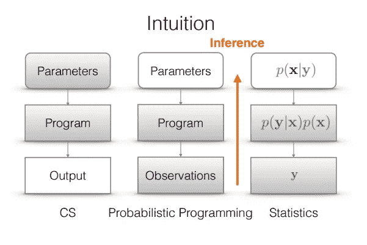
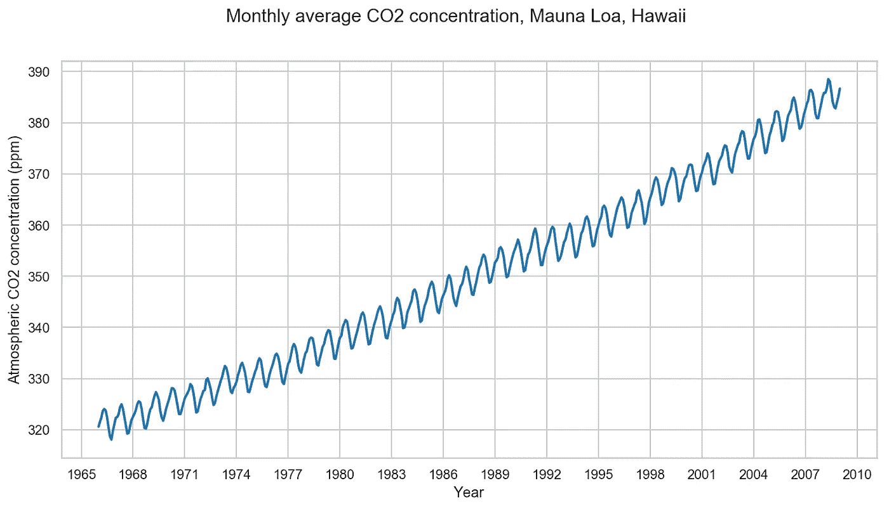
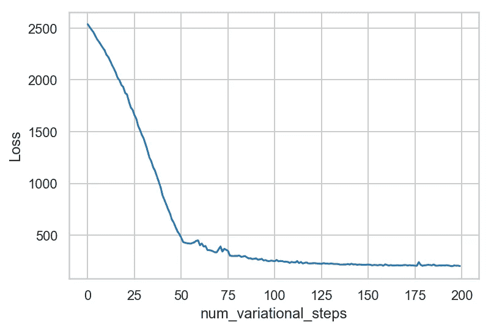
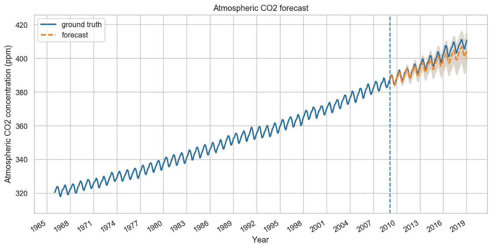
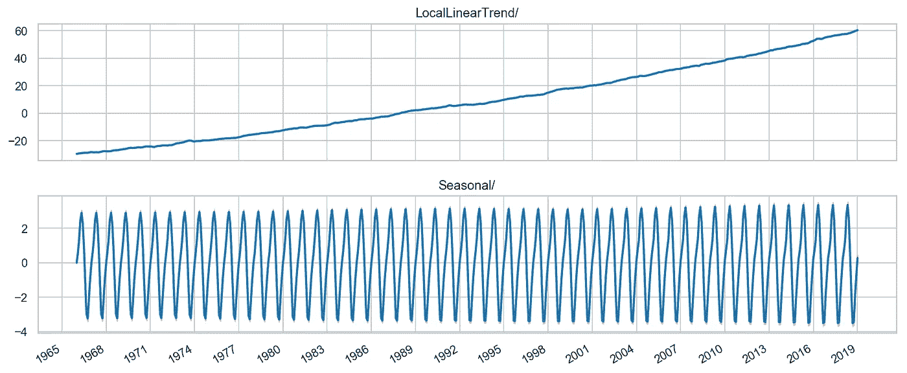

# 概率编程导论

> 原文：<https://towardsdatascience.com/intro-to-probabilistic-programming-b47c4e926ec5?source=collection_archive---------11----------------------->

## 使用张量流概率(TFP)的用例


图片来源:Unsplash

# 什么是概率规划？

概率编程背后的思想是将来自统计的推理算法和理论与来自编程语言的形式语义、编译器和其他工具结合起来，为来自机器学习的模型和应用程序构建高效的推理评估器。换句话说，概率编程*是统计建模*的工具。这个想法是从编程语言的世界中借鉴经验，并将它们应用到设计和使用统计模型的问题中。

> *概率编程是关于使用计算机科学工具进行统计的。*



关于[张量流概率](https://www.tensorflow.org/probability)

在上图中，你可以看到一个典型的计算机科学编程管道:编写一个程序，指定它的参数值，然后评估程序产生一个输出。右侧说明了统计学建模的方法:从输出、观察值或数据 Y 开始，然后指定一个抽象的生成模型 p(X，Y ),通常以数学方式表示，最后使用代数和推理技术来描述给定观察值的模型中未知量的后验分布 p(X | Y)。而在概率程序设计中:一种用于模型定义和统计推理算法的程序设计语言，用于计算程序输入的条件分布，这些条件分布可能会导致观察到的程序输出。

> *注意:概率编程并不是编写表现概率的软件。*

为了实现这样的系综结构，张量流引入了张量流概率。

# 张量流概率

TensorFlow Probability 是 TensorFlow 中用于概率推理和统计分析的库。作为 TensorFlow 生态系统的一部分，TensorFlow Probability 提供了概率方法与深度网络的集成、通过自动微分进行的基于梯度的推理，以及通过硬件加速(例如 GPU)和分布式计算对大型数据集和模型的可扩展性。
tensor flow-probability 中的概率机器学习工具是分不同层次构建的。在这篇博客中，我们将讨论使用 TensorFlow-probability 的*统计构建模块*和*模型构建*。

让我们从导入必要的模块开始:

# 张量流概率中的统计函数

# 分发-

A `[tfp.distributions.Distribution](https://www.tensorflow.org/probability/api_docs/python/tfp/distributions/Distribution)`是一个具有两个核心方法的类:`sample`和`log_prob`。这个类包含许多可以通过书写看到的发行版:

```
print_subclasses_from_module(tfp.distributions, tfp.distributions.Distribution)
```

让我们看看如何使用 tf-probability 对 stat101 中的正态分布进行采样，这是一个很好的开端:

```
# A standard normal
normal = tfd.Normal(loc=0., scale=1.) # mean=0, std=3samples = normal.sample(1000)
sns.distplot(samples)
plt.title("Samples from a standard Normal")
plt.show()'''
log of the probability density/mass function evaluated at the given sample value.
'''
print("log(PDF):",normal.log_prob(0.))
```

现在，为了计算其他统计参数，如累积分布函数和多重分布，我们仍然可以利用 tf 概率原生类。

```
# Define a single scalar Normal distribution.
dist = tfd.Normal(loc=0., scale=3.)  # mean=0, std=3# Evaluate the cdf at 1, returning a scalar.
dist.cdf(1.)# Define a batch of two scalar valued Normals.
# The first has mean 1 and standard deviation 11, the second 2 and 22.
dist = tfd.Normal(loc=[1, 2.], scale=[11, 22.])# Evaluate the pdf of the first distribution on 0, and the second on 1.5,
# returning a length two tensor.
dist.prob([0, 1.5])# Get 3 samples, returning a 3 x 2 tensor.
dist.sample([3])
```

使用上面的代码，你可以计算 CDFs 和多个正态分布。
在您的项目中使用统计工具时，您可能还需要声明多元分布，tf-probability 也为您提供了这方面的帮助！

```
mvn = tfd.MultivariateNormalDiag(loc=[0., 0.], scale_diag = [1., 1.])
print("Batch shape:", mvn.batch_shape)
print("Event shape:", mvn.event_shape)samples = mvn.sample(1000)
print("Samples shape:", samples.shape)g = sns.jointplot(samples[:, 0], samples[:, 1], kind='scatter')
plt.show()
```

在 tfp 模块中有很多这样的分布，对数正态分布、逻辑分布、对数正态混合分布、多项式分布、多变量正态分布等等。每一个分布都带有过多的统计推断和函数。

# 双喷射器-

双投影表示可逆的光滑函数。它们可用于转换分布，保留采样和计算 log _ probs 的能力。可以从`[tfp.bijectors](https://www.tensorflow.org/probability/api_docs/python/tfp/bijectors)`模块访问它们。

每个 bijector 至少实现 3 种方法:

*   `forward`
*   `inverse`，以及
*   `forward_log_det_jacobian`和`inverse_log_det_jacobian`中的(至少)一个。

有了这些成分，我们可以转换一个分布，并仍然从结果中获得样本和日志问题！

```
print_subclasses_from_module(tfp.bijectors, tfp.bijectors.Bijector)
```

使用上面的代码片段，我们可以列出 tf-probability 中所有可用的双射函数。

现在让我们看看如何使用双对象声明一个 NormalCDF，并计算正向传播中雅可比行列式的对数。

```
normal_cdf = tfp.bijectors.NormalCDF()
xs = np.linspace(-4., 4., 200)
plt.plot(xs, normal_cdf.forward(xs))
plt.show()plt.plot(xs, normal_cdf.forward_log_det_jacobian(xs, event_ndims=0))
plt.show()
```

双投影器主要用于变换分布。这里有一个应用变换的快速示例:

```
# creates a Y=g(X)=exp(X) transform
exp_bijector = tfp.bijectors.Exp()# declare a Normal Distribution and Transform it
log_normal = exp_bijector(tfd.Normal(0., .5))

samples = log_normal.sample(1000)
xs = np.linspace(1e-10, np.max(samples), 200)sns.distplot(samples, norm_hist=True, kde=False)
plt.plot(xs, log_normal.prob(xs), c='k', alpha=.75)
plt.show()
```

运行上面的代码片段后，您会看到一个转换后的分布(蓝色的框)和概率密度估计图(黑色的曲线)

我们成功地在 Tensorflow-probability 中实现了统计推断的构建模块，现在让我们看看如何对*表格时序*数据使用相同的框架。

# 张量流概率时间序列

TensorFlow-Probability (TFP)内置了对使用结构化时间序列模型进行拟合和预测的支持。这种支持包括模型的贝叶斯推断。因为它们是内置的 TensorFlow，所以这些方法自然利用了矢量化硬件(GPU 和 TPU)，可以高效地并行处理许多时间序列，并可以与深度神经网络集成。

让我们用张量流概率来解决一个时间序列问题:

# 导入必要的模块:

现在我们来定义一个 *Co2 浓度*历年(按月采样)的时间序列问题:



上述时间序列图

# 模型和拟合

我们将用一个局部线性趋势，加上一年中一个月的季节效应来模拟这个系列，并使用*变分推断来拟合这个模型。*这包括运行一个优化器来最小化一个变分损失函数，负证据下限(ELBO)。这符合参数的一组近似后验分布(实际上我们假设这些是变换到每个参数的支持空间的独立法线)。

`tfp.sts`预测方法需要后验样本作为输入，所以我们将通过从变分后验中抽取一组样本来结束。

运行上面的脚本后，您将看到如下图:



埃尔博损失曲线

# 预测

现在，让我们使用拟合模型来构建预测。我们只调用`tfp.sts.forecast`，它返回一个 TensorFlow 分布实例，表示未来时间步长上的预测分布。

特别是，预测分布的`mean`和`stddev`给了我们一个在每个时间步长都有边际不确定性的预测，我们也可以从中抽取可能未来的样本。

现在让我们想象一下二氧化碳浓度的预测。



上述代码片段的输出

我们可以观察到，我们的模型做出的预测结果相当不错。它能够捕捉季节变化和时间序列的总体趋势，并能够在发生时预测二氧化碳浓度。

现在让我们看看二氧化碳浓度的趋势和季节性:



正如我们已经讨论过的，统计推断和工具可以通过 TFP 轻松实现。在上面的图中，我们可以像其他核心统计模块一样有效地从数据中识别趋势和季节性。

# 你已经到达终点了！

恭喜你！我们刚刚学习了概率规划的用途和重要性，并讨论了张量流概率中的统计工具。更不用说我们刚刚使用 Tensorflow-probability 的模型解决了一个结构化的时间序列问题！

[*法比亚娜*](https://www.linkedin.com/in/fabiana-clemente/) *是* [*YData*](https://ydata.ai/?utm_source=medium&utm_medium=signature&utm_campaign=blog) *的首席数据官。*

**通过设计使数据在保密的情况下可用。**

[*YData*](https://ydata.ai/?utm_source=medium&utm_medium=signature&utm_campaign=blog) *帮助数据科学团队交付 ML 模型，简化数据采集，因此数据科学家可以将时间集中在重要的事情上。*