# 成为一名量子计算程序员

> 原文：<https://towardsdatascience.com/intro-to-quantum-computing-a5657afaf58b?source=collection_archive---------29----------------------->

## [奇点研究](https://towardsdatascience.com/tagged/the-singularity-research)

## 使用 Python 和 Qiskit

量子计算被许多人视为未来的技术。在这篇文章中，我们将看看如何在实际的量子计算机上运行一些重要的程序。特别是，我们将讨论一种叫做*的图形状态。*图态用于量子密码术、量子纠错和基于测量的量子计算。如果这些听起来像外语，那没关系。我们将从头到尾仔细检查每一件事…别担心，我们会保持轻松愉快。

照片由[分形哈桑](https://unsplash.com/@tetromino?utm_source=medium&utm_medium=referral)在 [Unsplash](https://unsplash.com?utm_source=medium&utm_medium=referral) 上拍摄

什么是量子计算？量子计算应该被视为 ASIC，或“专用集成电路”，如用于加速机器学习的 GPU。它们不应被视为标准“经典”计算机的替代品，如笔记本电脑、智能手机或谷歌等公司用于处理大量数据和训练机器学习模型数天的超级计算机。量子计算机是一种专门的计算资源，我们向它发送某些问题。量子计算机处理信息的方式与标准计算机中的标准二进制处理方式完全不同。他们使用类似于“*干涉“*”、“*叠加”、*和*“纠缠”*的特性，在解决某些类型的问题时获得超越经典计算机的优势。虽然通用量子计算机可以做经典计算机可以做的任何事情，但我们有兴趣解决的问题决定了我们是否要使用量子计算机。

最受欢迎的量子计算模型是*电路模型，*它将量子位上的操作描述为一系列*门*，可以用一个矩阵乘以一个向量来表示。让我们看一个例子。

首先，你需要下载免费的 Jupyter 笔记本工具，这是 Anaconda 的最新发行版(也是免费的)。下载完成后，打开 Anaconda navigator，并打开“Jupyter Lab”的一个实例。它会给你运行 Python 3 内核的选项，选择它。接下来，你会看到一个有单元格的窗口，如果你喜欢黑客风格，你可以将它切换到*黑暗模式*。

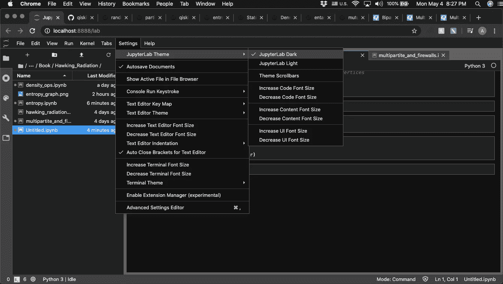

朱庇特实验室的黑暗主题

现在，在第一个单元格中，运行以下命令来导入您需要的库。

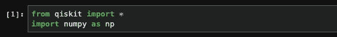

进口

一旦你做到了这一点，创建一个“量子寄存器”和一个“经典寄存器”如下，以及一个“量子电路”。

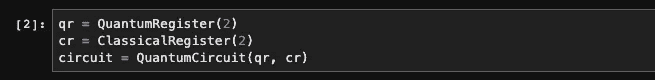

创建一个量子电路

量子和经典寄存器应该被认为是比特和量子比特的信息通道。在这个电路中，我们有两个量子比特和两个经典比特。现在，让我们对我们的量子位进行一些操作！让我们准备一个“铃州”。贝尔态是展示纠缠的经典例子。由于爱因斯坦、波多尔斯基和罗森在一篇经典论文中对这些量子态如何呈现纠缠态的评论，它们有时被称为 EPR 态。以下代码将构建一个电路，对第一个量子位应用“哈达玛门”，对第一个和第二个量子位应用“CNOT 门”，然后绘制电路。

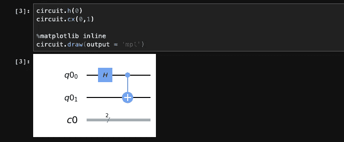

Qiskit 中的贝尔态电路

上述电路可以用线性代数解释如下:

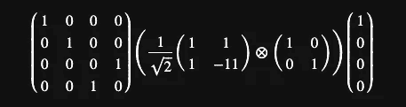

贝尔电路线性代数

如果你不是线性代数专家，没关系，Python 和 NumPy 可以为我们做这些计算…

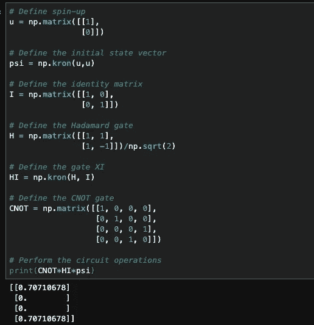

贝尔电路的数值计算

这输出了运行我们构建的量子电路所产生的状态向量。

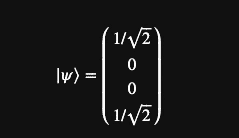

贝尔电路的状态向量

现在，我们刚刚构造的态矢，展示了纠缠和叠加。它同时以两种状态的组合存在，不像传统的位元总是 0 和 1。特别地，我们的状态向量表示两个状态“00”和“11”的组合。因此，两个量子位在测量时要么是自旋向上要么是自旋向下，但结果是概率性的，一个是 50%的时间，另一个是 50%的时间。令人着迷的是，我们只需要测量一个量子位*就可以知道另一个量子位处于什么状态！这是因为纠结。我们不需要观察第二个量子位就能知道它处于第一个量子位的任何状态。如果我们想在 IBM 量子计算机上运行这个，我们可以在(免费) [IBM 量子体验](https://quantum-computing.ibm.com/)中构建这个电路，使用一个交互式拖放电路编辑器。注册一个帐户，然后导航到边栏中的 circuit composer。*

**

*现在，点击“新电路”按钮。*

**

*接下来，只需将下列电路拖放到电路图上。这将准备与我们准备的相同的贝尔态，并将测量第一个量子位(带 z 的小黑米符号)。*

*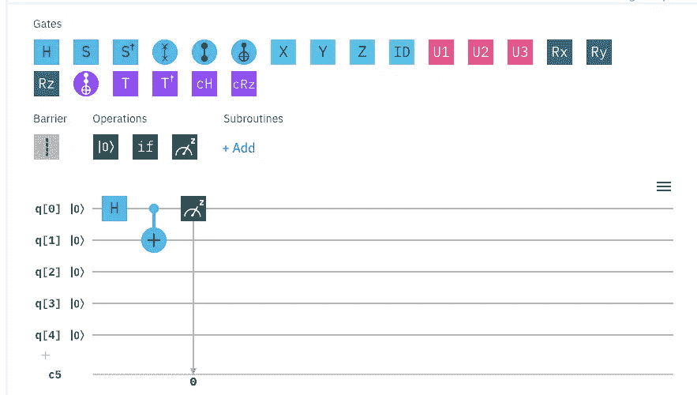*

*如果运行此电路，您可以在左侧看到可能要测量的两个状态。*

*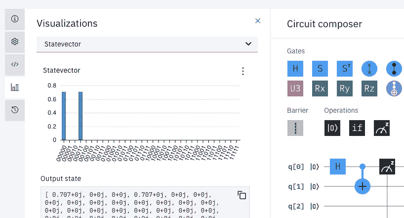*

*您可以在云中的 IBM quantum 计算机上运行该程序，并根据等待列表(该硬件上的作业数量)的长度来获取结果。就这么简单！*

*现在，如果你想构建一个图形状态，你可以使用我们在[奇点研究](https://github.com/The-Singularity-Research/graph-state-quantum-cryptography)用 NetworkX 写的以下函数。*

*您需要运行以下导入:*

*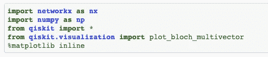*

*这个函数将定义一个图态量子电路:*

*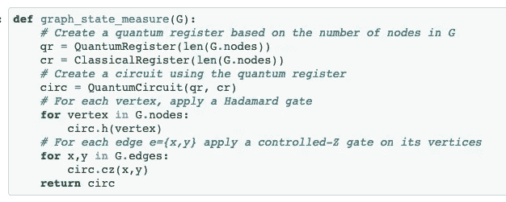*

*如果我们在 NetworkX 中定义以下图形:*

*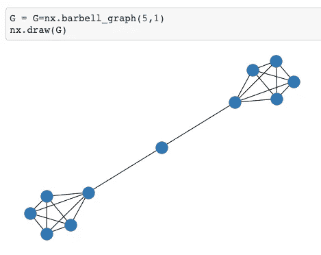*

*我们可以将“G”馈入“graph_state_measure(G)”函数，得到如下电路:*

*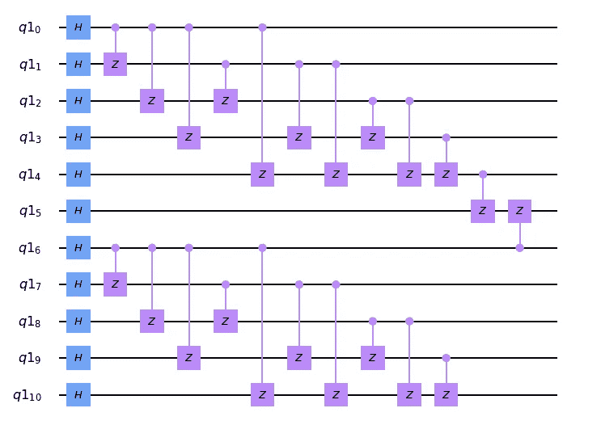*

*像这样的电路被称为图态，因为它们展示的纠缠是基于我们定义它们的图。连接电路图中两条线的粉红色“CZ 门”对应的是图中的边，图中的节点对应的是沿着电路图黑线运行的量子位。这些图态可以用在量子密码术中([见本互动笔记本](https://hub.gke.mybinder.org/user/the-singularity-um-cryptography-g7rz60zj/notebooks/certifying_graph_states.ipynb))。它们也用于纠错([见本互动笔记本](https://hub.gke.mybinder.org/user/the-singularity-rror-correction-eb98ieiv/notebooks/error_correction.ipynb))。*

*如果你想了解更多关于量子计算的知识，如果你想通过更高级的教程来解决纠缠、熵、复杂电路和算法等问题，你可以查看奇点的 Github 页面。我们有大量的交互式笔记本，您可以在浏览器中运行，而无需下载任何东西！你也可以查阅 IBM 为 Qiskit 编写的优秀的[在线书籍](https://qiskit.org/textbook/preface.html)，它以略微不同的方式涵盖了一些类似的主题，以及一些不同的主题。请随时联系并向 thesingularity.research@gmail.com 提问。确保在你的主题中包含“黑客宇宙”,这样就不会错过这封邮件。我们可以帮助你开始使用量子技术和量子机器学习。*