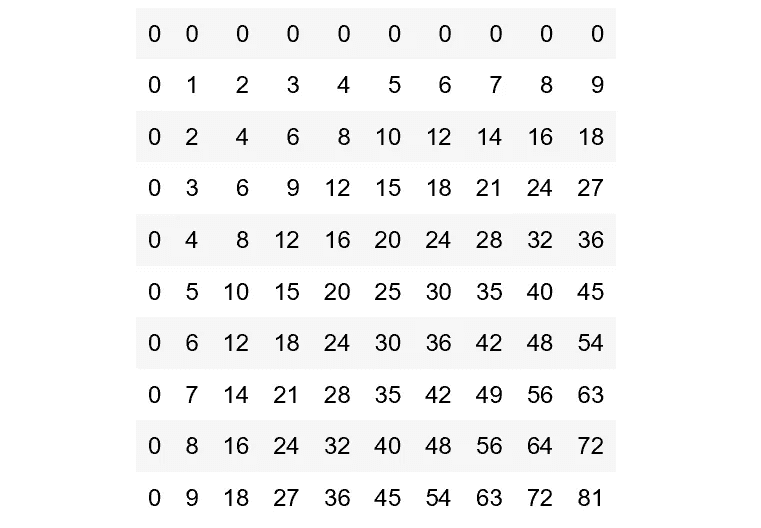
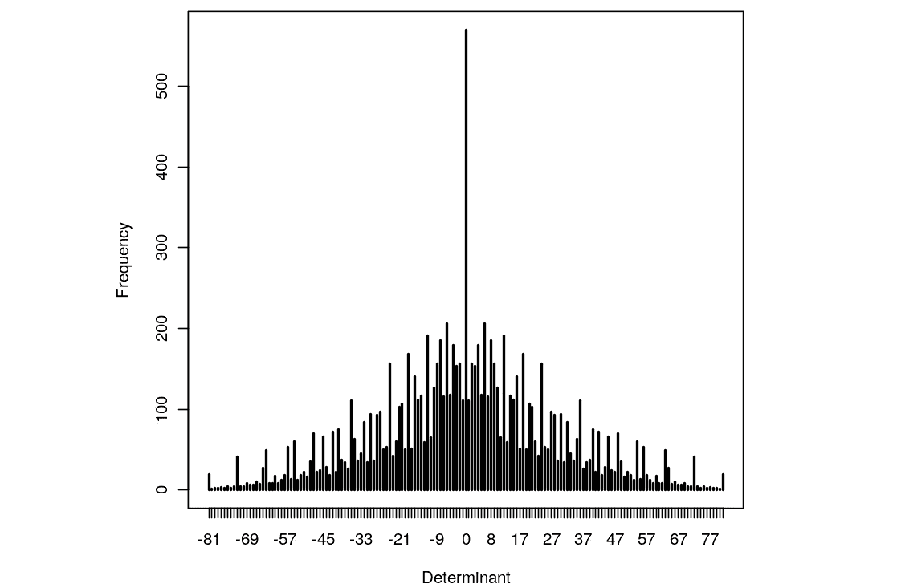

# R 简介:线性代数

> 原文：<https://towardsdatascience.com/intro-to-r-linear-algebra-2a4de2506c93?source=collection_archive---------8----------------------->


## 向量索引，特征向量求解器，奇异值分解，等等

r 是一种特别为数据分析、数据可视化和机器学习开发的非常强大的语言，这使得它成为任何有抱负的数据科学家的必学之作。

r 对线性代数尤其得心应手。它的内置数据类型(如向量和矩阵)与内置函数(如特征值和行列式解算器)和动态索引功能配合得很好。

这篇介绍 R 的文章将涵盖 R 中的以下线性代数主题实现:

## 向量

*   向量分配
*   向量运算
*   生成序列
*   逻辑向量
*   缺少值
*   索引向量

## 阵列和矩阵

*   数组
*   数组索引
*   矩阵索引
*   2 个数组的外积
*   演示:2x2 个位数矩阵的所有可能的行列式
*   数组的广义转置
*   矩阵乘法
*   特征值和特征向量
*   奇异值分解和行列式
*   最小二乘拟合和 QR 分解
*   形成分块矩阵

# 向量

## 向量分配

r 操作数据结构，其中最简单的是数字向量。向量是有序的数字集合。要创建一个包含四个元素`1`、`2`、`3`和`4`的向量`x`，可以使用连接函数`c()`。

```
x <- c(1, 2, 3, 4)
```

赋值操作符`<-`用在这个场景中，指向被赋值的对象。在大多数情况下，`<-`可以与`=`切换。

也可以使用功能`assign()`:

```
assign('x', c(1, 2, 3, 4))
```

运算符

也可以从另一个方向进行分配:

```
c(1, 2, 3, 4) -> x
```

## 向量运算

向量也可以有多种用途。

操作 `y <- c(x, 0, x)`会将向量`1, 2, 3, 4, 0, 1, 2, 3, 4` 分配给变量`y`。

向量可以与常数自由相乘和相加:

```
v <- 2*x + y + 1
```

注意，即使`x`和`y`长度不同时，该操作也有效。在这种情况下，R 将简单地循环使用 x(有时是分数),直到它满足 y 的长度。由于 y 是 9 个数字长，x 是 4 个单位长，x 将重复 2.25 次以匹配 y 的长度。

算术运算符`+`、`-`、`*`、`/`、`^`都可以使用。`log`、`exp`、`sin`、`cos`、`tan`、`sqrt`等等也可以。`max(x)`和`min(x)`代表一个向量`x`的最大和最小元素，`length(x)`是`x`中元素的个数。`sum(x)`给出`x`中元素的总和，而`prod(x)`给出它们的乘积。

`mean(x)`计算样本均值，`var(x)`返回样本方差。`sort(x)`返回一个向量，其大小与 x 相同，元素按升序排列。

## 生成序列

r 有很多生成数列的方法。`1:30`与`c(1, 2, …, 29, 30)`相同。冒号作为表达式中的最高优先级，所以`2*1:15`将返回`c(2, 4, …, 28, 30)`而不是`c(2, 3, …, 14, 15)`。

30∶1 可以用于反向生成序列。

`seq()`功能也可用于生成序列。`seq(2,10)` 返回与`2:10`相同的向量。在`seq()`中，用户还可以指定要执行的步长:`seq(1,2,by=0.5)`返回`c(1, 1.5, 2)`。

类似的功能还有`rep()`，用各种方式复制一个对象。比如`rep(x, times=5)`会端到端返回`x`的五个副本。

## 逻辑向量

R 中的逻辑值有 TRUE、FALSE 和 NA。逻辑向量是由条件设定的。`val <- x > 13`将`val`设置为与`x`长度相同的向量，条件满足时取值`TRUE`，条件不满足时取值`FALSE`。

r 中的逻辑运算符有`<`、`<=`、`>`、`>=`、`==`、`!=`，分别表示小于、小于或等于、大于、大于或等于、等于、不等于。

## 缺少值

如果`x`的对应元素是`NA`，函数`is.na(x)`返回一个与`x`大小相同的逻辑向量。

`x == NA`与`is.na(x)`不同，因为`NA`不是数值，而是不可用数量的标记。

第二种“缺失值”是由数值计算产生的，如`0/0`。在这种情况下，`NaN`(非数字)值被视为`NA`值；也就是说，`is.na(x)`将为`NA`和`NaN`值返回`TRUE`。`is.nan(x)`只能用于识别`NaN`值。

## 索引向量

第一种索引是通过逻辑向量。`y <- x[!is.na(x)]`将`y`设置为不等于`NA`或`NaN`的`x`值。

`(x+1)[(!is.na(x)) & x>0] -> z`将`z`设置为`x+1`中非`Na`或`NaN`且大于 0 的值。

第二种方法是用一个正整数量的矢量。在这种情况下，这些值必须在设置`{1, 2, …, length(x)}`中。向量的相应元素被选择并以该顺序连接以形成结果。重要的是要记住，与其他语言不同，R 中的第一个索引是 1，而不是 0。

`x[1:10]`返回`x`的前 10 个元素，假设`length(x)`不小于 10。`c(‘x’, ‘y’)[rep(c(1,2,2,1), times=4)]`产生长度为 16 的字符向量，其中`‘x’, ‘y’, ‘y’, ‘x’`重复四次。

负整数向量指定要排除而不是包含的值。`y <- x[-(1:5)]`将`y`设置为除了`x`的前五个值之外的所有值。

最后，当对象具有 names 属性来标识其组件时，可以使用字符串向量。有了水果`<- c(1, 2, 3, 4)`，可以用`names(fruit) <- c(‘mango’, ‘apple’, ‘banana’, ‘orange’)`设置矢量水果的各个指标的名称。然后，可以用`lunch <- fruit[c(‘apple’, ‘orange’)]`按名称调用元素。

这样做的好处是字母数字名称有时比索引更容易记忆。

请注意，索引表达式也可以出现在赋值的接收端，其中只对向量的那些元素执行赋值。例如，`x[is.na(x)] <- 0`用值`0`替换向量`x`中的所有`NA`和`NaN`值。

再比如:`y[y<0] <- -y[y<0]`和`y <- abs(y)`作用相同。代码只是用小于 0 的值的负值替换所有小于 0 的值。

# 阵列和矩阵

## 数组

数组是数据条目的下标集合，不一定是数字。

维度向量是非负整数的向量。如果长度是 *k* 那么数组就是 *k* 维的。尺寸从 1 到尺寸向量中给定的值进行索引。

向量可以被 R 作为数组使用，作为它的`dim` 属性。如果`z`是一个 1500 个元素的向量，赋值`dim(z) <- c(100, 5, 3)`将意味着`z`现在被视为一个 100 乘 5 乘 3 的数组。

## 数组索引

数组的单个元素可以通过给定数组名，后跟方括号中的下标来引用，下标由列分隔。

一个 3 乘 4 乘 6 的向量`a`可以通过`a[1, 1, 1]`调用它的第一个值，通过`a[3, 4, 6]`调用它的最后一个值。

`a[,,]`代表整个数组；因此，`a[1,1,]`在`a`中取第一个二维横截面的第一行。

## 索引矩阵

下面的代码生成一个 4 乘 5 的数组:`x <- array(1:20, dim = c(4,5))`。

数组由值的向量和矩阵的维数指定。首先从上到下计算值，然后从左到右计算值。

`array(1:4, dim = c(2,2))`会回来

```
1 3
2 4
```

而不是

```
1 2
3 4
```

索引矩阵中不允许负索引。`NA`和零值是允许的。

## 2 个数组的外积

对数组的一个重要操作是外积。如果`a`和`b`是两个数值数组，那么它们的外积就是一个数组，其维数向量是由两个维数向量串联而成，其数据向量是由`a`的数据向量与`b`的数据向量的元素的所有可能乘积而成。用运算符`%o%`计算外积:

`ab <- a %o% b`

实现这一点的另一种方法是

`ab <- outer(a, b, ‘*’)`

事实上，任何函数都可以使用 outer()函数应用于两个数组。假设我们定义了一个函数`f <- function(x, y) cos(y)/(1+x²)`。该函数可以通过`z <- outer(x, y, f)`应用于两个向量`x`和`y`。

## 演示:2x2 个位数矩阵的所有可能的行列式

考虑 2 乘 2 矩阵的行列式[a，b；c，d]其中每个条目是从 0 到 9 的非负整数。问题是找到这种形式的所有可能矩阵的行列式，并用高密度图表示该值出现的频率。

换句话说，如果每个数字都是独立均匀随机选取的，求行列式的概率分布。

一个聪明的方法是使用 outer(0 函数两次。

```
d <- outer(0:9,0:9)
fr <- table(outer(d, d, ‘-’))
plot(fr, xlab = ‘Determinant’, ylab = ‘Frequency’)
```

第一行将 d 赋给这个矩阵:



第二行再次使用 outer()函数计算所有可能的行列式，最后一行绘制了它。



## 数组的广义转置

函数`aperm(a, perm)`可以用来排列数组 a，参数 perm 必须是整数{1，…， *k* 的排列，其中 *k* 是 *a* 中下标的个数。该函数的结果是一个与 a 大小相同的数组，但是由`perm[j]`给出的旧维度变成了新的`j-th`维度。

一个简单的思考方法是矩阵转置的推广。如果`A`是一个矩阵，那么`B`就是`A`的转置:

```
B <- aperm(A, c(2, 1))
```

在这些特殊情况下，功能`t()`执行换位。

## 矩阵乘法

运算符%*%用于矩阵乘法。如果`A`和`B`是相同大小的方阵，`A*B`是两个矩阵的元素乘积。`A %*% B`是点积(矩阵积)。

如果 x 是一个向量，那么`x %*% A %*% x`就是一个二次型。

`crossprod()`执行叉积；因此，`crossprod(X, y)`与操作`t(X) %*% y`相同，但效率更高。

`diag(v)`，其中`v`是一个向量，给出一个对角矩阵，向量的元素作为对角元素。`diag(M)`，其中`m`是一个矩阵，给出`M`的主对角线元素的向量(与 Matlab 中的约定相同)。`diag(k)`，其中`k`为单个数值，通过`k`单位矩阵返回一个`k`。

## 线性方程和反演

解线性方程组是矩阵乘法的逆运算。当...的时候

```
b <- A %*% x
```

在只给定`A`和`b`的情况下，向量`x`就是线性方程组的解。这可以用 R 快速解决

```
solve(A, b)
```

## 特征值和特征向量

函数`eigen(Sm)`计算对称矩阵 Sm 的特征值和特征向量。结果是一个列表，第一个元素名为 values，第二个元素名为 vectors。`ev <- eigen(Sm)`将该列表分配给`ev`。

`ev$val`是`Sm`特征值的向量，`ev$vec`是对应特征向量的矩阵。

对于大型矩阵，如果使用表达式不需要计算特征向量，最好避免计算它们

```
evals <- eigen(Sm, only.values = TRUE)$values
```

## 奇异值分解和行列式

函数`svd(m)`采用任意矩阵参数`m`，并计算`m`的奇异值分解。这包括具有与`m`相同的列间距的标准正交列`U`的矩阵、其列间距是`m`的行间距的标准正交列`V`的第二矩阵以及正条目的对角矩阵`D`，使得

```
m = U %*% D %*% t(V)
```

`det(m)`可用于计算方阵的行列式`m`。

## 最小二乘拟合和 QR 分解

函数`lsfit()`返回一个列表，给出最小二乘拟合过程的结果。像这样的任务

```
ans <- lsfit(X, y)
```

给出最小二乘拟合的结果，其中 y 是观察向量，X 是设计矩阵。

`ls.diag()`可用于回归诊断。

一个密切相关的函数是 qr()。

```
b <- qr.coef(Xplus,y)
fit <- qr.fitted(Xplus,y)
res <- qr.resid(Xplus,y)
```

这些计算出`y`到`fit`中`X`范围的正交投影，到`res`中正交补码的投影，以及`b`中投影的系数向量。

## 形成分区`Matrices`

矩阵可以通过函数`cbind()`和`rbind()`从其他向量和矩阵中构建。

`cbind()`通过横向(按列)绑定矩阵形成矩阵，`rbind()`通过纵向(按行)绑定矩阵。

在赋值`X <- cbind(arg_1, arg_2, arg_3, …)`中，`cbind()`的参数必须是任意长度的向量，或者是具有相同列大小(相同行数)的列。

`rbind()`对行执行相应的操作。

## 感谢阅读！

我希望这篇关于 R 的介绍能够让您对 R 在线性代数中的强大功能有所了解。