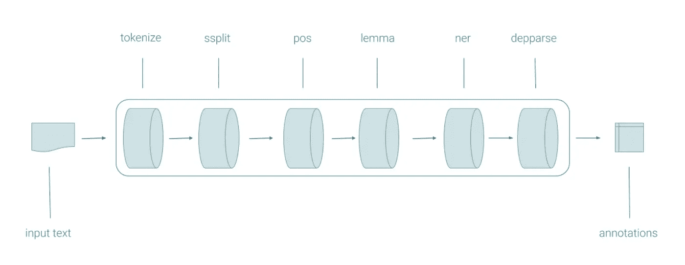
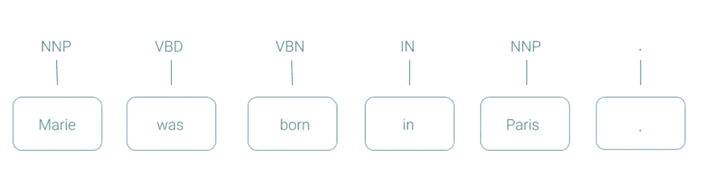
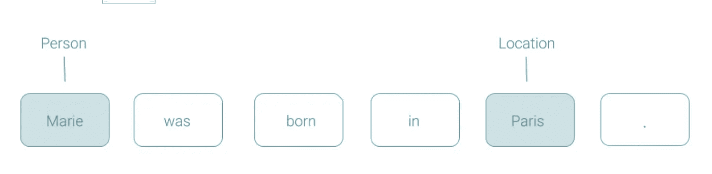
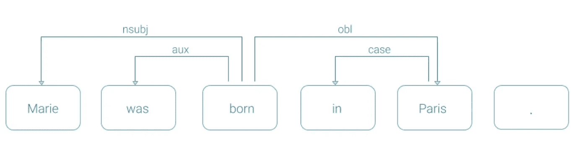
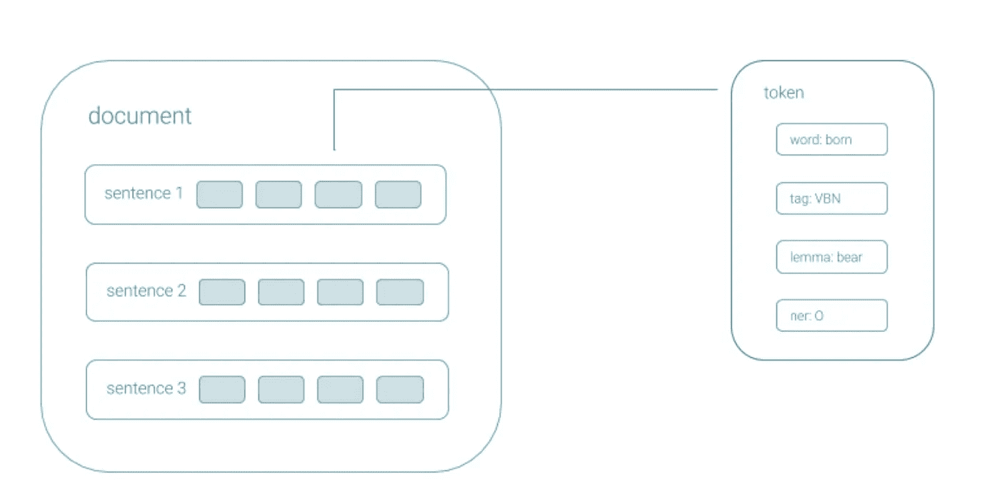
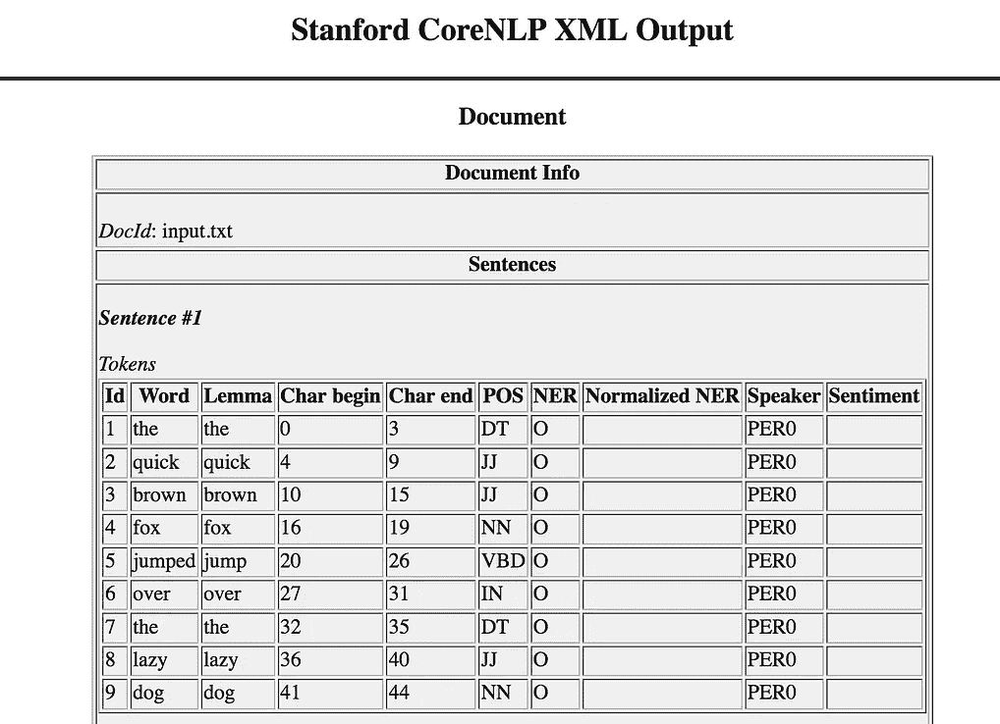
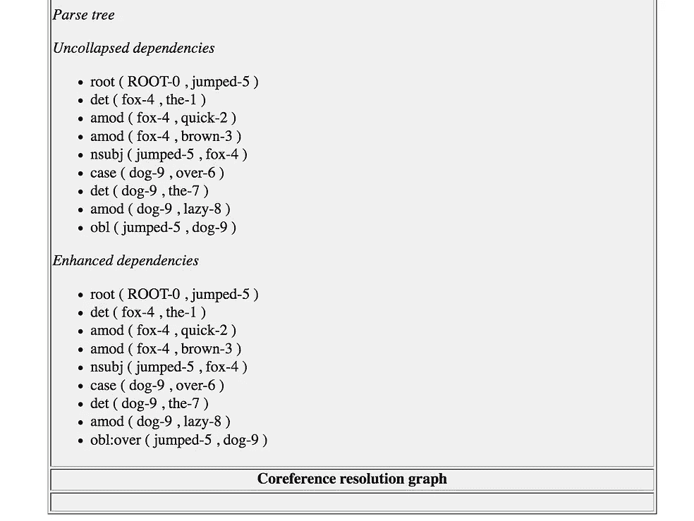
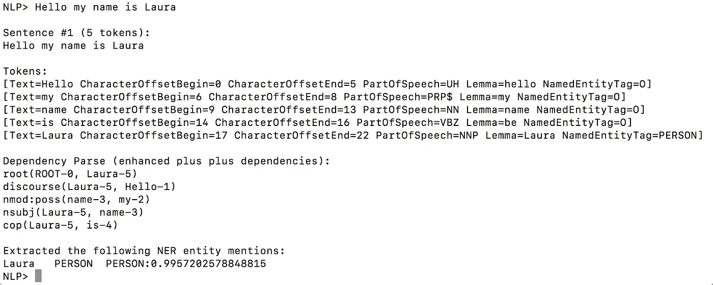
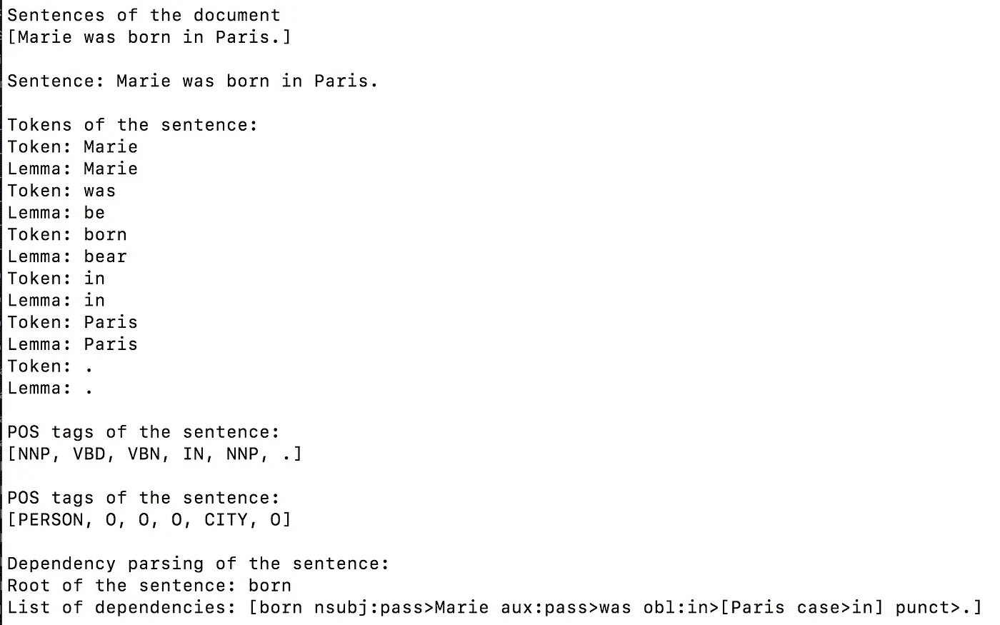
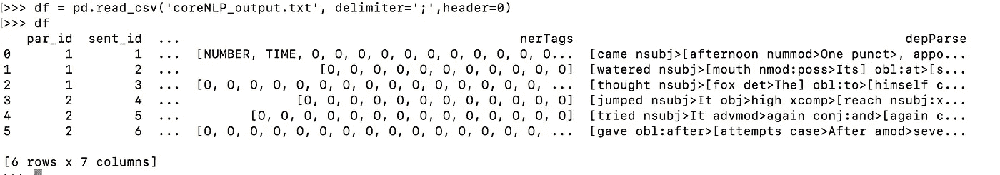

# 斯坦福大学 Pythoners 课程简介

> 原文：<https://towardsdatascience.com/intro-to-stanfords-corenlp-and-java-for-python-programmers-c2586215aab6?source=collection_archive---------22----------------------->

## 在您的 Python 项目中安装、开始使用和集成 coreNLP Java 脚本。

你好。我回来了，我希望这是斯坦福大学 CoreNLP 图书馆系列文章的第一篇。在本文中，我将重点介绍这个库的安装，并为像我这样的 Java 新手介绍它的基本特性。我将首先通过命令行来完成安装步骤和一些测试。稍后，我将带您浏览两个非常简单的 Java 脚本，您可以轻松地将它们合并到 Python NLP 管道中。你可以在 [github](https://github.com/laurabravopriegue/coreNLP_tutorial) 上找到完整的代码！


[梁杰森](https://unsplash.com/@ninjason?utm_source=medium&utm_medium=referral)在 [Unsplash](https://unsplash.com?utm_source=medium&utm_medium=referral) 上拍照

CoreNLP 是一个工具包，用它你只需要几行代码就可以生成一个相当完整的 NLP 管道。该库包括所有主要 NLP 过程的预构建方法，如词性(POS)标记、命名实体识别(NER)、依存解析或情感分析。它还支持除英语之外的其他语言，尤其是阿拉伯语、汉语、德语、法语和西班牙语。

我是这个库的忠实粉丝，主要是因为它的情感分析模型是多么酷的❤(我将在下一篇文章中详细介绍)。然而，我明白为什么大多数人宁愿使用 NLTK 或 SpaCy 等其他库，因为 CoreNLP 可能有点矫枉过正。事实上，coreNLP 的计算成本可能比其他库高得多，对于浅层 NLP 进程，结果甚至不会明显更好。另外，它是用 Java 编写的，对于 Python 用户来说入门有点痛苦(但是它是可行的，正如您将在下面看到的，如果您不介意的话，它还有一个 Python API)。

*   **CoreNLP 管道和基本标注器**

coreNLP 的基本构建模块是 **coreNLP** 管道**管道**。管道获取输入文本，对其进行处理，并以 **coreDocument 对象**的形式输出处理结果。coreNLP 管道可以根据您的 NLP 项目需求进行定制和调整。**属性对象**允许通过添加、删除或编辑**注释者**来进行定制。

那有很多行话，所以让我们用一个例子来分解它。所有的信息和数据都来自官方的 coreNLP 页面。



coreNLP 基本管道——图摘自 [coreNLP 现场](https://stanfordnlp.github.io/CoreNLP/pipeline.html#running-a-pipeline-from-the-command-line)

在上图中，我们有一个基本的 coreNLP 管道，默认情况下，当您第一次运行 coreNLP 管道类而不做任何更改时，就会运行这个管道。在最左边，我们有进入管道的**输入文本**，这通常是普通的*。txt* 文件。管道本身由 **6 个标注器**组成。这些注释器中的每一个都将按顺序处理输入文本，处理的中间输出有时被其他一些注释器用作输入。如果我们想通过添加或删除注释器来改变这个管道，我们可以使用 **properties 对象**。最终输出是一组**注释**，其形式为一个 **coreDocument 对象**。

我们将在整篇文章中使用这个基本管道。稍后当我们看一个例子时，对象的性质将变得更加清楚。现在，让我们记下每个注释器做了什么:

*   **注释器 1:标记化** →将原始文本转换成标记。
*   **注释者 2:分句** →将原文分成句子。
*   **标注器 3:词性(POS)标注** →给记号分配词性标签，比如是动词还是名词。文本中的每个标记都将被赋予一个标签。



位置标记示例—图摘自 [coreNLP 网站](https://stanfordnlp.github.io/CoreNLP/pipeline.html#running-a-pipeline-from-the-command-line)

*   **注释器 4:词条化** →将每个单词转换成它的词条，即它的字典形式。例如，单词“was”被映射为“be”。
*   **注释器 5:命名实体识别(NER)** →当实体(人、国家、组织等)在文本中被命名时进行识别。它还能识别数字实体，如日期。



NER 示例—图摘自 [coreNLP 网站](https://stanfordnlp.github.io/CoreNLP/pipeline.html#running-a-pipeline-from-the-command-line)

*   **注释器 6:依存解析** →将解析文本并突出显示单词之间的依存关系。



依存解析示例—图摘自 [coreNLP 网站](https://stanfordnlp.github.io/CoreNLP/pipeline.html#running-a-pipeline-from-the-command-line)

最后，来自 6 个标注器的所有输出被组织到一个**核心文档**中。这些基本上是以结构化方式包含注释信息的数据对象。CoreDocuments 使我们的生活变得更容易，因为，正如您将在后面看到的，它们存储了所有的信息，以便我们可以用一个简单的 API 来访问它。



CoreDocument 的图形表示——图摘自 [coreNLP 网站](https://stanfordnlp.github.io/CoreNLP/pipeline.html#running-a-pipeline-from-the-command-line)

*   **安装**

你需要安装 Java。你可以在这里下载最新版本的。为了下载 CoreNLP，我遵循了[官方指南](https://stanfordnlp.github.io/CoreNLP/download.html):

1.  使用 curl 或 wget 下载 CoreNLP zip 文件

```
curl -O -L http://nlp.stanford.edu/software/stanford-corenlp-latest.zip
```

2.解压缩文件

```
unzip stanford-corenlp-latest.zip
```

3.移到新创建的目录中

```
cd stanford-corenlp-4.1.0
```

现在让我们来看几个例子，以确保一切正常。

*   **使用命令行和 input.txt 文件的示例**

对于这个例子，首先我们将打开终端并创建一个测试文件，我们将使用它作为输入。代码改编自 coreNLP 的官方网站。您可以使用以下命令:

```
echo "the quick brown fox jumped over the lazy dog" > test.txt
```

`echo`在 test.txt 文件上打印句子`"the quick brown fox jumped over the lazy dog"`。

现在让我们在测试句子上运行一个默认的 coreNLP 管道。

```
java -cp “*” -mx3g edu.stanford.nlp.pipeline.StanfordCoreNLP -outputFormat xml -file test.txt
```

这是一个 java 命令，从类*edu . Stanford . NLP . pipeline . stanfordcorenlp .*加载并运行 coreNLP 管道，因为我们没有对该类进行任何更改，所以设置将设置为默认值。管道将使用 test.txt 文件作为输入，并将输出一个 XML 文件。

运行该命令后，管道将开始注释文本。你会注意到这需要一段时间……(一个 9 个单词的句子大约需要 20 秒🙄).输出将是一个名为 test.txt.xml 的文件。这个过程还会自动生成一个 XSLT 样式表( *CoreNLP-to-HTML.xsl* )，如果您在浏览器中打开它，它会将 xml 转换为 HTML。



在 Firefox 中显示的 XML 文件

似乎一切都很好！！我们看到标准管道实际上相当复杂。它包括了我们在上一节中看到的所有注释器:标记化、句子分割、语义化、词性标注、NER 标注和依存解析。

***注意:*** *我用 Firefox 显示了它，然而我花了很长时间才弄明白如何做到这一点，因为显然在 2019 年 Firefox 不再允许这样做。可以通过进入* about:config *页面并将*privacy . file _ unique _ origin*设置更改为* False *来解决这个问题。如果对您不起作用，您可以选择 json 作为输出格式，或者用文本编辑器打开 XML 文件。*

*   **使用交互式外壳模式的示例**

对于我们的第二个例子，您也将专门使用终端。CoreNLP 有一个很酷的交互式 shell 模式，可以通过运行以下命令进入。

```
java -cp “*” -mx3g edu.stanford.nlp.pipeline.StanfordCoreNLP 
```

一旦进入这种交互模式，您只需键入一个句子或一组句子，它们将由基本的注释器动态处理！下面你可以看到一个如何分析句子“你好，我叫劳拉”的例子。



我们可以看到在终端中以不同格式打印的 XML 文件中看到的相同注释！你也可以用更长的文本来尝试。

*   **使用非常简单的 Java 代码的示例**

现在让我们来看几个 Java 代码示例！我们将基本上使用 Java 创建和调整管道，然后将结果输出到一个. txt 文件中，该文件可以合并到我们的 Python 或 R NLP 管道中。代码改编自 coreNLP 的官方网站。

**例 1**

在我的 github 中找到完整的代码。我将首先带您浏览一下*coreNLP _ pipeline 1 _ LBP . Java*文件。我们开始导入所有需要的依赖项的文件。然后，我们将创建一个用于分析的文本示例。您可以将其更改为任何其他示例:

```
public static String text = "Marie was born in Paris."; 
```

现在，我们设置了管道，创建了一个文档，并使用以下代码行对其进行了注释:

```
// set up pipeline properties
Properties props = new Properties();// set the list of annotators to run
props.setProperty("annotators","tokenize,ssplit,pos,lemma,ner,depparse");// build pipeline
StanfordCoreNLP pipeline = new StanfordCoreNLP(props);// create a document object and annotate it
CoreDocument document = pipeline.processToCoreDocument(text);
pipeline.annotate(document);
```

文件的其余几行将在终端上打印出来，进行几次测试以确保管道工作正常。例如，我们首先获得输入文档的句子列表。

```
// get sentences of the document
        List <CoreSentence> sentences = document**.sentences()**;
        System.out.println("Sentences of the document");
        System.out.println(sentences);
        System.out.println();
```

注意，我们使用 document 对象上的方法`.sentences()`获得句子列表。类似地，我们在宾语句子上使用方法`.tokens()`得到句子的标记列表，在宾语 tok 上使用方法`.word()`和`.lemma()`得到单个单词和词条。

```
List<CoreLabel> tokens = sentence**.tokens()**;System.out.println("Tokens of the sentence:");
          for (CoreLabel tok : tokens) {
            System.out.println("Token: " + tok**.word()**);
            System.out.println("Lemma: " + tok**.lemma()**);
          }
```

要运行这个文件，你只需要把它保存在你的`stanford-corenlp-4.1.0`目录下，然后使用命令

```
java -cp "*" coreNLP_pipeline1_LBP.java
```

结果应该是这样的:



**例二**

第二个例子*coreNLP _ pipeline 2 _ LBP . Java*略有不同，因为它读取一个文件 *coreNLP_input.txt* 作为输入文档，并将结果输出到一个 *coreNLP_output.txt* 文件。

我们使用短篇故事*狐狸和葡萄*作为输入文本。这是一份有 2 段 6 句话的文件。处理过程将类似于上面的例子，除了这一次我们还将跟踪段落和句子的编号。

最大的变化将是关于读取输入和写入最终输出。下面的这段代码将创建输出文件(如果它还不存在)并使用 **PrintWriter** 打印列名…

```
File file = new File("coreNLP_output.txt");
    //create the file if it doesn't exist
    if(!file.exists()){
      file.createNewFile();}**PrintWriter** out = new **PrintWriter**(file);//print column names on the output document      out.println("par_id;sent_id;words;lemmas;posTags;nerTags;depParse");
```

…另一位将使用扫描仪读取输入文档。输入文档将被保存为一个字符串文本，我们可以像示例 1 中那样使用它。

```
**Scanner** myReader = new **Scanner**(myObj);while (myReader.hasNextLine()) {
          String text = myReader.nextLine();
```

运行文件*coreNLP _ pipeline 2 _ LBP . Java*并生成输出后，可以使用以下 python 代码将其作为 dataframe 打开:

```
df = pd.read_csv('coreNLP_output.txt', delimiter=';',header=0)
```

产生的数据帧将如下所示，并可用于进一步分析！



coreNLP 数据框架

*   **结论**

正如你所看到的，coreNLP 非常容易使用，并且很容易集成到 Python NLP 管道中！你也可以把它直接打印到一个. csv 文件中，并使用其他分隔符，但是我遇到了一些烦人的解析问题。不管怎样，希望你喜欢这篇文章，并且记住完整的代码可以在 [github](https://github.com/laurabravopriegue/coreNLP_tutorial) 上找到。

在下面的帖子中，我们将开始讨论递归情感分析模型，以及如何在 coreNLP 和 Java 中使用它。请继续关注，了解更多关于✌科伦普的信息🏻

*   **参考书目**

[](https://stanfordnlp.github.io/CoreNLP/index.html) [## 概观

### 高性能人类语言分析工具，现在带有 Python 中的原生深度学习模块，可用于许多…

stanfordnlp.github.io](https://stanfordnlp.github.io/CoreNLP/index.html) [](https://stanfordnlp.github.io/CoreNLP/download.html) [## [计] 下载

### 斯坦福 CoreNLP 可以通过下面的链接下载。这将下载一个大的(536 MB) zip 文件，其中包含(1)的…

stanfordnlp.github.io](https://stanfordnlp.github.io/CoreNLP/download.html) [](https://stanfordnlp.github.io/CoreNLP/pipeline.html) [## 管道

### CoreNLP 的核心是管道。管道接收文本或 xml，并生成完整的注释对象…

stanfordnlp.github.io](https://stanfordnlp.github.io/CoreNLP/pipeline.html) [](https://stanfordnlp.github.io/CoreNLP/api.html) [## CoreNLP API

### 下面是一小段代码，演示了在一些示例文本上运行完整的管道。它需要英国人…

stanfordnlp.github.io](https://stanfordnlp.github.io/CoreNLP/api.html) [](https://stanfordnlp.github.io/CoreNLP/cmdline.html) [## 命令行用法

### 注意:Stanford CoreNLP v.3.5+需要 Java 8，但也可以使用 Java 9/10/11。如果使用 Java 9/10/11，您需要…

stanfordnlp.github.io](https://stanfordnlp.github.io/CoreNLP/cmdline.html)