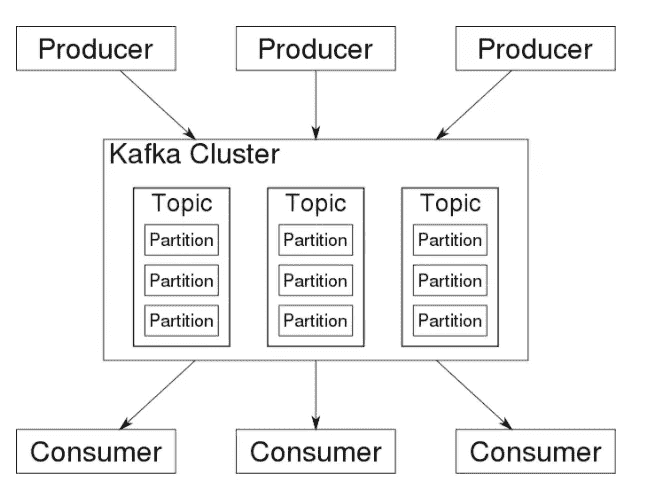
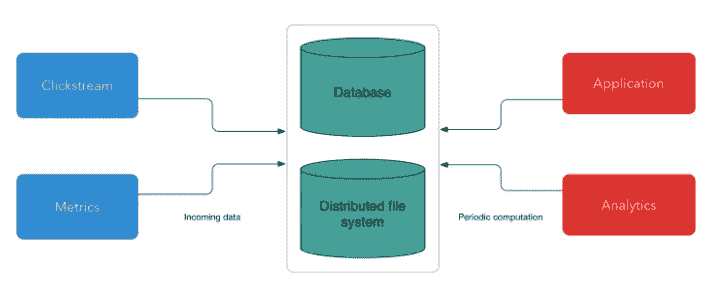
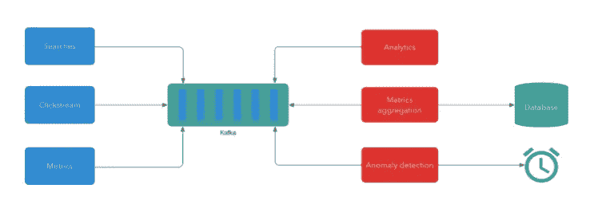
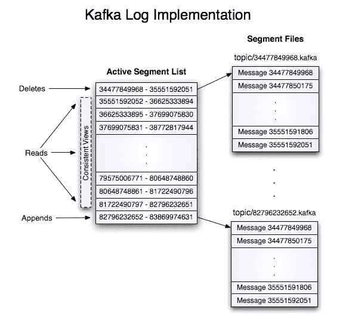
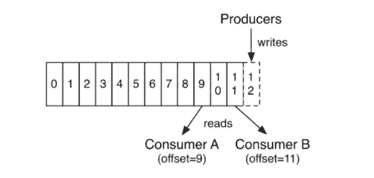

# 流式数据和 Apache Kafka 简介

> 原文：<https://towardsdatascience.com/intro-to-streaming-data-and-apache-kafka-5a797231258f?source=collection_archive---------27----------------------->

## 流数据架构概述以及 Apache Kafka 如此受欢迎的原因

术语“大数据”不仅仅指数量和容量。生活在一个随时可以获得信息和即时通信的时代，数据架构已经转向**面向流**就不足为奇了。对公司来说，真正的价值不仅仅来自于坐拥大量收集的数据点，还来自于他们尽快(甚至是实时)提取可操作的见解的能力。以更快的速度处理数据使公司能够实时应对不断变化的业务环境。

不言而喻，在过去的十年中，能够捕获、保留和处理这种极其快速的信息流的应用程序(又名消息代理软件)一直在不断增长。截至 2020 年，Apache Kafka 是最广泛采用的信息中介软件之一(被网飞、优步、Airbnb 和 LinkedIn 等公司使用)来完成这些任务。这个博客将非常简要地概述流处理的概念、流数据架构以及为什么 Apache Kafka 获得了如此大的发展势头。

图片来源:Giphy

# **什么是流处理？**

溪流加工最好被想象成一条河流。就像水在河流中流动一样，信息包也在无尽的流处理中流动。

根据 AWS，流数据的一般定义将是“由成千上万个数据源连续生成的数据，这些数据源通常同时发送数据记录，并且大小很小(千字节量级)”。

数据流在时间序列中工作得特别好，以便随着时间的推移找到潜在的模式。它在可以不断收集不同数据信号的物联网领域也大放异彩。其他常见的应用包括网络交互、电子商务、交易日志、地理定位等等。

实时处理和流处理之间有细微的区别:

1.  就数据处理而言，实时处理意味着严格的截止日期。换句话说，事件时间非常重要，秒级的延迟是不可接受的。
2.  流处理更多地是指在连续的数据流中的一种计算方法。从最后一天创建的所有脸书帖子中打印出来的应用程序实际上没有时间限制。然而，长期输出速率应该比长期输入速率更快(或至少相等),否则系统存储需求将无限增大。

# **流式数据架构**

标准流数据架构由 3 个基本块组成:

1.  *消息代理*。它从所谓的生产商那里收集流媒体数据。生产者可以跟踪任何事件，从指标，点击流，搜索等。然后，所有这些动作都被存储到 Apache Kafka 架构的原子构建块中，即主题和分区。Kafka 的一个关键优势是它能够并行化分区，从而提高整体吞吐量。这些信息随后被提供给消费者，消费者将以不同的方式使用这些输出。

图片来源:维基百科/卡夫卡消息代理

两个非常著名的新一代消息代理软件是 Apache Kafka 和 Amazon Kinesis，与 RabbitMQ 和 Active MQ 等老版本相对。

2.*实时 ETL 工具*

然后，原始数据被转换、清理和聚合，以便可以被基于 SQL 的系统使用，以便以后进行分析。

执行这些任务的一些最常用的平台是流处理器，如 Spark 流、Kafka 流等。这个阶段的结果可能是 API 调用、动作、警报等。

3.*数据存储和分析*

在我们的数据流处理器准备好数据后，我们必须对其进行存储和分析，以便提供有价值的见解。如此大量的数据可以存储在像亚马逊 S3 这样的廉价数据湖中，代价是延迟和 SQL 操作。或者像 Cassandra 和 Amazon Redshift 这样的数据仓库，它们比数据湖更难管理，但也更结构化。或者，它们也可以存储在消息代理本身的内存中(例如 Kafka ),但这比数据湖要贵 10 倍。

# **为什么卡夫卡如此受关注？**

为了更好地理解流处理是如何产生的，让我们简单地看一下在阿帕奇卡夫卡之前数据处理是什么样子的。所有数据之前都存储在数据库或分布式文件系统中，将定期(1 小时、1 天等)对其进行分析和操作。

尽管这一模式已经运行了很长时间，并且仍有许多应用，但它也有一个根本性的缺陷。在一个数据价值随时间快速下降的世界里，它根本无法即时分析数据。

流处理就是获取和分析事件的**流**，正如我们前面看到的，负责获取的主干由我们的消息代理软件组成，它能够接收所有这些数据信号，并使它们(几乎)立即可用。然而，创建一个多对多生产者对消费者的超高效系统并非易事，这正是 Linkedin 在 2008 年开始研究 Kafka 时必须面对的问题。其中一个主要问题是，生产者应该如何在私人会议中将信息直接传递给每个消费者，以及消费者如何在生产者编写数据时读取这些数据。

Linkedin 的项目(后来成为 Apache Kafka)解决了这个问题，并提供了一个分布式平台，能够在流记录发生时对其进行处理。

它基本上成为了现代流处理的主干，并且非常成功，以至于其他公司创建了他们的对手，如 Amazon Kinesis 和 Azure Event Hubs。

它受欢迎的核心是引入了一个面向日志的系统，而不是以前采用的批处理结构。日志是按时间顺序排列的、只需追加的一系列事件，消费者可以随时从中提取信息。来自购物车的日志中的数据事件的例子可以是添加项目、删除项目、结帐等。在 Kafka 中，消息被写在维护其日志的主题上，消费者可以从中提取数据。

图片来源:Apache Kafka 官方网站/仅附加日志结构

即使像 Rabbit MQ 和 ActiveMQ 这样的消息代理软件在 Kafka 之前就已经存在多年了，日志附加结构仍然允许处理数量惊人的事务。在 Kafka 中，每个消费者负责跟踪他们的活动，而在 RabbitMQ 这样的软件中，他们必须像队列一样工作，消息代理本身跟踪消费者的活动。

不得不说，卡夫卡并没有使以前的系统过时，它们仍然适用于其他建筑，它们只是更适合。Kafka 提供了更高的吞吐量，目前使像网飞这样的公司能够在高峰时间每秒处理 800 万个事件的数量级的令人难以置信的数据。