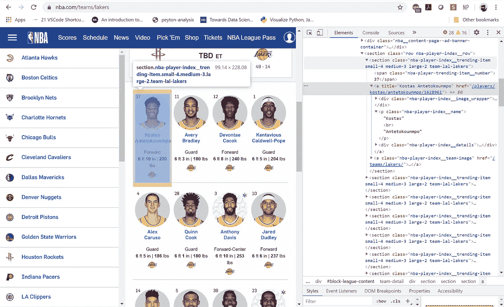
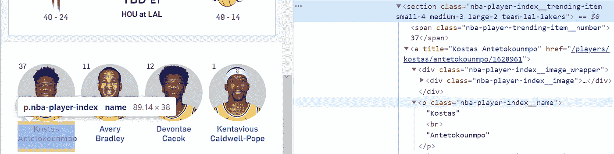
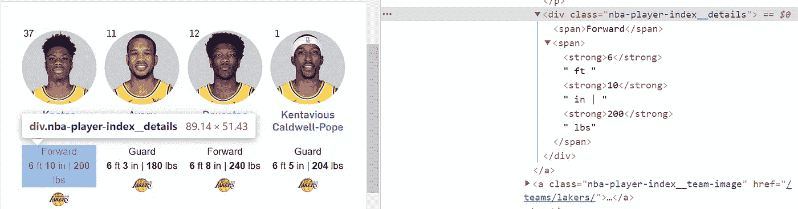
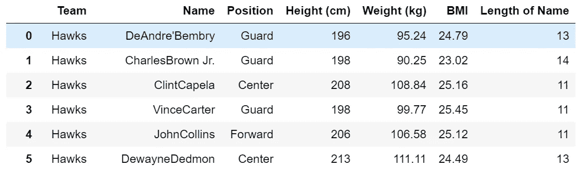
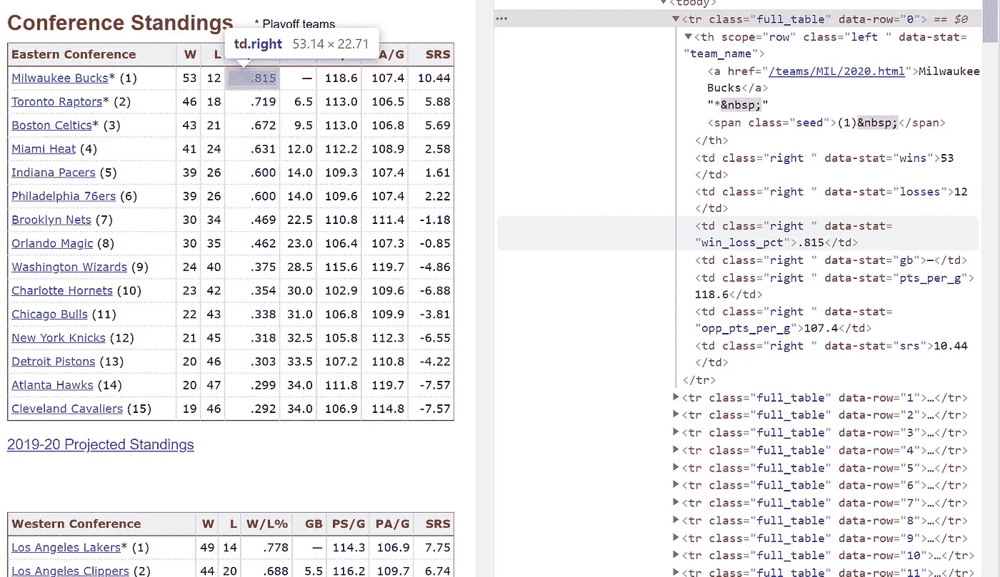
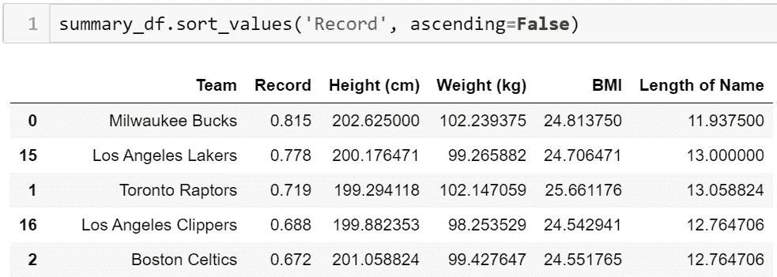
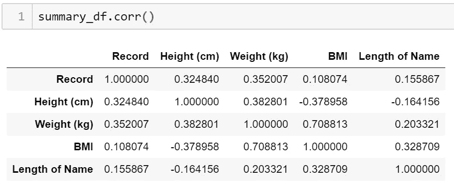
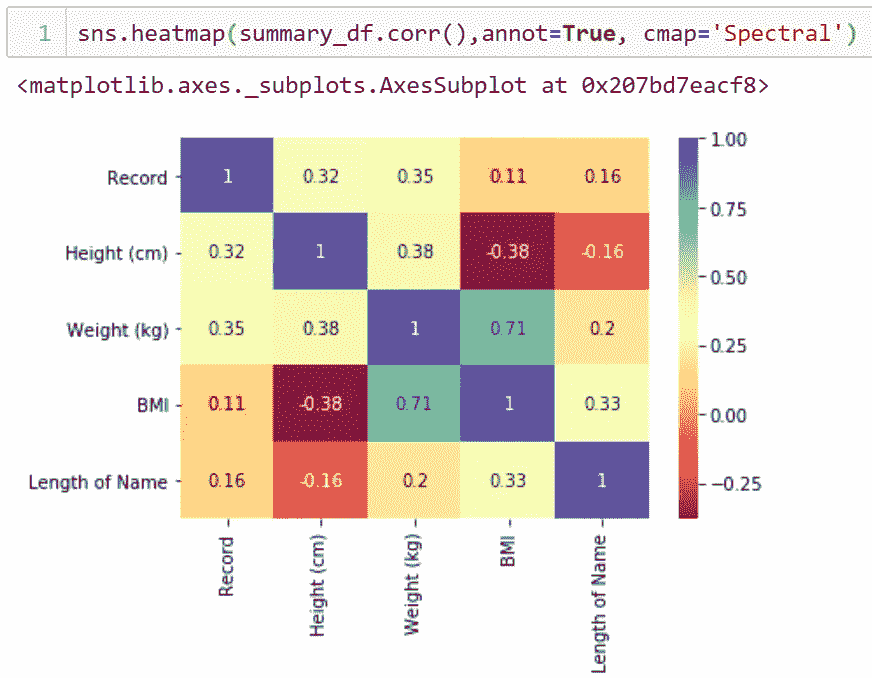
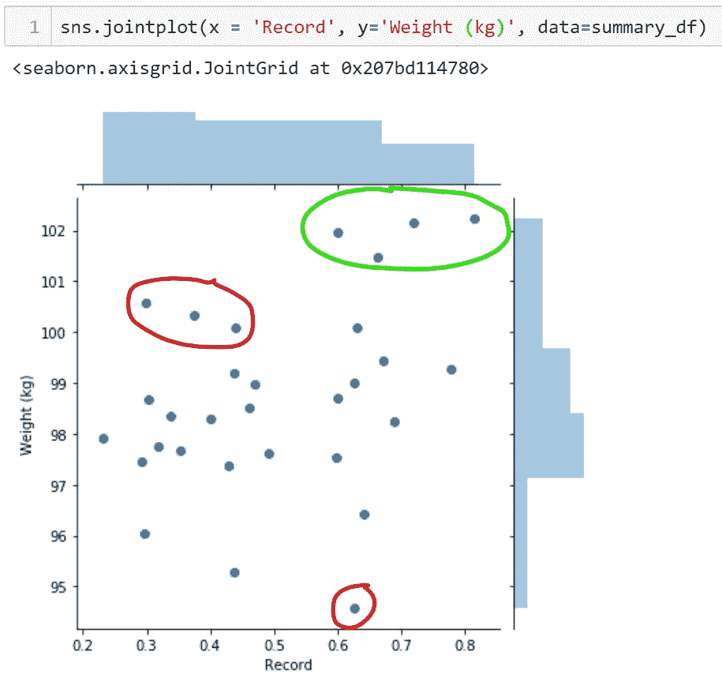

# 网络报废介绍:我们如何轻松找到我们想要的数据？

> 原文：<https://towardsdatascience.com/intro-to-web-scrapping-how-can-we-easily-seek-the-data-we-want-d9f3d9359246?source=collection_archive---------59----------------------->

## *使用 BeautifulSoup、Regex 和 Seaborn visualization 分析影响 NBA 球队胜率的因素*


来源:[塞斯·里斯](https://unsplash.com/@seththr)

那你为什么要读这个？坦白地说，我写这篇文章既是为了你，也是为了我自己。你看，我有一个豌豆大小的大脑，我希望写一篇这样的文章，作为我重温这些技术的日志。这也意味着我会把它写成一本儿童故事书，让我小小的豌豆脑袋去理解，也让你容易消化。尽情享受吧！

这个分析项目的目标是找出一个 NBA 球员的身体素质对他们球队的成功有多大的贡献。因此，我们将分析每支球队平均球员的身高、体重和身体质量指数，并与当前赛季的记录进行对比。当我们这样做的时候，我觉得有点恶作剧，就加上了 ***【名字的平均长度】*** ，纯粹是为了满足我对它如何与其他属性匹配的好奇心。

## 1.创建 BeautifulSoup 对象

首先，为了创建 soup 对象，我们必须使用我们希望从中提取数据的 URL 创建一个请求对象。在我的例子中，URL 是:**"**[**https://www.nba.com/teams/**](https://www.nba.com/teams/)**(blank)"**，( *blank)是所有 30 支球队的名字。因此，在循环创建我需要的对象之前，我创建了一个名为 teams 的 2D 列表。*

```
**#snippet of teams list**
teams = [[‘atl’,’hawks’],[‘bos’,’celtics’],[‘bkn’,’nets’]]**#create request object**
for team in teams:
 url = “[https://www.nba.com/teams/](https://www.nba.com/teams/)" + team[1]
 r = requests.get(url)**#create soup object**
 soup = BeautifulSoup(r.text,’html.parser’)
```

## 2.寻找正确的除法容器



来源: [NBA](https://www.nba.com/teams/lakers)

下一步，我们将通过右击元素并选择**‘Inspect’**来访问我们的 URL 并检查页面的 HTML 结构。会出现一个类似上面照片的菜单，显示一长串 HTML 标签。搜索保存信息的**特定分部或部门类别**。从我的经验来看，大多数页面都将来自相同类别(例如，电影、产品)的列表包装在同一个类下。在这种情况下，我们要寻找的重复性容器是:

***<section class = " NBA-球员-指数 _ _ 趋势-项目小-4 中-3 大-2 球队-拉尔-湖人"></section>***

```
**#soup.find_all finds all containers with this specific section class**
all_div = soup.find_all(‘section’, class_=’nba-player-index__trending-item small-4 medium-3 large-2 team-’+team[0]+’-’+team[1])
```

## 3.控制爬网率

因为我们向多个页面发送请求，所以我们负责任地这样做是完全正确的。通过控制爬行速率，我们避免了站点被我们的请求堵塞，并允许服务器处理其他用户的请求。虽然这意味着我们的代码可能需要额外的一分钟来运行，但我们不太可能被禁止使用我们的 IP 地址。实践良好的报废道德总是很重要的！

```
**#control crawl rate**
sleep(randint(2,10))
```

我们通过使用以下函数来实现这一点:

*   `**randint(2,10)**`随机生成请求之间的等待时间，数值在 2-10 秒之间。可以更改这些参数以适合您的项目。

## 4.提取数据

*   **提取玩家名字**



来源: [NBA](https://www.nba.com/teams/lakers)

第一个很简单。当将光标悬停在名称上时，我们可以看到，在容器内，数据属于
***< p 类‘NBA-player-index _ _ name’>****下，并嵌套在一个超链接 ***< a >*** 标签下。*

```
*for container in all_div:

 name = **container.a.find(‘p’, class_=’nba-player-index__name’).text**
 output[‘Name’].append(name)*
```

*`**.a**`代表<一个>标签
`**.find**`在`**container.a**`
`**.text**`下搜索这个类中出现的第一个元素，去掉任何标签，只留下文本*

*   ***提取玩家的位置、身高&体重***

**

*来源: [NBA](https://www.nba.com/teams/lakers)*

*对于剩余的数据字段，需要进行一些清理，我们将使用 [**正则表达式**](https://www.rexegg.com/regex-quickstart.html) 筛选出我们想要的数据。与前面的例子不同，剩余的数据字段并不是单个 class 标记所独有的。*

```
*details = **container.a.find(‘div’, class_=’nba-player-index__details’).text***
```

*当我们使用 **find()** 函数时，`**details**`会将找到的所有文本放在一起，并返回给我们“向前 6 英尺 10 英寸| 200 磅”。
因此为了筛选出玩家的位置，我们使用`**re.match()**` 来匹配从开始到第一个非字母字符的所有字符。*

```
*position = **re.match(‘[A-Za-z]+’,details).group(0)**
output[‘Position’].append(position)*
```

*至于身高和体重，使用`**re.findall('\d+',details)**`会返回一个在`**details**` 内找到的整数列表。从那里，我做了适当的单位转换和身体质量指数计算。*

```
*numbers = **re.findall(‘\d+’, details)**
height_in_inches = (int(numbers[0]) * 12) + int(numbers[1])
height = round(height_in_inches * 2.54)
output[‘Height (cm)’].append(height)

weight = round((int(numbers[2])/2.205),2)
output[‘Weight (kg)’].append(weight)

bmi = round((weight/(height/100)**2),2)
output[‘BMI’].append(bmi)*
```

*   ***提取玩家姓名的长度***

*最后，我再次使用了 regex ,因为我意识到他们的名字中有很多是由连字符或其他特殊字符组成的。然而，我只想计算字母字符的数量。*

```
*name_len = **len(re.findall(‘[A-Za-z]’, name))**
output[‘Length of Name’].append(name_len)*
```

*4 分 39 秒后，这就是我们到达的地方！*

**

## *5.准备用于分析的数据*

*有了上面的数据框架，我们现在可以总结他们各自团队的数据，并包括他们各自的胜率。*

*虽然我可以轻松地复制所有 30 个团队记录，但我决定直接从页面中删除它们，以保持数据的完整性。*

**

*来源:[篮球-参考](https://www.basketball-reference.com/leagues/NBA_2020_standings.html)*

```
***url = ‘**[**https://www.basketball-reference.com/leagues/NBA_2020_standings.html'**](https://www.basketball-reference.com/leagues/NBA_2020_standings.html')
r = requests.get(url)
soup = BeautifulSoup(r.text,’html.parser’)all_div = **soup.find_all('tr', class_='full_table')**
for container in all_div:
    if **len(output['Team']) < 30**:
        team = **container.th.a.text**
        output['Team'].append(team)
        record = **container.find('td', attrs={'data-stat': 'win_loss_pct'}).get_text()**
        record_formatted = float('0' + record)
        output['Record'].append(record_formatted)*
```

*   *`**soup.find_all('tr', class_='full_table')**` 搜索我们在这个页面中寻找的所有
    < tr 类>标签。*
*   *`**if len(output['Team']) < 30**` 由于页面包含相同数据的重复记录，放置一个 **if** 语句，只检索前 30 条记录。*
*   *`**container.find('td', attrs={'data-stat': ‘win_loss_pct'})**` 与之前的 **find** 函数不同，在这里使用**‘class’**作为参数，在这里使用**‘class’**并不能帮助我们将**输赢百分比**与其他数据列区分开来，例如**每场比赛的输赢/点数**。在这种情况下， **attrs** (属性)允许我们指定使用哪个参数。*

```
*for **height** in results_df.groupby(‘Team’)[‘Height (cm)’].mean():
 output[‘Height (cm)’].append(height)

for **weight** in results_df.groupby(‘Team’)[‘Weight (kg)’].mean():
 output[‘Weight (kg)’].append(weight)for **bmi** in results_df.groupby(‘Team’)[‘BMI’].mean():
 output[‘BMI’].append(bmi)

for **name_len** in results_df.groupby(‘Team’)[‘Length of Name’].mean():
 output[‘Length of Name’].append(name_len)

#convert output into dataframe
**summary_df** = pd.DataFrame(output)*
```

*最后，我使用了**。groupby()** 在先前的数据帧上按各自球队对球员的统计数据进行分组，并将平均值添加到新的数据帧中。*

## *6.分析趋势*

**

*有了这个新的数据框架，我们终于可以分析它们了。*

**

*`**.corr()**` 用于查找数据帧中所有列的成对相关性。**相关性**衡量两个变量之间的线性关联程度，并根据值解释其关系的强度: **-1 负 r/s | 0 无 r/s |+1 正 r/s***

**

*然后，我创建了一个**热图**，以便更好地显示上面的值。正如我们所看到的，所有 4 个属性都与团队记录有微弱但积极的关系。*

*   *重量+0.35*
*   *身高+0.32*
*   *名称长度+0.16*
*   *身体质量指数+0.11*

*有趣的是，与身体质量指数相比，每个球员名字的平均长度具有更高的相关性。体重也是其他因素中最有可能促成球队获胜记录的因素。可以创建一个 **jointplot** ，如下图所示，让我们更好地了解这种关系。*

**

*每个数据点由一个点表示。**绿色圆圈**代表的数据符合重量级球队在常规赛中表现更好的观点。重量级球队很可能是因为前场阵容强大，比如密尔沃基雄鹿队和多伦多猛龙队，他们目前都取得了巨大的成功。**红色**圈出的点是**异常值**，不符合该假设。*

*我们的分析到此结束。然而，在未来，我希望通过使用历史冠军球队的数据，更深入地研究这个 NBA 项目。*

# *7.最后的想法*

*如果你远道而来，感谢你一路阅读！我希望这个指南对你介绍网络报废有所帮助。*

*完整的代码集可以在 [**这里**](https://github.com/ngohweijie/Web_Scrapper_NBA) 找到。
如果您对本文有任何意见或问题，请随时在 [**Linkedin**](https://www.linkedin.com/in/wesngoh/) 联系我。*

**快乐编码！**