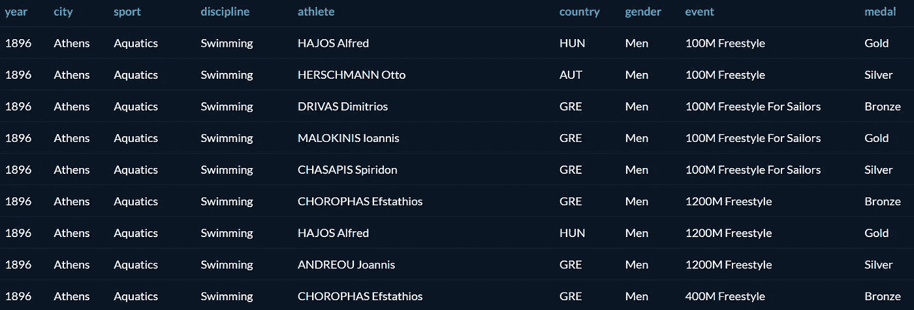
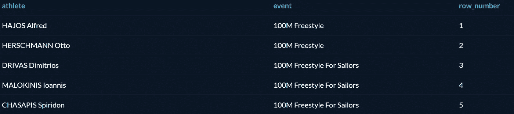
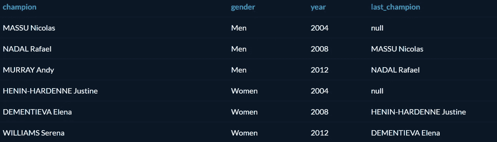
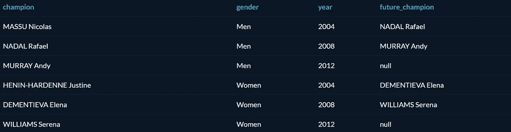
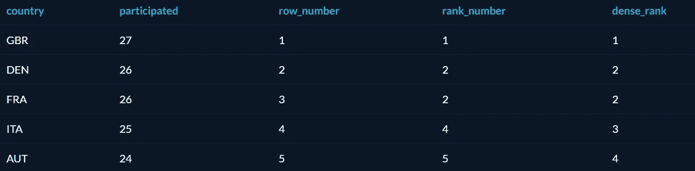

# SQL 中的窗口函数介绍

> 原文：<https://towardsdatascience.com/intro-to-window-functions-in-sql-23ecdc7c1ceb?source=collection_archive---------12----------------------->

## 如何使用窗口函数跨一组行执行操作


照片由 [R Mo](https://unsplash.com/@mooo3721?utm_source=medium&utm_medium=referral) 在 [Unsplash](https://unsplash.com?utm_source=medium&utm_medium=referral) 上拍摄

窗口函数可以帮助您在选择行上运行操作，并从原始查询中返回值。

> 术语[窗口](https://drill.apache.org/docs/sql-window-functions-introduction/)描述函数操作的行集合。窗口函数使用窗口中行的值来计算返回值。

窗口函数的一些常见用途包括计算累计和、移动平均、排名等。([图表](https://chartio.com/resources/tutorials/using-window-functions/))

窗口功能由`OVER`子句启动，并使用三个概念进行配置:

*   窗口分区(`**P**ARTITION BY` ) -将行分组为分区
*   窗口排序(`ORDER BY` ) -定义每个窗口中行的顺序或次序
*   窗口框架(`ROWS` ) -使用指定行的偏移量定义窗口

对于本教程，我们将涵盖`**PARTITION**`和`**ORDER BY**`。我假设你有基本到中级的 SQL 经验。如果你没有，这里有一些很好的资源可以帮助你开始。

*   [数据营](https://www.datacamp.com/courses/)
*   周末速成班
*   [学习 MS SQL Server + PostgreSQL](https://www.udemy.com/course/sqldatabases/)

# 窗口函数与分组依据:

*   窗口函数不会减少输出中的行数。
*   窗口函数可以从其他行中检索值，而 GROUP BY 函数则不能。
*   窗口函数可以计算累计和移动平均值，而 GROUP BY 函数则不能。

# 入门指南

我将与来自[](https://www.datacamp.com/courses)**数据营的名为 *summer_medal* 的奥运奖牌榜一起工作。(如果你是一名拥有 ***edu*** 邮箱的学生，并且想要获得三个月的免费 Datacamp 访问— [GitHub 学生开发者包](https://education.github.com/pack))。**

**以下是该表的概述。**

****

**该表代表了从 1896 年到 2010 年的奥运会，包含了每个国家、运动、项目、性别和学科的所有奖牌获得者。**

# **ROW_NUMBER()**

**如前所述，使用 OVER()标识窗口函数。本教程中的第一个函数是 ROW_NUMBER()。此函数为行中的每条记录分配一个编号。**

```
SELECT
  athlete,
  event,
  **ROW_NUMBER() OVER()** AS Row_Number
FROM Summer_Medals
ORDER BY Row_Number ASC;
```

****

**输出**

**我们可以看到，我们使用 ROW_NUMBER()创建了一个行号，并将其分配给所选的变量。我们将窗口函数别名为 Row_Number，并对其进行排序，这样我们就可以获得顶部的第一行编号。**

## **行号为()，排序依据为()**

**我们可以结合`ORDER BY`和`ROW_NUMBER`来确定哪一列应该用于行号分配。让我们找到不同的运动，并根据字母顺序给它们分配行号。**

```
SELECT
  sport,
  **ROW_NUMBER()** **OVER**(**ORDER BY** sport ASC) AS Row_N
FROM (
  SELECT DISTINCT sport
  FROM Summer_Medals
) AS sports
ORDER BY sport ASC;
```

****

# **划分依据**

**使用`[PARTITION BY](https://www.geeksforgeeks.org/mysql-partition-by-clause/)`,您可以根据一列中的唯一值拆分一个表。当我们必须使用一个组中的其他行对该组中的单个行执行计算时，这很有用。该子句仅适用于 windows 函数，如- **LAG()** ， **LEAD()，**等。**

## **什么是 LAG()？**

**SQL `LAG()`是一个窗口函数，输出当前行之前的一行。**

**这是一个很好的例子，说明了它与我们的数据之间的关系。让我们找出从 2004 年开始按性别分列的网球运动员，谁赢得了网球单打金牌，谁在前一年获胜。**

**这个问题有几个步骤。首先，我们想要创建一个 CTE，它允许您定义一个临时命名的结果集，该结果集在一个语句的执行范围内临时可用——如果您被困在这里，请访问我的另一篇 [**帖子**](/using-ctes-to-improve-sql-queries-dfcb04b7edf0) 以了解更多信息。**

**因为我们希望在使用`LAG()`之前，我们的结果中有今年的获胜者。**

```
**-- CTE for isolating gold medal tennis winners** WITH Tennis_Gold AS (
  SELECT
    Athlete,
    Gender,
    Year,
    Country
  FROM
    Summer_Medals
  WHERE
    Year  >=  2004 AND
    Sport = 'Tennis' AND
    event = 'Singles' AND
    Medal = 'Gold')**-- Window Function to find the lag and partition by gender** SELECT
    Athlete as Champion,
    Gender,
    Year,
    **LAG**(Athlete) OVER (**PARTITION BY** gender
                        ORDER BY Year ASC) AS Last_Champion
FROM Tennis_Gold
ORDER BY Gender ASC, Year ASC;
```

****

**输出**

**我们可以看到，男性和女性的结果都在一列中输出——这就是分区的作用。我们承认有 3 名男性和 3 名女性获奖者。男性和女性的第一个赢家是在 2004 年，如果我们看右边，我们看到一个空，因为在这之前没有赢家，因为我们从 2004 年开始。使用`LAG`和`PARTITION BY`有助于实现这一点。**

**让我们尝试使用铅()。**

## **什么是铅()？**

**SQL `LEAD()`是一个窗口函数，输出当前行之后的一行——本质上与 LAG()相反。**

**让我们使用网球例子中的相同问题，但是相反，找到未来的冠军，而不是过去的冠军。**

```
**-- CTE isolating tennis sport, gold medalists from the year 2004+**WITH Tennis_Gold AS (
  SELECT
    Athlete,
    Gender,
    Year,
    Country
  FROM
    Summer_Medals
  WHERE
    Year  >=  2004 AND
    Sport = 'Tennis' AND
    event = 'Singles' AND
    Medal = 'Gold')**-- Window function, using LEAD to find the NEXT champion** SELECT
    Athlete as Champion,
    Gender,
    Year,
    **LEAD**(Athlete) OVER (PARTITION BY gender
                        ORDER BY Year ASC) AS **Future_Champion**
FROM Tennis_Gold
ORDER BY Gender ASC, Year ASC;
```

****

**输出**

**我们只需要把`LAG`改成`LEAD`，把别名改成未来冠军，就能达到相反的效果。**

# **排名()**

**SQL `RANK`与`ROW_NUMBER`类似，只是它会将相同的数字分配给具有相同值的行，跳过后面的数字。还有一个`DENSE_RANK`，它给一个具有相等值的行分配一个数字，但不跳过一个数字。如果这一切看起来令人困惑，不要担心。下面是这种情况的并列对比。**

****

## **请注意 3 种不同类型的柱。**

*   **Row_number —这里没有什么新东西，我们只是为查询中的每一个行添加值。**
*   **Rank_number —这里，我们给出了基于值的排名，但是请注意，我们没有排名 **3** 。相反，我们有两个 2，我们跳到排名 4。**
*   **Dense_rank —类似于 rank_number，但我们没有跳过秩 3，而是包括了它。**

**这就是`RANK`和`DENSE_RANK`的主要区别。一个包括在联合排名数字之前的排名，一个不包括。**

**下面是我用来得到上表的代码。**

```
-- ***CTE to get countries and number year particpated in selected countries.***WITH countries AS (
  SELECT
    Country,
    COUNT(DISTINCT year) AS participated
  FROM
    Summer_Medals
  WHERE
    Country in ('GBR', 'DEN', 'FRA', 'ITA','AUT')
  GROUP BY
    Country)-- ***Window functions to show different ranking choices.***
SELECT
    Country,
    participated,
    **ROW_NUMBER()**
        OVER(ORDER BY participated DESC) AS Row_Number,
    **RANK()**
        OVER(ORDER BY participated DESC) AS Rank_Number,
    **DENSE_RANK()**
        OVER(ORDER BY participated DESC) AS Dense_Rank
FROM countries
ORDER BY participated DESC;
```

# **最终结果**

**对窗口函数的介绍到此结束。windows 函数还有更多的功能，包括`ROWS`、`NTILE`，以及集合函数(`SUM`、`MAX`、`MIN`等。).我将发布关于如何在 SQL 中更多地利用窗口函数的教程，所以请务必关注我的最新帖子。**

**在 [**Linkedin**](https://www.linkedin.com/in/jasonmchlee/) 或 [**Github**](https://github.com/jasonmchlee) 上与我联系**