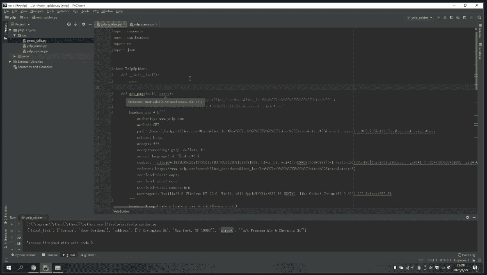
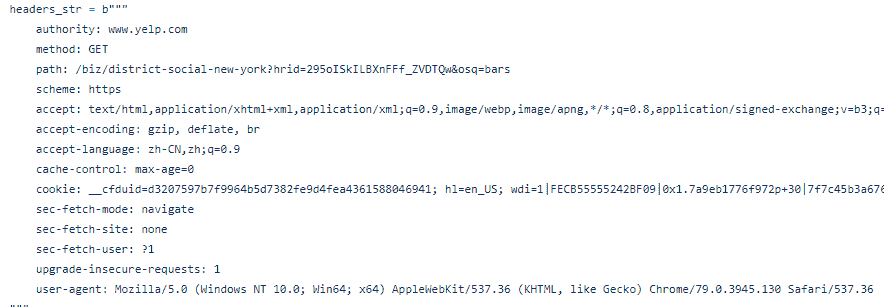
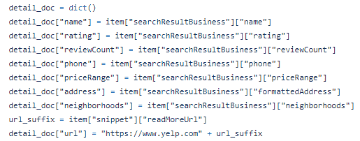
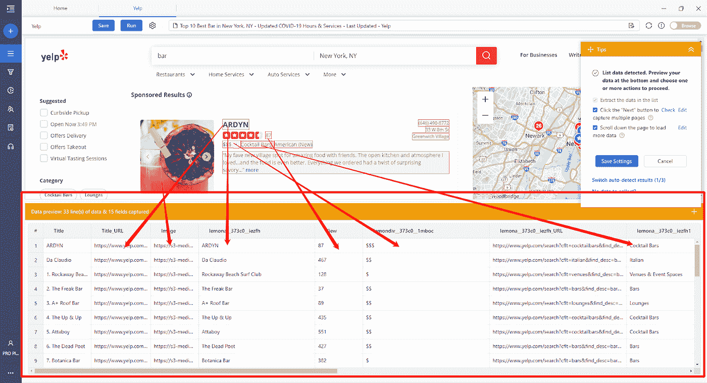
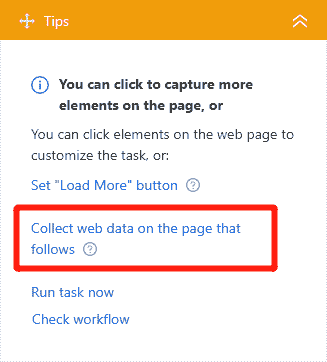
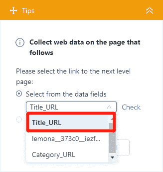
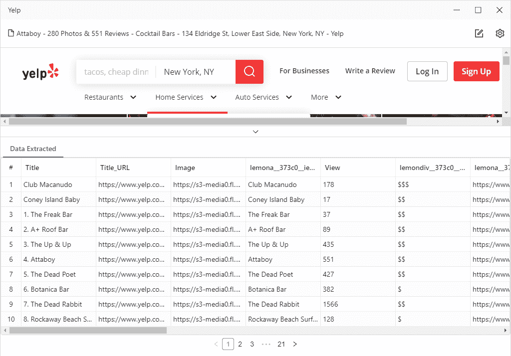

# 使用 Python 的 Yelp Web 抓取简介

> 原文：<https://towardsdatascience.com/intro-to-yelp-web-scraping-using-python-78252318d832?source=collection_archive---------32----------------------->

蒂姆·莫斯霍尔德在 [Unsplash](https://unsplash.com?utm_source=medium&utm_medium=referral) 上的照片

像许多持有甚至与计算机编程无关的学位的程序员一样，我自 2019 年以来一直在努力自学编码，希望能在工作中取得成功。作为一名自学成才的开发人员，我对我所学的东西更加实际和有目标。这就是我特别喜欢[网络抓取](https://www.octoparse.com/)的原因，不仅它有各种各样的用例，如[产品监控](https://www.octoparse.com/blog/competitor-monitoring-for-price-strategy-and-product-planning)，社交媒体监控，内容聚合等，而且它很容易上手。

web 抓取的基本思想是从网站中提取信息片段，并将其导出为易于阅读的格式。如果你是一个数据驱动型的人，你会发现网络抓取的巨大价值。幸运的是，有免费的[网页抓取工具](https://www.octoparse.com/)可以自动抓取网页数据，无需编码。

网络环境比我们想象的更复杂。说到这里，我们需要投入时间和精力来维护抓取工作，更不用说来自多个网站的海量抓取了。另一方面，抓取工具使我们免于编写代码和没完没了地维护工作。

为了让您了解 python 抓取和网站抓取工具的优缺点，我将带您了解 python 的整个工作。然后我会用网络抓取工具来比较这个过程。

事不宜迟，让我们开始吧:

# 使用 Python 进行 Web 抓取

# 项目:

*   网站:Yelp.com
*   抓取内容:企业名称、评级、评论数、电话号码、价格区间、地址、邻居

你可以在这里找到完整的代码:[https://github.com/whateversky/yelp](https://github.com/whateversky/yelp)

# 先决条件:

*   [**Python** 3.7](https://www.python.org/)
*   [**py charm**](https://www.jetbrains.com/pycharm/download/#section=windows)**—用于快速检查和修复编码错误**
*   **Bejson —清理 json 结构格式**

# **一般的刮擦过程如下所示:**

*   **首先，我们创建一个蜘蛛来定义我们将如何从 Yelp 中执行和提取数据。换句话说，我们发送 GET 请求，然后设置规则让抓取器抓取网站。**
*   **然后，我们解析网页内容并返回包含提取数据的字典。说到这里，我们告诉蜘蛛它必须返回一个 Item 对象或一个请求的对象。**
*   **最后，导出从蜘蛛返回的提取数据。**

**我只关注蜘蛛和解析器。然而，在数据提取之前，我们当然需要理解 web 结构。在编码时，你还会发现自己一直在检查网页以访问 div 和类。要检查网站，请转到您最喜欢的浏览器并右键单击。选择“检查”并在网络下找到“XHR”选项卡。您将找到相应的列表信息，包括商店名称、电话号码、位置和评级。当我们展开“PaginationInfo”时，它显示每个页面上有 30 个列表，总共有 6932 个列表。现在让我们开始有趣的部分:**

# **蜘蛛:**

**首先，打开 Pycharm 并建立一个新项目。然后建立一个 python 文件，命名为“yelp_spider”**

****

## **获取页面:**

**我们创建一个 get_page 方法。这将传递一个包含所有列出的 web URLs 的查询参数，然后返回页面 JSON。注意，我还添加了一个用户代理字符串来欺骗 web 服务器，以绕过任何 scraper 检测。我们可以复制并粘贴请求头。这不是必须的，但是如果你倾向于反复抓取一个网站，你会发现它在大多数时候是有用的。**

**我补充。format 参数来格式化 URL，以便它返回一个遵循某种模式的端点，在本例中，是来自搜索结果“Bar in New York City”的所有列表页面**

**def get_page(self，start_number):**

> **网址= "https://www.yelp.com/search/snippet？find _ desc = bars & find _ loc = New % 20 York % 2C % 20 ny % 2C % 20 United % 20 States & start = { } & parent _ request _ id = dfcaae 5 FB 7b 44685 & request _ origin = user " \。格式(起始编号)**

## **获取详细信息:**

**我们刚刚成功地获取了列表页面的 URL，现在我们可以告诉 scraper 使用 get_detail 方法访问每个详细页面。**

**详细页面 URL 由域名和表示企业的路径组成。**

****

**Yelp 详细页面 url**

**由于我们已经收集了列表 URL，我们可以简单地定义 URL 模式，它包括一个附加到[https://www.yelp.com](https://www.yelp.com)的路径。这样，它将返回一个详细页面的网址列表**

> **def get_detail(self，URL _ suffix):URL = " https://www . yelp . com/"+path**

**接下来，我们仍然需要添加一个标题，使刮刀看起来更人性化。对我们来说，进门之前敲门类似于一种常见的礼仪。**

****

**添加标题**

**然后我创建了一个与 IF 语句相结合的 FOR 循环来定位我们将要得到的标签。在这种情况下，标签包含企业名称、评级、评论、电话等。**

****

**创建一个循环**

**与返回 JSON 格式的列表页面不同，详细页面通常以 HTML 格式响应我们。因此，我去掉了标点符号和多余的空格，使它们在解析时看起来干净整洁。**

# **解析:**

**当我们一个接一个地访问这些页面时，我们可以指示我们的蜘蛛通过解析页面来获得详细的信息。**

**首先，在同一个文件夹下创建第二个名为“yelp_parse.py”的文件。并从导入开始，执行 YelpSpider。**

**在这里，我添加了一个分页循环，因为有 30 个清单分布在多个页面上。“start_number”是一个偏移值，在本例中为“0”。当我们爬完当前页面时，数字会增加 30。以这种方式，逻辑将是这样的:**

> **获取前 30 个列表**
> 
> **标页数**
> 
> **获取 31–60 个列表**
> 
> **标页数**
> 
> **获取 61–90 个列表…**

****

**页码**

**最后但同样重要的是，我创建了一个字典来将键和值与各自的数据属性配对，包括企业名称、评级、电话、价格范围、地址、邻居等等。**

****

**获取详细信息**

# **用网刮工具刮:**

**使用 python，我们可以直接与 web 服务器、门户和源代码进行交互。理想情况下，这种方法会更有效，但需要编程。由于网站是如此多才多艺，我们需要不断地编辑刮板，以适应变化。Selenium 和木偶师也是如此，它们是近亲，但与 Python 相比，它们在大规模提取方面有局限性。**

**另一方面，网页抓取工具更加友好。让我们以 [**八解**](https://www.octoparse.com/) 为例:**

**Octoparse 的最新版本 OP 8.1 应用了 Train 算法，该算法在网页加载时检测数据属性。如果你体验过应用人工智能的 iPhone 人脸解锁，“检测”对你来说并不是一个陌生的名词。**

**同样，Octoparse 将自动分解网页并识别各种数据属性，例如，企业名称、联系人信息、评论、位置、评级等。**

****

**[Octoparse 8 自动检测](https://helpcenter.octoparse.com/hc/en-us/articles/900000672806-Lesson-1-Extract-data-with-the-brand-new-Auto-detect-algorithm)**

**以 yelp 为例。一旦网页被加载，它会自动解析 web 元素并自动读取数据属性。一旦检测过程完成，我们就可以在预览部分看到 Octoparse 为我们捕获的所有数据，漂亮而整洁！然后，您会注意到工作流已经自动创建。工作流就像一个刮的路线图，刮的人会顺着方向去抓取数据。**

**我们在 python 部分创建了同样的东西，但是它们没有像 Octoparse 那样清晰的语句和图形。编程更具逻辑性和抽象性，如果没有这方面的坚实基础，就不容易概念化。**

**但这还不是全部，我们还想从详情页中获取信息。这很容易。只需按照提示面板上的指南，找到“在下一页收集网络数据”**

****

**行动指南**

**然后选择 title_url，它会将我们带到详细页面。**

****

**提取详细信息页面**

**一旦我们确认了命令，一个新的步骤将自动添加到工作流程中。然后，浏览器将显示一个详细页面，我们可以单击页面中的任何数据属性。例如，当我们点击业务标题“ARDYN”时，提示指南会响应一组操作供我们选择。只需单击“*提取所选元素的文本*”命令，它将处理剩下的工作并将操作添加到工作流中。类似地，重复上述步骤以获得“评级”、“评论计数”、“电话号码”、“价格范围”、“地址”。**

****

**遵循指南并设置操作**

**一旦我们设置好了所有的东西，只要在确认后执行 scraper。**

****

**决赛成绩**

# **最后的想法:使用 python 和 web 抓取工具进行抓取**

**它们都可以得到相似的结果，但性能不同。使用 python，在实现之前肯定需要做很多基础工作。然而，抓取工具在许多层面上要友好得多。**

**如果你是编程的新手，想要探索网页抓取的能力，尽管如此，一个 [**网页抓取工具**](https://www.octoparse.com/) 是一个很好的起点。当你踏进编码的大门时，有更多的选择和组合，我相信这将激发新的想法，使事情变得更加轻松和容易。**

***原载于 2020 年 6 月 12 日*[*http://www . data extraction . io*](http://www.dataextraction.io/?p=621)*。***