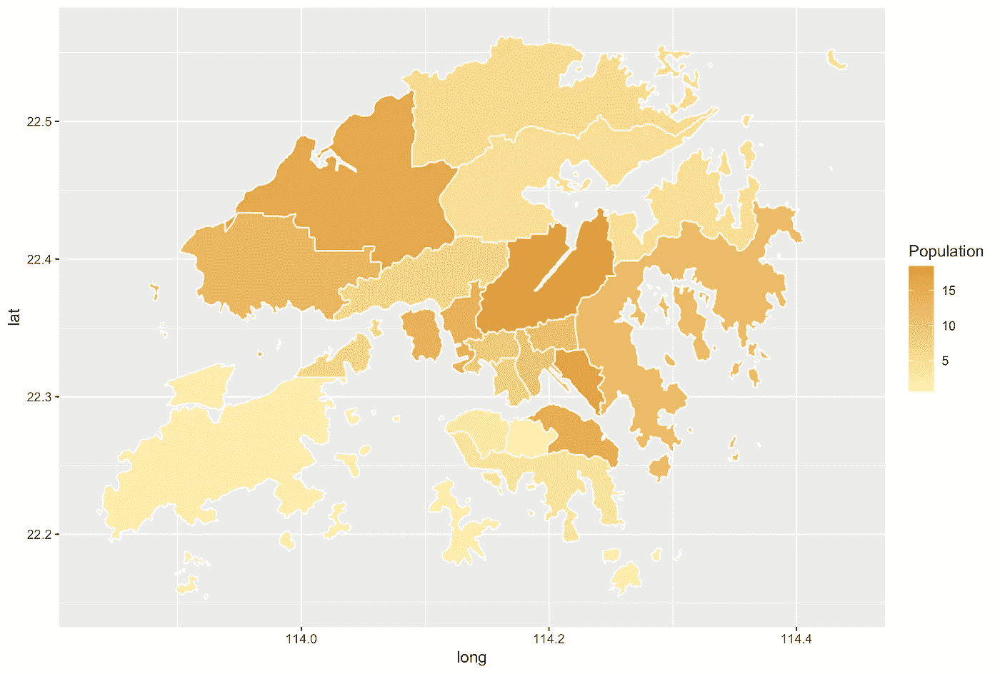

# 使用 Rayshader (R)介绍 3D ggplots

> 原文：<https://towardsdatascience.com/introducing-3d-ggplots-with-rayshader-r-c61e27c6f0e9?source=collection_archive---------25----------------------->

## [视频教程](https://towardsdatascience.com/tagged/video-tutorial)

## 在 3D 绘图中显示香港房价

Rayshader 是一个强大的 R 包，支持 2D 和 3D 数据可视化。让我惊讶的是它显示 3D 图的细节，它提供了很多定制。最重要的是，它允许您直接将 ggplot2 对象转换为 3D 绘图。


照片由 [cyda](https://cydalytics.blogspot.com)

在本演示中，使用了香港人口和房价数据。预处理数据和 R 脚本上传到[我的 Github repo](https://github.com/cydalytics/HK_Properties_Price_Distribution) 。请随意下载并试玩。


照片由 [cyda](https://cydalytics.blogspot.com)

# 包裹

光线着色器

# 功能

`rayshader`是一个用于在 R 中生成 2D 和 3D 数据可视化的开源包。`rayshader`使用基本 R 矩阵中的高程数据以及光线跟踪、球形纹理映射、叠加和环境遮挡的组合来生成美丽的地形 2D 和 3D 地图。除了地图，`rayshader`还允许用户将`ggplot2`物体翻译成漂亮的 3D 数据可视化。

模型可以旋转并交互检查，或者可以编写摄像机移动脚本来创建动画。也可以使用高质量的路径跟踪器`rayrender`来渲染场景。用户还可以创建电影景深后处理效果，将用户的注意力引导到图中的重要区域。3D 模型也可以通过内置的 STL 导出功能导出为 3D 可打印格式。

# 示范

1.  用`ggplot2`生成 2D 地图
2.  用`rayshader`将 2D 图转换成 3D 图

# 数据

人口数据. xlsx


照片由 [cyda](https://cydalytics.blogspot.com)

real_estate_master_df.csv


照片由 [cyda](https://cydalytics.blogspot.com)

**任务一:用** `**ggplot2**`生成 2D 地图

```
library(sp)
hkmap = readRDS("HKG_adm1.rds") # geo data of HK map# Preprocessing
map_data = data.frame(id=hkmap$ID_1, Code=hkmap$HASC_1, Eng_name=hkmap$NAME_1)
map_data$Code = gsub('HK.', '', as.character(map_data$Code))
map_data = merge(map_data, district_name, by = 'Eng_name')
hkmapdf = fortify(hkmap)
map_data = merge(hkmapdf, map_data, by="id")
map_data = merge(map_data, population, by = "Chi_name")
map_data$Population = as.numeric(map_data$Population)library(ggplot2)
# Map
map_bg = ggplot(map_data, aes(long, lat, group=group, fill = Population)) +
  geom_polygon() + # Shape
  scale_fill_gradient(limits=range(map_data$Population), 
                      low="#FFF3B0", high="#E09F3E") + 
  layer(geom="path", stat="identity", position="identity", 
       mapping=aes(x=long, y=lat, group=group, 
                   color=I('#FFFFFF'))) + 
  theme(legend.position = "none", 
        axis.line=element_blank(), 
        axis.text.x=element_blank(), axis.title.x=element_blank(),
        axis.text.y=element_blank(), axis.title.y=element_blank(),
        axis.ticks=element_blank(), 
        panel.background = element_blank()) # Clean Everything
map_bg# Save as PNG
xlim = ggplot_build(map_bg)$layout$panel_scales_x[[1]]$range$range
ylim = ggplot_build(map_bg)$layout$panel_scales_y[[1]]$range$range
ggsave('map_bg1.png', width = diff(xlim)*100, height = diff(ylim)*100, units = "cm")
```

逐步解释:

```
hkmap = readRDS("HKG_adm1.rds") # geo data of HK map
```

要绘制任何地区的地图，您需要手头有位置数据。请先从 [Github repo](https://github.com/cydalytics/HK_Properties_Price_Distribution) 下载 rds 文件。

```
library(ggplot2)
# Map
map_bg = ggplot(map_data, aes(long, lat, group=group, fill = Population)) +
  geom_polygon() + # Shape
  scale_fill_gradient(limits=range(map_data$Population), 
                      low="#FFF3B0", high="#E09F3E") + 
  layer(geom="path", stat="identity", position="identity", 
       mapping=aes(x=long, y=lat, group=group, 
                   color=I('#FFFFFF')))
```

ggplot2 是另一个很棒的 R 包，它提供了很多种类的图表，像条形图、饼状图、热图…你能想到的。在上面显示的脚本中，主要做了两件事。在线 *scale_fill_gradient* 上，地图中显示的多边形根据人口数据用颜色填充。颜色较深的地区意味着人口较多。然后，*层*给每个区域一条边界线，就是显示的白线。



照片由 [cyda](https://cydalytics.blogspot.com)

```
map_bg + 
  theme(legend.position = "none", 
        axis.line=element_blank(), 
        axis.text.x=element_blank(), axis.title.x=element_blank(),
        axis.text.y=element_blank(), axis.title.y=element_blank(),
        axis.ticks=element_blank(), 
        panel.background = element_blank()) # Clean Everything
map_bg
```

创建此图的原因是为我们将在任务 2 中完成的 3D 图准备背景图像。因此，我用*主题*去掉了所有的网格线，x 轴和 y 轴。


输出:map_bg.png

```
# Save as PNG
xlim = ggplot_build(map_bg)$layout$panel_scales_x[[1]]$range$range
ylim = ggplot_build(map_bg)$layout$panel_scales_y[[1]]$range$range
ggsave(‘map_bg.png’, width = diff(xlim)*40, height = diff(ylim)*40, units = “cm”)
```

最后， *ggsave* 用于导出 map_bg，其比例与绘图坐标一致。

**任务 2:用** `**rayshader**`将 2D 图转换成 3D 图

real _ estate _ master _ df.csv 的数据是从[香港房产](https://app2.hkp.com.hk/tx/default.jsp?lang=zh%27)刮来的。

```
# 2D Plot
library(ggplot2)
library(grid)
estate_price = ggplot(estate_df) + 
  annotation_custom(rasterGrob(hk_map_bg, width=unit(1,"npc"), 
                               height=unit(1,"npc")), 
                    -Inf, Inf, -Inf, Inf) + 
  xlim(xlim[1],xlim[2]) + # x-axis Mapping
  ylim(ylim[1],ylim[2]) + # y-axis Mapping
  geom_point(aes(x=Longitude, y=Latitude, color=apr_price),size=2) + 
  scale_colour_gradient(name = '成交呎價(實)\n(HKD)', 
                        limits=range(estate_df$apr_price), 
                        low="#FCB9B2", high="#B23A48") + 
  theme(axis.line=element_blank(), 
        axis.text.x=element_blank(), axis.title.x=element_blank(),
        axis.text.y=element_blank(), axis.title.y=element_blank(),
        axis.ticks=element_blank(), 
        panel.background = element_blank()) # Clean Everything
estate_price
```

逐步解释:

```
 annotation_custom(rasterGrob(hk_map_bg, width=unit(1,"npc"), 
                               height=unit(1,"npc")), 
                    -Inf, Inf, -Inf, Inf) + 
  xlim(xlim[1],xlim[2]) + # x-axis Mapping
  ylim(ylim[1],ylim[2]) + # y-axis Mapping
```

*annotation_custom* 用于将准备好的地图背景图像导入到绘图中。 *xlim(xlim[1]，xlim[2])* 和 *ylim(ylim[1]，ylim[2])* 固定地块的 x 轴和 y 轴，使其与 map_bg 相同。

```
geom_point(aes(x=Longitude, y=Latitude, color=apr_price),size=2) + 
  scale_colour_gradient(name = '成交呎價(實)\n(HKD)', 
                        limits=range(estate_df$apr_price), 
                        low="#FCB9B2", high="#B23A48") +
```

*geom_point* 将房地产价格的数据点添加到绘图中。

*scale_colour_gradient* 根据变量“apr_price”用颜色填充数据点，请注意这里使用的函数与任务 1 中使用的不同。(*几何点的比例颜色渐变*，几何多边形的比例填充渐变

**

*cyda 拍摄的照片*

```
*# 3D Plot
library(rayshader)
plot_gg(estate_price, multicore = TRUE, width = diff(xlim)*10 ,height=diff(ylim)*10, fov = 70, scale = 300)# Close Windows
rgl.close()*
```

*将 2D 图转换为 3D 图的脚本非常简单。3D 绘图显示在 rgl 窗口中。不过，看完剧情记得关窗。由于 rgl 窗口的输出不会被删除，所以下一个图将与前一个图重叠。*

**

*cyda 拍摄的照片*

*希望你喜欢我的文章=)*

*想了解更多使用 rayshader 的方法，请到 rayshader 的[官网。](https://www.rayshader.com)*

*如果你觉得我的文章有用，请在[我的 linkedIn 页面](https://www.linkedin.com/in/carrielsc/)上为我的技能背书，鼓励我写更多的文章。*

*最初发表于[cydalytics.blogspot.com](https://cydalytics.blogspot.com)*