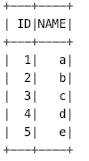
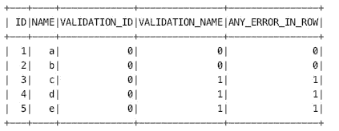
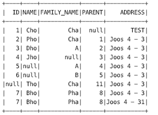
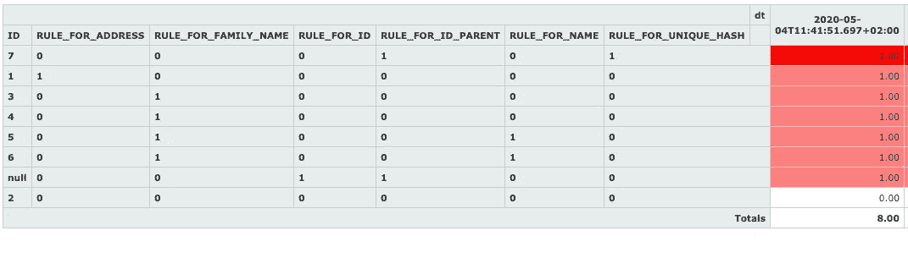
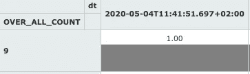
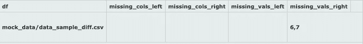
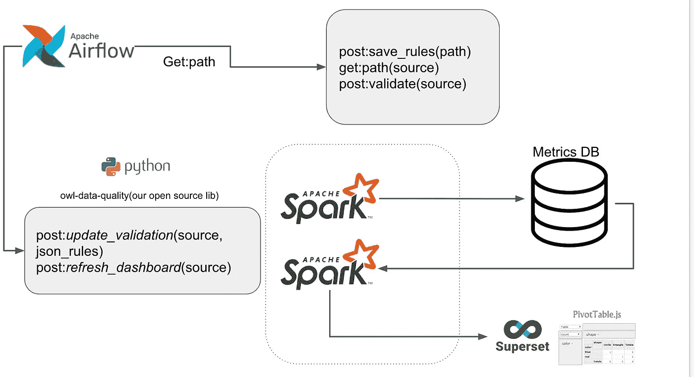

# 介绍一个新的 pySpark 库:owl-data-sanitizer

> 原文：<https://towardsdatascience.com/introducing-a-new-pysparks-library-owl-data-sanitizer-bcc46e1583e6?source=collection_archive---------37----------------------->

## 在拥有复杂管道的公司中实现数据质量民主化的库。


托德·斯泰特勒在 [Unsplash](https://unsplash.com/s/photos/owl?utm_source=unsplash&utm_medium=referral&utm_content=creditCopyText) 上拍摄的照片

数据质量是公司打造优秀产品的重要组成部分，无论您的技术团队有多强大，或者您的数据团队有多有才华，当您的数据不一致或错误时，您最终会得到一个糟糕的产品。因此，[研究](https://hbr.org/2020/02/data-driven-decisions-start-with-these-4-questions)发现，由于糟糕的数据，公司平均每年损失**1500 万美元**。

> 3 Cs:数据质量可以定义为以下各项组合:
> 
> 正确性:就内容和结构的不一致性而言，您的数据有多正确。
> 
> 完整性:结果中是否缺少记录？
> 
> 比较:我可以将我的全部数据与源数据进行比较吗？

因此，我们开始向数据团队提问，询问他们为保证数据集的整洁性而遵循的流程，发现了一些启示:

*   当我们问及传达数据质量规则的流程时，回答是这样的:“我们分享。xls 文件和截图”上来了。他们最终会得到多个版本的规则和报告。
*   在大多数情况下，开发人员不理解业务规则，业务人员也不能编写数据质量规则，这证明了缺乏透明度。此外，业务规则的变化意味着代码和部署的变化。
*   大数据的数据质量管道有时需要很长时间，并且在实时管道中不可用。
*   例如，对于实时管道或每天接收分区数据的管道，无法检测到重要的流量变化。例如，您接收交易，金额的总和在没有任何预期原因的情况下翻倍。
*   数据协调过程意味着在 ETL 情况下将数据与源进行比较，或者在代码更改的情况下将生产阶段进行比较，这个过程是手动完成的。
*   在创建每个管道验证规则后，开发人员平均损失 1-2 天。在一些例子中，他们花了 1.5 周来解决问题。

> 因此，我们发现了一个问题:我们必须通过使数据质量控制集中化、民主化和智能化，使其成为所有数据驱动团队不可或缺的一部分。

为了开始这个过程，我们分析了如何帮助开发人员完成这个耗时的验证任务。在我们的例子中，由数据工程师、数据科学家和全栈开发人员组成的不同团队编写的大多数管道使用 *pySpark* 作为 ETL 框架，然后我们确定了两个惊人的库来执行数据质量断言， [deequ](https://github.com/awslabs/deequ) 和 [great expectations。](https://greatexpectations.io/)

因此，两个库都允许基于列操作的数据集验证更加容易和快速。尽管如此，我们仍然缺少一些东西，*民主化*:数据工程师将不得不在编写数据测试人员和业务人员不理解的质量规则的过程中，下面列出了我们需求的缺点:

## 规则是如何编写的

在我们的例子中，数据规则是由业务人员或数据测试人员编写的，然后他们交付一个带有规则定义的文件，这应该被翻译成 *deequ* 或*great expectations*asserts。因此，需要额外的开发工作。然后，下面的问题出现了:

> Spark 接受 SQL，
> 
> 数据测试人员编写 SQL，
> 
> 从业务人员绘制 UI 生成 SQL 是可能的，
> 
> 为什么如果我们使用 SQL 编写规则，并避免中间的过程。

**注意:**关于 pySpark 支持， *deequ* 只适用于 scala 版本。

## 如何调试报告中的错误

*deequ* 和 *great expectations* 都在每一栏提供结果。因此，在报告中，您会发现列验证中的错误和一些错误示例。

举个例子:



源数据集。

**规则:**列名在【a，b】。

**结果:**断言错误，错误示例:[c，d，e](前 20 个示例)

这些结果非常有用。然而，当处理大数据(其中不匹配的值可能有数百万)时，一旦发现断言失败，该报告不足以发现问题。因此，您必须转到源数据并执行行操作。是的…，a)在该列有这些错误值的地方获取一些 id，b)然后连接源数据集，c)查看数据集中的其他列，以检测其他记录不一致的地方。然后下一个问题出现了:

*如果报表以矩阵形式显示每列和每行的结果会怎样？*



按行报告。 **1** 有误差时， **0** 干净时。

通过这种方式，您不仅可以计算每一列的错误，还可以计算整行的错误，以便于调试和修复错误。此外，您可以很容易地获得以下报告:*每列的错误数，每列的错误示例，有错误的行数，有错误的示例 id。*

## **重复数据删除**

两种框架都通过计算一列中唯一值的数量来验证重复数据删除。然而，在大数据中，这主要是一个行操作，它意味着查看多个列的组合(例如， *ID* 和 *NAME* )在同一个数据集中出现了多少次。出现了以下问题:

*如果重复验证收到一组列怎么办？*

有时使用模糊匹配发现重复项，然后:

*有时需要什么样的模糊算子？*

## **树形结构**

我们没有找到一种方法来验证树结构，例如，列 *PARENT_ID* 并将其验证为数据集中的有效 *ID* 。

## 如何进行数据对比和对账

最后，一种应用校验和比较的方法是:

*   当我们重构管道时，首先部署到阶段，并与生产中的数据进行比较。
*   数据有时会与目标相比较。
*   将数据与前一天/月的数据进行比较，以查看变化。

我们没有找到在现有框架上实现这一点的简单方法。

# 建造一座新图书馆

对于那些面临同样挑战的人，我们决定基于 *pySpark* 编写一个小型库，用于数据质量验证民主化[*owl-data-sanitizer*](https://github.com/ronald-smith-angel/owl-data-sanitizer)。

[](https://github.com/ronald-smith-angel/owl-data-sanitizer) [## 罗纳德-史密斯-天使/猫头鹰-数据-消毒剂

### 验证数据质量的 pyspark 库。为 Ronald-Smith-angel/owl-data-sanitizer 的开发做出贡献，创建一个…

github.com](https://github.com/ronald-smith-angel/owl-data-sanitizer) 

让我们看一个家庭数据集的例子。



家庭数据集。

## **基于简单 SQL 的验证**

您需要验证的唯一输入如下。yaml 文件:

示例 yaml 文件。

在这个文件中，我们遵循 3Cs 的概念，并添加了额外的配置变量。

***源表:*** 节用源表的元数据和路径来传递结果。目前与以下人员合作:

*   输入和输出**配置单元**表。
*   输入和输出 **S3** 铲斗。
*   输入输出**文件系统**路径。

除此之外，这里还添加了我们之前解释过的重复数据删除列。

***正确性验证:*** 正确性验证是使用简单的 SQL 编写的，您现在可以验证您用 SQL 编写的所有内容，框架会使用 spark 自动完成计算它们的神奇工作。

示例:

```
ADDRESS is not null and ADDRESS != '' and ADDRESS != 'null' and
CHAR_LENGTH(ADDRESS) > 4
```

***父子验证:*** 如前所述，我们需要验证我们的树结构。

***完整性验证:*** 要验证您的数据有多完整，您可以使用两个选项。

**a)** 根据源数据集的计数进行验证，这意味着一个简单的 SQL 规则。

**b)** 在分区或微批处理数据集中，您可以对照阈值(例如最大 10%)验证数据计数相对于前一个分区或批处理是如何增长的。

***比较相关表:*** 如前所述，比较数据是为了核对或验证。

## 使错误调试更容易的报告

作为使用配置运行 spark 作业的结果，将提供以下报告:

**a)正确性**基于矩阵的每列/行报告，如前所述。

**b)完整性**显示数据完整性的报告。

**c)** 最后，一份**对比**报告。

当使用文件系统运行时，还会显示 HTML 报告。对于我们的示例，这些报告是这样生成的:



a)正确性报告。

该报告显示每列有多少个错误，有多少行有错误(9 行中有 8 行有 ***，至少有 1 行验证失败*** )，并始终保留 ID 用于调试。



b)规则**计数≤ 5** 的完整性报告，这意味着错误( **1** )。

最后，将它与样本 diff 数据集进行比较，显示数据不同的地方。因此，它们将是第二个数据集中没有的 IDs 6 和 7:



比较报告。

# **测试集群中的库**

安装该库非常简单:

**pip 安装 owl-sanitizer-data-quality**

您可以按照这个小型单元测试的结构编写一个基本示例，其中您可以控制输出 spark 数据帧:

```
**test_rules** = {
    "CODE": """CODE is not null and CODE != '' and CODE != 'null'""",
    "NAME": """NAME is not null and NAME != '' and NAME != 'null'""",
    "GENERAL_ID": (
        "GENERAL_ID is not null and GENERAL_ID != '' and GENERAL_ID != 'null' and"
        " CHAR_LENGTH(GENERAL_ID) < 4"
    ),
    "ULTIMATE_PARENT_ID": """ULTIMATE_PARENT_ID is not null""",
    "PARENT_ID": """PARENT_ID is not null""",
}

**parent_rules** = [
    ("GENERAL_ID", "ULTIMATE_PARENT_ID"),
    ("GENERAL_ID", "PARENT_ID"),
]

**completeness_rules** = {"OVER_ALL_COUNT": """OVER_ALL_COUNT <= 7"""}

**validator** = **DataframeValidator**(
    spark=spark,
    source_df=source_df,
    id_col_name="GENERAL_ID",
    correctness_rules_dict=test_rules,
    parent_children_validation_pairs=parent_rules,
    completeness_rules_dic=completeness_rules,
    comparable_dfs_list=[
        ("diff_df", grid_diff_df),
        ("diff_df_2", grid_diff_2_df),
    ],
)

**processed_df** = validator.**process**()

**comparable_df** = validator.**compare**()
```

或者简单地说，使用配置文件交付结果:

```
**from** spark_validation.dataframe_validation.dataframe_validator import **CreateHiveValidationDF**
from spark_validation.common.config import **Config**

**spark_session** = SparkSession.builder.enableHiveSupport().getOrCreate()
with open(**PATH_TO_CONFIG_FILE**) as f:
        config = Config.parse(f)
**CreateHiveValidationDF**.validate(spark_session, config)
```

使用该库执行验证，从一个大的 Hive 表中读取结果并将结果传递给 Hive，随后将它们索引到一个超集仪表板上。



示例架构。

# 未来的工作

以 *owl-data-sanitizer* 为基础，仍然缺少一个组件，包括规则创建和报告通知方面的业务人员。然后，我们添加一个前端组件，数据团队，包括测试人员和业务人员，可以在其中拖放数据质量规则。