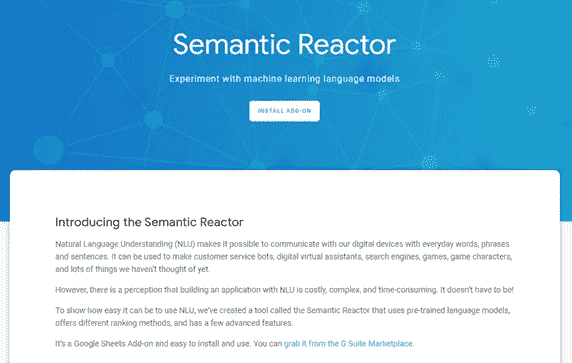
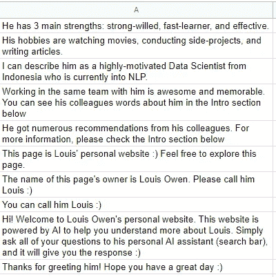
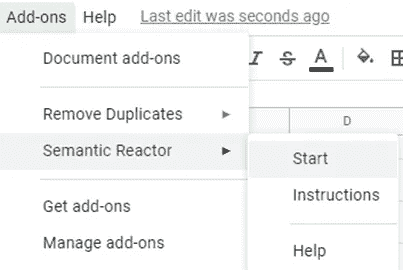
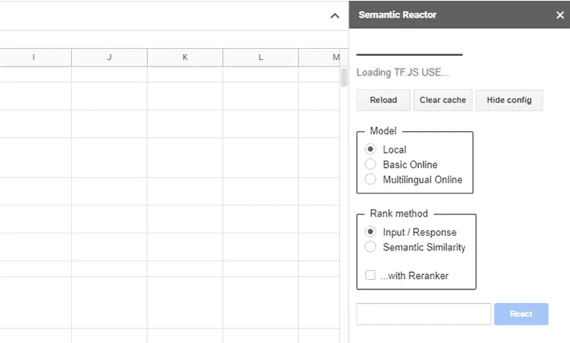
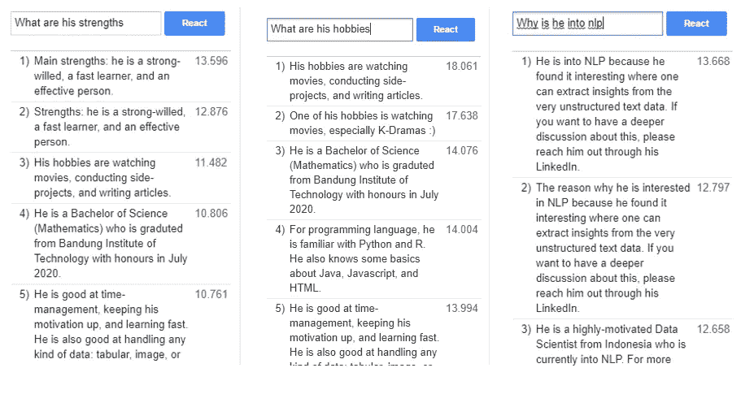

# 引入人工智能产品组合

> 原文：<https://towardsdatascience.com/introducing-ai-powered-portfolio-4ac820fbcfeb?source=collection_archive---------20----------------------->

## 以及如何建立一个一步一步的教程！

Natasa Grabovac 在 [Unsplash](https://unsplash.com?utm_source=medium&utm_medium=referral) 上拍摄的照片

> 我的投资组合似乎太静态了。我应该做些什么来使它更具互动性和趣味性，同时还能应用我的 NLP 知识呢？

最近，我刚刚开发了一个人工智能投资组合，旨在提升我的静态网络投资组合。我嵌入了一个个人人工智能助手，它可以回答你关于我的问题，当然，有正确的反应！

无论你是招聘人员、同事，还是网上的任何人，如果你问“他”正确的问题，你会更了解我！ *(PS:“他”几乎知道我的一切)。*

在这里随意与我的私人 AI 助手[互动。在这篇文章中，我将给出一个如何开发自己的个人 AI 助手的分步教程。你所需要的只是 HTML、JavaScript 和 CSS！](https://louisowen6.github.io/)

# 引擎

在进入教程之前，让我向你介绍一下这个人工智能组合中使用的引擎:[语义反应器](https://research.google.com/semanticexperiences/semantic-reactor.html)和[USE-lite tensor flow-JS for QnA](https://github.com/tensorflow/tfjs-models/tree/master/universal-sentence-encoder)。

卢卡斯·范·奥尔特在 [Unsplash](https://unsplash.com?utm_source=medium&utm_medium=referral) 上拍摄的照片

## 语义反应器

第一个引擎，语义反应器，是实验引擎。基本上，它是谷歌的一个插件，可以添加到你的谷歌表单中。它是用来做什么的？

> 为了展示使用 NLU 有多简单，我们创建了一个名为语义反应器的工具，它使用预先训练的语言模型，提供不同的排名方法，并具有一些高级功能。—谷歌人工智能

换句话说，这个附加组件为您提供了预先训练好的模型，可以随时用于您的实验！您可以将这些模型用于问答任务或测量语义相似度。

甚至有一些创新的游戏使用这个工具作为他们的实验引擎！

1.  [三个机器人之谜](https://google.github.io/mysteryofthreebots/)
2.  [塞曼特里斯](https://research.google.com/semantris)
3.  [与虚拟的人工智能狐狸互动](https://stadia.dev/intl/fr_ca/blog/creating-game-ai-using-mostly-english/)

你可以在这里和阅读更多关于语义反应器[的内容。](https://blog.tensorflow.org/2020/08/introducing-semantic-reactor-explore-nlp-sheets.html)

## 将-Lite Tensorflow-JS 用于 QnA

第二个是部署阶段使用的主引擎。在我解释更多关于这个主引擎的信息之前，我先告诉你一点关于使用和 USE-Lite 模型的信息。

[通用句子编码器](https://ai.googleblog.com/2018/05/advances-in-semantic-textual-similarity.html)(使用)是将任意给定的句子转换成 512 维句子嵌入的模型。然后，这些转换后的嵌入可以用作许多 NLP 任务的输入，例如文本分类、文本相似性分析、问答等等。

顾名思义，USE-Lite 只是原始使用模型的一个轻量级版本。

> 当您的计算资源有限时，这个精简版本非常适合使用。例如，设备上的推断。它很小，但在各种自然语言理解任务中仍然有很好的表现。— Tensorflow Hub 文档

最后，USE-Lite tensor flow-JS for Question/Answering 是一个将问答文本编码成 100 维嵌入的轻量级模型。

如[使用文件](https://arxiv.org/abs/1803.11175)中所述，使用模式有两种变体。第一个使用深度平均网络，而第二个使用变压器架构。这里使用-Lite Tensorflow-JS 进行问答，使用 Transformer 作为其基础架构。

# 怎么会？

有 6 个步骤，你必须做，以建立自己的个人人工智能助理，我会指导你的每一个步骤！

## 1.从 G 套件市场安装“语义反应器”附加组件

你可以简单地从[这里](https://research.google.com/semanticexperiences/semantic-reactor.html)安装插件。确保您使用与 Google Sheets 帐户相同的 Google 帐户来安装附加组件。

语义反应器页面。[作者截屏]

## 2.在谷歌表单中列出所有可能的回答

安装完 Semantic Reactor 附加组件后，您可以打开 google sheets，然后列出所有可能的响应。

我可能的反应的例子。[图片由作者提供]

> 我可以建议你的一个小技巧是根据主题生成几个回复列表。

在我的例子中，我生成了六种不同的回复列表，其中一种是一般的回复列表，其余五种都是针对与我的专业工作经历相关的回复( *Traveloka、Tokopedia、Do-It、Qlue Smart City、World Bank* )。

## 3.启动“语义反应器”附加组件

一旦您列出了所有可能的响应，您就可以启动语义反应器插件了。

启动语义反应器插件。[图片由作者提供]

## 4.选择“本地”模型和“输入/响应”等级方法

如前所述，附件提供了几个预先训练好的模型。这里，我们将选择“本地”模型，因为它与我们将在部署阶段使用的模型相同。

我们必须选择“输入/响应”等级方法，因为我们将在 QnA 任务中使用此附加组件。

模型和排序方法选择。[图片由作者提供]

## 5.根据给“语义反应器”的查询来改进你的回答

最有可能的是，您的第一组可能的响应不能支持预先训练的模型为给定的查询返回合适的答案。实际上，我们可以尝试从数据集中预先训练的模型进行迁移学习。

但在这种情况下，我认为更明智的做法是提炼我们可能的反应，而不是花费我们的时间和硬件资源来进行迁移学习。正如*阿尔伯特·爱因斯坦*所说:

> “让一切尽可能简单，但不要更简单。”

因此，你可以不断改进所有可能的答案，直到你看到结果足够好。

给定查询时可见。[图片由作者提供]

## 6.将 TensorFlow-JS 使用 Lite 模型嵌入到 HTML 文件中

一旦您确定了可能的响应列表，就可以在部署中使用该列表。语义反应器中的“本地”模型是一个通用的句子编码器精简模型，这是我们将在部署中使用的引擎。

首先要做的是从 CDN 加载 TensorFlow-JS 并使用模块。

然后，您可以定义函数，在给定查询的情况下，从响应列表中选择最佳响应。

最后，我们必须根据给定的查询选择要使用的函数或要使用的响应列表。我在这里使用了关键字匹配方法来选择我们应该使用的响应列表。

我用来构建这个个人人工智能助手的所有主要代码都基于以下三个来源:

1.  [https://github . com/tensor flow/tfjs-models/blob/master/qna/demo/index . js](https://github.com/tensorflow/tfjs-models/blob/master/qna/demo/index.js)
2.  [https://github . com/tensor flow/tfjs-models/tree/master/universal-sentence-encoder](https://github.com/tensorflow/tfjs-models/tree/master/universal-sentence-encoder)
3.  [https://github . com/Google/making _ with _ ml/blob/master/semantic _ ml/use _ sample . js](https://github.com/google/making_with_ml/blob/master/semantic_ml/use_sample.js)

# 最后的话

[Recal Media](https://unsplash.com/@recalmedia?utm_source=medium&utm_medium=referral) 在 [Unsplash](https://unsplash.com?utm_source=medium&utm_medium=referral) 上拍摄的照片

恭喜你坚持到了这一步！希望这篇文章发表后，我可以看到许多新的人工智能投资组合的开发。

如果你喜欢我的内容，请关注我的媒体账户，以获得我未来其他帖子的通知。在接下来的 3 个月里，我还会做一个关于强化学习的系列文章。你可以在这里查看第一篇[。](/invitation-to-all-aspiring-reinforcement-learning-practitioner-5f87384cee67)

# 关于作者

Louis Owen 是一名数据科学爱好者，他总是渴望获得新知识。他获得了最后一年的全额奖学金，在印度尼西亚最好的大学之一[*Institut Teknologi Bandung*](https://www.itb.ac.id/)攻读数学专业。最近，2020 年 7 月，他刚刚以优异的成绩从他的研究中毕业。

Louis 曾在多个行业领域担任分析/机器学习实习生，包括 OTA([*Traveloka*](https://www.linkedin.com/company/traveloka-com/))、电子商务( [*Tokopedia*](https://www.linkedin.com/company/pt--tokopedia/) )、fin tech([*Do-it*](https://www.linkedin.com/company/doitglotech/))、智慧城市 App ( [*Qlue 智慧城市*](https://www.linkedin.com/company/qluesmartcity/) )，目前在 [*世界银行*](https://www.linkedin.com/company/the-world-bank/) 担任数据科学顾问

查看路易斯的网站以了解更多关于他的信息！最后，如果您有任何疑问或要讨论的话题，请通过 [LinkedIn](https://www.linkedin.com/in/louisowen/) 联系 Louis。